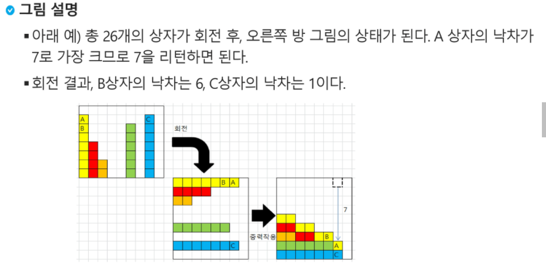
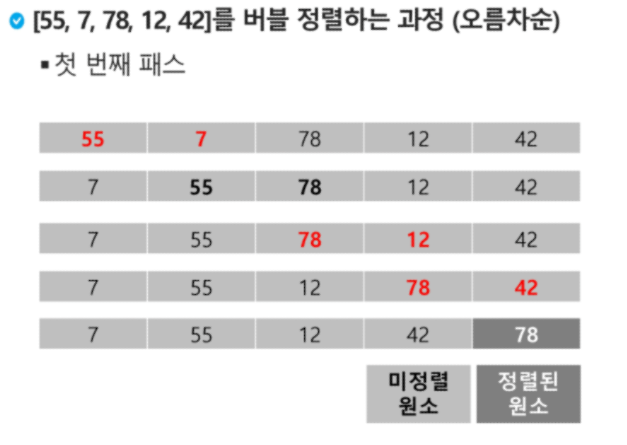
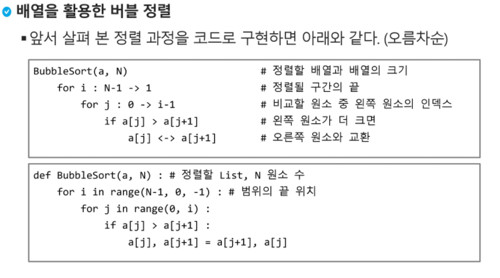
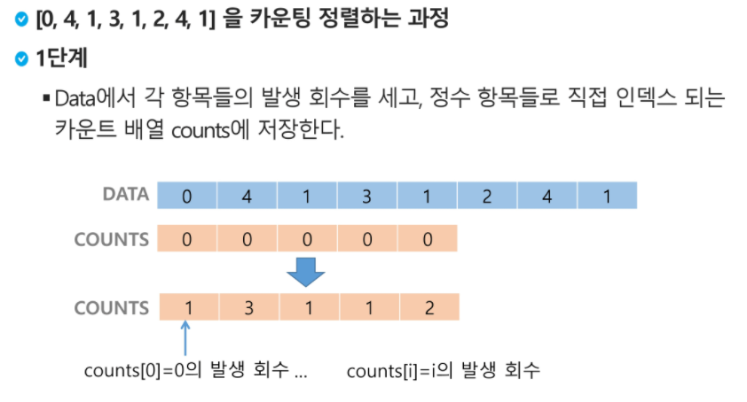
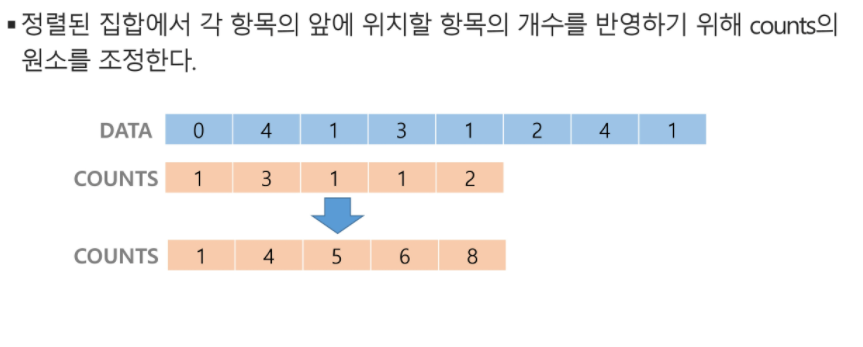
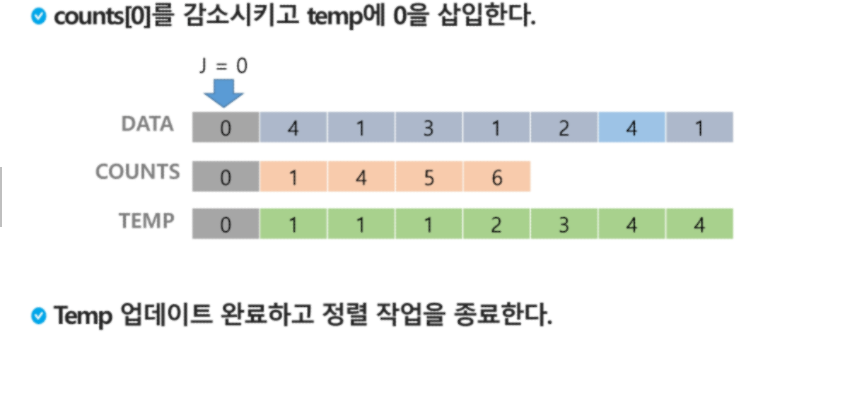
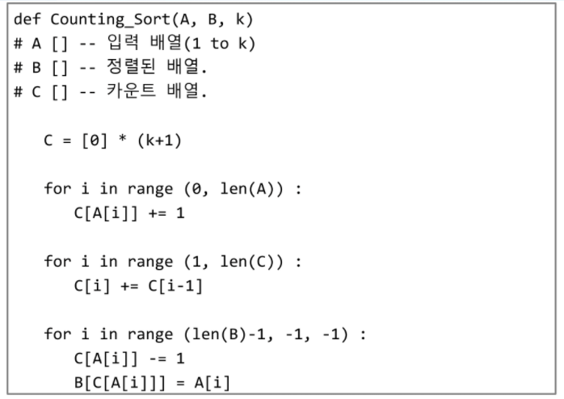
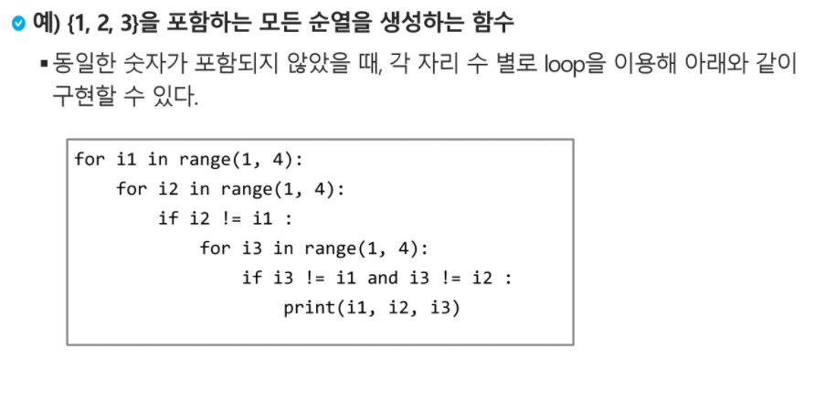
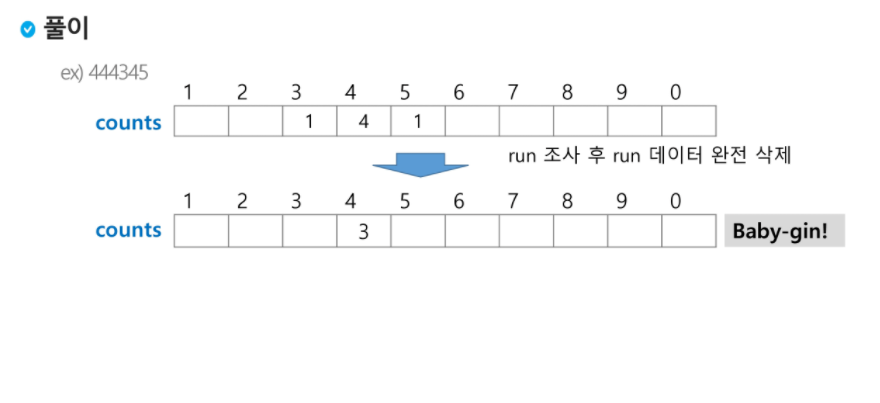

### 알고리즘 배열

일정한 자료형의 변수들을 하나의 이름으로 열거하여 사용하는 자료 구조

```
Num0 = 0;
Num1 = 1;
Num2 = 2;
Num3 = 3;
Num4 = 4;

Num = [0,1,2,3,4]
```

필요성

* 여러 변수가 필요할 때 , 일일이 다른 변수를 이용하여 접근하는 것은 매우 비효율적
* 하나의 선언을 통해 둘 이상의 변수 선언 가능
* 다수의 변수로는 하기 힘든 작업을 배열을 활용해 쉽게 할 수 있다.

**1차원 배열 선언**

* 별도 선언 없으면, 처음 값을 할당할 때 생성됨
* idx 로 접근 가능하다

```python
Arr = list()
Arr = []
Arr = [1,2,3]
Arr = [0]*10
```

---

#### ex) 예제 - Gravity

상자들이 쌓여있는 방이 있다. 방이 오른쪽으로 90도 회전하여 상자들이 중력의 영향을 받아 낙하한다고 할 때, 낙차가 가장 큰 상자를 구하여 그 낙차를 리턴하는 프로그램을 작성하시오.

중력은 회전이 완료 된 후 적용된다.

상자들은 모두 한쪽 변에 붙여진 상태로 쌓여, 2차원의 형태를 이루며 벽에서 떨어져서 쌓인 상자는 없다.

방의 가로,세로 길이는 항상 100이다.



```
[7,4,2,0,0,6,0,7,0]
숫자간의 관계를 비교하는 것임.
현재 인덱스가 가진 숫자보다 작은 수의 갯수를 센 뒤, 그 크기가 가장 큰 것을 찾으면 된다.

```

---

### 알고리즘 정렬

* 2개 이상의 자료를 특정 기준에 의해 작은 값부터 큰 값, 혹은 그 반대의 순서로 재배열하는 것(오름차순, 내림차순)

* 키 = 자료를 정렬하는 기준이 되는 특정 값

#### 대표 정렬방식

* 버블 정렬
* 카운팅 정렬
* 선택 정렬
* 퀵 정렬
* 삽입 정렬
* 병합 정렬

---

#### 1. 버블 정렬

- 인접한 두 개의 원소를 비교하며 자리를 계속 교환하는 방식
- 정렬 과정
  - 첫 째 원소부터 인접한 원소끼리 계속 자리를 교환하면서 맨 마지막 자리까지 이동한다.
  - 한 단계가 끝나면 가장 큰 원소가 마지막 자리로 정렬된다.
  - 교환하며 자리를 이동하는 모습이 물 위에 올라오는 거품 모양과 같다고 버블정렬임
- O(n^2) 의 시간복잡도





---

#### 2. 카운팅 정렬

* 항목들의 순서를 결저하기 위해 집합에 각 항목이 몇 개씩 있는지 세는 작업을 하여, 선형 시간에 정렬하는 효율적 알고리즘
* 정수나 정수로 표현가능한 자료에만 적용가능, 각 항목의 발생횟수를 기록하기 위해, 정수 항목으로 인덱스 되는 카운트들의 배열을 사용하기 때문
* 카운트를 위한 충분한 공간을 할당하려면 집합 내의 가장 큰 정수를 알아야 한다.
* O(n+k) 의 시간 복잡도  n은 리스트 길이, k는 정수 최대값









---

### 완전 검색

문제의 해법으로 생각할 수 있는 모든 경우의 수를 나열하여 확인하는 기법

Brute-force 혹은 generate-and-test 기법

모든 경우의 수 테스트, 최종 해법 도출

경우의 수가 작을 때 유용

#### ex)  Baby-gin - 완전검색용 풀이 

0~9 사이의 숫자 카드에서 임의의 카드 6장을 뽑았을 때, 3장의 카드가 연속적인 번호를 갖는 경우를 run이라 하고, 3장의 카드가 동일한 번호를 갖는 경우를 triplet이라고 한다

6장의 카드가 run과 triplet로만 구성된 경우를 baby-gin으로 부른다

ex)

* 667767은 두 개의 triplet이므로 baby-gin
* 054060은 한 개의 run과 한 개의 triplet이므로 baby-gin
* 101123은 한 개의 triplet이 존재하나, run이 아니므로 baby-gin이 아니다.

---

#### 순열

서로 다른 것들 중 몇 개를 뽑아 한 줄로 나열하는 것

서로 다른 n개 중 r개를 택하는 순열은 다음과 같다. `nPr`

`nPr`은 다음 식이 성립한다

`nPr = n\*(n-1)\*(n-2)....\*(n-r+1)`

`nPn` = n!



---

### 탐욕(Greedy) 알고리즘

탐욕 알고리즘은 최적해를 구하는데 사용되는 근시안적 방법

여러 경우 중 하나를 결정해야 할 때 마다 순간에 최적이라고 생각되는 것을 선택해 나가는 방식으로 진행, 최종 해 도달.

각 선택 시점은 지역적으로는 최적이지만, 그 선택을 수집하여 최종 해답을 만들었다고, 그것이 최적이라는 보장은 없다.

일반적으로, 머릿 속에 떠오르는 생각을 검증 없이 바로 구현하면 greedy 접근임.

##### 동작 과정

1. 해 선택 :  현재 상태에서 부분 문제의 최적 해를 구한 뒤, 이를 부분해 집합에 추가
2. 실행 가능성 검사 : 새로운 부분해 집합이 실행가능한지 확인, 문제 제약 조건을 위반하지 않는지 검사
3.  해 검사 : 새로운 부분해 집합이 문제의 해가 되는지 확인. 아직 전체 문제 해가 완성되지 않았다면, 1부터 다시 시작

#### ex) 거스름돈 줄이기

어떻게 하면 손님에게 거스름돈으로 주는 지폐와 동전의 개수를 최소한으로 줄일 수 있을까?

1. 해 선택 : 가장 좋은해를 선택한다. 단위가 큰 동전으로만 거스름돈을 만들면 동전의 개수가 줄어들므로 현재 고를 수 있는 가장 단위가 큰 동전을 골라 거스름돈에 추가한다.
2. 실행 가능성 검사 : 거스름돈이 손님에게 드릴 액수를 초과하는지 확인, 초과시 마지막에 추가한 동전을 거스름돈에서 빼고, 1로 돌아가서 현재보다 한 단계 작은 단위의 동전을 추가.
3. 해 검사 : 거스름돈을 확인해서 액수에 모자라면 다시 1로 돌아가서 거스름돈에 추가할 동전을 고른다. 

---

#### ex)  Baby-gin - 탐욕 알고리즘 풀이

0~9 사이의 숫자 카드에서 임의의 카드 6장을 뽑았을 때, 3장의 카드가 연속적인 번호를 갖는 경우를 run이라 하고, 3장의 카드가 동일한 번호를 갖는 경우를 triplet이라고 한다

6개의 숫자는 6자리의 정수값으로 입력된다.

counts 배열의 각 원소를 체크하여 run과 triplet 및 baby-gin 여부 판단한다.



```python
num = 456789 #baby-gin 확인할 6자리수
c = [0]*12 #6자리 수로부터 각 자리 수를 추출하여 개수를 누적할 리스트 생성

for i in range(6):
    c[num%10] += 1
    num //= 10
    
i = 0
tri = run = 0
while i < 10 :
    if c[i] >= 3 : # triplet 조사후 데이터 삭제
        c[i] -= 3
        tri += 1
        continue
    if c[i] >= 1 and c[i+1] >= 1 and c[i+2] >= 1: #run 조사후 데이터 삭제
        c[i] -= 1
        c[i+1] -= 1
        c[i+2] -= 1
        run += 1
        continue
    i += 1
if run + tri == 2 : print("Baby Gin")
else : print("Lose")
```

