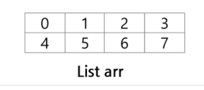

### 2차원 배열

---

* 배열 : 2차원 배열
* 부분 집합 생성
* 바이너리 서치(Binary Search)
* 셀렉션 알고리즘(Selection Algorithm)
* 선택 정렬(Selection Sort)

---

##### 2차원 배열의 선언

* 1차원 List를 묶어놓은 List
* 2차원 이상의 다차원 List는 차원에 따라 Index 선언
* 2차원 List 선언 : 세로길이(행의 개수), 가로길이(열의 개수)를 필요로 함
* `arr = [[0,1,2,3],[4,5,6,7]]` (2행 4열의 2차원 List)
* 

---

##### 2차원 배열의 접근

* 배열 순회
  * n*m 배열의 모든 원소를 빠짐없이 조사하는 방법
  
* 행 우선 순회
  * 

* 열 우선 순회
  * 

*  지그재그 순회

  * 

  * i%2 => 홀수 행일 때 0, 짝수 행일 떄 1 (idx는 0부터 시작하니까)
  * j가 진행되는 상태에서 반대편으로 오려면 끝 `m-1-j` 형태가 필요한데, 
  * 홀수 행일때 필요에 의해 이미 j가 있기에 -2j로 극복함

* 델타를 이용한 2차 배열 탐색

  * 2차 배열의 한 좌표에서 4방향의 인접 배열 요소를 탐색하는 방법
  * 
  * 
  * 위와 같이 델타 탐색에 대해 내 입맛대로 골라 만들기도 가능
  * 순서만 필요하게 바꾸면 된다.(상하좌우 상좌하우 뭐든 노상관)
  * di와 dj 잘 만들면 된다.
  * i와 j의 범위 지정을 위해 `0<=ni<N and 0<=nj<M`의 범위를 지정해줌
  * 델타 범위에 따라 스킬범위처럼 지정 가능

* 2차원 배열 만들기 TIP(idx 안 헷갈리게) 

  * ```python
    N = int(input())
    arr = [[0]*N+1] + [[0]+list(map(int,input().split()))+[0] for _ in range(N)]
    
    # input = 1 2 3 / 4 5 6 / 7 8 9
    # result = [[0,0,0,0],[0,1,2,3],[0,4,5,6],[0,7,8,9]]
    ```

---

##### 2차원 배열의 활용

* 전치 행렬
  * 

---

##### 부분집합의 합

* 부분집합 생성하기

  * 완전 검색 기법을 활용할 경우, 집합의 모든 부분집합을 생성한 후에 각 부분집합의 합을 계산해야한다.
  * 부분집합의 수 = 원소가 n개 일 때, 공집합 포함한 부분집합의 수는 `2^n` 개이다.
  * 

* 비트 연산 활용하기

  * `&` : 비트 단위로 AND 연산
  * ` | ` : 비트 단위로  OR 연산
  * `<<` : 피연산자의 비트 열을 왼쪽으로 이동
  * `>>` : 피연산자의 비트 열을 오른쪽으로 이동

  `<<` 연산자 :

  * `1 << n : 2^n` 즉, 원소가 n개일 경우 모든 부분집합의 수

  `& `연산자 :

  * `i&(1<<j)` : i의 j번째 비트가 1인지 아닌지 검사

  

---

##### 검색

저장되어 있는 자료 중에서 원하는 항목을 찾는 작업

* 종류 :

  * 순차 검색
  * 이진 검색
  * 해쉬

  

* 일렬로 되어 있는 자료를 순서대로 검색하는 방법

  * 가장 간단하고 직관적인 방법
  * 순차구조로 구현된 자료구조에서 원하는 항목을 찾을 때 유용함
  * 구현이 쉽지만, 검색 수가 많을 경우 비효율적

  

* 순차 검색 2가지 경우

  * 정렬되어 있지 않는 경우
    * 찾고자 하는 원소의 순서에 따라 비교횟수가 결정됨
    * 
  * 정렬되어 있는 경우
    * 

  

* 이진 검색

  * 자료 중앙에 원소를 고른다
  * 중앙 값과 목표 값을 비교하여 검색 범위를 새로 지정
  * 

  ---

#### 선택정렬

주어진 자료들 중 가장 작은 값의 원소부터 차례대로 선택하여 위치를 교환하는 방식

*  정렬 과정

  * 주어진 리스트 중에서 최소값을 찾는다

  * 그 값을 리스트의 맨 앞에 위치한 값과 교환한다

  * 맨 처음 위치를 제외한 나머지 리스트를 대상으로 위 과정 반복

    ```python
    def selectionSort(a, N):
        for i in range(N-1) :
            minIdx = i
            for j in range(i+1,N) :
                if a[minIdx] > a[j]:
                    minIdx = j
            a[i], a[minIdx] = a[minIdx], a[i]
    ```

* 셀렉션 알고리즘

  * k번째로 작은 원소를 찾는 알고리즘

    * 1~k번째까지 작은 원소를 찾아 배열 앞쪽으로 이동시키고, 배열의 k번째 반환

    * ``` python
      def select(arr,k):
          for i in range(0,k):
              minIndex = i
              for j in range(i+1, len(arr)):
                  if arr[minIndex] > arr[j]:
                      minIndex = j
              arr[i],arr[minIndex] = arr[minIndex], arr[i]
          return arr[k-1]
      ```

      