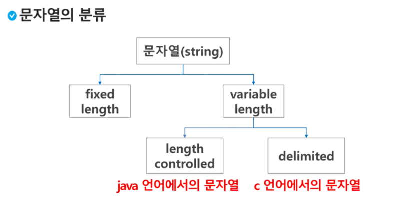
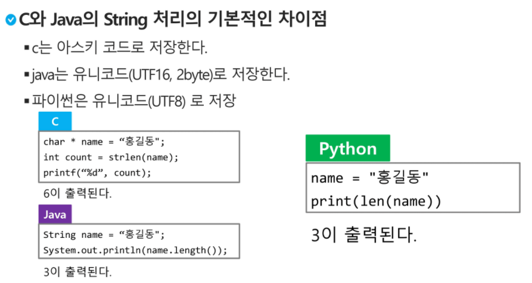
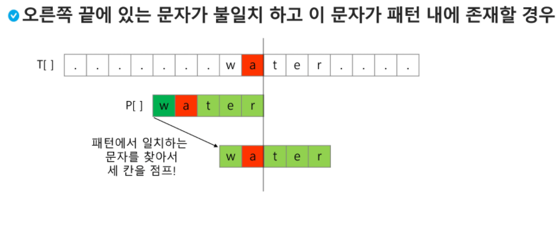
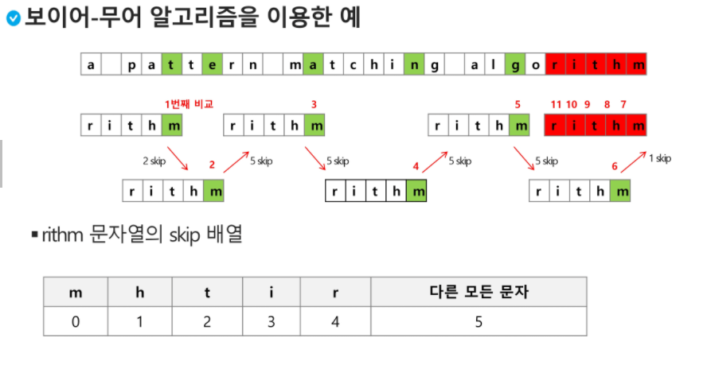
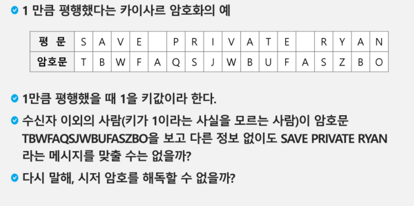
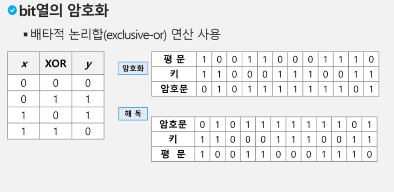
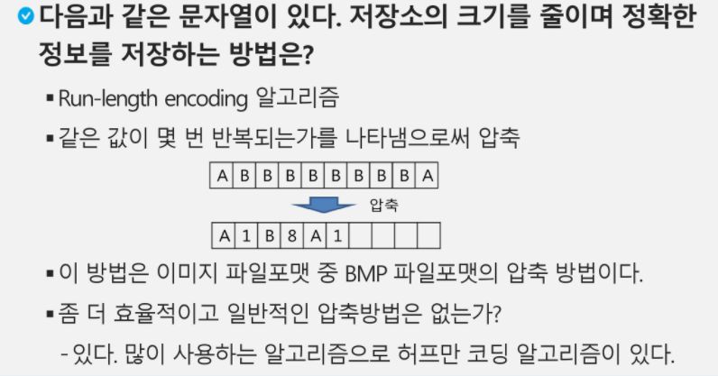

### APS 기본

### 문자열

* #### 문자열

  * 

  

  * *C 언어 문자열 처리*

    * 문자열 끝에 `\n`을 넣어줌으로 구분
    * 메모리 훨씬 덜 들지만, 다루기 까다로움

    

  * *JAVA(객체지향언어)의 문자열 처리*

    * 문자열 데이터를 저장, 처리해주는 클래스 제공
    * String 클래스 사용
    * 문자열 처리에 필요한 연산 제공

    

  * *Python 문자열 처리*

    * char 타입 X
    * 텍스트 취급 방법이 통일되어 있다
    * 문자열 기호
      * `''` , `""`,`''' '''`
    * 연결(`+`)과 반복 가능
    * 시퀀스 자료형으로 분류, 시퀀스에 사용되는 인덱싱 슬라이싱 연산 사용 가능
    * immutable

  * ```python
    # 다음 두 코드의 차이 이해하기
    s1 = list(input())
    s2 = input()
    print(s1)		# ['1','2','3']
    print(s2)		# 123
    ```

  * ```python
    # strlen() 함수 만들어보기
    # \w 을 만나면 \w을 제외한 글자수 리턴
    # while을 써서 함수 완성
    def strlen(a) : 
        i = 0
        while s[i] != `\0`:
            i += 1
        return i
    
    a = ['a','b','c','\0']
    print(strlen(a))		# 3
    ```

  * C와 Java, Python 차이점

    

  * ```python
    s1 = 'abc'
    s2 = 'abc'
    s3 = 'def'
    s4 = s1
    s5 = s1[:2]+'c'
    
    print(s1 == s2)		# True
    print(s1 is s2)		# True
    print(s5)			# abc
    print(s1 == s5)		# True
    print(s1 is s5)		# False
    # s1과 s2 는 같은 주소값을 참조하기 때문에, 여러개가 생성된게 아니다. 고로 같은거임
    # 슬라이싱을 통해 생성된 s5 는 새로운 주소이기 때문에 `is`연산에서 다르게 나옴
    
    ```

    ```python
    a = 'abc'
    b = 'Abc'
    
    print(a<b)		# False
    print(a>b)		# True
    print(a == b)	# False
    ```

    ```python
    # atoi() 함수 만들기
    def atoi(s):
        i = 0
        for x in s:
            i = i*10 + ord(x)-ord('0')
        return i
    
    s = '123'
    a = atoi(s)
    print(a)
    ```

    ```python
    # itoa() 만들기
    ```

* #### 패턴매칭

  * 매우 긴 텍스트가 있따. 'abc'가 있는지 찾아볼래?

  * 사용되는 알고리즘

    * **고지식한 패턴 검색 알고리즘**

      * 본문 문자열을 처음부터 끝까지 순회하면서 문자들을 일일히 비교하는 방식으로 동작
      * Index 오류 조심해야한다.

      ```python
      p = "is"				# 찾을 패턴
      t = "This is a book"	# 전체 텍스트
      M = len(p)				# 찾을 패턴 길이
      N = len(t)				# 전체 텍스트 길이
      
      def Brute(p,t):
          i = 0				# t 인덱스
          j = 0				# p 인덱스
          while j < M and i < N:
              if t[i] != p[j]:
                  i = i - j
                  j = -1
              i = i + 1
              j = j + 1
          if j == M : return i - M	# 검색 성공
          else : return -1			# 검색 실패
      ```

    * **카프-라빈 알고리즘**

    * **KMP 알고리즘**

      * 불일치가 발생한 텍스트 스트링의 앞부분에 어떤 문자가 있는지를 알고 있으므로, 불일치가 발생한 앞 부분에 대해 다시 비교하지 않고 매칭 수행
      * 패턴을 전처리하여 배열 next[M]을 구해서 잘못된 시작을 최소화함
      * `next[M]` : 불일치가 발생할 경우 이동할 다음 위치

    * **보이어-무어 알고리즘**

      * 오른쪽에서 왼쪽으로 비교
      * 상용 소프트웨어에서 채택하고 있는 알고리즘
      * 오른쪽 끝에 있는 문자가 불일치하고 이 문자가 패턴 내에 존재하지 않는 경우, 이동거리는 패턴 길이만큼이 된다.
      * 
      * 

* #### 문자열 암호화

  * 시저 암호 : 평문에서 사용되고 있는 알파벳을 일정 문자 수만큼 [평행 이동] 시킴으로 암호화 
  * 
  * bit열 암호화 : 베타적 논리합(exclusive-or) 연산 사용
  * 

* #### 문자열 압축

  * 

* ##### 문제풀이연습

* 