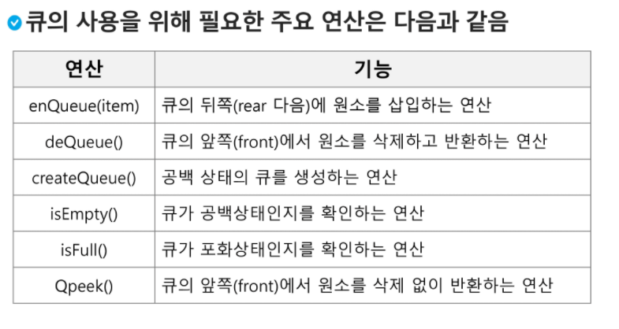
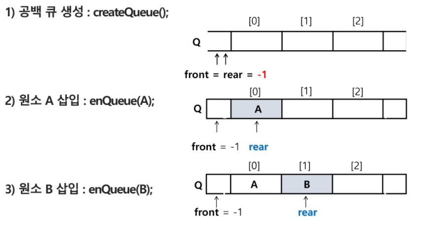
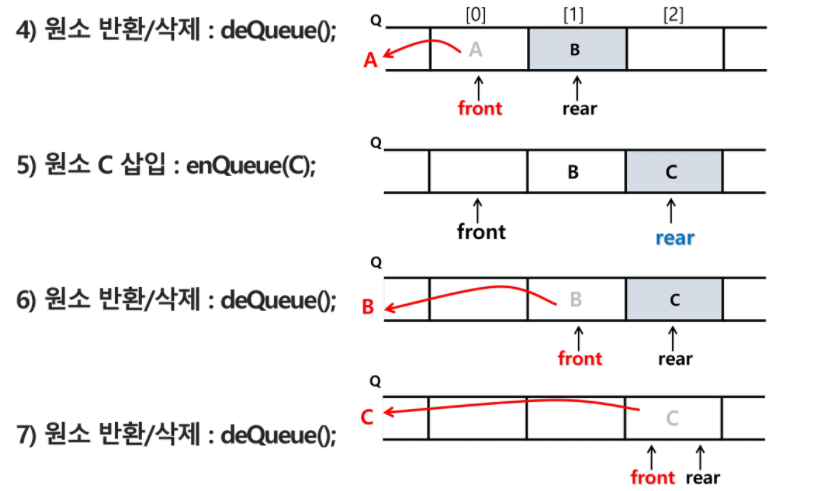
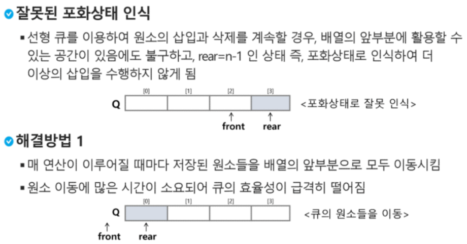
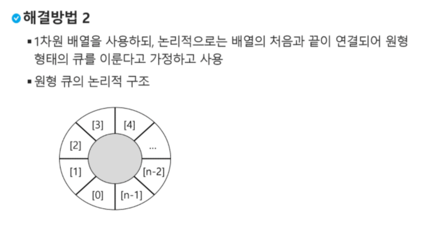
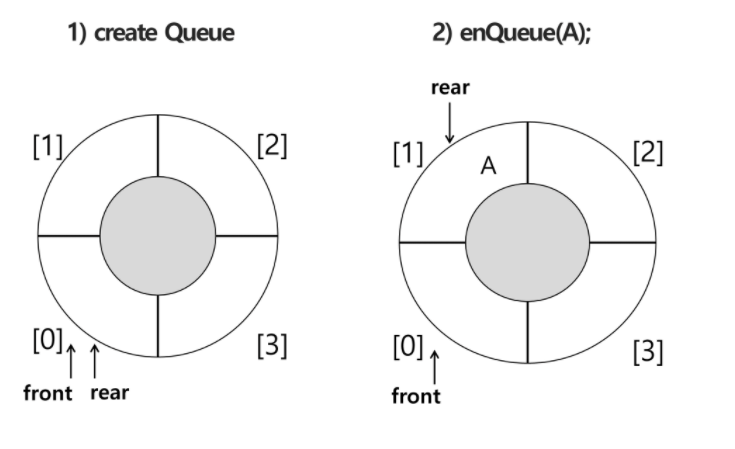
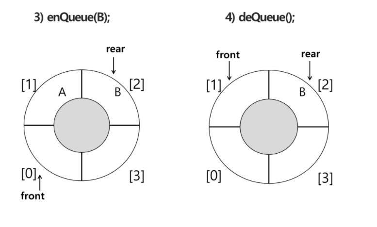
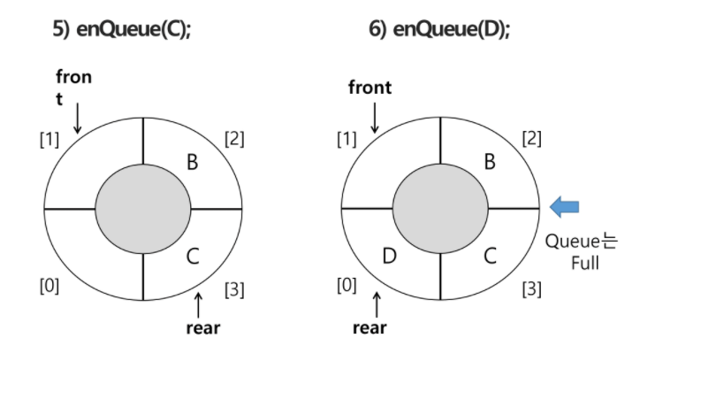
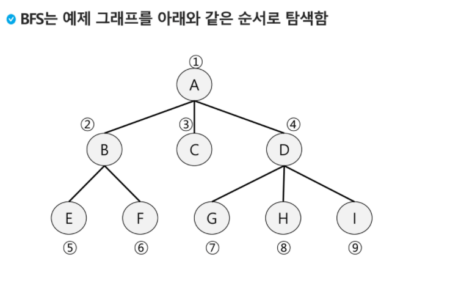
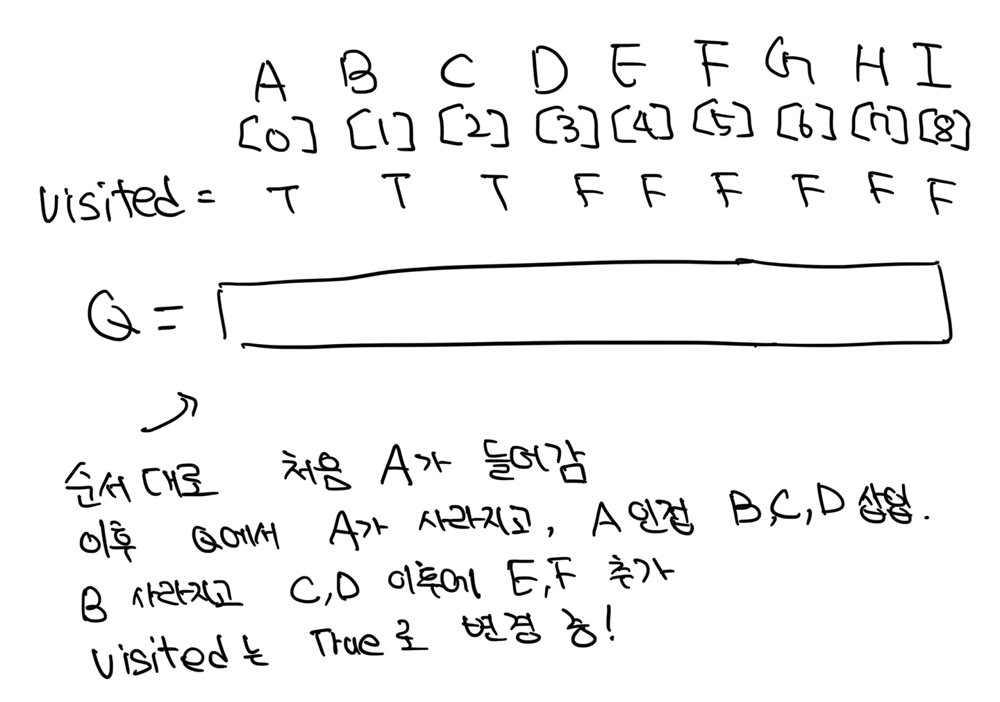

### 큐(Queue)

---

#### 큐

- 스택과 마찬가지로, 삽입과 삭제의 위치가 제한적인 자료구조

- 큐의 뒤에서는 삽입만 하고, 큐의 앞에서는 삭제만 이루어지는 구조

- 선입선출구조(FIFO : First In First Out)

- 큐의 기본 연산

  - 삽입 : enQueue
  - 삭제 : deQueue

- 

- ##### **큐의 연산 과정**

  - 
  - 


---

#### 큐의 구현

1. ##### 선형큐

* 1 차원 배열을 이용한 큐

  * 큐의 크기 = 배열의 크기
  * fonrt, rear = 저장된 원소의 첫 인덱스, 마지막 인덱스

* 상태 표현

  * 초기상태 : front = rear = -1
  * 공백상태 : front == rear
  * 포화상태 : rear == n-1(n : 배열 크기, n-1 : 배열 마지막 인덱스)

* 구현 시작

  * ```python
    # 초기 공백 큐 생성
    # 크기 n인 1차원 배열 생성
    # front/rear -1로 초기화
    Q = [0] *10
    front = rear = -1
    
    # 삽입(enQueue) : 마지막 원소 뒤에 새로운 원소 삽입을 위해
    def enQueue(item):
        global rear
        if rear == len(Q)-1: 
            print("Queue Full")
        else :
            rear += 1
            Q[rear] = item
    
    # 삭제(deQueue) : 가장 앞 원소 삭제
    # 새로운 첫 째 원소 리턴함으로 삭제와 동일한 기능
    def deQueue():
        if front==rear : 
            print("Queue Empty")
        else :
            front += 1
            return Q[front]
    # 검사(Qpeek) : 가장 앞 원소 검색 및 반환
    # 현재 front 한자리 뒤 원소, 큐의 첫째 원소 반환
    def Qpeek():
        if front==rear:
            print("Queue Empty")
        else :
            return Q[front+1]
     
    
    ```

  * 선형 큐 이용시의 문제점

    * 

      


2. ##### 원형큐

   * 초기 공백상태

     * front = rear = 0

   * Index 순환

     * front와 rear으 ㅣ위치가 배열 마지막인 n-1을 가리킨 후, 다음에는 논리적 순환을 위해 첫 인덱스인 0으로 이동해야함
     * 이를 위해 나머지 연산자 mod 사용

   * front 변수

     * 공백상태와 포화 상태 구분을 쉽게하기 위해 front가 있는 자리는 사용하지 않고 빈자리로 둠

   * 삽입 위치

     * rear = (rear+1) mod n

   * 삭제 위치

     * front = (front+1) mod n

   * 연산 과정

     * 
     * 
     * 

   *  구현해보자

     ```python
     # 초기 공백 큐 생성
     cQ = [0] * n
     front = rear = 0
     
     # 공백상태 및 포화상태 검사
     # 공백상태 : 
     def isEmpty():
     	return front == rear
     # 포화상태 : 삽입할 rear의 다음 위치 == 현재 front
     def isFull():
     	return (rear+1) % len(cQ) == front
     
     # 삽입 
     def enQueue(item):
         global rear
         if (rear+1)%n == front:
             print("Queue Full")
         else :
             rear = (rear+1)%len(cQ)
             cQ[reare] = item
             
     # 삭제 : 가장 앞 원소 삭제를 위해
     # front 값을 조정하여 삭제할 자리 준비
     # 새로운 front 원소 리턴함으로 삭제와 동일한 기능
     def deQueue():
         global front
         if is_Empty():
             print("Queue Empty")
         else :
             fornt = (front+1) % len(cQ)
             return cQ[front]
     ```

     <hr

3. ##### 우선순위 큐

   * 우선 순위를 가진 항목들을 저장하는 큐
   * FIFO가 아니라 우선순위가 높은 순서대로 먼저 나간다
   * 적용분야
     * 시뮬레이션 시스템
     * 네트워크 트래픽제어
     * 운영체제의 데스크 스케줄링
   * 우선순위 큐의 구현법
     * 배열을 이용한 우선순위 큐
     * 링크드 리스트를 이용한 우선순위 큐
   *  배열을 이용하여 우선순위 큐 구현
     * 배열을 이용하여 자료 저장
     * 원소를 삽입하는 과정에서 우선순위 비교, 적절한 위치에 삽입하는 구조
     * 가장 앞에 최고 우선순위의 원소가 위치하게 됨
   * 문제점
     * 배열을 사용하므로 삽입이나 삭제 연산이 일어날 때 원소의 재배치 발생
     * 이에 소요되는 시간이나 메모리 낭비가 크다

---

#### 큐의 활용

##### 버퍼

- 데이터를 다른 곳으로 전송하는 동안 일시적으로 데이터를 보관하는 메모리 영역
- 버퍼링 : 버퍼를 활용하는 방식 or 버퍼를 채우는 동작 의미


---

### BFS(Breadth First Search) : 너비우선탐색

* 너비우선탐색은 탐색 시작점의 인접 정점들을 모두 차례로 방문한 후에, 방문했던 정점을 시작으로 하여 다시 인접 정점들을 차례로 방문하는 방식
* 인접 정점에 대해 탐색을 한 후, 차례로 다시 너비 우선탐색을 진행해야하므로, 큐를 활용함




```python
# append pop 활용 / 중복 탐색 방지
    def BFS(G,v):							# 그래프 G, 탐색 시작점 v
    visited = [0]*(n+1)						# n : 정점의 개수
    queue = []								# 큐 생성
    queue.append(v)							# 시작점 v를 큐에 삽입
    visited[v] = 1
    while queue :							# 큐가 비어있지 않은 경우
        t = queue.pop(0)					# 큐의 첫번째 원소 반환
        visit(t)
        for i in G[t]:						# t와 연결된 모든 정점에 대해
            if not visited[i]:				# 방문되지 않은 곳이라면
                queue.append(i)				# 큐에 넣기
                visited[i] = visited[t] + 1 # n으로부터 1만큼 이동
```

