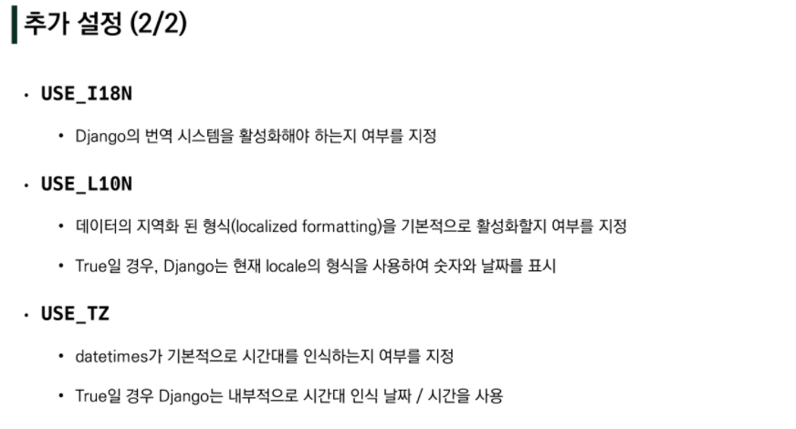

### Django Web Framework

---

#### 들어가기 앞서..

##### 정적 웹페이지

- 서버에 미리 저장된 파일이 사용자에게 그대로 전달되는 웹 페이지
- 모든 상황에서 동일한 정보 표시
- HTML, CSS, JavaScript로 작성
- flat page라고도 함
- 

##### 동적 웹페이지

* 웹 페이지에 대한 요청을 받은 경우, 추가적인 처리 과정 이후 클라이언트에게 응답을 보냄
* 상호작용하기 때문에, 내용은 그때 그때 다름
* 서버 사이드프로그래밍 언어(python, java, c++)가 사용되며, 파일을 처리하고 데이터베이스와 상호작용이 이루어짐


##### Framework

* 프로그래밍에서 특정 운영체제를 위한 응용프로그램 표준 구조를 구현하는 클래스와 라이브러리 모임
* 재사용할 수 있는 수많은 코드를 프레임워크로 통합함으로, 개발자가 새로운 어플을 위한 코드를 다시 작성하지 않아도 같이 사용할 수 있게 도움
* Application Framework라고 함


##### Framework Architecture

* MVC Design Pattern(model-view-controller)
* 인터페이스로부터 프로그램 로직을 분리하여, 어플리케이션의 시각적 요소나 이면에서 실행되는 부분을 서로 영향 없이 쉽게 고칠 수 있는 어플을 만들 수 있다
* Django는 MTV (model-template-view) Pattern이라고 함


##### MTV 패턴

* model
  * 응용프로그램의 데이터 구조를 정의하고 데이터베이스의 기록을 관리(추가,수정,삭제)
* template
  * 파일 구조나 레이아웃 정의
  * 실제 내용을 보여주는데 사용(presentation)
* view
  * http 요청을 수신하고, http 응답을 반환
  * model을 통해 요청을 충족시키는데 필요한 데이터에 접근
  * template에게 응답의 서식 설정을 맡김

---

#### Django

##### 1. 설정

1.  폴더 생성 후 가상환경 설정
   * `python -m venv '가상환경 이름'`: 특별한 일 없으면 가상환경 이름은 venv
2.  가상환경 활성화
   * `source 파일명/Scripts/activate`
   * 이후 `pip list`로 확인
   * 
3.  django 설치 : `pip install django==3.2.12`
4.  django 프로젝트 생성 : `django-admin startproject <프로젝트명> .`
   * 프로젝트명에는 python이나 django에서 사용중인 키워드를 피애햐한다. `-`도 사용 불가
   * <프로젝트명> 파일과 manage.py 파일이 생성됨


5. django 서버 실행 : `python manage.py runserver`

   * ctrl+shift+p > python select interpreter 설정해주기

   * C:\Users\admin\Desktop\00_django_intro\firstpjt\__init__.py로켓 보고 기뻐하기

   

---

##### 2. 파일구조

1. `__init__.py` : python에게 이 디렉토리를 하나의 python 패키지로 다루도록 지시
2. `asgi.py` : Asynchronous Server Gateway Interface, 비동기식 웹 서버와 연결 및 소통하는 것을 도움
3. `settings.py` : 어플리케이션의 모든 설정 포함
4. `urls.py` : 사이트 url과 적절한 views의 연결 지정
5. `wsgi.py`: Web Server Gateway Interface, 웹서버와 연결 및 소통하는 것을 도움
6. `manage.py` : 장고 프로젝트와 다양한 방법으로 상호작용하는 커맨드라인 유틸리티

---

##### 3. Application 생성

`python manage.py startapp <앱이름>`

: 앱 이름을 가진 폴더가 생성됨 // 앱 이름은 복수형 권장 (ex - articles)

3-1 Application 파일 구조

* `admin.py` : 관리자용 페이지를 설정하는 곳
* `apps.py` : 앱의 정보가 작성된 곳
* `models.py` : 앱에서 사용하는 model을 정의하는 곳
* `tests.py` : 프로젝트의 테스트 코드를 작성하는 곳
* `views.py`: view 함수들이 정의되는 곳

---

##### 4. project & application

* project : 프로젝트는 앱의 집합
  * 프로젝트에는 여러 앱이 포함될 수 있음
  * 앱은 여러 프로젝트에 있을 수 있다 
* application : 앱은 실제 요청을 처리하고 페이지를 보여주고 하는 등의 역할 담당
  * 하나의 프로젝트는 여러 앱을 가짐
  * 일반적으로 앱은 하나의 역할 및 기능 단위로 작성함
* 앱 등록 : 현재 프로젝트에는 어떤 앱을 사용할지 등록되어 있지 않기때문에, `project/settings.py`에 들어가서 등록을 해주어야한다.
  * 
  * 반드시 ***앱 생성 후 등록!!!!!!!!!!!!!!!***
  * 앱 등록 권장 순서!!:
    * 

---

##### 5. 요청과 응답

5-1. 추가설정





urls > views > template/<필요.html>  순으로 해야 오류 안난다

---

##### 6. Template

6.1 - Django Template

* 데이터 표현을 제어하는 도구이자 표현에 관련된 로직
* 사용하는 built-in system

##### Django Template Language(DTL)

* Django template에서 사용하는 built-in template system
* 조건, 반복, 변수, 치환, 필터 등의 기능 제공
* 프로그래밍적 로직이 아니라, 프레젠테이션을 표현하기 위한 것
* python 코드 형태로 생겼으나, python 코드로 실행되는 것이 아니다.(이해 및 사용에 용이하라고 같게 만든거임)

* DTL Syntax

  * Variable

    

    ```django
    # urls.py
    urlpatterns = [
        path('greeting/', views.greeting),
    ]
    
    # views.py
    def greeting(request):
        foods = ['apple','banana','coconut']
        info = {
            'name' : 'Alice',
        }
        context = {
            'foods' : foods,
            'info' : info,
        }
        return render(request, 'greeting.html', context)
    
    # greeting.html
        <p>안녕하세요 저는 {{ info.name }} 입니다.</p>
        <p>제가 가장 좋아하는 음식은 {{ foods }} 입니다.</p>
        <p>저는 사실 {{ foods.0 }}를 가장 좋아합니다.</p>
    ```

  * Filters

    

    ```django
    # greeting.html ==> 소문자로 출력
    <p>안녕하세요 저는 {{ info.name|lower }} 입니다.</p>
    ```

  * Tags

    

    ```django
        # dinner.html
        <p>메뉴판</p>
        <ul>
          
          <li>{{ food }}</li>
          
        </ul>
    ```

  * Comments

    

    ```django
        {# 이것은 한 줄 주석입니다. #} 
        <p>1</p>
        <p>1</p>
        <p>1</p>
        
    ```

##### Template inheritance (템플릿 상속)

* 기본적으로 코드의 재사용성에 초점을 맞춤
* 상속을 사용하면 사이트의 모든 공통 요소를 포함하고, 하위 템플릿이 재정의(override) 할 수 있는 블록을 정의하는 기본 'skeleton' 템플릿을 만들 수 있다

##### Template inheritance - 'tags'


base.html을 최상단에 올릴 것이기 때문에, 특별히 경로를 추가해주어야한다

프로젝트 -> settings.py -> TEMPLATES -> 'DIRS'에 추가해준다


`BASE_DIR` = 현재 장고 파일을 모두 가지고 있는 최상단 파일. 즉, 최상단 시작점


#### 장고 설계 철학

