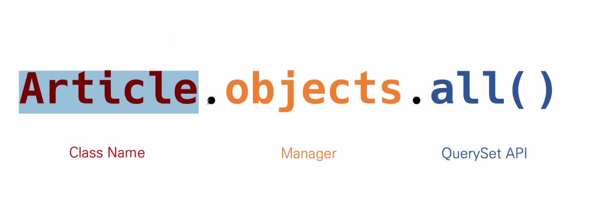
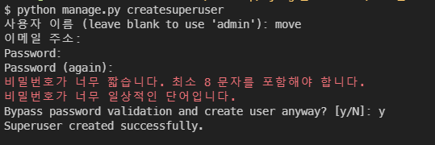

### Django Model

#### Model

- 단일한 데이터에 대한 정보를 가짐
  - 사용자가 저장하는 데이터들의 필수적인 필드들과 동작들을 포함
- 저장된 데이터베이스의 구조(layout)
- django는 model을 통해 데이터에 접속하고 관리
- 일반적으로 각각의 model은 하나의 데이터베이스 테이블에 매핑 됨


#### Database

* 체계화된 데이터의 모임ㅐ
* 쿼리(Query)
  * 데이터를 조회하기 위한 명령어
  * 조건에 맞는 데이터를 추출하거나 조작하는 명령어
  * "Query를 날린다 -> DB조작한다"
* 스키마(Schema)
  * 데이터베이스에서 자료의 구조, 표현방법, 관계 등을 정의한 구조
* 테이블(Table)
  * 열(column) : 필드 or 속성 - 고유한 데이터 형식이 지정된다(속성값과 일치하는 정보들)
  * 행(row) : 레코드 or 튜플 
* PK값(기본키) : 각 행의 고유값으로, Primary Key. 반드시 설정해야하며, 데이터베이스 관리 및 관계 설정시 주요하게 활용된다.


#### ORM

* Object-Relational-Mapping
* 객체 지향 프로그래밍 언어를 사용하여 호환되지 않는 유형의 시스템간에(Django-sql) 데이터를 변환하는 프로그래밍 기술
* OOP 프로그래밍에서 RDBMS를 연동할 때, 데이터베이스와 객체 지향 프로그래밍 언어간의 호환되지 않는 데이터를 변환하는 프로그래밍 기법
* Django는 내장 Django ORM을 사용함
* 장점
  * SQL을 알지 못해도 DB조작 가능
  * SQL의 절차적 접근이 아닌 객체 접근으로 인한 높은 생산성
* 단점
  * ORM 만으로 완전한 서비스를 구현하기 어려운 경우가 있음
* 현대 웹 프레임워크의 요점은 웹 개발 속도를 높이는 것(생산성)


#### models.py 작성

```python
# articles/models.py

class Article(models.Model):
    title = models.CharField(max_length=10)
    content = models.TextField()
    
# 아티클이라는 객체를 생성함으로써, 테이블 생성
```


#### Migrations

* django가 model에 생긴 변화를 반영하는 방법

* 명령어 모음

  * `'python manage.py makemigrations'`
    * model을 변경한 것에 기반한 새로운 마이크레이션을 만들 때 사용
  * `python manage.py migrate`
    * 마이그래이션을 DB에 반영하기 위해 사용
    * 설계도를 실제 DB에 반영하는 과정
    * 모델에서의 변경 사항들과 DB의 스키마가 동기화를 이룸

  * `python manage.py sqlmigrate <모델명> <모델번호>`
    * 마이그레이션에 대한  SQL 구문을 보기 위해 사용
    * 마이그래이션이 SQL문이 어떻게 해석되어 동작할지 미리 확인할 수 있음
  * `python manage.py showmigrations`
    * 프로젝트 전체의 마이그레이션 상태를 확인하기 위해 사용
    * 마이그레이션 파일들이 migrate 됐는지 안됐는지 여부를 확인할 수 있음


#### 사용모델필드

* `CharField(max_length=None)`
  * 한 줄짜리 정도
* `TextField(**options)`
  * 많은 양의 텍스트
* `auto_now_add`
  * 최초 생성 일자
* `auto_now`
  * 최종 수정 일자


#### DB API

* DB를 조작하기 위한 도구
* 
* 하나만 원하는 경우 `.all` 이 아닌 `.get` 사용
* Manager
  * 기본적으로 모든 django 모델 클래스에 objects라는 Manager 추가
* QuerySet
  * 데이터베이스로부터 전달받은 객체 목록
  * queryset 안의 객체는 0개, 1개 혹은 여러 개일 수 있음
  * 데이터베이스로부터 조회, 필터, 정렬 등을 수행할 수 있음

* `app/settings.py/installed_app에 django_extensions 추가`
*  `python manage.py shell_plus`
* 내용 조작 후에 `article.save()`로 꼭 저장
* `Article.objects.all()` 로 결과 출력

```python
python mange.py shell_plus

# 첫번째 조작법
article = Article()
article.title = 'lalal'
article.content = '해윙'
article.save()

# 두번째 조작법
article = Article(title='해윙',content='바윙')
article.save()

# 세번째 조작법
Article.objects.create(title='또 해윙',content='또 바윙')
```


#### CRUD

##### 1. C(create)

* 위의 과정

##### 2. R(read)

* QuerySet API method는 크게 2가지로 분류
  * return new querysets
  * do querysets
  * `all()` : 현재 QuerySet의 복사본을 반환
  *  `get()` : 주어진 lookup  매개변수와 일치하는 객체를 반환
    * 객체를 찾을 수 없으면 DoesNotExist 예외 발생, 둘 이상의 객체를 찾을 경우 MultipleObjectReturned 발생
    * 그래서 pk 값과 같이 고유성을 보장하는 조회에서 사용할 것

##### 3. U(update)

```python
#update Where pk=1 and title=first
article = Article.objects.get(pk=1)
article.title
#first

# 값을 변경하고 저장
article.title = 'byebye'
article.save()

# 정상적으로 변경됐는지 확인
article.title
#byebye
```

##### D(delete)

```python
article = Article.objects.get(pk=1)

# 삭제
article.delete()
#(1, {'articles.Article' : 1})

# 1번은 이제 찾을 수 없음
Article.objects.get(pk=1)
# DoesNotExist : Article matchin query does not exist.
```


#### Admin site

##### Automatic admin interface

*  사용자가 아닌 서버의 관리자가 활용하기 위한 페이지
* Model class를 admin.py에 등록하고 관리
* django.contrib.auth 모듈에서 제공됨
* record 생성 여부 확인에 매우 유용하며, 직접 record를 삽입할 수도 있음


##### admin 생성

```python 
python manage.py createsuperuser
```




* admin 등록

* ```python
  # articles/admin.py
  from django.contrib import admin
  from .models import Article
  
  class ArticleAdmin(admin.ModelAdmin):
      # list_display 정해진 변수이름이므로 변경 X
      list_display = ('pk', 'title', 'content', 'created_at', 'updated_at')
  
  # admin site에 register 하겠다.
  # ArticleAdmin을 추가함으로써 list_display 값을 다 보이게 설정하겠다
  admin.site.register(Article, ArticleAdmin)
  ```
  
* 