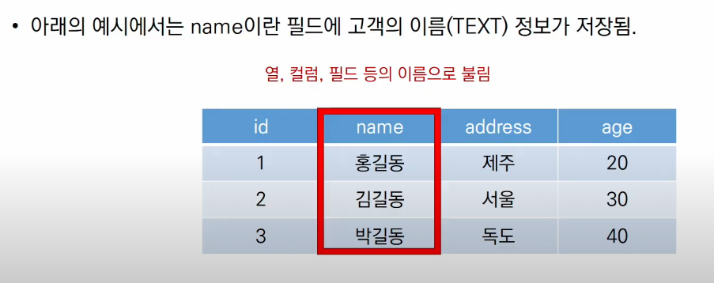
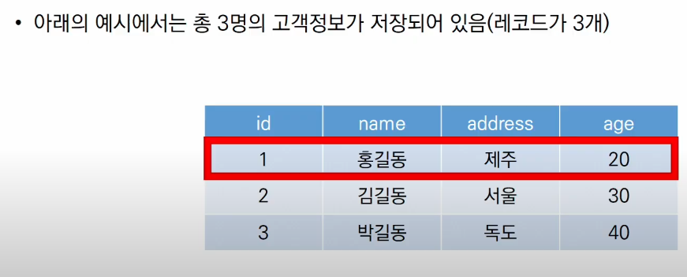
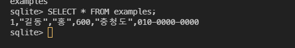
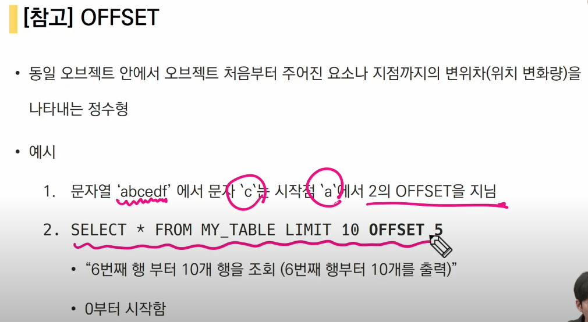

### DB01

---

### 1. Database

- 체계화된 데이터 모임
- 몇 개의 자료 파일을 조직적으로 통합, 자료 항목의 중복을 없애고, 자료를 구조화시켜 기억시켜놓은 자료의 집합체
- 데이터베이스로 얻는 장점
  - 데이터 중복 최소화
  - 데이터 무결성(정확한 정보 보장)
  - 데이터 일관성
  - 데이터 독립성
  - 데이터 표준화
  - 보안 유지


#### 관계형 데이터베이스(RDB)

* 키와 값들의 간단한 관계를 표로 정리한 데이터베이스

  | 고유번호 |  이름  | 주소 | 나이 |
  | :------: | :----: | :--: | :--: |
  |    1     | 홍길동 | 제주 |  20  |
  |    2     | 김길동 | 서울 |  30  |

* 스키마 : 데이터베이스에서 자료의 구조, 표현방법, 관계 등 전반적 명세를 기술한 것

  | column | datatype |
  | :----: | :------: |
  |   id   |   int    |
  |  name  |   text   |

* 테이블 : 열과 행의 모델을 사용해 조직된 데이터 요소들의 집합

* 열 : 각 열에는 고유한 데이터 형식이 지정됨

  

* 행 : 실제 데이터가 저장되는 형태

  

* 기본키 : 각 행의 고유값, 반드시 설정해야하며 DB 관리 및 관계 설정시 주요하게 활용됨

#### RDBMS(관계형 데이터베이스 관리 시스템)

* ex) MySQL, ORACLE 등등
* SQLite
  * 서버 형태가 아닌 파일 형식으로 응용 프로그램에 넣어서 사용하는 비교적 가벼운 데이터베이스
  * 구글 안드로이드 기본 탑재 DB로 임베디드에도 많이 활용됨
* Sqlite Data Type
  * NULL
  * INTEGER
    * 크기에 따라 0,1,2,3,4 또는 8바이트에 저장된 부호 있는 정수
  * REAL
    * 8바이트 부동 소수점 숫자로 저장된 부동 소수점 값
  * TEXT
  * BLOB
    * 입력된 그대로 정확히 저장된 데이터(별다른 타입 없이 그대로 저장)

---

### 2. SQL

* 관계형 데이터베이스 관리시스템의 데이터 관리를 위해 설계된 특수 목적 프로그래밍 언어

* 데이터베이스 스키마 생성 및 수정

* 자료 검색 및 관리

* 데이터베이스 객체 접근 조정 관리

* 분류

  |          분류           |                             개념                             |                 예시                 |
  | :---------------------: | :----------------------------------------------------------: | :----------------------------------: |
  | DDL - 데이터 정의 언어  | 관계형 데이터베이스 구조(테이블,스키마)를 <br>정의하기 위한 명령어 |       CREATE<br>DROP<br>ALTER        |
  | DML -  데이터 조작 언어 |    데이터를 저장, 조회, 수정, 삭제 등을 하기 위한 명령어     | INSERT<br>SELECT<br>UPDATE<br>DELETE |
  | DCL - 데이터 제어 언어  |    데이터베이스 사용자의 권한 제어를 위해 사용하는 명령어    |                GRANT                 |

#### 테이블 생성 및 삭제 실습

```shell
sqlite3 tutorial.sqlite3
sqlite> .databse
```

##### csv 파일을 table로 만들기

```shell
sqlite> .mode csv
sqlite> .import 파일명.csv 테이블명
sqlite> .tables
테이블명
```

##### 조회

```SQL
SELECT * FROM examples;
```



#### 쉬운 접근법(SQlite extention 사용)

```
tutorial.sqlite3 우클릭 - open database or ctrl+shift+p -> sqlite3 Open database
sqlite EXPLORER 우클릭 - NEW QUERY - 명령어 입력 및 저장 - run

## 테이블 생성 및 삭제

1. SQLite 설치하기

2. csv 파일 다운로드

3. 데이터 베이스 생성하기

   ```bash
   sqlite3 tutorial.sqlite3
   .database
   # .은 sqlite 프로그램의 기능을 실행하는 것 
```

4. csv 파일을 table로 만들기

   ```bash
   .mode csv
   .import hellodb.csv examples
   # hellodb.csv를 받아와서 exaples라는 테이블에 만들어줘!
   .tables
   # 하면 examples라는 테이블이 만들어짐
   ```

5. tutorial sqlite3를 오른쪽 마우스 클릭해서 open database를 클릭하면 sqlite explorer에 tutorial.sqlite3가 뜸(sqlite 확장 프로그램 사용하기)

6. sqlite 작성

   ```bash
   # 조회: 특정 테이블의 레코드 정보를 반환
   SELECT * FROM examples;
   # ;까지 하나의 명령으로 간주
   # examples에서 모든것을 가져와라
   
   # 생성
   CREATE TABLE classmates (
     id INTEGER PRIMARY KEY,
     name TEXT
   );
   #테이블 생성 - 스키마 생성
   # ☆ 새롭게 테이블을 생성하거나 삭제할때  SQLITE EXPLORER 옆에 있는 새로고침 버튼을 눌러야 UPDATE
   ```

7. 터미널 view 변경하기

   ```bash
   .headers on 
   # 테이블의 id, name, 등 헤더가 보임
   .mode column
   # 하면 헤더와 데이터가 분리한 채 보임
   ```

8. tutorial sqlite3 오른쪽 버튼 클릭하면 new query를 클릭하면 파일이 하나 생성 됨 

   sql 확장자 생성됨

   이런 확장자에 코드 작성하면 자동완성, colorizing이 가능함

9. 확장자 생성된 것에 아무곳에나 오른쪽 버튼 클릭하면 

   run query: 쿼리 전체 실행

   run selected query: block 처리 된 곳이나 마우스가 클릭되어있는 부분만 실행

10. run selected query를 클릭하면 tutorial.sqlite 클릭 하면 sqlite화면 결과를 보여줌
```


```terminal
.schema classmates
# 를 하면 classmate 테이블의 스키마를 볼 수 있음
```

---

### CRUD

#### 1. CREATE

##### Insert

기본적으로 공백 허용 안할 때 = 테이블 생성시 NOT NULL 설정

```sqlite
sqlite> CREATE TABLE classmates (
id INTEGER PRIMARY KEY,
name TEXT NOT NULL);
```


##### INSERT: 테이블에 단일 행 삽입

```SQL
INSERT INTO 테이블이름 (컬럼1,컬럼2..) VALUES(값1,값2,...)
```

```sqlite
INSERT INTO classmates (name, age) VALUES ('홍길동',23);
```

```sqlite
-- id 값 보려면
SELECT rowid, * FROM 테이블명;
```


#### 2. READ

##### SELECT

* 테이블에서 데이터를 조회

* 가장 복잡한 문이며 다양한 절과 함께 사용

* ORDER BY, DISTINCT, WHERE, LIMIT, GROUP BY

* LIMIT
  * 뭐리에서 반환되는 행 갯수 제한
  * 특정 행부터 시작해서 조회하기 위해 OFFSET 키워드와 함께 사용하기도 함
  
* WHERE
  * 쿼리에서 반환된 행에 대한 특정 검색 조건을 지정
  
    ```sqlite
    
    -- 30살 이상이고 성이 김씨인 사람들 모두 출력
    SELECT age, last_name FROM users 
    WHERE age >= 30 AND last_name='김';
    ```
  
    
  
* SELECT DISTINCT
  * 조회 결과에서 중복 행을 제거
  * DISTINCT 절은 SELCELT 키워드 바로 뒤에 작성해야 함

```SQLITE
SELECT 컬럼1, 컬럼2 ... FROM 테이블 이름;
```

```sqlite
SELECT 컬럼1, 컬럼2 ... FROM 테이블 이름 LIMIT 숫자;
```

```sqlite
SELECT 컬럼1, 컬럼2 ... FROM 테이블 이름 LIMIT 숫자 OFFSET 숫자;
```



```sqlite
SELECT 컬럼1, 컬럼2 ... FROM 테이블 이름 WHERE 조건;
```

```sqlite
SELECT DISTINCT 컬럼1 FROM 테이블이름;
```


#### 3. UPDATE

```sqlite
UPDATE 테이블이름 SET 컬럼1, 컬럼2 WHERE 조건;
```


#### 4. DELTET 

```SQL
DROP TABLE classmates;
```

```sqlite
DELETE FROM 테이블 이름 WHERE 조건;
```

장고에서는 한 번 사용된 pk 값이 다시 사용되지 않지만, sqlite는 기본적으로 재사용 가능하다.

이를 방지하기 위해서는

```sqlite
CREATE TABLE 테이블이름 (
id INTEGER PRIMARY KEY AUTOINCREMENT,);
```

와 같이 autoincrement 설정을 해주면 된다.

---

#### SQLite Aggregate Functions

* 집계 함수

* 집합에 대한 계산을 수행하고 단일 값을 반환

  * 여러 행으로부터 하나의 결과값을 반환하는 함수

* SELECT 구문에서만 사용됨

* 종류

  * COUNT

    ```sqlite
    SELECT COUNT(컬럼) FROM 테이블이름;
    ```

  * 기본 컬럼이 숫자로 이루어질 때 사용 가능

    ```sqlite
    SELECT AVG(컬럼) FROM 테이블이름;
    SELECT SUM(컬럼) FROM 테이블이름;
    SELECT MIN(컬럼) FROM 테이블이름;
    SELECT MAX(컬럼) FROM 테이블이름;
    ```

---

### LIKE

* 패턴 일치를 기반으로 데이터를 조회하는 방법

* SQLite는 패턴 구성을 위한 2개의 wildcards 제공

* `%` : 이 자리에 문자열이 있을 수도, 없을 수도 있다.

* `_`: 반드시 이 자리에 한 개의 문자가 존재해야 한다.

  |  와일드카드패턴  |                     의미                     |
  | :--------------: | :------------------------------------------: |
  |        2%        |               2로 시작하는 값                |
  |        %2        |                2로 끝나는 값                 |
  |       %2%        |               2가 들어가는 값                |
  |       _2%        | 아무 값이 하나 있고 두번째가 2로 시작하는 값 |
  |       1___       |          1로 시작하고 총 4자리인 값          |
  | 2\_%\_% / 2\_\_% |        2로 시작하고 적어도 3자리인 값        |

  ```sqlite
  -- 폰 가운데 번호가 5114 인 사람 정보를 꺼내줘~
  SELECT * FROM users WHERE phone
  LIKE '%_5114_%';
  ```

---

### ORDER BY

* 조회 결과 집합을 정렬
* SELECT 문에 추가하여 사용
* `ASC` :  오름차순
* `DESC` : 내림차순

```sqlite
SELECT * FROM 테이블 ORDER BY 컬럼 ASC;
SELECT * FROM 테이블 ORDER BY 컬럼1, 컬럼2 DESC;
```

```sqlite
-- 나이 순, 성 순으로 오름차순 정렬하여 상위 10개만 조회한다면?
-- 이때 나이순으로 선 정렬된 후 성에 따라 2차 정렬된다.
SELECT * FROM users 
ORDER BY age, last_name ASC
LIMIT 10;
```

```sqlite
-- 계좌 잔액 순으로 내림차순 정렬하여 해당 유저의 성과 이름을 10개만 조회한다면?
select last_name, first_name 
FROM users 
ORDER BY balance DESC 
LIMIT 10;
```

---

### GROUP BY

* 행 집합에서 요약 행 집합을 만든다
* SELECT 문의 optional 절
* 선택된 행 그룹을 하나 이상의 열 값으로 요약 행으로 만든다
* 문장에 WHERE 절이 포함된 경우 반드시 WHERE 절 뒤에 작성해야함

```sqlite
SELECT 컬럼1, aggregate_funstion(컬럼2) FROM 테이블 GROUP BY 컬럼1, 컬럼2;
```

```sqlite
-- users에서 각 성(last_name)씨가 몇 명씩 있는지 조회한다면?
SELECT last_name, COUNT(*) 
FROM users GROUP BY last_name;
```

```sqlite
-- 위와 같은 상황이지만, name_count의 헤더로 자료가 조회된다
SELECT last_name, COUNT(*) AS name_count
FROM users GROUP BY last_name;
```

---

### ALTER TABLE

* 4가지 기능

  * table 이름 변경

    ```sqlite
    -- 테이블 이름 바꾸기
    ALTER TABLE table_name
    RENAME TO 바꿀이름;
    ```

  * 테이블에 새로운 column  추가

    ```sqlite
    ALTER TABLE news
    ADD COLUMN column이름 TEXT
    NOT NULL;
    ```

    ```sqlite
    -- 오류가 뜬다
    Error : Cannot add a NOT NULL column with default value NULL
    ```

    기존 레코드에 새로 추가할 필드에 대한 정보가 없기 때문에 나타남. 그렇기 때문에 NOT NULL은 추가가 불가능 

    1. NOT NULL 설정 없이 추가하기

       ```sqlite
       ALTER TABLE news
       ADD COLUMN column이름 TEXT;
       ```

    2. 기본값(DEFAULT) 설정하기

       ```sqlite
       ALTER TABLE news
       ADD COLUMN 생성할컬럼이름 TEXT NOT NULL
       DEFAULT '여기 디폴트값 적으면 됩니다';
       ```

  * column 이름 수정

    ```sqlite
    ALTER TABLE news
    RENAME COLUMN current_name TO new_name;
    ```

  * column 삭제

    ```sqlite
    -- subtitle column 삭제
    ALTER TABLE news
    DROP COLUMN subtitle;
    ```

    