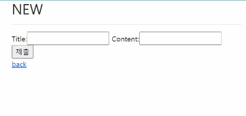
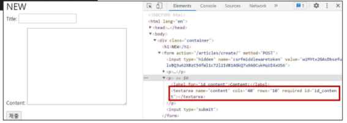
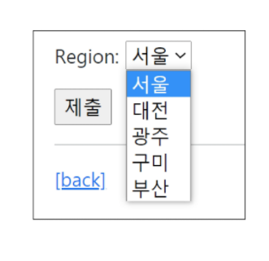

### Django Form Class

현재까지 HTML form, input을 통해 사용자로부터 데이터를 받아왔다.

입력된 데이터의 유효성을 검증하고, 필요시 데이터를 검증 결과와 함께 다시 표시할 수 있어야한다.

* 사용자가 입력한 데이터는 개발자가 요구한 형식이 아닐 수 있음을 항상 생각해야함

이렇게 사용자가 입력한 데이터를 검증하는 것을 '유효성 검증'이라고 한다.

Django는 이러한 과중한 작업과 반복코드를 줄여줌으로 해당 작업을 쉽게 만들어준다.


---

#### Django's forms

* Form은 Django의 유효성 검사 도구 중 하나
* 외부의 악의적 공격 및 데이터 손상에 대한 중요한 방어 수단
* 개발자가 직접 작성하는 코드보다 더 안전하고 빠르게 수행하는 코드를 작성할 수 있게 자동화 기능을 제공
* 다음과 같은 일을 처리해줌
  * 렌더링을 위한 데이터 준비 및 재구성
  * 데이터에 대한 HTML forms 생성
  * 클라이언트로부터 받은 데이터 수신 및 처리

#### Form Class

* Django Form 관리 시스템의 핵심
* Form내 field, field 배치, 디스플레이 widget, label, 초기값,  유효하지 않는 field에 관련된 에러 메세지를 결정

```python
# articles/forms.py

from django import forms

class ArticleForm(forms.Form):
    title = forms.CharField(max_length=10)
    content = forms.CharField()	# 모델에서는 charfield에 maxlength가 필수이지만 form에서는 아님
   
```

```python
# articles/views.py -> def new

def new(request):
    form = ArticleForm()
    context = {
		'form' : form,}
    return render(request, 'articles/new.html', context)
```

결과값




#### Form rendering options

* <label> &  <input> 쌍에 대한 3가지 출력 옵션

  * as_p()
    * 각 필드가 단락(<p>태그)으로 감싸져서 렌더링 됨
  * as_ul()
    * 각 필드라 목록항목(<li>)으로 감싸져서 렌더링 됨
  * as_table()
    * 각 필드가 테이블(<tr>)행으로 감싸져서 렌더링 됨

* Html input 요소 표현 방법 2가지

  * Form fields

    * input 에 대한 유효성 검사 로직을 처리하며 템플릿에서 직접 사용됨

  * Widgets

    * 웹 페이지의 HTML input요소 렌더링
    * GET/POST 딕셔너리에서 데이터 추출
    * widgets은 반드시 Form fields에 할당 됨
    * 주의사항
      * Form Fields와 혼동되어선 안됨
      * Form Fields는 input 유효성 검사를 처리
      * Widgets은 웹페이지에서 input element의 단순 raw한 렌더링 처리

    ```python
    # articles/forms.py
    
    from django import forms
    
    class ArticleForm(forms.Form):
        title = forms.CharField(max_length=10)
        content = forms.CharField(widget=forms.Textarea)	
       
    ```

    

  * ```python
    # articles/forms.py
    
    from django import forms
    
    class ArticleForm(forms.Form):
        REGION_A = 'sl'
        REGION_B = 'dj'
        REGION_C = 'gj'
        REGIONS_CHOICES= [
            (REGION_A, '서울'),
            (REGION_B, '대전'),
            (REGION_C, '광주'),
        ]
        title = forms.CharField(max_length=10)
        content = forms.CharField(widget=forms.Textarea)
        region = forms.ChoiceField(widget=forms.Select, choices=REGIONS_CHOICES)
    ```

    


---

#### ModelForm

* Django Form을 사용하다 보면 Model에 정의한 필드를 유저로부터 입력받기 위해 Form에서 Model 필드를 재정의하는 행위가 중복 될 수 있음
* 그래서 Django는 Model을 통해 Form class를 만들 수 있는 Model Form helper 를 제공


#### ModelForm Class

선언하기

```python
# articles/forms.py

from django import forms
from .models import Article

class ArticleForm(forms.ModelForm):
    
    class Meta:
        model = Article
        fields = '__all__'
        # exclude = ('title',) => 제외하고 출력!

# Article 모델을 가져와서 장고가 똑똑하게 다 만들어준다
# form과는 쓰임새가 다른 것이다.
# ModelForm의 경우 회원가입과 같이 DB에 저장하는 용도로 사용할 수 있고
# Form의 경우 로그인과 같이 사용자의 입력을 확인하는데에 사용
```

* forms 라이브러리에서 파생된 ModelForm 클래스를 상속받음
* 정의한 클래스 안에 Meta 클래스를 선언하고, 어떤 모델을 기반으로 Form을 작성할 것인지에 대한 정보를 Meta 클래스에 지정 [주의] 클래스 변수 fields와 exclude 는 동시에 사용할 수 없다
* Meta class
  * Model의 정보를 작성하는 곳
  * ModelForm을 사용할 경우 사용할 모델이 있어야하는데 Meta Class가 이를 구성함
    * 해당 Model에 정의한 field 정보를 Form에 적용하기 위함
  * [참고] Inner Class(Nested Class)
    * 클래스 내에 선언된 다른 클래스
    * 관련 클래스를 함께 그룹화하여 가독성 및 프로그램 유지관리를 지원(논리적으로 묶어서 지원)
    * 외부에서 내부 클래스에 접근할 수 없으므로 코드의 복잡성을 줄일 수 있음
  * [참고] Meta 데이터
    * '데이터에 대한 데이터' ex) 사진을 찍고 정보를 보면 카메라 조리개값 등의 정보가 나온다. 그게 데이터의 데이터


#### 모델폼이 쉽게 해주는 것

1. 모델 필드 속성에 맞는 html element를 만들어주고
2. 이를 통해 받은 데이터를 view 함수에서 유효성 검사를 할 수 있도록 함


##### `is_valid() method`

유효성 검사를 실행하고, 데이터가 유효한지 여부를 boolean으로 반환

데이터 유효성 검사를 보장하기 위해 제공

##### `save() method`

Form에 바인딩 된 데이터에서 데이터베이스 객체를 만들고 저장

ModelForm의 하위 클래스는 기존 모델 인스턴스를 키워드 인자 instance로 받아들일 수 있음

* 이것이 제공되면 save()는 해당 인스턴스를 수정(UPDATE)
* 제공되지 않은 경우 save()는 지정된 모델의 새 인스턴스를 만든다(CREATE)

Form의 유효성이 확인되지 않은 경우 save()를 호출하면 form.errors를 확인하여 에러 확인 가능

```python
# articles/views.py/create

def creat(request):
    form = ArticleForm(request.POST)
    # is_valid를 통해 유효성 검사를 통과한다면
    if form.is_valid():
        article = form.save() # form.save()에 리턴값이 생기기 때문에 article로 저장해주고 리턴시 									article.pk를 사용 가능
        return redirect('articles:detail', article.pk)
    print(form.errors)		# save() 실패할 경우 에러메세지를 알려준다
    # 통과 못하면
    return redirect('articles:new')

# save 에러일 경우:
# 이 값이 최대 10개의 글자인지 확인하세요(입력값 23) 
# 프린트됨

```

```python
# save()의 경우 CREATE, UPDATE 둘 다 가능인데 다음과 같이 구분
# Create a form instance from POST data.
form = ArticleForm(request.POST)

# CREATE
# Save a new Article object from the form's data.
new_article = form.save()

# UPDATE
# Create a form to edit an existing Article, but use POST data to populate the form.
article = Article.objects.get(pk=1)
# instance의 유무에 따라 저장인지 수정인지 구분한다
form = ArticleForm(request.POST, instance=article) 
form.save()
```


##### create를 위해 new 함수와 create 함수가 같이 일함

* 근데 그 차이가 https의 GET과 POST의 차이이기 때문에
* 두 함수를 하나로 합치고, method 구분을 통해 일을 나눠 줄거임

```python
# articles/views.py

def creat(request):
    
    # method가 POST라면 create 작동
    if request.method == 'POST':
    	form = ArticleForm(request.POST)
    	# is_valid를 통해 유효성 검사를 통과한다면
    	if form.is_valid():
        	article = form.save() # form.save()에 리턴값이 생기기 때문에 article로 저장해주고 
            						# 리턴시 article.pk를 사용 가능
        	return redirect('articles:detail', article.pk)
    # 아니라면 new 작동
    else:
        form = ArticleForm()
    # 들여쓰기 주의  (1. 유효성 검사를 통과하지 못했을 때, 2. new일 때 두가지 경우에 context를 전달해		줘야함)
    # 유효성 검사를 통과하지 못했을 때는, is_valid에서 에러 메세지를 포함한 form을 전달,
    # new의 form과는 전혀 다른 형태
    context = {
        'form' : form,
    }
    return render(request, 'articles/create.html', context) # new의 흔적들 다지워주기~
	
    # 여기까지 작업을 완료하면, artilces/templates/articles/create.html
    # 에서 form의 action 값이 없어도 작동한다(권장하지는 않음)
    # form 의 특성상 action이 없으면 자기 자신의 url을 호출하게 되는데 이 때, 
    # 현재 url은 new와 create의 기능을 하기 때문에 작동하게 됨
    
```

##### 같은 결로 edit과 update도 변경 가능

```python
# articles/views.py

def update(request, pk):
    article = Article.objects.get(pk=pk)
    # 조건을 POST로 거는 이유는 else에서 PUT이나 DELETE 등의 다른 method가
    # 걸리기 때문이기도 하고, POST 자체가 DB를 건드리는 행위이기 때문이다.
    if request.method == 'POST':
        # update를 위해 과거데이터(instance=article)을 넣어줘야한다.
        # 아닐경우 새로운 글이 생성되는 것과 같음
        form = ArticleForm(request.POST, instance=article)
    	if form.is_valid():
        	article = form.save() 
            return redirect('articles:detail',article.pk)
        
    else:
        # 수정 페이지에 들어갈 때 값이 필요하고, instance=article로 전달해준다
        form = ArticleForm(instance=article)
    context = {
        'article' : article,
        'form' : form,
    }
    return render(request, 'articles/update.html', context)
```


#### forms.py 파일 위치

* Form class는 forms.py 뿐만 아니라 다른 어느 위치에 두어도 상관없다.
* 하지만 되도록 app폴더/forms.py에 작성하는것이 일반적인 구조


##### Form & ModelForm 비교

* Form
  * 어떤 Model에 저장해야하는지 알 수 없으므로, 유효성 검사 이후 cleaned_data 딕셔너리 생성
  * cleaned_data 딕셔너리에서 데이터를 가져온 후 .save() 호출해야함
  * Model에 연관되지 않은 데이터를 받을 때 사용
* ModelForm
  * Django가 해당 model에서 양식에 필요한 대부분의 정보를 이미 정의
  * 어떤 레코드를 만들어야 할 지 알고 있으므로 바로 .save() 호출 가능
* 그러니까, ModelForm은 모델을 연결해놔서 .save()로 다 가능한데,
* Form의 경우에는 model 지정을 안해줘서 유효성 검사 후에 다시 추가 저장이 필요하단 말

---

#### Widgets 

Django의 HTML input element 표현

HTML 렌더링 처리

2가지 작성 방식을 가짐


#### ModelForm의 widget 활용하기

```python
# articles/forms.py

from django import forms
from .models import Article

class ArticleForm(forms.ModelForm):
    title = forms.CharField(
        widget=forms.TextInput(
            attrs={
                'class':'my-class second-class',
                'placeholder' : 'Enter the title',
            }
        )
    )
    content = forms.CharField(
        widget = forms.Textarea(
            attrs={
                'calss':'my-content',
            }
        )
        error_messages={
            'required':'Please enter your content!!',
        }
    )
    
    class Meta:
        model = Article
        fields = '__all__'
        # exclude = ('title',) => 제외하고 출력!

# Article 모델을 가져와서 장고가 똑똑하게 다 만들어준다
# form과는 쓰임새가 다른 것이다.
# ModelForm의 경우 회원가입과 같이 DB에 저장하는 용도로 사용할 수 있고
# Form의 경우 로그인과 같이 사용자의 입력을 확인하는데에 사용
```


---

#### Rendering fields manually

필드 갯수에 상관없이 form 인스턴스 하나로만 나타나서 커스텀하기 매우 힘든 상황

위젯 또한 힘들기 때문에, 매뉴얼을 제공


##### 수동으로 Form 작성하기

1. Rendering fields manually

   ```django
   # 직접 일일히 나눠주기
   <form action="" method="POST">
       
       <div>
           {{ form.title.errors }}
           {{ form.title.label_tag }}
           {{ form.title }}
       </div>
       <div>
           {{ form.content.errors }}
           {{ form.content.label_tag }}
           {{ form.content }}
       </div>
   </form>
   ```

2. Looping over the form's fields

   ```django
   # for문으로 돌리기
   <form action="" method="POST">
       
       
       	{{ field.errors }}
       	{{ field.label_tag }}
       	{{ field }}
       
   </form>
   ```

   

##### Bootstrap과 함께 사용하기

1. Bootstrap class with widgets

   ```python
   # 부트스트랩 class를 위젯에 직접 넣어주기
   # articles/forms.py
   
   from django import forms
   from .models import Article
   
   class ArticleForm(forms.ModelForm):
       title = forms.CharField(
           widget=forms.TextInput(
               attrs={
                   'class':'my-class second-class, 여기에 직접추가해주기',
                   'placeholder' : 'Enter the title',
               }
           )
       )
       content = forms.CharField(
           widget = forms.Textarea(
               attrs={
                   'calss':'my-content 여기에 직접추가해주면 된다~',
               }
           )
           error_messages={
               'required':'Please enter your content!!',
           }
       )
       
       class Meta:
           model = Article
           fields = '__all__'
           
   
   ```

   ```django
   # html에서 class에 직접 추가
   <form action="" method="POST">
       
       
       	
       		
       			<div class="alert alert-danger">
                       {{ error }}</div>
       		
       	
       	{{ field.label_tag }}
       	{{ field }}
       
   </form>
   ```

2. Django Bootstrap 5 Library

   ```shell
   # 설치
   pip install django-bootstrap-v5
   # requirement 업데이트
   pip freeze > requirements.txt
   ```

   ```python
   # settings.py에 추가
   INSTALLED_APPS = [
       'bootstrap5',
   ]
   ```

   ```django
   # 설치한 라이브러리 적용하기
   # 가장 상단에
   
   
   <form>
       
   </form>
   ```


---

