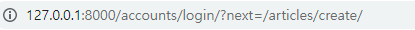
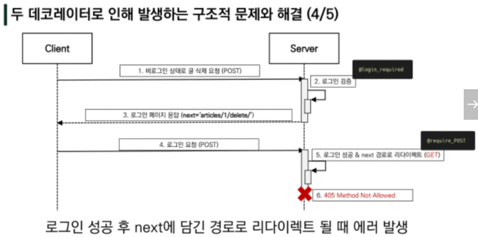
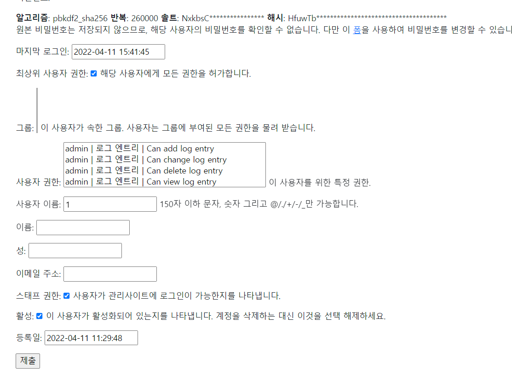
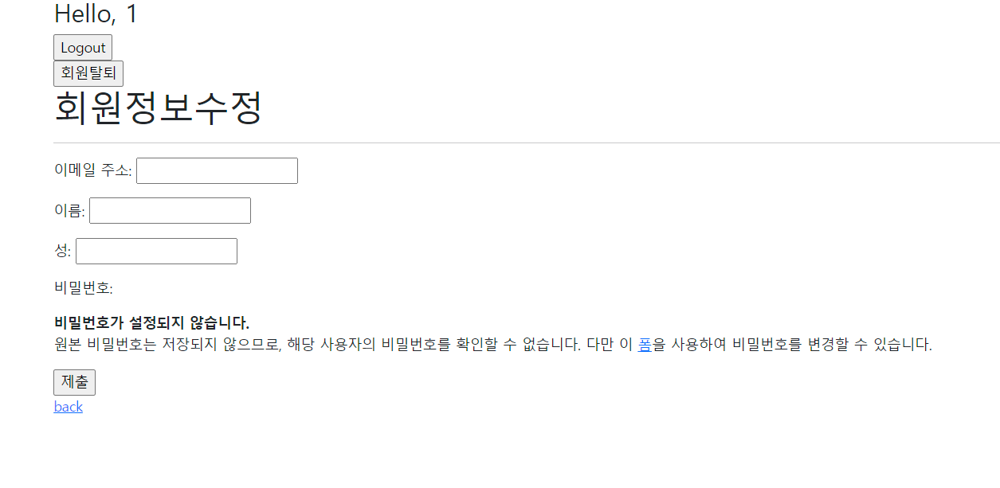

### Django 사용자 인증 및 권한

### 1. Authentication System Part 1.

#### The Django Authentication System

인증과 권한 부여를 함께 제공하며, 이러한 기능이 어느 정도 결합되어 일반적으로 인증시스템이라고 함

* `django.contrib.auth`
  * 인증 프레임 워크의 핵심과 기본 모델 포함
* `django.conrib.contenttypes`
  * 사용자가 생선한 모델과 권한을 연결할 수 있음
* accounts 앱 생성하기 ( 다른 이름을 사용해도 되지만 accounts로 지정하는 것을 권장)
  * 1. settings.py 추가
    2. project/urls.py 에 account path 추가
    3. account app 폴더에 urls.py 추가
    4.  시작

---

#### 쿠키와 세션

##### HTTP 

* Hyper Text Transfer Protocol
  * 웹에서 이루어지는 모든 데이터 교환의 기초
  * 클라이언트 - 서버 프로토콜이기도 함
  * `비연결 지향 `
    * 서버는 요청에 응답을 보낸 후 연결을 끊음
  * `무상태`
    * 연결을 끊는 순간 클라이언트와 서버 간의 통신이 끝나며, 상태정보가 유지되지 않음
    * 클라이언트와 서버가 주고 받는 메세지들은 서로 완전히 독립적임
  * `클라이언트와 서버의 지속적 관계 유지를 위해`  쿠키와 세션이 존재

##### 쿠키

서버가 사용자의 웹 브라우저에 전송하는 작은 데이터 조각

웹사이트에 방문할 경우, 사용자의 컴퓨터에 설치되는 작은 기록 정보 파일

* 브라우저는 쿠키를 로컬에 KEY-VALUE의 데이터 형식으로 저장
* 이렇게 쿠키를 저장해놓았다가, 동일 서버에 재요청시 저장된 쿠키를 함께 전송

HTTP 쿠키는 상태가 있는 세션을 만들어 줌

쿠키는 두 요청이 동일한 브라우저에서 들어왔는지 아닌지를 판단할 때 주로 사용

* 이를 이용해 사용자의 로그인 상태를 유지할 수 있음
* 상태가 없는 HTTP 프로토콜에서 상태 정보를 기억시켜주기 때문


사용목적

* 세션 관리
  * 로그인, 아이디 자동완성, 공지 하루 안보기, 팝업 체크, 장바구니 등의 정보 관리
* 개인화
  * 사용자 선호, 테마 등의 설정
* 트래킹
  * 사용자 행동을 기록 및 분석


##### 세션

사이트와 특정 브라우저 사이의 '상태'를 유지시키는 것

클라이언트가 서버에 접속하면 서버가 특정 session id를 발급하고, 클라이언트는 쿠키에 저장

* 클라이언트가 서버에 다시 접속 요청하면 쿠키를 서버에 전달, 쿠키는 요청마다 서버에 전송되며, 서버는 session id 를 확인해 알맞은 로직 처리

ID는 세션을 구별하기 위해 필요하며, 쿠키에는 ID만 저장함


##### 쿠키 lifetime(수명)

1. Session cookies
   * 현재 세션이 종료되면 삭제됨
   * 브라우저가 현재 세션이 종료되는 시기를 정의
   * [참고] 일부 브라우저는 다시 시작할 때 세션 복원을 사용해 세션 쿠키가 오래 지속 될 수 있도록 함
2. Persistent cookies( or Permanent cookies)
   * Expires 속성에 지정된 날짜 혹은 Max-Age 속성에 지정된 기간이 지나면 삭제

#### Session in Django

Django의 세션은 미들웨어를 통해 구현됨

Django는 database-backed sessions 저장 방식을 기본 값으로 사용

* 설정을 통해 cached, file-based, cookie-based 방식으로 변경 가능

Django는 특정 session id를 포함하는 쿠키를 사용해서 각각 브라우저와 사이트가 연결된 세션을 알아냄

* 세션 정보는 Django DB의 django_session 테이블에 저장됨

모든 것을 세션으로 사용하려고 하면 사용자가 많을 때 서버에 부하가 걸릴 수 있다

---

#### 로그인

session을 Create하는 로직과 같음

Django는 우리가 session의 메커니즘에 생각하지 않게끔 도움을 줌

이를 위해 인증에 관한 built-in forms를 제공


`AuthenticationForm` : 사용자 로그인을 위함 form, request를 첫번째 인자로 받음

`def login(request, user, backend=None)`:

* 현재 세션에 연결하려는 인증된 사용자가 있는 경우 login() 필요
* 사용자를 로그인하여 view 함수에서 사용됨
* HttpRequest 객체와 User 객체 필요
* Django의 session framework를 사용하여 세션에 user의 ID를저장(==로그인)

```python
# accounts/views.py

from django.shortcuts import render, redirect
from django.views.decorators.http import require_http_methods, require_POST
# 로그인 전용 모듈 import
from django.contrib.auth.forms import AuthenticationForm
from django.contrib.auth import login as auth_login

@require_http_methods(['GET','POST'])
def login(request):
    if request.method=='POST':
        # 
        form = AuthenticationForm(request, request.POST)
        # 현재 세션에 연결하려는 인증 된 사용자가 있는 경우 login() 함수가 필요
        if form.is_valid():
            # request객체와 user객체 정보 2가지가 필요
            # django에서 form.get_user()를 통해 제공해준다
            auth_login(request, form.get_user())
            return redirect('articles:index')
    else:
        form = AuthenticationForm()
    context = {
        'form':form,
    }
    return render(request, 'accounts/login.html', context)
```

```django
# base.html

  <body>
    <div class="container">
        
      # 로그인 했는지 확인하기 위해 출력
      <h3>Hello, {{ user }}</h3>
      <a href="">Login</a>      
       
       
    </div>


```

---

#### 로그아웃

session을 Delete하는 로직과 같음

`logout(request)`:

* HttpReqeust 객체를 인자로 받고 반환값 X
* 사용자가 로그인하지 않은 경우 오류 발생시키지 않음
* 현재 요청에 대한 session data를 DB에서 완전 삭제하고, 클라이언트의 쿠키에서도 session id가 삭제됨
* 다른 사람이 동일 웹 브라우저를 사용하여 로그인하고, 이전 사용자의 세션 데이터에 엑세스하는 것을 방지하기 위함

```python
# accounts/views.py

from django.shortcuts import render, redirect
from django.views.decorators.http import require_http_methods, require_POST
# 로그아웃 전용 모듈 import
from django.contrib.auth import logout as auth_logout

@require_POST
def logout(request):
    auth_logout(request)
    return redirect('articles:index')
```


이 상황에선, 로그인 했을때도 로그인 버튼이, 로그아웃했을 때도 로그아웃 버튼이 남아있다.

이를 해결하기 위해 밑 과정 ㄱ


#### 로그인 사용자에 대한 두 가지 접근 제한

1. The raw way

   * `is_authenticated` attribute

     * user_model 속성 중 하나, 모든 User 인스턴스에 True, AnonymousUser는 False

     * 사용자가 인증되었는지 여부를 알 수 있는 방법

     * 권한과는 관련 없으며, 사용자가 활성화 상태인지, 유효한 세션을 가지고 있는지도 확인 X

     * ```django
       # base.html
         <body>
           <div class="container">
               
             # if문으로 구별한다
             
       	   <h3>Hello, {{ user }}</h3>
              <form action="" method="POST">
               
               <input type="submit" value="Logout" />
              </form>
             
              <a href="">Login</a>
                 
              
              
           </div>
       ```

     * 이 상태의 경우, 로그인한 상태로 로그인 화면으로 갈 수 있다.

     * is_authenticated로 겉으로 보이는 출력만 변경한 것이기 때문

     * views.py에 if 추가

       ```python
       
       @require_http_methods(['GET','POST'])
       def login(request):
           
           # 로그인 된 사람이라면 로그인 안되게 막기
           if request.user.is_authenticated:
               return redirect('articles:index')
       
           if request.method=='POST':
               form = AuthenticationForm(request, request.POST)
               if form.is_valid():
                   auth_login(request, form.get_user())
                   return redirect('articles:index')
           else:
               form = AuthenticationForm()
           context = {
               'form':form,
           }
           return render(request, 'accounts/login.html', context)
       
       
       @require_POST
       def logout(request):
           
           # 로그인된 사람만 쓸 수 있어야한다
           if request.user.is_authenticated:
               auth_logout(request)
           return redirect('articles:index')
       
       ```

     * 인증된 사용자만 게시글 작성가능하게 설정

       ```django
       # articles/index.html
       
       # if문으로 추가
       
       <a href="">CREATE</a>
       
       <a href="">[새 글을 작성하려면 로그인 하세요]</a>
       
       ```

     * 역시나 이 상태에서도 주소창으로 접근 가능. 단순 출력만 바꾼 것이기 때문

     

2. The `login_required` decorateor

   * 사용자가 로그인 되어있지 않으면, settings.LOGIN_URL에 설정된 문자열 기반 절대 경로로 redirect 함

     * LOGIN_URL의 기본 값은 '/accounts/login'
     * 두번째  app 이름을 accounts로 했던 이유 중 하나

   * 사용자가 로그인 되어 있으면 정상적으로 view 함수 실행

   * 인증 성공시 사용자가 redirect 되어야하는 경로는 'next'라는 쿼리 문자열 매개 변수에 저장됨

     * /accounts/login/?next=/articles/create/

     

   * 로그인 된 상태에서만 create, Update, Delete가 가능하게 해주고 싶으니까

   * articles/views.py에서 decorator 설정, 데코레이터를 설정함으로써, 

   * 로그인 되지 않은 상태에서 create 접근시, 로그인 화면으로 연결해주고, next 파라미터도 함께 저장하게 됨

   * 데코레이터가 여러 개일 경우 위에서부터 진행됨

     ```python
     # articles/views.py
     
     from django.shortcuts import render, redirect, get_object_or_404
     from django.views.decorators.http import require_http_methods, require_POST, require_safe
     from .models import Article
     from .forms import ArticleForm
     # 로그인 된 상태에서만 create, update, delete 허용해주기 위해 deco import
     from django.contrib.auth.decorators import login_required
     
     # 데코 추가
     @login_required
     @require_http_methods(['GET', 'POST'])
     def create(request):
         if request.method == 'POST':
             form = ArticleForm(request.POST)
             if form.is_valid():
                 article = form.save()
                 return redirect('articles:detail', article.pk)
         else:
             form = ArticleForm()
         context = {
             'form': form,
         }
         return render(request, 'articles/create.html', context)
     
     # 데코 추가
     @login_required
     @require_POST
     def delete(request, pk):
         article = get_object_or_404(Article, pk=pk)
         if request.method == 'POST':
             article.delete()
             return redirect('articles:index')
         return redirect('articles:detail', article.pk)
     
     # 데코 추가
     @login_required
     @require_http_methods(['GET', 'POST'])
     def update(request, pk):
         article = get_object_or_404(Article, pk=pk)
         if request.method == 'POST':
             form = ArticleForm(request.POST, instance=article)
             if form.is_valid():
                 article = form.save()
                 return redirect('articles:detail', article.pk)
         else:
             form = ArticleForm(instance=article)
         context = {
             'article': article,
             'form': form,
         }
         return render(request, 'articles/update.html', context)
     ```

     ```django
     # accounts/login.html
     
      
     <h1>로그인</h1>
     <hr />
     
     # next 파라미터로 바로 이동하기 위해, action 값을 비워줌
     <form action="" method="POST">
        {{ form.as_p }}
       <input type="submit" />
     </form>
     <a href="">back</a>
     
     
     ```

     ```python
     # accounts/views.py
     # 이 과정을 거치면 바로 로그인 후 create로 넘어가게 됨
     
     
     @require_http_methods(['GET','POST'])
     def login(request):
         # next 파라미터 가져오기
         # data = request.GET.get('next')  # 값은 '/articles/creat/' 즉 next 파라미터가 넘어온 주소
     
         if request.user.is_authenticated:
             return redirect('articles:index')
     
         if request.method=='POST':
             form = AuthenticationForm(request, request.POST)
             if form.is_valid():
                 auth_login(request, form.get_user())
                 
                 # next 파라미터가 있다면 next로, 없다면 index로 넘어가자
                 return redirect(request.GET.get('next') or  'articles:index')
         else:
             form = AuthenticationForm()
         context = {
             'form':form,
         }
         return render(request, 'accounts/login.html', context)
     ```

   @decorater 구조적 오류

   현재 delete에는 `@login_required` 와 `@require_POST`로 구성되어있는데

   이때, 비로그인 상태로 게시글 삭제를 요청하게 되면, 첫 데코레이터로 인해 login 화면으로 넘어간 뒤,

   next 파라미터를 통해 'articles/delete'로 연결되는데(GET 방식), 

   둘째 데코레이터로 인해  delete는 POST 방식만을 받아오기로 하여 405 error가 발생하게 된다

   ```python
   @login_required
   @require_POST
   def delete(request, pk):
       article = get_object_or_404(Article, pk=pk)
       if request.method == 'POST':
           article.delete()
           return redirect('articles:index')
       return redirect('articles:detail', article.pk)
   ```

   

   ```python
   # 데코 중복을 막기 위해 무언가 하나는 변경해주어야함
   
   @login_required
   @require_POST
   def delete(request, pk):
       # if문 변경을 통해서 중복 제거
       # if request.method == 'POST':
       if request.user.is_authenticated:
           article = get_object_or_404(Article, pk=pk)
           article.delete()
       return redirect('articles:index')
   
   ```

---

### 2. Authentication System Part 2.


#### 회원가입

##### `UserCreationForm` :

주어진 Username과 password로 권한이 없는 새 user를 생성하는 ModelForm

```python
# accounts/views.py
# 이 상태는 로그인 상태여도 회원가입이 되고, 회원가입 후에 가입 아이디로 바로 로그인되지 않음

def signup(request):
    if request.method == 'POST':
        form = UserCreationForm(request.POST)
        if form.is_valid():
            form.save()
            return redirect('articles:index')
    else:
        form = UserCreationForm()
    context = {
        'form':form,
    }
    return render(request, 'accounts/signup.html', context)

```


```python
# accounts/views.py
# 회원가입 후 바로 로그인 되게끔 signup 함수 수정
# 로그인, 회원가입 전용 모듈 import
from django.contrib.auth.forms import AuthenticationForm, UserCreationForm

@require_http_methods(['GET','POST'])
def signup(request):
    if request.method == 'POST':
        form = UserCreationForm(request.POST)
        if form.is_valid():

            # 회원가입 후 바로 로그인 되게끔
            user = form.save()
            auth_login(request, user)
            return redirect('articles:index')
            
    else:
        form = UserCreationForm()
    context = {
        'form':form,
    }
    return render(request, 'accounts/signup.html', context)
```


#### 회원탈퇴

DB에서 사용자를 삭제하는 것과 같음

```python
@ require_POST
def delete(request):
    # 비로그인 사용자가 회원탈퇴 할 수 없게끔 설정
    if request.user.is_authenticated:
        request.user.delete()
        # 회원탈퇴만 이루어지고, 해당 세션값이 사라지진 않기 때문에
        # 다 지우기 위해 로그아웃까지 진행해준다. 
        # 반드시 회원탈퇴 후 로그아웃 함수 호출, 순서가 바뀌면 안된다
        auth_logout(request)
    return redirect('articles:index')
```


#### 회원정보 수정

##### `UserChangeForm`:

UserChangeForm을 그대로 사용할 경우 절대 권한 상태로 나타나기 때문에, 일반 유저에게 보이는 형태는

다르게 출력해야한다.


그래서 forms.py로 변경

```python
# acccoutns/forms.py

from django.contrib.auth.forms import UserChangeForm
# Meta model을 변경해야하는데, 우리는 user의 모델을 본 적이 없다,
# django는 그 모델을 제공해준다.
from django.contrib.auth import get_user_model

class CustomUserChangeForm(UserChangeForm):

    class Meta:
        model = get_user_model() # User
        fields = ('email', 'first_name', 'last_name',)

```

accounts/views.py

```python
# accounts/views.py
# 일반 회원에게 보여질 커스텀된 userform import 추가
from .forms import CustomUserChangeForm

@login_required
@require_http_methods(['GET','POST'])
def update(request):
    if request.method=='POST':
        form = CustomUserChangeForm(request.POST, instance=request.user)
        if form.is_valid():
            form.save()
            return redirect('articles:index')
    else:
        form = CustomUserChangeForm(instance=request.user)
    context = {
        'form':form,
    }
    return render(request, 'accounts/update.html', context)
```

변경된 결과




#### 비밀번호 변경

위 사진을 봤을 떄, 비밀번호를 바로 변경할 수 없고, 폼을 통해 바꿀 수 있게 되어 있다

폼 클릭시 accounts/password/ 로 연결된다.

##### `PasswordChangeForm()`:

사용자가 비밀번호를 변경할 수 있도록 하는 form,

이전 비밀번호를 입력하여 비밀번호를 변경할 수 있도록 함

이전 비밀번호를 입력하지 않고, 비밀번호를 설정할 수 있는 SetPasswordForm을 상속받는 서브 클래스

```python
# 로그인, 회원가입, 비밀번호변경 전용 모듈 import
from django.contrib.auth.forms import (
    AuthenticationForm, 
    UserCreationForm,
    PasswordChangeForm)

def change_password(request):
    if request.method=='POST':
        # passwordchangeform 은 인자 받는 순서가 다름. user 먼저
        form = PasswordChangeForm(request.user, request.POST)
        if form.is_valid():
            form.save()
            return redirect('articles:index')
    else:
        form = PasswordChangeForm(request.user)
    context= {
        'form':form,
    }
    return render(request, 'accounts/change_password.html', context)

# 이때 비밀번호를 변경하면, 로그아웃이 되버림
# 그 이유는 비밀번호가 바뀌면 sessionid값도 변경이 되는데,
# 함께 업데이트 되는 것이 아니라 로그아웃처리 되버림
# 장고는 이를 같이 업데이트 해줄 update_session_auth_hash 를 제공 
```

##### `update_session_auth_hash(request, user)`:

암호 변경시 세션 무효화 방지 함수

암호가 변경되어도 로그아웃되지 않도록 새로운 password hash로 session을 업데이트함

```python
# 비밀번호 업데이트시 세션무효화방지 기능 import
from django.contrib.auth import update_session_auth_hash
# 로그인용 데코레이터
from django.contrib.auth.decorators import login_required

@login_required
@require_http_methods(['GET','POST'])
def change_password(request):
    if request.method=='POST':
        form = PasswordChangeForm(request.user, request.POST)
        if form.is_valid():
            
            # 비밀번호 변경후 세션 함께 업데이트하기
            user = form.save()
            update_session_auth_hash(request, user)
            return redirect('articles:index')
        
    else:
        form = PasswordChangeForm(request.user)
    context= {
        'form':form,
    }
    return render(request, 'accounts/change_password.html', context)

```

