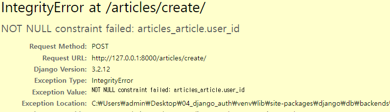

### DB 02

### Foreign Key

* 외래키(외부키)
* 관계형 데이터베이스에서 한 테이블의 필드 중 다른 테이블의 행을 식별할 수 있는 키
* 참조 테이블에서 속성(필드)에 해당하고, 이는 참조되는 테이블의 기본키를 가리킴
* 참조하는 테이블의 외래키는 참조되는 테이블 행 1개에 대응됨
  * 이 때문에 참조하는 테이블에서 참조되는 테이블의 존재하지 않는 행을 참조할 수 없다
* 참조하는 테이블의 행 여러개가 참조되는 테이블의 동일한 행을 참조할 수 있다

##### 특징

키를 사용하여 부모 테이블의 유일한 값을 참조(참조 무결성)

외래 키의 값이 반드시 부모 테이블의 기본 키일 필요는 없지만 유일한 값(pk)이어야 함


##### 1:N 관계

외래키는 참조하는 N(Comment)이 가지고 있다.

id 값만 가능한 것은 아니지만, 유일하다고 보장되어 있어서 id를 fk값으로 사용했다


##### `ForeignKey field`

* A many-to-one relationship (1 : N 관계)
* 2개 위치 인자가 반드시 필요
  * 참조하는 model class
  * `on_delete` 옵션
    * 외래 키가 참조하는 객체가 사라졌을 때, 외래 키를 가진 객체를 어떻게 처리할 지를 정의
    * ex) 댓글을 달았는데, 게시글을 삭제함. 그럼 그 댓글은 어떻게 되는가?
    * Database Integrity(데이터 무결성)을 위해서 매우 중요한 설정
    * 여러 옵션
      * CASCADE : 부모 객체가 삭제 됐을 때 이를 참조하는 객체도 삭제
      * PROJECT
      * SET_NULL
      * SET_DEFAULT
      * SET()
      * DO_NOTHING
      * RESTRICT
* migrate 작업 시필드 이름에 _id를 추가하여 데이터베이스 열 이름을 만듦

```python
# articles/models.py

class Comment(models.Model):
    # `Comment 모델은 외래키 article_id를 포함합니다`라고 해도 article로 만들자
    # 자동으로 _id가 붙어서 생성되니까
    # 1:N에서 참조하는 테이블의 소문자 단수형의로 필드를 설정하는데, 이는
    # 누구를 참조하는지 명확히 알기 위해 소문자 단수형으로 사용한다.
    # 또한 다른 모델관계와 헷갈리지 않기 위함이다
    article = models.ForeignKey(Article, on_delete=models.CASCADE)
    content = models.CharField(max_length=200)
    created_at = models.DateTimeField(auto_now_add=True)
    updated_at = models.DateTimeField(auto_now=True)

    def __str__(self):
        return self.content
```

##### 댓글 생성 연습하기

```shell
$ python manage.py shell_plus
```

```shell
# 댓글 생성하기
$ In [1]: comment = Comment()
#확인
$ In [2]: comment
$ Out[2]: <Comment: >
# 첫 댓글의 content 추가
$ In [3]: comment.content = 'first comment'
# 댓글을 담을 게시글 생성
$ In [6]: article = Article.objects.create(title='title', content='content')
# 게시글 생성 확인 = pk값 존재
$ In [7]: article.pk
$ Out[7]: 1
# 댓글의 content 확인
$ In [8]: comment.content
$ Out[8]: 'first comment'
# django에서 추천하는 방식 
# comment의 모델을 pk값을 넣기보단 모델 자체를 전달해줘라
$ In [9]: comment.article = article
# 댓글 저장
$ In [10]: comment.save()
# 댓글 잘 생성됐는지 확인
$ In [11]: comment.pk
$ Out[11]: 1
# comment 내용 확인
$ In [13]: comment.content
$ Out[13]: 'first comment'

# django가 추천하는 방식으로 모델 자체를 전달해줬기 때문에,
# 다음과 같은 기능이 가능
# comment가 참조하는 모델 확인
$ In [14]: comment.article
$ Out[14]: <Article: title>
# comment가 참조하는 모델의 pk 값 확인
$ In [15]: comment.article.pk
$ Out[15]: 1
# comment가 참조하는 모델의 content 확인
$ In [16]: comment.article.content
$ Out[16]: 'content'

# 두번째 댓글 생성하기
$ In [17]: comment = Comment(content='second comment', article=article)
# 저장
$ In [18]: comment.save()
# 두번째 댓글의 pk 확인
$ In [19]: comment.pk
$ Out[19]: 2
# 댓글이 등록된 게시글의 pk값 확인도 가능
# 실제로 작성된 외래키 컬럼명은 article_id이기 때문에 
# comment.article_id로도 확인 가능하지만, article_pk로는 확인 불가능하다(해당 컬럼명이 존재하지 않기 때문)
$ In [20]: comment.article.pk
$ Out[20]: 1
```


#### 1:N 관계 related manager

* 역참조('comment_set')

  * Article(1) -> Comment(N)
  * `article.comment` 형태로는 사용할 수 없고, `article.comment_set` 
  * 게시글에 몇 개의 댓글이 작성되었는지 Django ORM이 보장할 수 없기 때문
    * article은 comment가 있을 수도 있고 없을 수도 있다
    * 실제로 Article  클래스에는 Comment와의 어떠한 관계도 작성되어있지 않다.

  ```shell
  # pk 1인 article 가져오기
  $ In [1]: article = Article.objects.get(pk=1)
  # 확인
  $ In [2]: article
  $ Out[2]: <Article: title>
  # article에 달린 모든 댓글을 보여줘 (역참조)
  # _set으로 역참조합니다
  $ In [4]: article.comment_set.all()
  $ Out[4]: <QuerySet [<Comment: first comment>, <Comment: second comment>]>
  # 모든 댓글 쿼리셋을 comments에 저장
  $ In [5]: comments = article.comment_set.all()
  # 템플릿에 다음과 같이 활용가능~
  $ In [6]: for comment in comments:
     ...:     print(comment.content)
     ...: 
  first comment
  second comment
  ```

  * 역참조는 `_set`으로 하는데 이때 마음에 들지 않는다면 다음과 같이 명령어 변경가능

  * ```python
    class Comment(models.Model):
        
    	# article의 3번째 인자로 related_name으로 바꿔줌
        # 1:N 관계에선 권장하지 않음
        # M:N 에서 사용해야하기 때문에, 관계가 명확히 보이지 않을 수 있다
        article = models.ForeignKey(Article, on_delete=models.CASCADE, related_name='comments')
        content = models.CharField(max_length=200)
        created_at = models.DateTimeField(auto_now_add=True)
        updated_at = models.DateTimeField(auto_now=True)
    
        def __str__(self):
            return self.content
    ```

  * ```python
    article.comment_set.all() -> 1 : N 관계에서의 조회를 명확히 알 수 있다
    # related_name으로 이름 변경후에 명령어도 다음과 같이 사용함
    article.comments.all() -> 로 변경됨
    ```

    

* 참조('article')

  * Comment(N) -> Article(1)
  * 댓글의 경우 어떠한 댓글이든 반드시 자신이 참조하는 게시글이 있으므로, `comment.article`로 접근가능
  * 실제 FK 또한 Comment 클래스에서 작성됨

  ```shell
  # 참조 (위에서 했음)
  # pk가 1인 comment 가져오기
  $ In [12]: comment = Comment.objects.get(pk=1)
  # 확인
  $ In [13]: comment
  $ Out[13]: <Comment: first comment>
  # 커멘트에 연결된 모델 확인
  $ In [14]: comment.article
  $ Out[14]: <Article: title>
  ```

---

#### Comment CREATE & READ

CommentForm 작성

```python
# articles/forms.py

class CommentForm(forms.ModelForm):

    class Meta:
        model = Comment
        fields = ('content')
```

def detail()에 추가, comment_create 함수 작성

```python
# articles/views.py
# import하기
from .forms import CommentForm

@require_safe
def detail(request, pk):
    article = get_object_or_404(Article, pk=pk)
    comment_form = CommentForm()
    # 조회한 article의 모든 댓글을 조회해서 보내주어야한다.
    # 역참조
    comments = article.comment_set.all()
    context = {
        'article': article,
        'comment_form' : comment_form,
        'comments':comments,
    }
    return render(request, 'articles/detail.html', context)

@require_POST
def comment_create(request, pk):
    # 댓글 생성은 단독페이지가 없고, 디테일 페이지에서 나타나기 때문에 
    # 디테일 함수에서 처리가 이루어짐.
    # 즉. if, else 처리할 필요없다.
    if request.user.is_authenticated:
        article = get_object_or_404(Article, pk=pk)
        comment_form = CommentForm(request.POST)
        if comment_form.is_valid():
            # commit=False로 하면서, DB에 저장은 안하고 instance는 만들어줘라는 요청
            comment = comment_form.save(commit=False)
            # 현재 누락된 article을 추가하고
            comment.article = article
            # 이제 저장해줘~
            comment.save()
        return redirect('articles:detail', article.pk)
    return redirect('accounts:login')
```

html 수정

```python
# articles/detail.html

# 댓글 목록 추가
<h4>댓글 목록</h4>
<ul>
  
  <li>{{ comment.content }}</li>
  
</ul>
# 댓글 작성폼 추가
<form action="" method="POST">
   {{ comment_form }}
  <input type="submit" />
</form>


```

댓글 작성 url 작성

```python
# articles/urls.py

app_name = 'articles'
urlpatterns = [
    path('', views.index, name='index'),
    path('create/', views.create, name='create'),
    path('<int:pk>/', views.detail, name='detail'),
    path('<int:pk>/delete/', views.delete, name='delete'),
    path('<int:pk>/update/', views.update, name='update'), 
    
    # 추가
    path('<int:pk>/comments/', views.comments_create, name='comments_create'),
]
```


#### Comment DELETE

urls 생성

```python
# articles/urls.py

app_name = 'articles'
urlpatterns = [
    path('', views.index, name='index'),
    path('create/', views.create, name='create'), # GET / POST
    path('<int:pk>/', views.detail, name='detail'),
    path('<int:pk>/delete/', views.delete, name='delete'),
    path('<int:pk>/update/', views.update, name='update'), # GET / POST
    path('<int:pk>/comments/', views.comments_create, name='comments_create'),
    
    # 댓글 삭제 path 추가
	path('<int:article_pk>/comments/<int:comment_pk>delete/', views.comment_delete, name='comment_delete')
]

```


함수 생성

```python
# articles/views.py

@require_POST
def comment_delete(request, article_pk, comment_pk):
    if request.user.is_authenticated:
        comment = get_object_or_404(Comment, pk=comment_pk)
        comment.delete()
        return redirect('articles:detail', article_pk)
    return redirect('articles:detail', article_pk)

    # 댓글 삭제를 위해 해당 댓글의 pk값이 필요한데 
    # 두 가지 방법으로 가져올 수 있다 
    # 첫번째 방법으로 아래와 같이 comment의 article.pk를 받아오는 경우이고
    # 두번째는 우리가 사용한 인자로 받아오는 방식이다. 
    # article = comment.article.pk
    # comment.delete()
    # return redirect('articles:detail', article)
```


디테일 페이지

```python
# detail.html

<h4>댓글 목록</h4>
<ul>
  
  <li>
    {{ comment.content }}
    # 각 댓글마다 댓글의 pk값이 다르기 때문에
    <form
      action=""
      method="POST"
    >
      
      <input type="submit" value="삭제" />
    </form>
  </li>
  
</ul>

<form action="" method="POST">
   {{ comment_form }}
  <input type="submit" />
</form>

```


---

### Customizing authentication in Django


#### Substituting a custom User model

- 커스텀 유저모델로 대체하기

- User 모델 대체하기

  - 일부 프로젝트에서는 Django의 내장 User 모델이 제공하는 인증 요구사항이 적절하지 않을 수 있음
    - username 대신 email을 식별 토큰으로 사용하는 것이 더 적합한 사이트
  - 이에 Django는 User를 참조하는 `AUTH_USER_MODEL`값을 제공하여 모델을 재정의할 수 있도록 함
  - Django는 기본 제공에도 불구하고, 커스텀 유저 모델을 설정하는 것을 강력하게 권장한다
  - 단, 프로젝트의 모든 migrations 혹은 첫 migrate를 실행하기 전에 이 작업을 마쳐야함

- `AUTH_USER_MODEL`:

  - 기본값 : 'auth.User'
  - [참고] 프로젝트 중간에 변경도 가능하긴하지만, 모델 관계 전체에 영향을 끼쳐 어려운 작업 필요
  - 그래서 초기에 설정 하는 것을 강력 권장

- ```python
  # accounts/models.py
  
  from django.contrib.auth.models import AbstractUser
  
  class User(AbstractUser):
      pass
  ```

- ```python
  # projects/settings.py
  # 가장 아래
  
  AUTH_USER_MODEL = 'accounts.User'
  ```

  ```python
  # accounts/admin.py
  
  from django.contrib import admin
  from django.contrib.auth.admin import UserAdmin
  from .models import User
  # Register your models here.
  
  admin.site.register(User, UserAdmin)
  ```

  

#### Custom user & Built-in auth forms

`auth.User`을 `accounts.User`로 바꿨으니까 다 변경해주어야한다.

기존 User모델을 사용하기 때문에 커스텀 User 모델로 다시 작성하거나 `UserCreationForm`,`UsechangeForm`을 확장해야 한다.

```python
# accounts/forms.py
from django.contrib.auth.forms import UserCreationForm
# Meta model을 변경해야하는데, 우리는 user의 모델을 본 적이 없다,
# django는 그 현재 활성화된 모델을 제공해준다.
from django.contrib.auth import get_user_model

# UserCreationForm 커스텀하기
class CustomUserCreationForm(UserCreationForm):
    # 확장하는 법
    # class Meta(UserCreationForm.Meta):
    #     model = CustomUser
    #     fields = UserCreationForm.Meta.fields + ('custom_field',)
    
    # 기존에서 email까지 더 보여주자!
    class Meta(UserCreationForm.Meta):
        model = get_user_model()
        fields = UserCreationForm.Meta.fields + ('email',)
```

```python
# accounts/views.py
# 커스텀 유저모델폼 가져오기
from .forms import CustomUserCreationForm


@require_http_methods(['GET','POST'])
def signup(request):
    if request.user.is_authenticated:
        return redirect('articles:index')

    if request.method == 'POST':
        # 모델폼 바꿨으니 대체 해주기
        # form = UserCreationForm(request.POST)
        form = CustomUserCreationForm(request.POST)
        if form.is_valid():

            # 회원가입 후 바로 로그인 되게끔
            user = form.save()
            auth_login(request, user)
            return redirect('articles:index')

    else:
         # 모델폼 바꿨으니 대체 해주기
        # form = UserCreationForm()
        form = CustomUserCreationForm()
    context = {
        'form':form,
    }
    return render(request, 'accounts/signup.html', context)
```


---

### Model Relationship 2

#### ※ User 모델 참조하는 두 가지 방법의 차이

1. settings.AUTH_USER_MODEL
   * str으로 반환
   * user 모델에 대한 외래 키 또는 다대다 관계 정의시 사용
   * models.py에서 User 모델을 참조할 때 사용
2. get_user_model()
   * 현재 활성화된 User 모델을 object로 반환
   * models.py가 아닌 다른 모든 곳에서 유저모델을 참조할 때 사용

#### User - Article(1:N)

사용자는 여러개의 게시글을 작성할 수 있다.

```python
# articles/models.py

from django.db import models
# 1:N 관계설정을 위해 유저모델이 필요한데, 모델은 settings에서 가져온다
from django.conf import settings

# Create your models here.
class Article(models.Model):
    # fk 변수 설정
    # 참조하는 이름의 소문자 단수형
    user = models.ForeignKey(settings.AUTH_USER_MODEL, on_delete=models.CASCADE)
    
    title = models.CharField(max_length=10)
    content = models.TextField()
    created_at = models.DateTimeField(auto_now_add=True)
    updated_at = models.DateTimeField(auto_now=True)

    def __str__(self):
        return self.title
```

현재 화면 


유저를 골라서 글을 작성할 수 있음.

foms.py 에서 변경 필요

```python
# articles/forms.py

class ArticleForm(forms.ModelForm):

    class Meta:
        model = Article
        # user선택할 수 없게 변경
        exclude = ('user',)
        # fields = '__all__'
```

이후 게시글 작성 시 오류가 남 (create 함수에 user_id를 할당하는 부분이 없어서)



```python
# articles/views.py

@login_required
@require_http_methods(['GET', 'POST'])
def create(request):
    if request.method == 'POST':
        form = ArticleForm(request.POST)
        
        if form.is_valid():
            # 일단은 저장 stop, 인스턴스만 넘겨주자
            article = form.save(commit=False)
            # article에 추가로 저장할거 할당하고
            article.user = request.user
            # 저장
            article.save()
            return redirect('articles:detail', article.pk)
    else:
        form = ArticleForm()
    context = {
        'form': form,
    }
    return render(request, 'articles/create.html', context)


@login_required
@require_POST
def delete(request, pk):
    article = get_object_or_404(Article, pk=pk)
    if request.user.is_authenticated:
        # 글을 작성한 사람만 글을 삭제할 수 있어야한다.
        if request.user == article.user:
            article.delete()
    return redirect('articles:index')


@login_required
@require_http_methods(['GET', 'POST'])
def update(request, pk):
    article = get_object_or_404(Article, pk=pk)
    # 작성자와 게시글 쓴 사람이 일치할 때만 update 가능하게 설정
    if request.user == article.user:
        if request.method == 'POST':
            form = ArticleForm(request.POST, instance=article)
            if form.is_valid():
                article = form.save()
                return redirect('articles:detail', article.pk)
        else:
            form = ArticleForm(instance=article)
    # 아니면 나가라
    else:
        return redirect('articles:index')
    context = {
        'article': article,
        'form': form,
    }
    return render(request, 'articles/update.html', context)

```


#### User-Comment(1:N)

* 외래키 설정 - foms 설정 - view 설정

```python
# articles/models.py

class Comment(models.Model):

    article = models.ForeignKey(Article, on_delete=models.CASCADE)
    # 외래키 설정
    user = models.ForeignKey(settings.AUTH_USER_MODEL, on_delete=models.CASCADE)
    
    content = models.CharField(max_length=200)
    created_at = models.DateTimeField(auto_now_add=True)
    updated_at = models.DateTimeField(auto_now=True)

    def __str__(self):
        return self.content
```

```shell
$ python manage.py makemigrations
$ python manage.py migrate
```

```python
# articles/forms.py

class CommentForm(forms.ModelForm):

    class Meta:
        model = Comment
        # user 설정 못하게 필드 설정
        fields = ('content',)
```

```python
# articles/views.py

@require_POST
def comment_create(request, pk):
    if request.user.is_authenticated:
        article = get_object_or_404(Article, pk=pk)
        comment_form = CommentForm(request.POST)
        if comment_form.is_valid():
            # commit=False로 하면서, DB에 저장은 안하고 instance는 만들어줘라는 요청
            comment = comment_form.save(commit=False)
            # 현재 누락된 외래키 추가하고
            comment.article = article
            # 현재 누락된 외래키 추가
            comment.user = request.user
            # 이제 저장해줘~
            comment.save()
        return redirect('articles:detail', article.pk)
    return redirect('accounts:login')

@require_POST
def comment_delete(request, article_pk, comment_pk):
    if request.user.is_authenticated:
        comment = get_object_or_404(Comment, pk=comment_pk)
        # 작성한 사람만 댓글 삭제 가능하게 하기
        if request.user == comment.user:
            comment.delete()
    return redirect('articles:detail', article_pk)
    
```

```python
# articles/detail.html

# 작성자에게만 수정 삭제 버튼 보이기

<a href="">수정</a>
<form action="" method="POST">
  
  <input type="submit" value="삭제" />
</form>
<a href="">back</a>
<hr />

<h4>댓글 목록</h4>
<ul>
  
  <li>
    {{ comment.user }} - {{ comment.content }} 
    # 댓글 작성자와 로그인한 사람이 일치할 때 삭제 버튼 보이기
    
    <form
      action=""
      method="POST"
    >
      
      <input type="submit" value="삭제" />
    </form>
    
  </li>
  
</ul>

# 로그인 했을 경우만 댓글 작성 폼 보이기

<form action="" method="POST">
   {{ comment_form }}
  <input type="submit" />
</form>

<a href="accounts:login"> [댓글을 작성하려면 로그인해주세요] </a>
 
```

