### DB (M대N)

#### Intro 병원진료기록시스템

---

#### 1:N의 한계

* 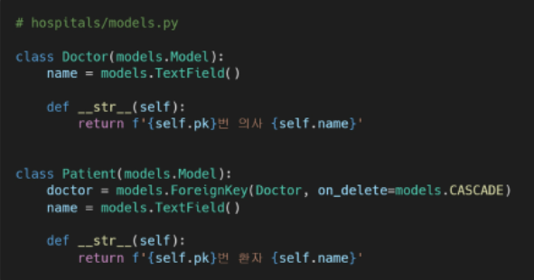
* 새로운 예약을 생성하는 것이 불가능
  * 새로운 객체를 생성해야한다
* 여러 의사에게 진료받은 기록을 환자 한 명에 저장할 수 없음
  * 외래키에 '1, 2' 형식의 데이터를 사용할 수 없다


#### 중개모델을 쓰자

* 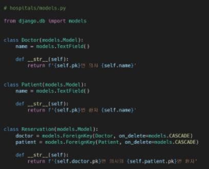
* 외래키가 사라지고, 모델이 하나 더 생김
* 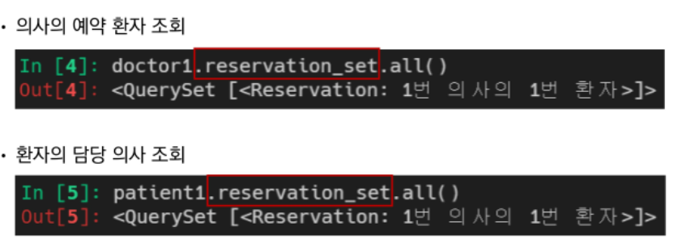
* 역참조 형식으로 뽑아낼 수 있다


### ManyToManyField

*  다대다(M:N) 관계 설정시 사용하는 모델 필드
* 하나의 필수 위치인자 필요
* 중개 테이블이 자동으로 만들어져 따로 수고할 필요가 없다
* 1:N 관계인지 따로 확인할 필요도 없다
* 데이터를 뽑을 때 manytomany 위치에 따라 참조와 역참조만 구분하면 된다
* 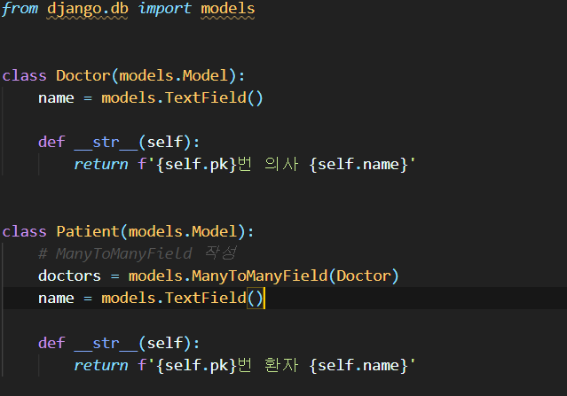

`related_name`

* 

* target model(관계필드를 가지지 않은 모델) => 여기선 Doctor
* source model(관계필드를 가진 모델) -> patient
* `_set` 의 역참조 형식을 사용할 수 없다

* 중개테이블을 직접 작성하는 경우는 없을까?
  * 중개 테이블을 수동으로 지정하려는 경우 through 옵션을 사용하여, 중개 테이블을 나타내는 Django 모델을 지정할 수 있음(다음 챕터에서 나온다)

* Related Manager

  * `add()`:
  * 지정된 객체를 관련 객체 집합에 추가
  * 이미 존재하는 관계에 사용하면 관계가 복제되지 않음
  * 모델 인스턴스, 필드값(PK)을 인자로 허용
  * 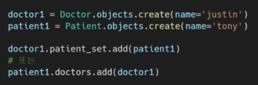
  * `remove()`:
  * 관련 객체 집합에서 지정된 모델 객체를 제거
  * 내부적으로  QuerySet.delete()를 사용하여 관계가 삭제됨
  * 모델 인스턴스, 필드값을 인자로 허용
  * 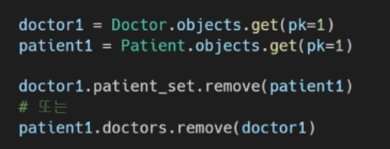

  

* throuht 예시(중개테이블을 직접 구현할 때)
  * 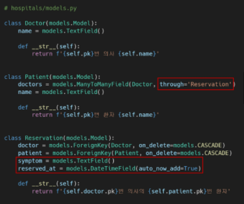
  * 기존에서 symptom과 reserved_at 추가해준 상태임
  * 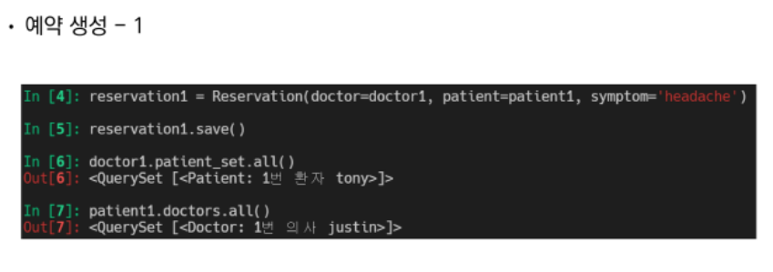
  * 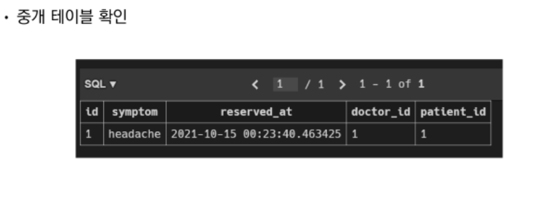
  * 예약이 예약을 만들고 있는 상태니까 환자가 예약을 만드는 방법은 아래
  * 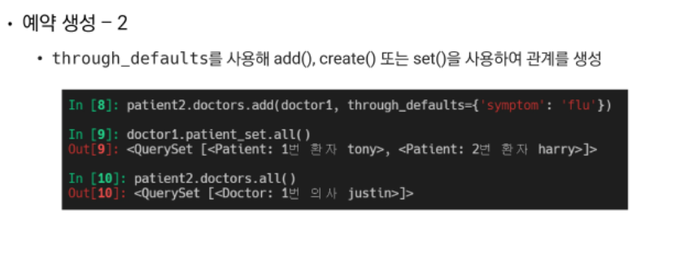
  * 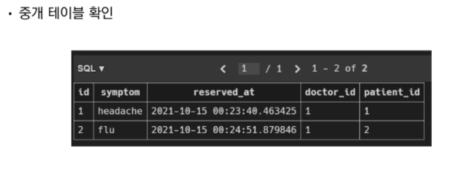
  * 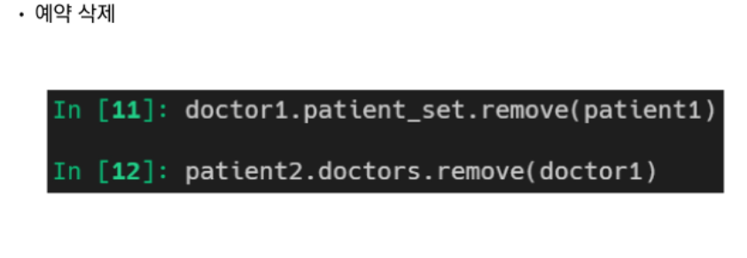

* 중개 테이블의 필드 생성 규칙
  * source model 및 target model이 다른 경우
    * id
    * <containing_model>_id
    * <other_model>_id
  * ManyToManyField가 동일한 모델을 가리키는 경우
    * id
    * from\__<model>\_id
    * to\_<model>\_id


---

#### Like

QuerySet API - `exists()`

*쿼리셋에 결과가 포함되어있으면 True, 아니면 False 반환*

고유 필드(예를 들어, pk)가 있는 모델이 쿼리셋 구성원인지 찾는 가장 효율적 방법


1. 모델 생성

```python
# accounts/models.py

from django.db import models
from django.conf import settings

# Create your models here.
class Article(models.Model):
    # 기존 유저와 게시글을 연결하는 FK
    user = models.ForeignKey(settings.AUTH_USER_MODEL, on_delete=models.CASCADE)
    # 좋아요 기능을 나타내니까 like_users로 하자
    # 이 때, user.article_set.all() 형식으로 역참조를 하게 되는데, 이는
    # 위의 user-article 관계와 겹치는 형태이다
    # 그렇기 때문에 related_name을 설정해준다
    like_users = models.ManyToManyField(settings.AUTH_USER_MODEL, related_name='like_articles')
    title = models.CharField(max_length=10)
    content = models.TextField()
    created_at = models.DateTimeField(auto_now_add=True)
    updated_at = models.DateTimeField(auto_now=True)

    def __str__(self):
        return self.title
```

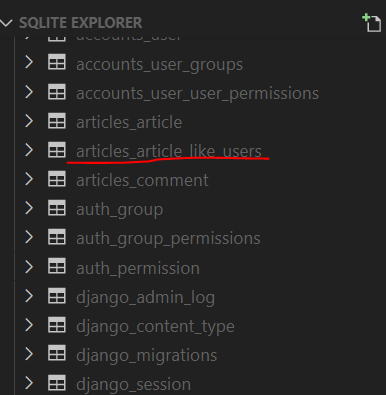

형태로 table 생성된다

```python
# 현재 User-Article 간 사용가능한 DB API

# 게시글을 작성한 유저 1:N
article.user

# 게시글을 좋아요한 유저 M:N
article.like_users

# 유저가 작성한 게시글(역참조) 1:N
user.article_set

# 유저가 좋아요한 게시글(역참조) M:N
user.like_articles

```


2. url 생성

```python
# articles/views.py

from django.urls import path
from . import views


app_name = 'articles'
urlpatterns = [
    path('', views.index, name='index'),
    path('create/', views.create, name='create'),
    path('<int:pk>/', views.detail, name='detail'),
    path('<int:pk>/delete/', views.delete, name='delete'),
    path('<int:pk>/update/', views.update, name='update'),
    path('<int:pk>/comments/', views.comment_create, name='comment_create'),
    path('<int:article_pk>/comments/<int:comment_pk>/delete/', views.comment_delete, name='comment_delete'),
    
    # 생성
    path('<int:article_pk>/likes/', views.likes, name='likes'),
]
```


3. veiws 작성

```python
# articles/view.py

# 좋아요 기능 구현
@require_POST
def likes(request, article_pk):
    if request.user.is_authenticated:
        article = get_object_or_404(Article, pk=article_pk)
        # 누르는게 무조건 좋아요를 활성화만 시키는게 아님
        # 홀수에 좋아요, 짝수에 취소
        # request.user가 좋아요 목록에 있으면 취소를 구현한다.

        # 햔재 요청하는 user가 article의 좋아요 목록에 있다면
        # if request.user in article.like_users.all():
        
        # exists() -> 쿼리셋에 결과가 포함되어있으면 True, 아니면 False 반환
        # 고유 필드(예를 들어, pk)가 있는 모델이 쿼리셋 구성원인지 찾는 가장 효율적 방법 
        if article.like_users.filter(pk=request.user.pk).exists():
            article.like_users.remove(request.user)
        # 아니라면
        else:
            article.like_users.add(request.user)
        return redirect('articles:index')
    return redirect('accounts:login')
```


4. templates 작성

```python
# templates/articles/index.html

  
    <p>작성자: {{ article.user }}</p>
    <p>글 번호: {{ article.pk }}</p>  
    <p>글 제목: {{ article.title }}</p>
    <p>글 내용: {{ article.content }}</p>
    <a href="">DETAIL</a>
    
    # 좋아요 버튼 기능 작성
    <div>
      <form action="" method='POST'>
      
      
      <input type="submit" value='좋아요 취소'>
      
      <input type="submit" value='좋아요'>
      
    </form>
    
  </div>
```


---

#### Profile Page 작성하기


1. url 작성

```python
# articles/urls.py

from django.urls import path
from . import views


app_name = 'articles'
urlpatterns = [
	...
    # variable 라우팅이 문자열로 시작하는 경우 가장 아래로 내려주어야한다.
    path('<username>/', views.profile, name='profile'),
]
```


2. view 작성

```python
# accounts/views.py
# 현재 활성화된 모델 가져오기
from django.contrib.auth import get_user_model

# profile view 함수 작성
def pofile(request, username):
    person = get_object_or_404(get_user_model(), username=username)
    context = {
        'person' : person,
    }
    return render(request, 'accounts/profile.html', context)
```


3. template 작성

```python
# templates/profile.html




<h1>{{ person.username }}님의 프로필</h1>
<hr>

<h2>
  {{ person.username }}'s 게시글
</h2>

<div>{{ article.title }}</div>


<hr>

<h2>{{ person.username }}'s 댓글 </h2>

<div>{{ comment.content }}</div>


<hr>

<h2>{{ person.username }}'s 좋아요한 게시글</h2>

<div>{{ article.title }}</div>


<hr>

<a href="">Back</a>

```


---

#### Follow

`symmetrical`

: ManyToManyField가 동일한 모델(on self)을 가리키는 정의에서만 사용

symmetrical=True(기본값)일 경우, Django는 person_set 매니저를 추가하지 않음

source 모델의 인스턴스가 target 모델의 인스턴스를 참조하면, target 모델 인스턴스도 source 모델 인스턴스를 자동으로 참조하도록 함

* 즉, 내가 당신의 친구라면 당신도 내 친구가 되는 것
* 대칭을 원하지 않을 경우 False로 설정


1. model 작성

```python
# accounts/models.py

class User(AbstractUser):
    # 서로 동시에 팔로우가 되지 않도록 symmetrical False 설정해주기
    followings = models.ManyToManyField('self', symmetrical=False, 				related_name='followers')

```


2. url 작성

```python
# accounts/urls.py

app_name = 'accounts'
urlpatterns = [
    ...
    path('<int:user_pk>/follow/', views.follow, name='follow'),
]
```


3. view 작성

```python
# accounts/views.py

# follow 함수 작성
@require_POST
def follow(request, user_pk):
    if request.user.is_authenticated:
        person = get_object_or_404(get_user_model(), pk=user_pk)
        if person != request.user:
            if person.followers.filter(pk=request.user.pk).exists():
                # if request.user in person.followers.all():
                person.followers.remove(reqeust.user)
            else:
                person.followers.add(request.user)
            return redirect('accounts:profile', person.username)
        return redirect('accounts:login')
```


4. template 작성

```python
# templates/accounts/profile.html

<div>
  <div>
    팔로잉 : {{ person.followings.all|length }} / 팔로워 : {{ person.followers.all|length }}
  </div>
  
  <div>
    <form action="" method='POST'>
      
      
      <input type="submit" value='Unfollow'>
      
      <input type="submit" value='Follow'>
      
    </form>
  </div>
  
</div>
```

