### RESTAPI M:N관계

---

#### M:N 실습

```python
# articles/models.py

...

class Card(models.Model):
    articles = models.ManyToManyField(Article, related_name='cards')
    name = models.CharField(max_length=100)
```

```shell
$ python manage.py makemigrations
$ python manage.py migrate
# 더미 데이터 넣기
$ ptyhon manage.py seed articles --number=10
```

```python
# 여러개의 serializers들이 생기다보면, 각 class들의 순서도 중요해지고 정리를 해야하는 순간이 온다. 각 역할별로 분류한다던지, 모델에 이름에 맞춘다던지, 그래서 이제 할 거임(유지보수 관리를 위해서)

# serializers 폴더 생성

# articles/serializers/article.py
from rest_framework import serializers
# 폴더 경로 바뀌니까 ..models로 변경
from ..models import Article
# 현재 이 파일에는 CommentSerializer가 없어서 import 해와야한다.
from .comment import CommentSerializer


class ArticleListSerializer(serializers.ModelSerializer):

    class Meta:
        model = Article
        fields = ('id', 'title',)
        
       
   
class ArticleSerializer(serializers.ModelSerializer):
    # comment_set = serializers.PrimaryKeyRelatedField(many=True, read_only=True)
    comment_set = CommentSerializer(many=True, read_only=True)
    comment_count = serializers.IntegerField(source='comment_set.count', read_only=True)

    class Meta:
        model = Article
        fields = '__all__'


```

```python
# articles/serializers/card.py

from rest_framework import serializers
from ..models import Card

class CardSerializer(serializers.ModelsSerailizer):
    
    class Meta:
        model = Card
        fields = '__all__'


```

```python
# articles/serializers/comment.py

from rest_framework import serializers
from ..models import Comment

class CommentSerializer(serializers.ModelSerializer):

    class Meta:
        model = Comment
        fields = '__all__'
        read_only_fields = ('article',)
```

```python
# articles/views.py에서 기존 seiralizers.py에서 import 해온 경로들 수정해주기

from .serializers.article import ArticleListSerializer, ArticleSerializer
from .serializers.comment import CommentSerializer
from .serializers.card import Cardserializer


@api_view(['GET'])
def card_list(request):
    cards = get_object_404(Card)
    serializer = Cardserializer(cards, many=True)
    return Response(serializer.data)


```

```python
# articles/urls.py 설정

urlpatterns = [
    ...
    path('cards/', views.card_list),
]
```

```python
# 현재 ArticleSerializer에는 카드에 대한 fields가 없다.
# 그래서 추가해주자
# articles/serializers/article.py

from .card import CardSerializer

class ArticleSerializer(serializers.ModelSerializer):
    comment_set = CommentSerializer(many=True, read_only=True)
    comment_count = serializers.IntegerField(source='comment_set.count', read_only=True)
    
    # related_name이 cards라서 card_set으로 역참조하는 것이 아니다!
    cards = CardSerializer(many=True, read_only=True)

    class Meta:
        model = Article
        fields = '__all__'

```

```python
# 중개테이블에 값 잘 추가해주도록 만들어주자
1. urls
2. views
```

```python
# articles/urls.py


urlpatterns = [
    ...
    # 카드 디테일 함수
    path('cards/<int:card_pk>/', views.card_detail),
    # M:N 관계에서 DB를 add, remove 해 줄 수 있는 함수도 하나 더 필요하다
    path('<int:card_pK>/register/<int:article_pk>/', views.register),
    
]
```

```python
# articles/views.py

@api_view(['GET', 'DELETE', 'PUT'])
def card_detail(request, card_pk):
    card = get_object_or_404(Card, pk=card_pk)

    if request.method == 'GET':
        serializer = CardSerializer(card)
        return Response(serializer.data)

    elif request.method == 'DELETE':
        card.delete()
        data = {
            'delete': f'데이터 {article_pk}번이 삭제되었습니다.',
        }
        return Response(data, status=status.HTTP_204_NO_CONTENT)

    elif request.method == 'PUT':
        serializer = CardSerializer(card, request.data)
        if serializer.is_valid(raise_exception=True):
            serializer.save()
            return Response(serializer.data)

     
# M:N 관계에서 db를 추가, 삭제해줄 함수   
@api_view(['POST'])
def register(request, card_pk, article_pk):
    
    card = get_object_or_404(Card, pk=card_pk)
    article = get_object_or_404(Article, pk=article_pk)
    
    if card.articles.filter(pk=article.pk).exists():
        card.articles.remove(article)
       
    else:
        card.articles.add(article)
    serializer = CardSerializer(card)
    return Response(serializer.data)
```


#### REST API 문서화

##### drf-yasg 라이브러리

'Yet another Swagger generator' > api를 설계하고 문서화하는데 도움을 주는 라이브러리

Swagger & OpenAPI 2.0 문서 제공

```shell
$ pip install drf-yasg
```

```python
# settings.py

INSTALLED_APPS = [
    ...
    'django.contrib.staticfiles',
    'drf-yasg',
]
```

```python
# swagger관련 url설정
# articles/urls.py

from drf_yasg.views import get_schema_view
from drf_yasg import openapi

schema_view = get_schema_view(
   openapi.Info(
      title="Snippets API",
      default_version='v1',
      # 위 두개는 필수, 아래는 선택옵션
       description="Test description",
      terms_of_service="https://www.google.com/policies/terms/",
      contact=openapi.Contact(email="contact@snippets.local"),
      license=openapi.License(name="BSD License"),
   ),
   public=True,
)

urlpatterns = [
    ...
    path('swagger/', schema_view.with_ui('swagger')),
    # 입맛 맞춰서 ui 변경해주면 된다~
    # path('swagger/', schema_view.with_ui('redoc')),
]

```

```shell
$ python manage.py runserver
```

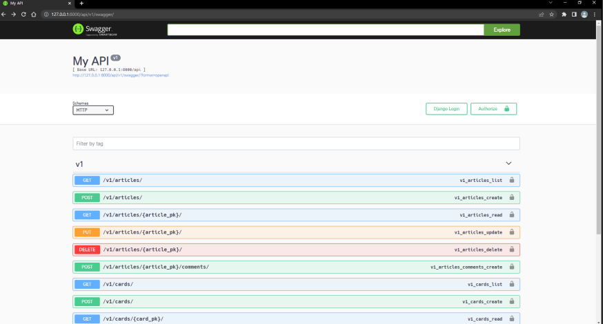


---

#### Fixtures (모델에 초기데이터를 제공하는 방법)

\* 앱을 처음 설정할 때, 미리 준비된 데이터로 db를 채우는 것이 필요한 상황이 있다

\* 마이그레이션 또는 fixtures와 함께 초기 데이터 제공

\* ex) A가 db를 다 채운뒤 깃헙에 올려도, db는 올라가지 않는다. 그래서 B가 깃헙에서 내려 받은 다음 migrate를 하더라도 db는 전달되지 않는 문제가 있다

\* fixtures 데이터를 함께 보내주는게 이를 해결하는 방법

\* django가 fixtures 파일을 찾는 경로 : `app/fixtures`

\* `dumpdata` : 응용프로그램과 관련된 db의 모든 데이터를 표준 출력으로 출력

```shell
# A 입장
# --indent 옵션을 주지 않으면 한줄로 작성되기 때문에 다음과 명령
# 'auth 앱의 user 모델 데이터를 indent 4칸의 user.json 파일로 출력 '
$ python manage.py dumpdata --indent 4 auth.user > user.json
```

\* `loaddata` : 전달된 json 파일을 통해 db를 받아옴

```shell
# B 입장
$ python manage.py migrate
$ python manage.py loaddata user.json
```


위에꺼 실습

```shell
# $ python manage.py dumpdata --indent 4 앱이름.모델명 > article.json
$ python manage.py dumpdata --indent 4 articles.article > articles.json
$ python manage.py dumpdata --indent 4 articles.comment > comments.json
$ python manage.py dumpdata --indent 4 accounts.user > users.json
```

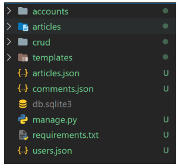

```python
# 기존 경로가 app/fixtures이기 때문에
# 각 앱마다 fixtures 폴더 생성 후 json 파일을 옮겨준다
```

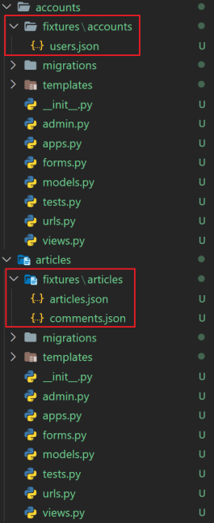


```shell
# loaddata는 한번에 여러개도 받을 수 있다
$ python manage.py loaddata articles.json comments.json users.json
```

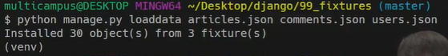

```python
# app/fixtures/app_name/users.json 과 같이
# template 형태의 구조로 만들어주어도 된다.
```

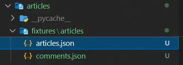

```shell
# 이때는 다음과 같이 받아와야한다
$ python manage.py loaddata articles/articles.json articles/comments.json accounts/users.json

# [주의] fixtures는 직접 작성이 아니라 dumpdata를 통해 생성하는 것이니 직접 작성하지 말 것
```


---

#### Improve query(쿼리 개선하기)

##### 쿼리셋 이해하기

\* QuerySets are lazy

: 쿼리셋을 만드는 작업에는 db 작업이 포함되지 않음. 하루 종일 필터를 함께 쌓을 수 있으며(stack filters), Django는 쿼리셋이 '평가(evaluated)' 될 때까지 실제로 쿼리를 실행하지 않음

: DB에 쿼리를 전달하는 일이 웹 어플리케이션을 느려지게 하기 때문


```python
# 다음 구문에서 몇 개의 쿼리가 DB에 전달될까
articles = Article.objects.filter(title__startswith='What')
articles = articles.filter(created_at__lte=datetime.date.today())
articles = articles.exclude(content__icontaions='food')
print(articles)

# print 될 때 한번 전달된다.
```


\* `평가` : 

* 쿼리셋에 해당하는 DB 레코드를 실제로 가져오는것
  * == hit, access, Queries database
* 평가된 모델들은 쿼리셋의 내장 캐시(cache)에 저장, 덕분에 순회하더라도 같은 쿼리를 db에 전달하지 않음
* [참고] 캐시
  * 데이터나 값을 미리 복사해놓는 임시장소
  * 데이터 접근시간보다 캐시접근이 더 빠르다 판단될 때 사용


\* 쿼리셋 평가 시점

1. Iteration

   * 쿼리셋은 반복 가능하며, 처음 반복시 db 쿼리 실행

     

2. bool()

   * bool() 또는 if문 사용과 같은 bool 컨텍스트에서 쿼리셋 테스트하면 쿼리 실행

     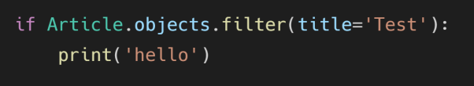


\* 쿼리셋이 캐시되지 않는 경우

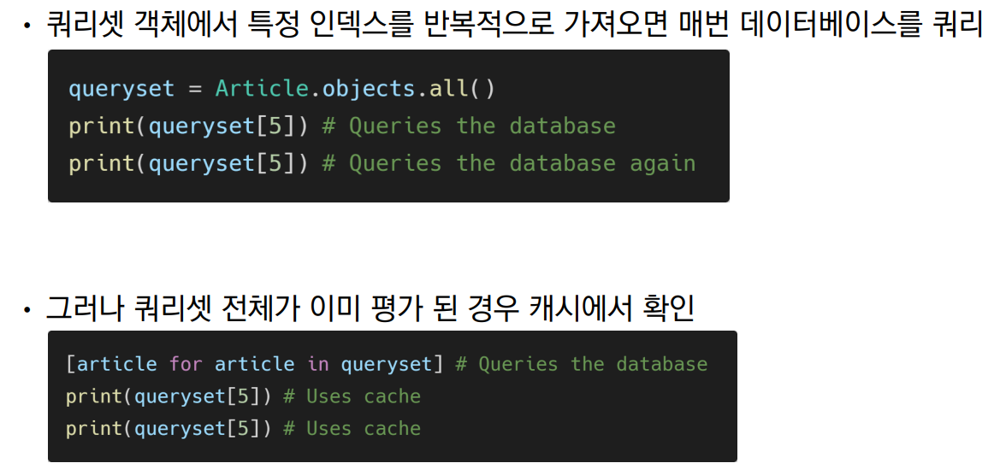


##### 필요하지 않은 것을 검색하지 않기

 `.count()` : len(queryset) 대신 QuerySet.count() 사용하기

`.exists()` :  최소한 하나의 결과가 존재하는지 확인하려는 경우 if 말고 .exists() 쓰자

`iterator()`: 객체가 많을 때, 쿼리셋의 캐싱 동작으로 인해 많은 양의 메모리가 사용될 때 사용


'안일한 최적화 주의'

: `exists()와 iterator() 메서드를 사용하면 메모리 사용을 최적화할 수 있지만 쿼리셋 캐시는 생성되지 않기 때문에, DB 쿼리가 중복될 수 있음

---

\* `Annotate`

\1. 단순히 SQL로 계산해 하나의 테이블의 필드로 추가하여 붙여올 수 있는 경우

'게시글 별로 댓글 수를 출력해보기'

```python
# articles/views.py

def index_1(request):
    # articles = Article.objects.order_by('-pk')
    # 아래로 변경
    articles = Article.objects.annotate(Count('comment')).order_by('-pk')
    context = {
        'articles': articles,
    }
    return render(request, 'articles/index_1.html', context)

```

```django
# templates/index_1.html




  <h1>Articles</h1>
  
    <p>제목 : {{ article.title }}</p>
     <p>댓글개수 : {{ article.comment_set.count }}</p> 
    <p>댓글개수 : {{ article.comment__count }}</p>
    <hr>
  

```

11번의 쿼리가 1번으로 줄게 됨 

이는 중복을 제거하지 않고, 단순히 쿼리 갯수만 날린 것이다

이거보다 큰 문제는 반복문을 도는 상황에서의 1:N, M:N 호출상황이다

그래서 아래로 넘어감


---

##### 한번에 모든 것을 검색하기

\* `select_related()` : 

1:1 or 1:N  참조 관계에서 사용

DB에서 INNER JOIN을 활용

* 게시글의 사용자 이름까지 출력을 해보기

```django
# html




  <h1>Articles</h1>
  
    <h3>작성자 : {{ article.user.username }}</h3>
    <p>제목 : {{ article.title }}</p>
    <hr>
  



```

```python
# articles/views.py

def index_2(request):
    # articles = Article.objects.order_by('-pk')
    articles = Article.objects.select_related('user').order_by('-pk')
    context = {
        'articles': articles,
    }
    return render(request, 'articles/index_2.html', context)
```

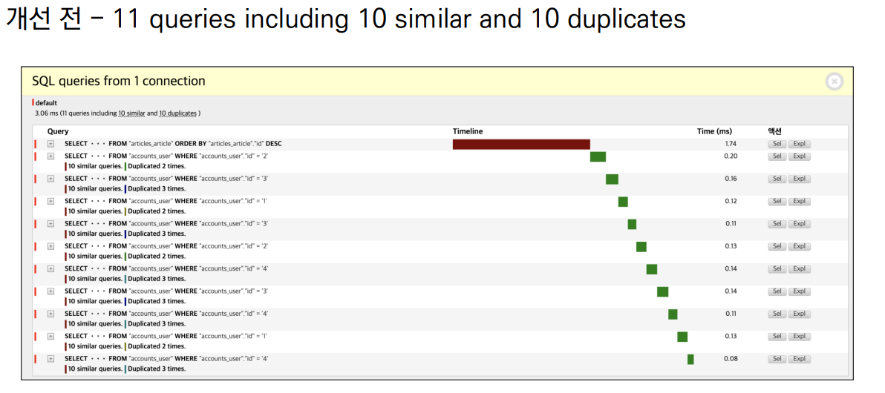

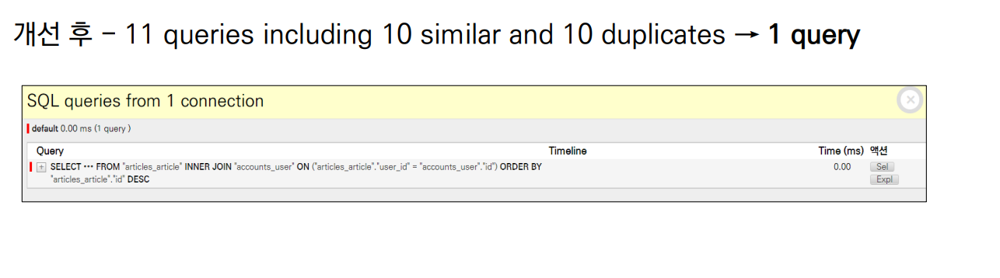

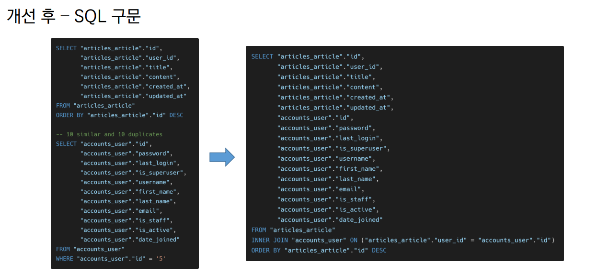


\*`prefetch_related()`:

M:N or 1:N 역참조 관계에서 사용

DB가 아닌 python을 통한 JOIN

* 댓글 목록을 모두 출력해보기

```django
# html




  <h1>Articles</h1>
  
    <p>제목 : {{ article.title }}</p>
    <p>댓글 목록</p>
    
      <p>{{ comment.content }}</p>
    
    <hr>
  


```

```python
# views.py


def index_3(request):
    # articles = Article.objects.order_by('-pk')
    articles = Article.objects.prefetch_related('comment_set').order_by('-pk')
    context = {
        'articles': articles,
    }
    return render(request, 'articles/index_3.html', context)
```

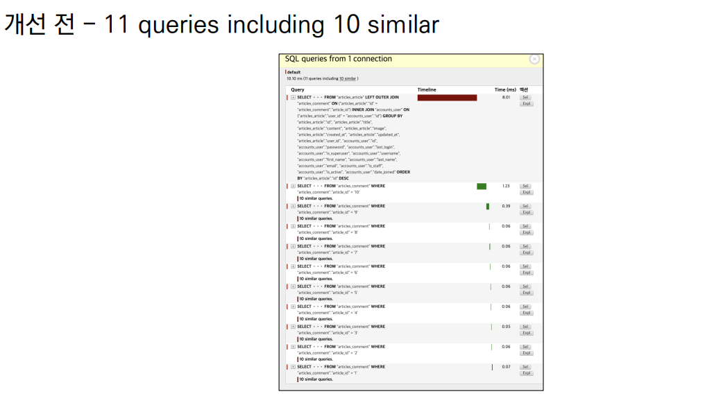

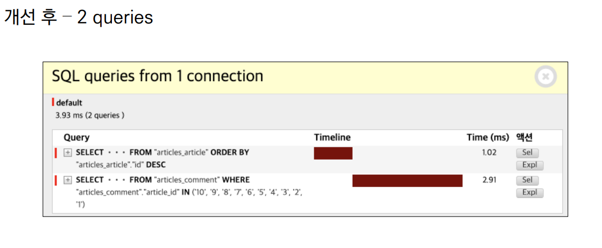

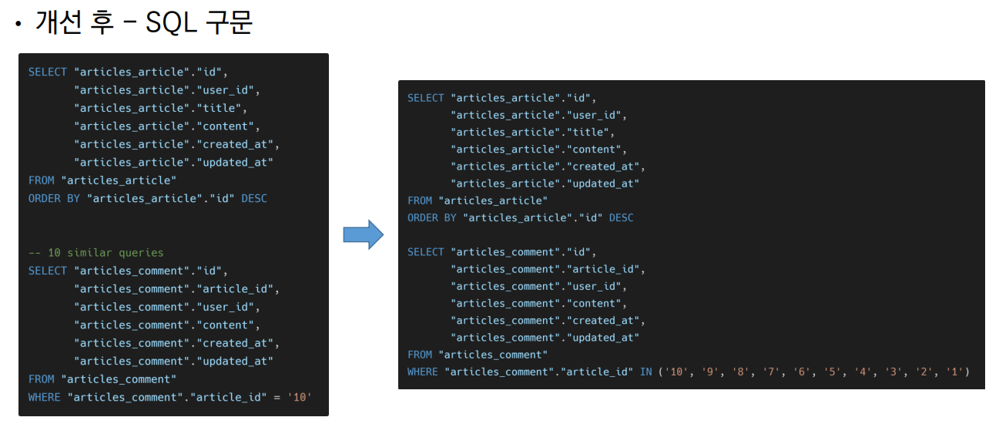


\* 복합활용

* 댓글에 더해서 해당 댓글을 작성한 사용자 이름까지 출력해보기

```django
# html




  <h1>Articles</h1>
  
    <p>제목 : {{ article.title }}</p>
    <p>댓글 목록</p>
    
      <p>{{ comment.user.username }} : {{ comment.content }}</p>
    
    <hr>
  


```

```python
# views.py


from django.db.models import Prefetch

def index_4(request):
    # articles = Article.objects.order_by('-pk')
    articles = Article.objects.prefetch_related(Prefetch('comment_set', queryset=Comment.objects.select_related('user'))).order_by('-pk')
    context = {
        'articles': articles,
    }
    return render(request, 'articles/index_4.html', context)
```

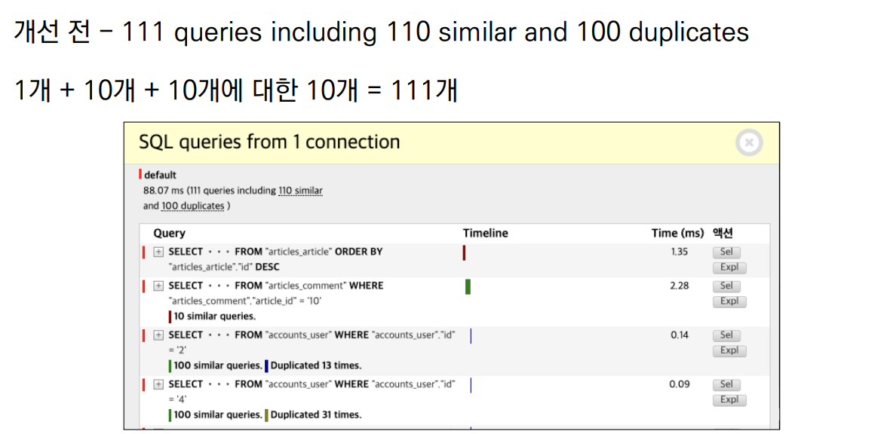

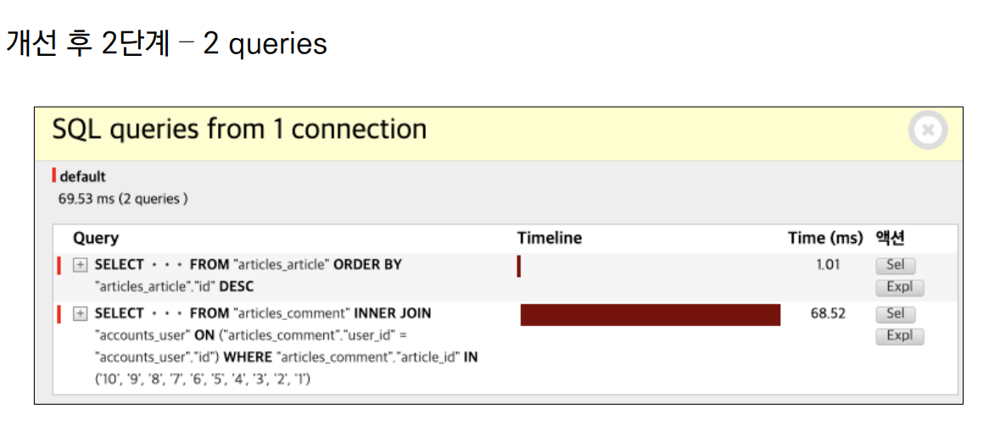