### JS 심화(JS 02)

---

### DOM

HTML, XML 같은 문서를 다루기 위한 프로그래밍 인터페이스

구조화 되어 있으며, 각 요소는 객체로 취급


### DOM 조작

- Document는 문서 한 장에 해당하고 이를 조작

- 조작 순서

  1. 선택
  2. 변경

- 상속 구조

  1. EventTarget (Event Listener를 가질 수 있는 객체)
  2. Node(여러 DOM 타입들이 상속하는 인터페이스)
  3. Element
  4. Document(브라우저가 불러온 웹 페이지)
  5. HTMLElement(모든 HTML요소)

  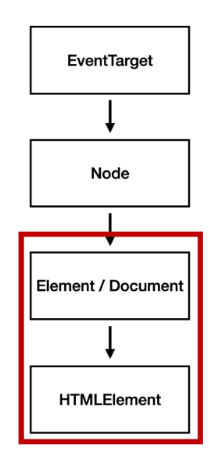

---

### 선택


- #### Dom 선택 관련 메서드

  - `document.querySelector(selector)`
    - 제공한 선택자와 일치하는 element 하나 선택
    - 제공한 CSS selector를 만족하는 첫 번째 element 객체를 반환(없다면 null)
  - `document.querySelectorAll(selector)`
    - 제공한 선택자와 일치하는 여러 element를 선택
    - 하나 이상의 유효한 인자를 받음
    - 지정된 셀렉터에 일치하는 NodeList반환
  - 아래도 있지만 위 2개를 더 자주 사용(구체적 설정이 가능해서)
  - `getElementByID(id)`
  - `getElementByName(name)`
  - `getElementByClassName(names)`

- 실습(각 요소를 선택해보자)

  - 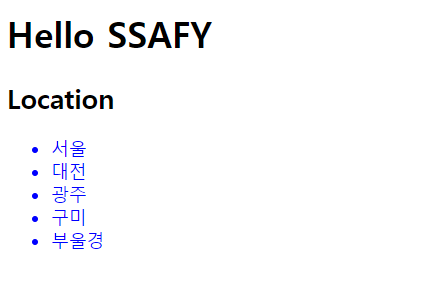

  - ```javascript
       // querySelector
    const h1 = document.querySelector('h1')
    const h2 = document.querySelector('h2')
    const secondH2 = document.querySelector('#location-header')
    const selectUlTag = document.querySelector('div > ul')
    
    // querySelectorAll
    const liTags = document.querySelectorAll('li')
    const secondLiTags = document.querySelectorAll('.ssafy-location')
    ```

- #### DOM 변경 메서드

  - `document.createElement()`

    - 작성한 태그 명의 HTML 요소를 생성하여 반환

  - `Element.append()`

    - 여러 노드 객체, DOMString을 추가할 수 있다

  - `Node.appendChild()`

    - 특정 부모 노드의 자식 노드리스트 중 마지막 자식으로 삽입
    - 한 번에 하나만 추가 가능

  - `Node.innerText`

    - 해당 요소의 text만 바꿈

  - `Element.innerHTML`

    - 요소 내에 포함된 HTML 마크업을 반환
    - XSS 공격에 취약하므로 사용하지 말 것

  - `innerText와 innerHTML 차이`

    - 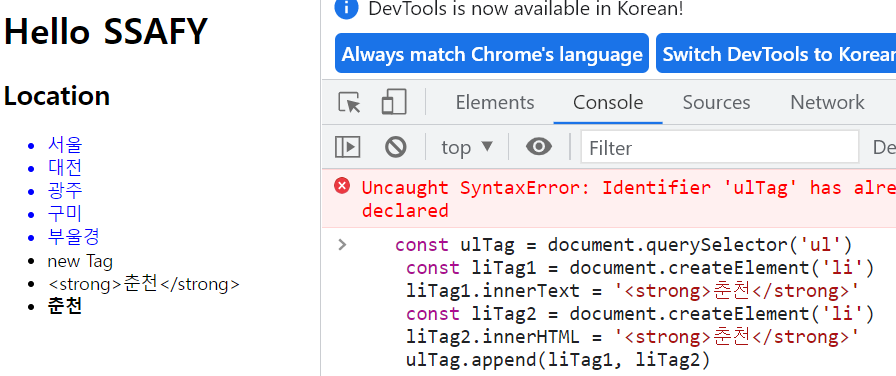
    - innerText는 문자 자체로 받아들이고
    - innerHTML은 HTML요소로 받아들인다.

    

- 실습

  - 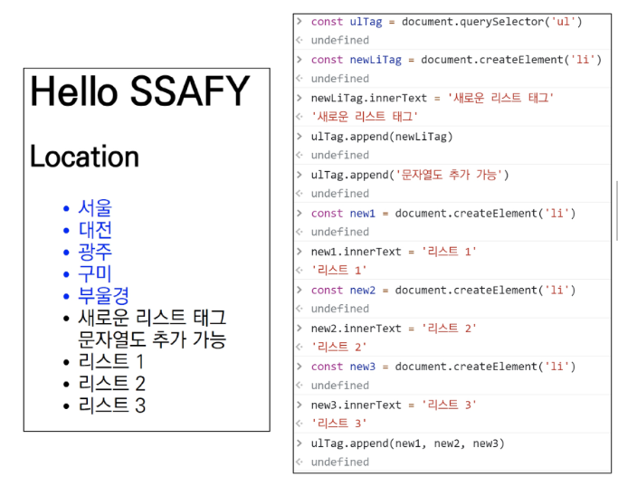

  - 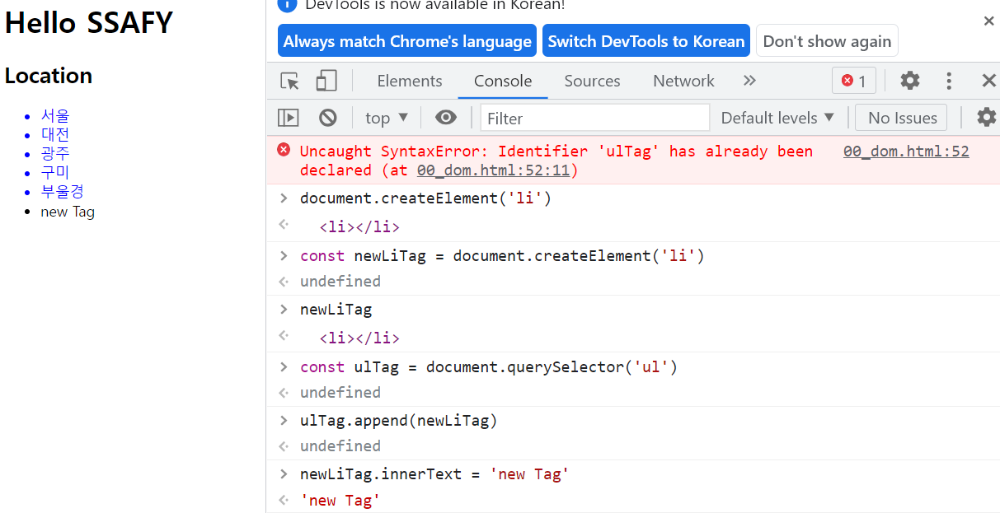

  - ```javascript
       // 2. Creation & Append
    // 2-1. createElement
    const ulTag = document.querySelector('ul')
    const newLiTag = document.createElement('li')
    
    // 2-2. append
    const ulTag = document.querySelector('ul')
    const newLiTag = document.createElement('li')
    newLiTag.innerText = '새로운 리스트 태그'
    ulTag.append(newLiTag)
    ulTag.append('문자열도 추가 가능')
    
    const new1 = document.createElement('li')
    new1.innerText = '리스트 1'
    const new2 = document.createElement('li')
    new2.innerText = '리스트 2'
    const new3 = document.createElement('li')
    new3.innerText = '리스트 3'
    // 동시에 여러개 append도 가능
    ulTag.append(new1, new2, new3)
    
    // 2-3. appendChild
    const ulTag = document.querySelector('ul')
    const newLiTag = document.createElement('li')
    newLiTag.innerText = '새로운 리스트 태그'
    ulTag.appendChild(newLiTag)
    ulTag.appendChild('문자열은 추가 불가')
    
    const new1 = document.createElement('li')
    new1.innerText = '리스트 1'
    const new2 = document.createElement('li')
    new2.innerText = '리스트 2'
    // 적용되지 않는다, 문자열 추가도 불가능
    ulTag.appendChild(new1, new2)
    // ulTag.appendChild('asdafsd')
    
    // 2-2. innerText & innerHTML
    const ulTag = document.querySelector('ul')
    const liTag1 = document.createElement('li')
    liTag1.innerText = '<strong>춘천</strong>'
    const liTag2 = document.createElement('li')
    liTag2.innerHTML = '<strong>춘천</strong>'
    ulTag.append(liTag1, liTag2)
    
    const ulTag = document.querySelector('ul')
    ulTag.innerHTML = '<li><a href="javascript:alert(\'당신의 개인정보 유출\')">춘천</a></li>'
    
    
    ```

- #### DOM 삭제 관련 메서드

  - `ChildNode.remove()`

    - 노드가 속한 트리에서 해당 노드 제거

  - `Node.removeChild()`

    - DOM에서 자식 노드를 제거하고 제거된 노드 반환
    - 노드 인자로 들어가는 자식 노드의 부모 노드

  - 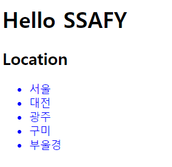

  - 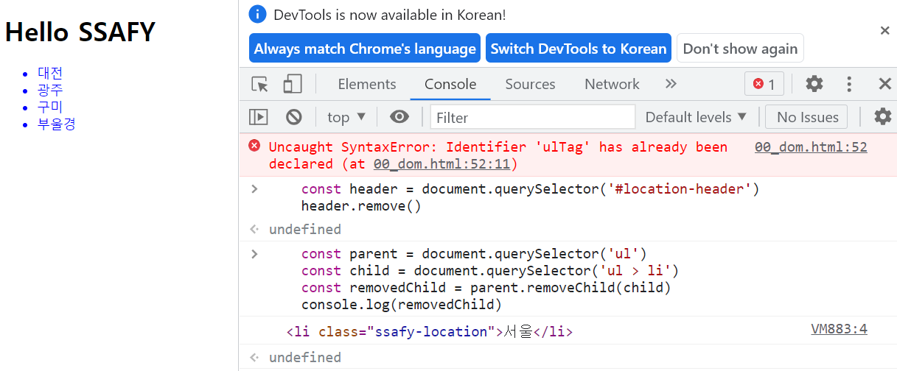

  - ```javascript
    // 3. Delete
    // 3-1. remove
    const header = document.querySelector('#location-header')
    header.remove()
    
    // 3-2. removeChild(요소의 위치를 바꿀 때 사용)
    const parent = document.querySelector('ul')
    const child = document.querySelector('ul > li')
    const removedChild = parent.removeChild(child)
    console.log(removedChild)
    // 순서바꾸기 예시
    parent.append(child)
    ```

- #### DOM 속성관련메서드

  - `Element.setAttribute(name, value)`

    - 지정된 요소의 값을 설정
    - 속성이 이미 존재하면 값을 갱신, 존재하지 않으면 새 속성 추가

  - `Element.getAttribute(attributeName)`

    - 해당 요소의 지정된 값(문자열)을 반환
    - 인자는 값을 얻고자 하는 속성의 이름

  - ```javascript
    // 4. 속성
    // 4-1. setAttribute
    const header = document.querySelector('#location-header')
    header.setAttribute('class', 'ssafy-location')
    
    // 4-2. getAttribute
    const getAttr = document.querySelector('.ssafy-location')
    getAttr.getAttribute('class')
    getAttr.getAttribute('style')
    
    //4-3. Element Styling
    li1.style.cursor = 'pointer'
    li2.style.color = 'blue'
    li3.style.background = 'red'
    ```


---

### 조작

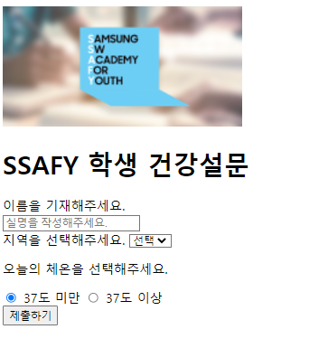

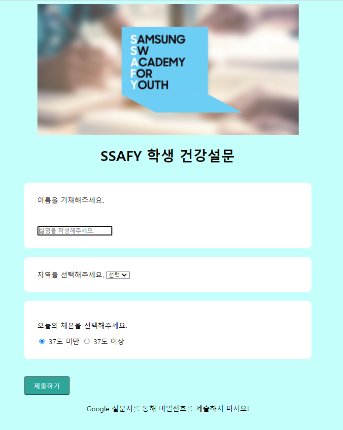


```html
<!DOCTYPE html>
<html lang="en">
<head>
  <meta charset="UTF-8">
  <meta http-equiv="X-UA-Compatible" content="IE=edge">
  <meta name="viewport" content="width=device-width, initial-scale=1.0">
  <title>Document</title>
  <style>
    /* body background color */
    #main {
      background-color: rgba(197, 255, 251)
    }

    /* 중앙 정렬 */
    .box-container {
      display: flex;
      justify-content: center;
      align-items: center;
    }

    /* 박스 별 테두리 */
    .box-item {
      margin: 20px;
      padding: 30px;
      border-radius: 10px;
      width: 600px;
      background-color: white;
    }

    /* 버튼 텍스트 변경 및 스타일링 */
    .button {
      background-color: rgba(45, 166, 153);
      border-radius: 4px;
      color: white;
      padding: 10px 20px;
      margin: 20px;
      cursor: pointer;
      font-size: 15px;
    }

    /* footer */
    .footer {
      margin-top: 3vh;
      margin-bottom: 3vh;
    }
  </style>
</head>
<body>
  <nav>
    <a href="https://www.ssafy.com">
      
    </a>
  </nav>

  <header>
    <h1>SSAFY 학생 건강설문</h1>
  </header>

  <section>
    <form action="#" method="GET">
      <div>
        <label for="name">이름을 기재해주세요.</label><br>
        <input type="text" id="name" placeholder="실명을 작성해주세요." autofocus>
      </div>
      
      <div>
        <label for="region">지역을 선택해주세요.</label>
        <select name="region" id="region" required>
          <option value="">선택</option>
          <option value="서울" disabled>서울</option>
          <option value="대전">대전</option>
          <option value="광주">광주</option>
          <option value="구미">구미</option>
        </select>
      </div>
      
      <div>
        <p>오늘의 체온을 선택해주세요.</p>
        <input type="radio" name="body-heat" id="normal" value="normal" checked>
        <label for="normal">37도 미만</label>
        <input type="radio" name="body-heat" id="warning" value="warning">
        <label for="warning">37도 이상</label>
      </div>

      <input type="submit" value="제출하기" id="submitButton">
    </form>
  </section>

  <script>
    // 배경색 설정
    // body를 선택하고
    const body = document.querySelector('body')
    // id를 style에 미리 설정한 main으로 설정해준다.
    body.setAttribute('id', 'main')

    // 요소 중앙 정렬
    // 1. 필요한 요소 선택
    const nav = document.querySelector('nav')
    const header = document.querySelector('header')
    const section = document.querySelector('section')
    // 2. 중앙 정렬(.box-container) class를 box로 만들어줘도 되고
    // 직접 class 추가를 해주어도 된다.
    nav.setAttribute('class', 'box-container')
    header.classList.add('box-container')
    section.classList.add('box-container')
    

    // 테두리 설정
    // 1. section > div 전부 선택
    const divs = document.querySelectorAll('section div')
    // 2.  div에 위에 설정해놓은 box-item 클래스 준다
    divs.forEach(function (div) {
      div.setAttribute('class', 'box-item')
    })


    // 버튼 변경
    // 1. 버튼을 선택한다.
    const button1 = document.querySelector('#submitButton')
    // 2. .button 지정한다.
    button1.setAttribute('class', 'button')
  

    // 이미지 사이즈
    // 1. 이미지 선택
    const navImg = document.querySelector('nav img')
    //2. 사이즈 변경
    navImg.width = '600'


    // footer
    // 1. footer element 생성
    const footer = document.createElement('footer')
    footer.innerText = 'Google 설문지를 통해 비밀전호를 제출하지 마시오!'
    // 2. body 맨 밑에 append 한다
    body.appendChild(footer)
    // 3. class 추가한다.
    footer.setAttribute('class', 'box-container')

    // input 요소 스타일링
    const nameInput = document.querySelector('#name')
    nameInput.style.marginTop = '50px'


  </script>
</body>
</html>

```


#### collector 실수 주의

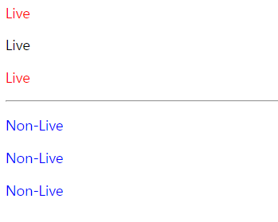

```html
<!DOCTYPE html>
<html lang="en">
<head>
  <meta charset="UTF-8">
  <meta http-equiv="X-UA-Compatible" content="IE=edge">
  <meta name="viewport" content="width=device-width, initial-scale=1.0">
  <title>HTMLCollection & NodeList</title>
  <style>
		.red {
			color: red;
		}

		.blue {
			color: blue;
		}
	</style>
</head>
<body>
  <div>
    <p class="live">Live</p>
    <p class="live">Live</p>
    <p class="live">Live</p>
  </div>
	
	<hr>
  
	<div>
    <p class="non-live">Non-Live</p>
    <p class="non-live">Non-Live</p>
    <p class="non-live">Non-Live</p>
  </div>
	<script>
    // 1 
    const liveNodes = document.getElementsByClassName('live')
    // console.log(liveNodes)
	
    // class 이름을 실시간으로 바꾸기 때문에, 따로 적용이 된다
    for (let i = 0; i < liveNodes.length; i++) {
      liveNodes[i].className = 'red'
      console.log(liveNodes)
    }

    // 2 일반적으로 적용하는 방법
    const nonLiveNodes = document.querySelectorAll('.non-live')

    for (let i = 0; i < nonLiveNodes.length; i++) {
      nonLiveNodes[i].className = 'blue'
      console.log(nonLiveNodes)
    }
  </script>
</body>
</html>

```


---

### Event Listener

#### Event

네트워크 활동이나 사용자와 상호작용 같은 사건의 발생을 알리기 위한 객체

이벤트 발생

* 마우스 클릭, 키보드 누르는 등 사용자 행동으로 발생가능

* 특정 메서드 호출하여 프로그래밍적으로도 만들 수 있다

* AnimationEvent, ClipboardEvent, DragEvent 등

* UIEvent

  * 간단한 사용자 인터페이스 이벤트
  * Event의 상속을 받음
  * MouseEvent, KeyboardEvent, InputEvent, FocusEvent 등 다 감지

* #### Event handler

  * `EventTarget.addEventListener()`

    * 지정 이벤트가 대상에 전달될 때마다 호출 함수 설정
    * 이벤트를 지원하는 모든 객체(element, document, window)를 대상으로 지정 가능

  * `target.addEventListener(type, listener[, options])`

    * type = 반응할 이벤트 유형(대소문자 구분 문자열)

    * listener 

      = 지정된 타입의 이벤트가 발생했을 때 알림을 받는 객체, EventListener인터페이스 혹은 JS function 객체(콜백함수)여야 함

    

    ##### 2-1 click event

    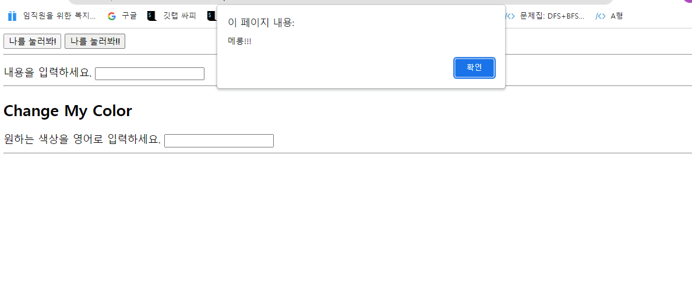

    ##### 2-2 input event

    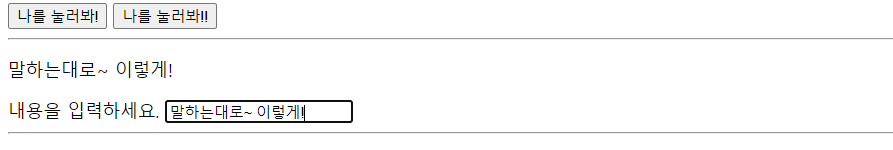

    

    ##### 2-3 Input event로 속성 변경

    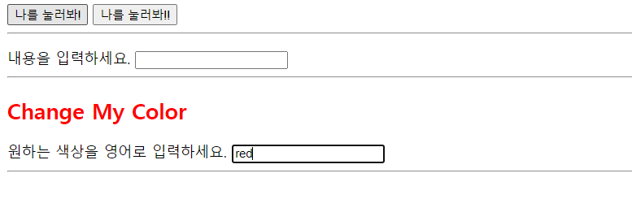

    ```html
    <!DOCTYPE html>
    <html lang="en">
    <head>
      <meta charset="UTF-8">
      <meta http-equiv="X-UA-Compatible" content="IE=edge">
      <meta name="viewport" content="width=device-width, initial-scale=1.0">
      <title>Document</title>
    </head>
    <body>
      <!-- 1. onclick -->
      <button onclick="alertMessage()">나를 눌러봐!</button>
    
      <!-- 2-1. addEventListener -->
      <button id="my-button">나를 눌러봐!!</button>
      <hr>
    
    	<!-- 2-2. addEventListener -->
      <!-- 사용자 입력 메세지 바로 보여줄 탭 -->
      <p id="my-paragraph"></p>
    
      <form action="#">
        <label for="my-text-input">내용을 입력하세요.</label>
        <input id="my-text-input" type="text">
      </form>
      <hr>
    
      <!-- 2-3. addEventListener -->
      <h2>Change My Color</h2>
      <label for="change-color-input">원하는 색상을 영어로 입력하세요.</label>
      <input id="change-color-input"></input>
      <hr>
    
      <script>
        // 1
        const alertMessage = function () {
          alert('메롱!!!')
        }
    
        // 2-1 클릭이벤트
        const myButton = document.querySelector('#my-button')
        // 둘 차이는 엄청 크다
        // 위에꺼는 함수라는 값을 넘기는 거고
        // 떡볶이 레시피를 넣어놓은것이고
        // 떡볶이 만드는 기계
        myButton.addEventListener('click', alertMessage)
        // 아래 두 줄은 같은 결과다. 없는 값을 넘기는 중임
        // 만들어진 떡볶이를 넣는것이다
        // 떡볶이 묻은 기계
        // myButton.addEventListener('click', alertMessage())
        // myButton.addEventListener('click', undefined)
    
        // 2-2 input이벤트
        const myTextInput = document.querySelector('#my-text-input')
        // n번 실행될 필요가 없어서 위로 끌어올리기
        const myP = document.querySelector('#my-paragraph')
        
    
        // 1번 코드 = 함수로 분리
        const ifInputIsComing = function (event) {
          //console.log(event.target.value)
          myP.innerText = event.target.value
        }
        myTextInput.addEventListener('input', ifInputIsComing)
    
    
        // 2번 코드  = 하나로 합치기
        myTextInput.addEventListener('input',  function (event) {
          //console.log(event.target.value)
          myP.innerText = event.target.value
        })
    
        // 3번 arrowfunction
        myTextInput.addEventListener('input', event => { myP.innerText = event.target.value })
    
    
       
        // 2-3 input event로 속성변경
        // n번 실행될 필요가 없어서 위로 끌어올리기
        const h2Tag = document.querySelector('h2')
    
        const onColorInput = function (event) {
          const userInput = event.target.value
          h2Tag.style.color = userInput
        }
    
        const colorInput = document.querySelector('#change-color-input')
        
        colorInput.addEventListener('input', onColorInput)
    
      </script>
    </body>
    </html>
    
    ```

* #### Evnet 취소

  * `evnet.preventDefault()`

    * 현재 이벤트의 기본 동작을 중단
    * html요소의 기본 동작을 작동하지 않게 막음(a 태그의 기본 동작은 클릭시 링크 이동)
    * 이벤트 취소할 수 있는 경우 이벤트를 취소

  * ```html
    <!DOCTYPE html>
    <html lang="en">
    <head>
      <meta charset="UTF-8">
      <meta name="viewport" content="width=device-width, initial-scale=1.0">
      <title>preventDefault</title>
    	<style>
        body {
          height: 10000px;
        }
      </style>
    </head>
    <body>
      <!-- 1. checkbox -->
      <input type="checkbox" id="my-checkbox">
      <hr>
    
      <!-- 2. submit -->
      <!-- form tag => submit event (1. input > enter / 2. submit btn > click)-->
      <form action="/articles/" id="my-form">
        <!-- input tag => input event -->
        <input type="text">
        <input type="submit" value="제출!">
      </form>
      <hr>
    
      <!-- 3. link -->
      <a href="https://google.com/" target="_blank" id="my-link">GoToGoogle</a>
      <hr>
      
      <script>
        // 1 클릭시 체크되는 기본동작을 막아놓음
        const checkBox = document.querySelector('#my-checkbox')
        
        checkBox.addEventListener('click', function (event) {
          event.preventDefault()
          console.log(event)
        })
    
        // 2 클릭, 엔터 시 제출되는 상황은 모든 상황을 일일히 막아주어야한다.
        // 이를 submit 자체를 막아서 제출되지 않게 하겠다.
        const formTag = document.querySelector('#my-form')
        // submit 자체를 막아버리겠다
        formTag.addEventListener('submit', function (event) {
          console.log(event)
          event.preventDefault()
          event.target.reset()
        })
    
        // 3
        const aTag = document.querySelector('#my-link')
    
        aTag.addEventListener('click', function (event) {
          console.log(event)
          event.preventDefault()
        })
    
        // 4 기본 이벤트가 전부 막히는 건 아니다.
        // scroll은 막히지 않는다.
        document.addEventListener('scroll', function (event) {
          console.log(event)
          event.preventDefault()
        })
      </script>
    </body>
    </html>
    
    ```


---

