## Vue CLI


### SFC(Single File Component)

+ 하나의 컴포넌트는 `.vue` 확장자를 가진 하나의 파일 안에서 작성되는 코드의 결과문

+ 화면의 특정 영역에 대한 HTML, CSS, JS 코드를 하나의 .vue 파일에서 관리

+ 즉, `.vue` 확장자를 가진 싱글 파일 컴포넌트를 통해 개발하는 방식

+ Vue 컴포넌트 ===  Vue 인스턴스 === .vue 파일

+ **Component**

  + 단일 파일에서의 개발
    + 처음 개발을 시작할 때는 크게 신경 쓸 것이 없지만, 코드 양이 많아지면 변수 관리가 힘들어지고 유지보수에 많은 비용이 발생한다
  + 각 기능 별로 파일을 나눠서 개발
    + 처음 개발 준비 단계에서 시간은 더 들지만, 변수 관리가 용이, 기능 별 유지 보수 비용 감소

+ **Vue Component**

  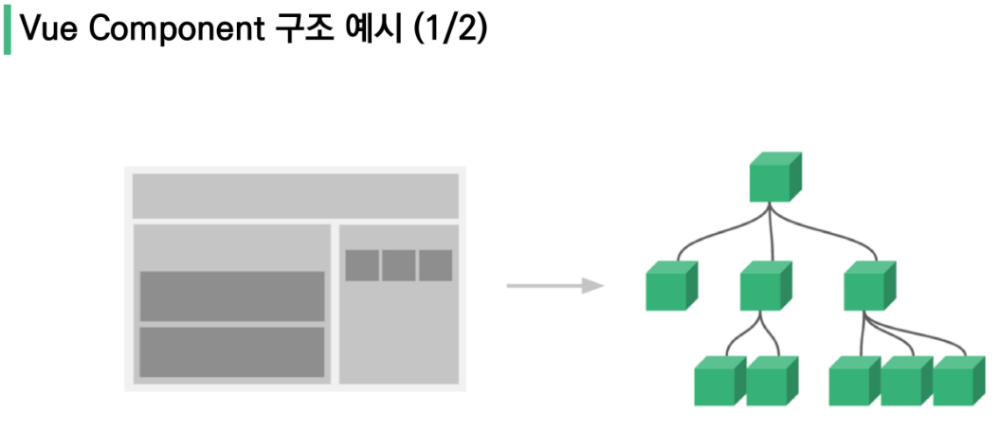

+ 한 화면 안에서도 기능 별로 각기 다른 컴포넌트 존재

  + 하나의 컴포넌트는 여러 개의 하위 컴포넌트를 가질 수 있음
  + Vue는 컴포넌트 기반의 개발 환경 제공

+ Vue 컴포넌트는 `const app = new  Vue({...})`의 app을 의미하며 이는 Vue 인스턴스

  + [주의] 컴포넌트 기반 개발 != 파일 단위 구분
  + 단일 .html 파일 안에서도 여러 개의 컴포넌트를 만들어 개발 가능

+ 정리

  + Vue 컴포넌트는 Vue 인스턴스(new Vue({})) 이기도 함
  + Vue 인스턴스는 .vue 파일 안에 작성된 코드의 집합
  + HTML, CSS, JS를 .vue 라는 확장자를 가진 파일 안에서 관리하며 개발

  

### Vue CLI

* Vue.js 개발을 위한 표준 도구
* 프로젝트의 구성을 도와주는 역할, Vue 개발 생태계에서 표준 tool 기준을 목표로 함
* 확장 플러그인, GUI, Bable 등 다양한 tool 제공


* **Node.js**

  * JS를 브라우저가 아닌 환경에서도 구동할 수 있도록 하는 JS 런타임 환경
  * 단순 브라우저만 조작할 수 있던 JS를 SSR 아키텍처에서도 사용할 수 있도록 함

* **NPM**

  * JS를 위한 패키지 관리자

  * python 에서 pip 와 같은 역할

  * Node.js의 기본 패키지 관리자, Node 설치시 함께 설치 됨

  * ```shell
    설치 -g 옵션을 넣어주지 않으면 npm은 특정 프로젝트에 귀속됨. -global의 뜻
    $ npm install -g @vue/cli
    
    
    버전 확인
    $ vue --version
    ```

  * Vue CLI Start

  * ```shell
    프로젝트 생성
    $ vue create my-first-app
    ```

    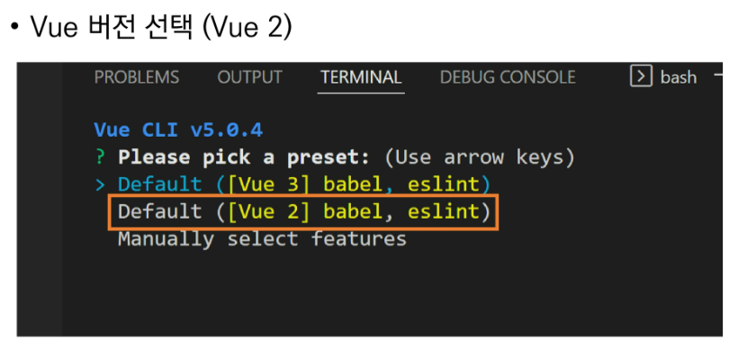

    프로젝트 생성 성공

    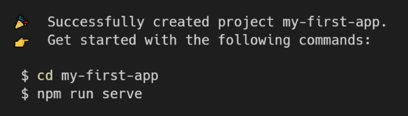

  * 프로젝트 이동 및 서버 실행

    ```shell
    $ cd my-first-app
    $ npm run serve
    ```

  * 서버 실행시 기본 화면

    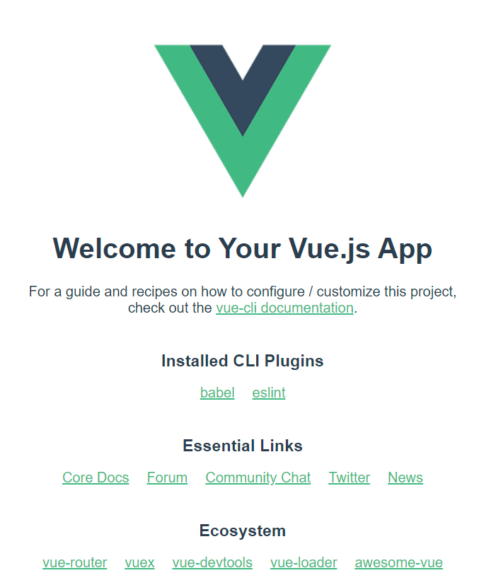


### Babel & Webpack

##### Babel

* JS 컴파일러

* JS 코드를 이전 버전으로 번역/변환해주는 도구

* 최신 문법을 사용해도 이전 브라우저 혹은 환경에서 동작하지 않는 상황을 막아줌

  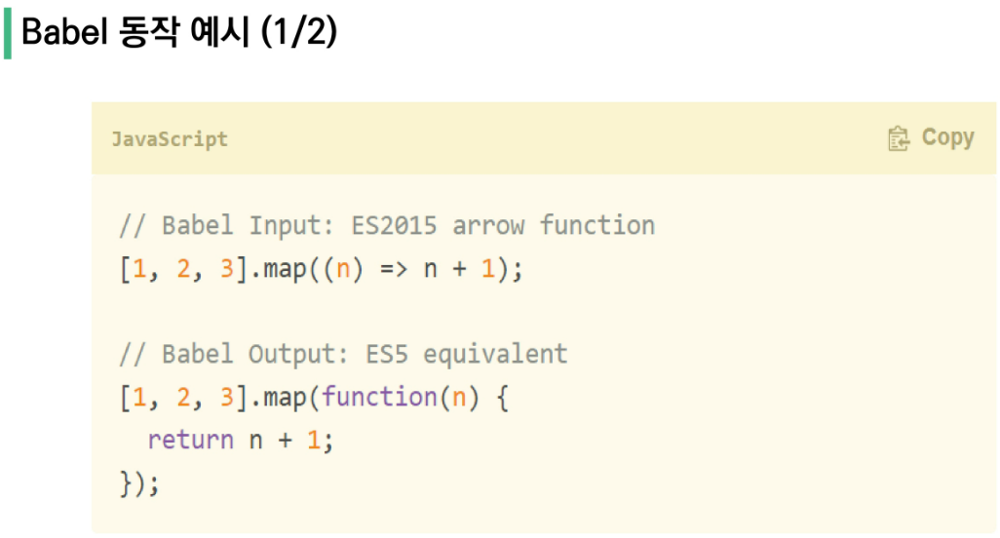


**Webpack**

* static module bundler
  * 모듈은 단지 파일 하나를 의미(ex-js파일 하나 === 모듈 하나)
  * JS와 애플리케이션이 복잡해지고 커지자 기존 개발 방식의 한계가 드러남(너무 깊은 의존성)
  * 이를 해결하기 위해 등장
  * 여러 모듈 중 **ESM**을 표준으로 사용
  * 여러 모듈을 하나로 묶어주고 파일은 하나 혹은 여러개로 합쳐짐
* 모듈간 의존성 문제를 해결하기 위한 도구
* 프로젝트에 필요한 모든 모듈을 매핑하고 내부적으로 종속성 그래프를 빌드함
* **Vue CLI는 Babel, Webpack에 대한 초기 설정이 자동으로 되어 있다!**

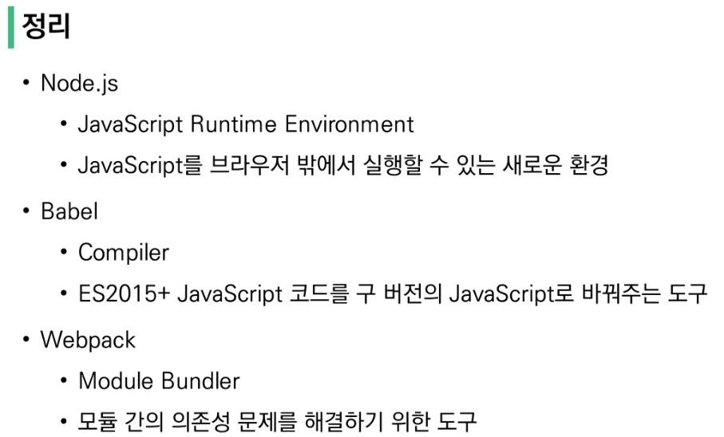


#### Vue 구조

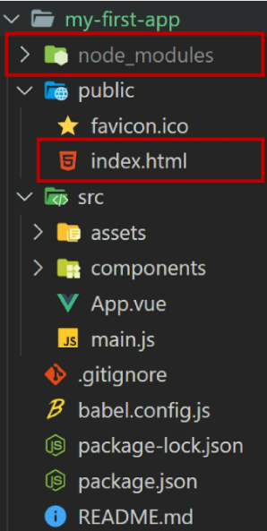


+ `node_modules`
  + node.js 환경의 여러 의존성 모듈 like venv
+ `public/index.html`
  + vue 앱의 뼈대가 되는 파일
  + 실제 제공되는 단일 html 파일

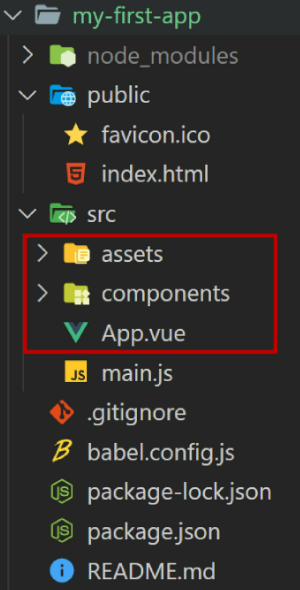

* `src/assets`
  * webpack에 의해 빌드 된 정적 파일
* ` src/components`
  * 하위 컴포넌트들이 위치
* `src/App.vue`
  * 최상위 컴포넌트
* `src/main.js`
  * webpack이 빌드를 시작할 때 가장 먼저 불러오는 entry point
  * 실제 단일 파일에서 DOM과 data를 연결했던 것과 동일한 작업이 이루어지는 곳
  * Vue 전역에서 활용할 모듈을 등록할 수 있는 파일

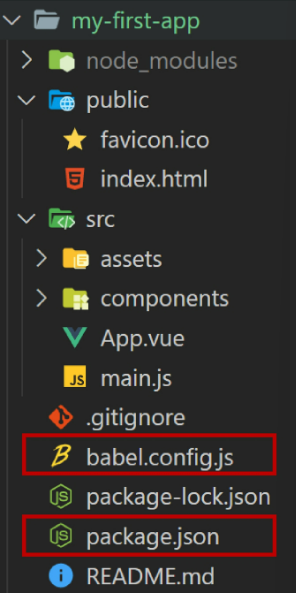

* `babel.config.js`

  * babel 관련 설정이 작성된 파일

* `package.json`

  * 프로젝트의 종속성 목록과 지원되는 브라우저에 대한 구성 옵션이 포함

* `pakage-lock.json`

  * node_modules에 설치되는 모듈과 관련된 모든 의존성을 설정 및 관리
  * 팀원 및 배포 환경에서 정확히 동일한 종속성을 설치하도록 보장하는 표현
  * 사용할 패키지의 버전을 고정
  * 개발 과정 간의 의존성 패키지 충돌 방지
  * like requirment.txt

  

#### Pass Props & Emit Events

부모는 자식에게 데이터를 전달(Pass props)하며, 

자식은 부모에게 알림(Elmit event)

* 부모와 자식이 명확하게 정의된 인터페이스를 통해 격리된 상태를 유지 가능
* props는 아래로, events는 위로

**컴포넌트 구조**

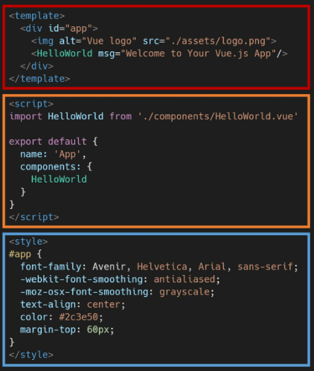

위에서부터

1. 템플릿 (HTML)
2. 스크립트 (JS)
3. 스타일 (CSS)


**vue 파일 만들기**

```
빈 템플릿에 vue 입력
다음과 같이 생성됨
```

```html
<template>
  
</template>

<script>
export default {

}
</script>

<style>

</style>
```


**컴포넌트 등록 3단계**

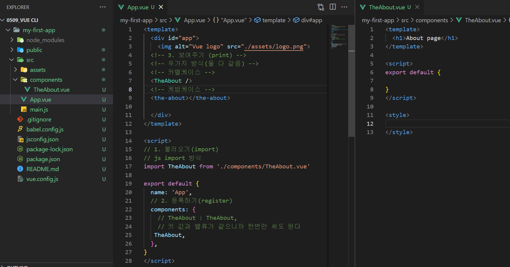


TheAbout(자식)

```vue
<template>
  <h1>About page</h1>
</template>

<script>
export default {

}
</script>

<style>

</style>
```

components/App.vue(부모)

```vue
<template>
  <div id="app">
    
  <!-- 3. 보여주기 (print) -->
  <!-- 두가지 방식(둘 다 같음) -->
  <!-- 카멜케이스 -->
  <TheAbout />
  <!-- 케밥케이스 -->
  <the-about></the-about>

  </div>
</template>

<script>
// 1. 불러오기(import)
// js import 방식
import TheAbout from './components/TheAbout.vue'

export default {
  name: 'App',
  // 2. 등록하기(register)
  components: {
    // TheAbout : TheAbout,
    // 키 값과 밸류가 같으니까 한번만 써도 된다
   TheAbout,
  },
}
</script>

<style>
#app {
  font-family: Avenir, Helvetica, Arial, sans-serif;
  -webkit-font-smoothing: antialiased;
  -moz-osx-font-smoothing: grayscale;
  text-align: center;
  color: #2c3e50;
  margin-top: 60px;
}
</style>

```


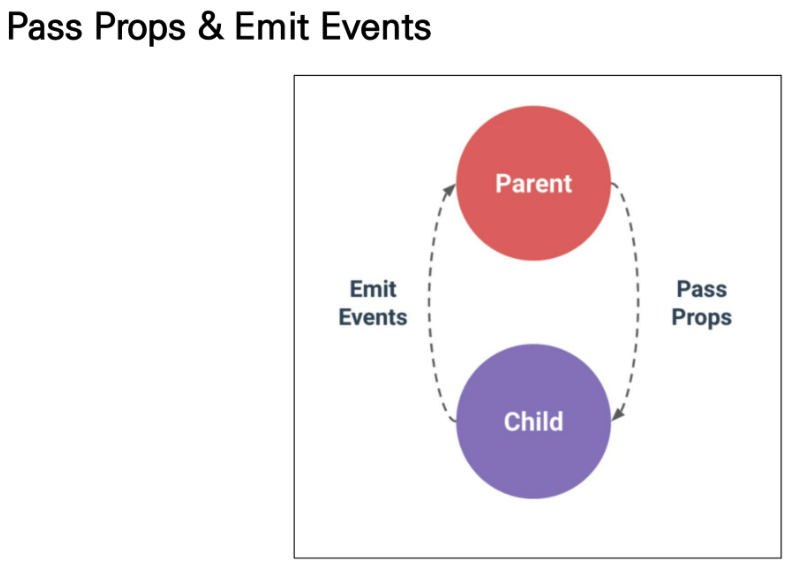


**Static Props작성** (부모가 자식에게 데이터 전달)

components/TheAbout.vue(자식)

```vue
<template>
<!-- template 안에는 반드시 하나의 Element만 있어야한다. -->
<!-- div 하나의 element 안에 여러개 있어도 상관없다. -->
<div>
<!-- 부모로부터 넘어온 데이터 사용 -->
  <h1>{{ myMessage }}</h1>
  <p>div 없었으면 이거 못 썼다</p>
</div>
</template>
<script>
export default {
  name: 'TheAbout',
  // 부모로부터 넘어온 데이터 등록
  props: {
    // 이름이 my-message로 넘어올 경우 연산이 일어난다.
    // 자료형 명시하는게 국룰
    myMessage: String,
  },
}

</script>

<style>

</style>
```

components/App.vue

```vue
<template>
  <div id="app">
    
  <!-- 부모자식 간에 정보전달은 key, value로 진행
  여기선 my-message -->
  <TheAbout my-message="CamelCase"/>
  <the-about my-message="kebab-case"></the-about>

  </div>
</template>

...

```


#### vue에서 data는 객체가 아니라 함수로 만들어야함

만든 함수가 return 하는 게 우리가 쓰던 data

* [주의] `:` bind 걸어주는 것 잊지 말기

components/TheAbout.vue(자식)

```vue
<template>
<div>
  <h1>{{ myMessage }}</h1>
  <p>div 없었으면 이거 못 썼다</p>
</div>
</template>
<script>
export default {
  name: 'TheAbout',
  props: {
    myMessage: String,
  },
  // 이렇게 함수 형식으로 만들어주어야한다.
  // 그렇지 않을 경우 여러 app이 동일한 data를 참조하게 될 경우가 있기 때문
  data: function() {
    return {
      arr: []
    }
  }
}

</script>

<style>

</style>
```

components/App.vue

```vue
<template>
  <div id="app">
    
  <!-- 아래 script에서 만든 data를 변수처럼 사용하려면 -->
  <!-- bind까지 걸어주어야한다. -->
  <TheAbout :my-message="parentData"/>
  <the-about my-message="kebab-case"></the-about>

  </div>
</template>

<script>
import TheAbout from './components/TheAbout.vue'

export default {
  name: 'App',
  components: {
   TheAbout,
  },
// vue에서 data는 객체가 아니라 함수로 만들어야함
// 만든 함수가 return 하는 게 우리가 쓰던 data
  data: function () {
    return {
      parentData: 'This is parent data to child component'
    }
  }
}
</script>

...


```


#### 단방향 데이터 흐름

* 모든 props는 하위 속성과 상위 속성 사이의 단방향 바인딩 형성
* 부모 속성이 변경되면 자식 속성에게 전달되지만, 반대로는 안됨
  * 자식 요소가 의도치 않게 부모 요소의 상태를 변경하여 앱의 데이터 흐름을 이해하기 어렵게 만드는 일을 방지
* 부모 컴포넌트가 업데이트 될 때마다 자식 요소의 모든 prop들이 최신값으로 업데이트 됨


#### Emit event

`$emit(eventName)`

* 현재 인스턴스에서 이벤트를 트리거
* 추가 인자는 리스너의 콜백 함수로 전달

components/TheAbout.vue(자식)

```vue
<template>
<div>
  <h1>{{ myMessage }}</h1>
  <p>div 없었으면 이거 못 썼다</p>
  <input 
    type="text"
    v-model="childInputData"
    @keyup.enter="childInputEnter"
    >
</div>
</template>
<script>
export default {
  name: 'TheAbout',
    
  props: {
    myMessage: String,
  },
    
  data: function() {
    return {
      childInputData:''
    }
  },
    
  methods: {
    childInputEnter: function (){
      console.log('Enter!', this.childInputData)
      // 부모 컴포넌트에게 child-input-change라는 이름의 이벤트를 발생시킨 것
      // 두번째 인자로 전달하고자 하는 데이터 전달
      // kebab-case 권장
      this.$emit('child-input-change', this.childInputData)
    }
  },
}

</script>

<style>

</style>
```

components/App.vue(부모)

```vue
<template>
  <div id="app">
    
  <!-- 아래 script에서 만든 data를 변수처럼 사용하려면 -->
  <!-- bind까지 걸어주어야한다. -->
  <!-- 자식 컴포넌트에서 전달한 이벤트를 듣고 @ 다음 함수를 실행하겠다. -->
  <TheAbout 
    :my-message="parentData" 
    @child-input-change="parentGetChange"/>

  </div>
</template>

<script>
import TheAbout from './components/TheAbout.vue'

export default {
  name: 'App',

  components: {

   TheAbout,
  },

  data: function () {
    return {
      parentData: 'This is parent data to child component'
    }
  },

  // 사용할 함수 정의, 여기선 자식 컴포넌트에서 넘어온 이벤트에 따른 함수를 정의했다.
  // 자식 컴포넌트에서 두번째 인자로 전달된 데이터가 inputData로 자동으로 넘어오게 된다.
  methods: {
    parentGetChange: function(inputData){
      console.log('아빠 안잔다.', inputData)
    }
  }
}
</script>

<style>
#app {
  font-family: Avenir, Helvetica, Arial, sans-serif;
  -webkit-font-smoothing: antialiased;
  -moz-osx-font-smoothing: grayscale;
  text-align: center;
  color: #2c3e50;
  margin-top: 60px;
}
</style>

```


---

## Vue Router

vue.js 공식 라우터

url을 통한 하이퍼링크 이동이 아니라 그런척 하는거다

컴포넌트와 주소를 매핑하는 형식


**실습**

```shell
$ vue create my-router-app
$ cd my-router-app
$ vue add router
commit 여부(YES)
History 여부(YES)
```

```javascript
// main.js
// router 관련된 친구들이 추가됨

import Vue from 'vue'
import App from './App.vue'
import router from './router'

Vue.config.productionTip = false

new Vue({
  router,
  render: h => h(App)
}).$mount('#app')

```

```vue
// App.vue

<template>
  <div id="app">
    <nav>
      <router-link to="/">Home</router-link> |
      <router-link to="/about">About</router-link>
    </nav>
    <router-view/>
  </div>
</template>

<style>
#app {
  font-family: Avenir, Helvetica, Arial, sans-serif;
  -webkit-font-smoothing: antialiased;
  -moz-osx-font-smoothing: grayscale;
  text-align: center;
  color: #2c3e50;
}

nav {
  padding: 30px;
}

nav a {
  font-weight: bold;
  color: #2c3e50;
}

nav a.router-link-exact-active {
  color: #42b983;
}
</style>

```

```javascript
// router/index.js

import Vue from 'vue'
import VueRouter from 'vue-router'
import HomeView from '../views/HomeView.vue'

Vue.use(VueRouter)

const routes = [
    // 다음과 같이 경로 형식이 생성됨
  {
    path: '/',
    name: 'home',
    component: HomeView
  },
  {
    path: '/about',
    name: 'about',
    // route level code-splitting
    // this generates a separate chunk (about.[hash].js) for this route
    // which is lazy-loaded when the route is visited.
    component: () => import(/* webpackChunkName: "about" */ '../views/AboutView.vue')
  }
]

const router = new VueRouter({
  mode: 'history',
  base: process.env.BASE_URL,
  routes
})

export default router

```


#### router-link


#### router-view


#### [참고]History mode


#### 1. Named Routes

```
```


#### 2. 프로그래밍 방식 네비게이션


#### 3. Dynamic Route Matching(동적인자전달)


