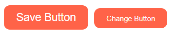
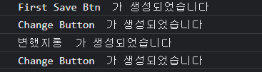
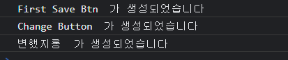
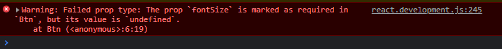

### React Props 

```javascript
<!DOCTYPE html>
<html lang="en">
  <body>
    <div id="root"></div>
  </body>
  <script src="https://unpkg.com/react@17.0.2/umd/react.production.min.js"></script>
  <script src="https://unpkg.com/react-dom@17.0.2/umd/react-dom.production.min.js"></script>
  <script src="https://unpkg.com/@babel/standalone/babel.min.js"></script>
  <script type="text/babel">
    const root = document.getElementById("root");
    function App() {
      // props 전달법
      // Btn 컴포넌트는 아래와 같은 style을 가진 btn을 생성하는 컴포넌트이다.
      // 기본적으로 props를 인자로 받게 되며, 딕셔너리 형태로 이루어져 여러 인자를 받아 사용가능하다

      /* props 전달 기본 사용법
          function Btn(props) {
            return (
              <button
                style={{
                  backgroundColor: "tomato",
                  color: "white",
                  padding: "10px 20px",
                  margin: "5px",
                  border: "0",
                  borderRadius: "10px",
                }}
              >
                {props.text}
              </button>
            );
          }
    */
      // props 전달 축약 사용법 => props 대신 {인자}로 사용
      function Btn({ text, big }) {
        return (
          <button
            style={{
              backgroundColor: "tomato",
              color: "white",
              padding: "10px 20px",
              margin: "5px",
              border: "0",
              borderRadius: "10px",
              fontSize: big ? 18 : 12,
            }}
          >
            {text}
          </button>
        );
      }
      // <Btn banana="메롱" super={true} />
      // <Btn banana="메롱" />와 같이 작성할 경우
      // props에
      // {"banana":"메롱", "super":true}
      // {"banana":"메롱", "super":undefined} 로 전달된다.
      return (
        <div>
          <Btn text="Save Button" big={true} />
          <Btn text="Change Button" />
        </div>
      );
    }
    ReactDOM.render(<App />, root);
  </script>
</html>

```

#### Result




#### Props function

컴포넌트는 직접 이벤트 리스너를 적용할 수 없다

이름은 똑같이 생겼더라도, props로 전달될 뿐 추가 작업을 해줘야 function을 적용 시켜줄 수 있다

```javascript
<!DOCTYPE html>
<html lang="en">
  <body>
    <div id="root"></div>
  </body>
  <script src="https://unpkg.com/react@17.0.2/umd/react.production.min.js"></script>
  <script src="https://unpkg.com/react-dom@17.0.2/umd/react-dom.production.min.js"></script>
  <script src="https://unpkg.com/@babel/standalone/babel.min.js"></script>
  <script type="text/babel">
    const root = document.getElementById("root");
    function Btn({ text, big, onClick }) {
      console.log(text, " 가 생성되었습니다");
      return (
        <button
          onClick={onClick}
          style={{
            backgroundColor: "tomato",
            color: "white",
            padding: "10px 20px",
            margin: "5px",
            border: "0",
            borderRadius: "10px",
            fontSize: big ? 18 : 12,
          }}
        >
          {text}
        </button>
      );
    }
    function App() {
      const [value, setValue] = React.useState("First Save Btn");
      function changeValue() {
        setValue("변했지롱");
      }
      return (
        <div>
          <Btn text={value} big={true} onClick={changeValue} />
          <Btn text="Change Button" />
        </div>
      );
    }
    ReactDOM.render(<App />, root);
  </script>
</html>

```


##### 과정 해설
`<Btn text={value} big={true} onClick={changeValue} />`:

Btn은 컴포넌트이기 때문에, onClick은 이벤트리스너가 아닌 props로 전달된다.

즉 `props={"onClick":"changeValue"}`의 형태로 props가 전달 될 뿐이다.

`function Btn({ text, big, onClick })`을 통해 전달 받은 onClick을 

`<button onClick={onClick}`> 과 같이 button의 이벤트리스너 onClick에 전달되어 function이 실행되는 과정이다.


#### Memo



위의 코드로 실행하게 되면, Btn의 state가 변경되게 되면서 

모든 btn 요소[변했지롱 버튼, Change Btn]가 re-rendering 되게 된다. 연결된 컴포넌트가 적다면 문제가 없지만, 

많다면 re-rendering에만 많은 시간을 소요할 수 있다.


##### `React.memo()` : 

+ state가 변한 값만 렌더링 되도록 최적화를 지원하는 react 기능
+ memo 컴포넌트 생성 후 기존 컴포넌트 대신 렌더링 되게 만들어주면 된다

```javascript
<!DOCTYPE html>
<html lang="en">
  <body>
    <div id="root"></div>
  </body>
  <script src="https://unpkg.com/react@17.0.2/umd/react.production.min.js"></script>
  <script src="https://unpkg.com/react-dom@17.0.2/umd/react-dom.production.min.js"></script>
  <script src="https://unpkg.com/@babel/standalone/babel.min.js"></script>
  <script type="text/babel">
    const root = document.getElementById("root");
    function Btn({ text, big, onClick }) {
          ...
    }
    
      // MemorizeBtn 컴포넌트 생성 후 Btn 컴포넌트 대신 적용시켜줌
    const MemorizeBtn = React.memo(Btn);
    function App() {
      const [value, setValue] = React.useState("First Save Btn");
      function changeValue() {
        setValue("변했지롱");
      }
      return (
        <div>
          <MemorizeBtn text={value} big={true} onClick={changeValue} />
          <MemorizeBtn text="Change Button" />
        </div>
      );
    }
    ReactDOM.render(<App />, root);
  </script>
</html>

```



#### PropTypes

1. 리액트는 파라미터를 잘 못 넘겨도 확인할 수 없는 문제점이 존재

2. 이런 문제를 줄이기 위해서 PropTypes라는 모듈의 도움을 받을 수 있다.

3. type과 다르게 입력 되엇을 경우 warning을 뜨 할수 있고, parameter 에 값을 넣지 않는 경우 경고 메시지를 띄울수 있다.

`https://unpkg.com/prop-types@15.7.2/prop-types.js` - script에 추가해주기

```javascript
<!DOCTYPE html>
<html lang="en">
  <body>
    <div id="root"></div>
  </body>
  <script src="https://unpkg.com/react@17.0.2/umd/react.development.js"></script>
  <script src="https://unpkg.com/react-dom@17.0.2/umd/react-dom.production.min.js"></script>
  <script src="https://unpkg.com/prop-types@15.7.2/prop-types.js"></script>
  <script src="https://unpkg.com/@babel/standalone/babel.min.js"></script>
  <script type="text/babel">
    const root = document.getElementById("root");
    function Btn({ text, big, fontSize = 16 }) {
      // fontSize가 지정되지 않을 경우 기본값 16
      return (
        <button
          style={{
            backgroundColor: "tomato",
            color: "white",
            padding: "10px 20px",
            margin: "5px",
            border: "0",
            borderRadius: "10px",
            // fontSize: big ? 18 : 12,
            fontSize,
          }}
        >
          {text}
        </button>
      );
    }
    Btn.propTypes = {
      text: PropTypes.string, // text는 string 형태라는 것
      fontSize: PropTypes.number.isRequired, // fontSize는 필수라는 것
    };
    function App() {
      return (
        <div>
          <Btn text="Save Button" big={true} fontSize={18} />
          <Btn text="Change Button" />
        </div>
      );
    }
    ReactDOM.render(<App />, root);
  </script>
</html>

```




다음과 같이 에러가 뜨게 된다!
