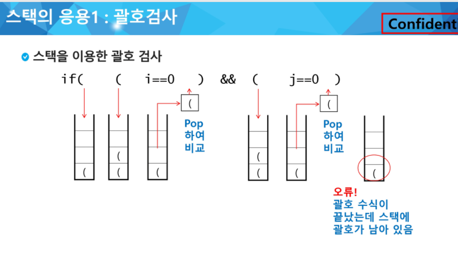
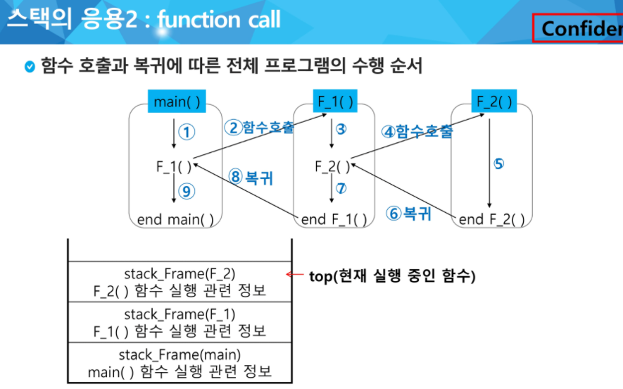
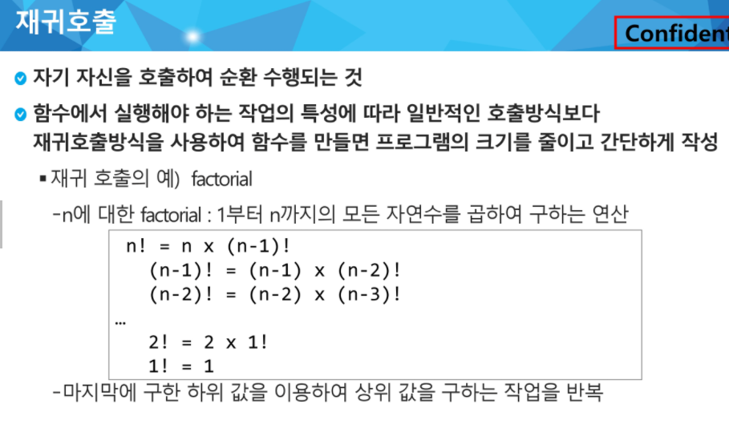
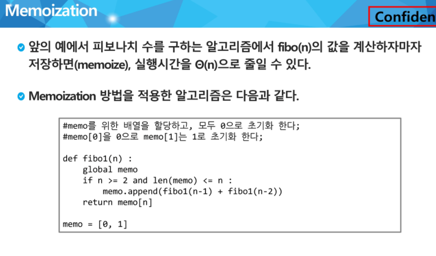

### 자료구조 (Data Structure)

: 데이터 구조를 전체적으로 파악해서 효율적으로 사용 가능

---

#### 데이터

: 경험이나 관찰로부터 얻어진 조직화된 정보의 모음

: 프로그램 코드가 아닌 모든 것

---

#### 스토리지

: 데이터가영구히 저장되는 곳 

: HDD, SSD, USB

: 용량이 크지만 속도가 느림

: 당장 필요한 데이터가 아닌 데이터

---

#### 메모리

: 데이터가 임시적으로 저장되는 곳

: 용량이 작지만 속도가 매우 빠름

: 당장 필요한 데이터가 위치

: 메모리를 효율적으로 사용하자

: 데이터가 저장되는 위치 = Random

: RAM(Random Access memory)

: 각 칸마다 주소값이 지정되어 있다

---

#### 데이터 타입

: 현실 세게의 데이터를 0과 1로 표현해서 메모리에 저장하기 위한 방법

: class를 사용하여 정의

: 선형 자료구조(list, stack, queue, linked list) - 1대 1의 관계 , 비선형 자료구조(graph, tree) - 1대 N의 관계

---

#### 추상 데이터 타입(ADT, Abstarct Data Type)

: 구조화된 데이터를 필요한 연산과 함께 묶어서 표현하는 방법

: 데이터가 가지고 있는 구조, 데이터가 가지고 있는 연산

: 특정 대상이나 사람이나 상황을 추상화 시키는 것

: 1. 개별적인 특징을 지우고

: 2. 데이터 구조의 특징을 도출

: 3 .필요한 연산을 정의

---

### Stack

: 물건을 쌓아 올리듯, 자료를 쌓아 올린 형태의 자료 구조

: 후입선출(Last in First Out) : 가장 마지막에 들어간 것이, 가장 처음에 나온다 

: 배열을 사용할 수 있고, 마지막 삽입된 원소의 위치를 top이라 부른다


#### 연산 

- 삽입 : 저장소에 자료를 저장한다. 보통 push라고 부름
- 삭제 : 저장소에서 자료를 꺼낸다. 꺼낸 자료는 삽입한 자료의 역순으로 꺼낸다. pop 이라고 부름
- isEmpty : 스택이 공백인지 아닌지 확인하는 연산
- peek : 스택의 top에 있는 item을 반환하는 연산


#### 스택의 top 알고리즘

```python
def push(item, size):
	global top
    top += 1
    if top == size:
        print('overflow!')
    else:
        stack[top] = item

size = 10
stack = [0] * size
top = -1
push(10,size)
```

```python
top += 1
stack[top] = 20
# 위와 같다
```


#### 스택의 pop 알고리즘

```python
def pop():
    if len(s) == 0:
        # underflow
        return
    else :
        return s.pop(1)
```

```python
def pop():
    global top
    if top == -1 :
        print('underflow')
        return 0
  	else :
        top -= 1
        return stack[top+1]
print(pop())
```

```python
if top > -1 :
    top -= 1
    print(stack[top+1])
```


#### 스택의 응용1 : 괄호검사



- 문자열에 있는 괄호를 차례대로 조사하면서 왼쪽 괄호를 만나면 스택에 삽입하고, 오른쪽 괄호를 만나면 스택에서 top 괄호를 삭제한 후 오른쪽 괄호와 짝이 맞는지 검사
- 이 때, 스택이 비어 있으면 조건1 or 조건 2 에 위배되고 괄호의 짝이 맞지 않으면 조건 3에 위배된다.
- 마지막 괄호까지 조사한 후에도, 스택에 괄호가 남아있으면 조건 1에 위배


#### 스택의 응용2 : function call

* 프로그래에서의 함수 호출과 복귀에 따른 수행 순서를 관리
* 가장 마지막에 호출된 함수가 가장 먼저 실행을 완료하고 복귀하는 후입선출 구조로, 후입선출 구조의 스택을 이용하여 수행순서 관리
* 함수 호출이 발생하면 호출한 함수수행에 필요한 지역변수, 매개변수 및 수행 후 복귀할 주소 등의 정보를 스택 프레임에 저장하여 시스템 스택에 삽입
* 함수의 실행이 끝나면 시스템 스택의 top원소를 삭제하면서 프레임에 저장되어 있던 복귀 주소를 확인하고 복귀
* 함수 호출과 복귀에 따라 이 과정을 반복하여 전체 프로그램 수행이 종료되면 시스템 스택은 공백 스택이 된다




#### 재귀호출

* 자기 자신을 호출하여 순환수행되는 것
* 함수에서 실행해야하는 작업의 특성에 따라 일반적 호출방식보다 재귀방식을 사용하여 만들면, 프로그램의 크기를 줄이고 간단하게 작성



*  재귀 문제점 = 엄청난 중복호출이 있따


#### Memoization

* 메모이제이션은 컴퓨터 프로그램을 실행할 때, 이전에 계산된 값을 메모리에 저장해서 매번 다시 계산하지 않도록 하여 전체적 속도를 빠르게 하는 기술이다. 동적 계획법의 핵심



```python
def fibo(n):
    if n>=2 and memo[n] == 0:
        memo[n] = fibo(n-1) + fibo(n-2)
    return memo[n]

N = 10
memo = [0]*(N+1)
memo[0] = 0
memo[1] = 1
print(fibo(N))
print(memo)
```


#### DP(Dynamic Programming)

* 동적 계획 알고리즘은 그리디 알고리즘과 같이 최적화 문제를 해결하는 알고리즘이다.
* 동적 계획 알고리즘은 먼저 입력 크기가 작은 부분 문제들을 모두 해결할 후에 그 해들을 이용하여 보다 큰 크기의 부분 문제들을 해결하여, 최종적으로 원래 주어진 입력의 문제를 해결하는 알고리즘이다

```python
N = 10
fibo = [0]*(N+1)
fibo[0] = 0
fibo[1] = 1
for i in range(2, N+1):
    fibo[i] = fibo[i-1] + fibo[i-2]
print(fibo)
```


#### DPS(깊이우선탐색)

* 비선형구조인 그래프 구조는 그래프로 표현된 모든 자료를 빠짐없이 검색하는 것이 중요함
* 두가지 방법
  * 깊이 우선 탐색(DFS)
  * 너비 우선 탐색(BFS)