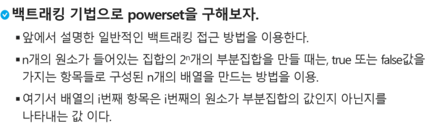

### Stack 2

---

- 비선형구조의 그래프는 모든 자료를 빠짐 없이 검색하는 것이 중요하다
  - DFS(깊이 우선 탐색)
  - BFS(너비 우선 탐색)

---

#### DFS(깊이 우선 탐색)

- 시작 정점의 한 방향으로 갈 수 있는 곳까지 깊이 탐색해, 더 이상 갈 수 없으면 마지막에 만난 갈림길로 돌아와 다른 방향을 탐색, 모든 정점을 방문하는 방법
- 후입선출 구조의 스택을 사용

* 방법

  1)  시작 정점 v를 결정하여 방문

  2)  정점 v에 인접한 정점 중에, 

     ㄱ. 방문하지 않은 정점 w가 있으면, 정점 v를 스택에 push하고 정점 w를 방문한다.

     ​		그리고 w를 v로 하여 다시 반복한다

     ㄴ. 방문하지 않은 정점이 없으면, 탐색 방향 변경을 위해 스택을 pop하여 받은 가장 마지막 방문 정점을 v로   		하여 반복한다.

* practice 3

  

  

---


#### 계산기

* 문자열로 계산식이 주어질 때, 스택을 이용하여 값 계산 가능
* 일반적 방법
  1.  중위 표기법을 후위표기법으로 변경 (중위 표기법 : 연산자를 가운데 넣는 것 ex_ A+B)
  2.  후위 표기법을 스택을 이용하여 계산 (후위 표기법 : 연산자를 뒤에 넣는것 ex_AB+)

* 

*  다음 주소를 참고하세요 제발 수업개똥

[https://velog.io/@jin0106/Python-%ED%9B%84%EC%9C%84%ED%91%9C%EA%B8%B0%EB%B2%95-%EB%B0%8F-%EA%B3%84%EC%82%B0%EB%B2%95](https://velog.io/@jin0106/Python-후위표기법-및-계산법)

---


#### 백트래킹

* 해를 찾는 도중에 '막히면'(즉, 해가 아니라면) 되돌아가서 다시 해를 찾아가는 기법

* 모든 후보를 검사하지 않는다

* 노드의 가능성을 점검 후에 유망하다하고, 아님 가지치기로 날림

* 최적화 문제와 결정 문제를 해결 가능

* 결정 문제 = 문제의 조건을 만족하는 해가 존재하는지 여부를 yes, no로 답하는 문제

  * ex) 결정문제 예제. 미로찾기

    

    

    

    


---

#### 백트래킹과 깊이우선탐색 차이

* 어떤 노드에서 출발하는 경로가 해결책으로 이어질 것 같지 않으면 더 이상 그 경로를 따라가지 않음으로 시도의 횟수를 줄임(Prunning 가지치기)
* 깊이 우선 탐색이 모든 경로를 추적하는데 비해 백트래킹은 불필요한 경로를 조기 차단
* 깊이 우선 탐색을 가하기에는 경우의 수가 너무나 많다. 즉 N! 가지의 경우의 수를 가진 문제에 대해 DFS를 하면 처리불가능 문제
* 백트래킹 적용시 일반적으로 경우의 수가 줄어들지만, 최악의 경우 지수함수 시간을 요하므로 처리 불가능


#### 백트래킹 절차

1. 상태 공간 트리의 깊이 우선 검색을 실시한다

2. 각 노드가 유망한지 점검

3. 만일 그 노드가 유망하지 않으면, 그 노드의 부모 노드로 돌아가 검색을 계속한다

   ex) N-Queens


깊이 우선 탐색 (155노드)  <<<< 백트래킹 (27노드)


ex) 부분집합 구하기



```python
def f(i, N, K):
    global cnt
    cnt += 1
    if i == N:
        s = 0
        for j in range(N):
            if bit[j]:
                s += a[j]
        if s == K:
            for k in range(N):
                if bit[k]:
                    print(a[k], end = ' ')
            print()
    else:
        bit[i] = 1
        f(i+1, N, K)
        bit[i] = 0
        f(i+1, N, K)

cnt = 0
a = [1,2,3,4,5,6,7,8,9,10]
N = len(a)
bit = [0]*N
f(0,N,10)
print(cnt)
```

```python
def f(i, N, s, t):
    global cnt
    cnt += 1
    if s == t:
        for j in range(N):
            if bit[j]:
                print(a[j], end = ' ')
        print()
    elif i == N:
        return
    elif s > t:
        return
    else:
        bit[i] = 1
        f(i+1, N, s + a[i], t)
        bit[i] = 0
        f(i+1, N, s, t)
        

cnt = 0
N = 10
a = [x for x in range(1, N+1)]
bit = [0] * N
t = 10
f(0, N, 0, t)
print(cnt)

```


#### 순열

```python
def f(i,N):
    if i==N:
        print(p)
    else:
        for j in range(i,N):
            p[i],p[j] = p[j],p[i]
            f(i+1,N)
            p[i],p[j] = p[j],p[i]

N = 5
p = [x for x in range(1,N+1)]
f(0,N)
```


---

#### 분할정복


---

#### 퀵정렬

* 주어진 배열을 두 개로 분할하고, 각각 정렬
* 합병 정렬은 그냥 두 부분으로 나누는 반면에, 퀵 정렬은 분할할 때, 기준 아이템을 중심으로 작은것이 왼편, 큰 것은 오른편에 위치시킨다
* 각 부분 정렬이 끝난 후, 합병정렬은 '합병'이란 후처리 작업이 필요하나, 퀵정렬은 필요하지 않는다
* 퀵 정렬의 최악 시간 복잡도는  O(n^2)이다. 합병정렬에 비해 좋지 못하다
* 평균 복잡도는 nlogn이다

```python
def partition(a, begin, end):
    pivot = (begin+end)//2
    L = begin
    R = end
    while L<R :
        while(L<R and a[L]<a[pivot]): 
            L += 1
        while(L<R and a[R]<a[pivot]): 
            R -= 1
        if L < R :
            if L == pivot : pivot = R
            a[L],a[R] = a[R],a[L]
    a[pivot],a[R] = a[R],a[pivot]
	return R

def quickSort(a,begin,end):
    if begin < end:
        p = partition(a,begin,end)
        quickSort(a,begin,p-1)
        quickSort(a,p+1,end)
```

