### Tree 

절대적 개념이 아닌 상대적 개념이다~

비선형 구조

원소들 간에 1:n 관계를 가지는 자료구조

원소들 간에 계층 관계를 가지는 계층형 자료구조

상위 원소에서 하위 원소로 내려가면서 확장되는 트리 모양의 구조

* 한 개 이상의 노드로 이루어진 유한 집합이며 다음 조건을 만족한다.
  * 노드 중 최상위 노드를 루트라고 한다
  * 나머지 노드들은 n개의 분리 집합으로 분리될 수 있다
* 이들 T1,T2..TN은 각각 하나의 트리가 되며(재귀적 정의) 루트의 부 트리라 한다

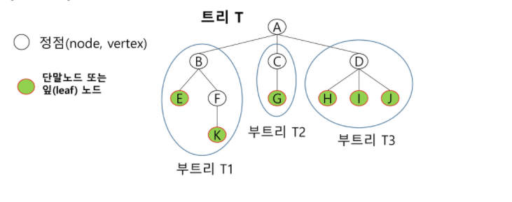

#### 용어

* 노드 - 트리의 원소(A,B,C,D,E,F,G,H,I,J,K)
* 간선 - 노드를 연결하는 선. 부모 노드와 자식 노드 연결
* 루트 노드 - 트리의 시작 노드
  * 트리 T의 루트노드 - A
* 형제 노드 - 같은 부모 노드의 자식 노드들
  * B,C,D는 형제 노드
* 조상 노드 - 간선을 따라 루트 노드까지 이르는 경로에 있는 모든 노드들
  * K의 조상 노드 : F,B,A
* 서브 트리 - 부모 노드와 연결된 간선을 끊었을 때 생성되는 트리
* 자손 노드 - 서브트리에 있는 하위 레벨의 노드들
  * B의 자손 노드 - E,F,K
* 차수 
  * 노드의 차수 : 노드에 연결된 자식 노드의 수
    * B의 차수 = 2, C의 차수 = 1
  * 트리의 차수 : 트리에 있는 노드 차수 중에서 가장 큰 값
    * 트리 T의 차수 = 3
  * 단말노드(리프노드) : 차수가 0인 노드. 자식 노드가 없는 노드

​	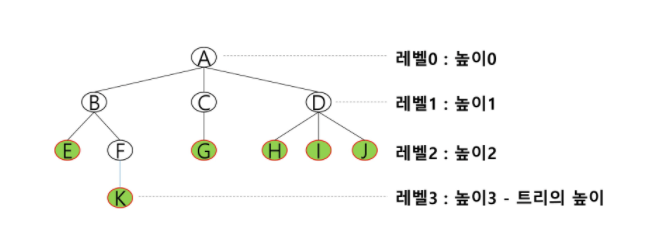

* 높이
  * 노드 높이 : 루트에서 노드에 이르는 간선의 . 노드의 레벨
    * B의 높이 = 1,  F의 높이 = 2
  * 트리의 높이 : 트리에 있는 노드의 높이 중에서 가장 큰 값. 최대 레벨
    * 트리 T의 높이 = 3

---

### 이진트리

모든 노드들이 2개의 서브트리를 갖는 특별한 형태의 트리

각 노드가 자식 노드를 최대 2개까지만 가질 수 있는 트리

* 왼쪽 자식 노드
* 오른쪽 자식 노드

이진 트리의 예

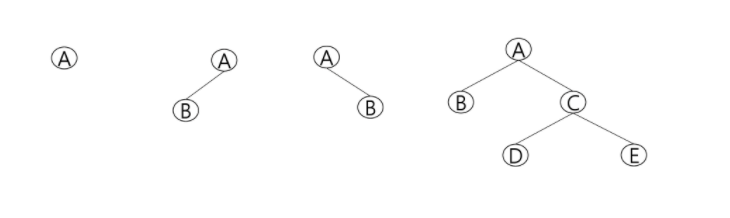

레벨 i에서 노드의 최대 개수는 2^i개

높이가 h인 이진 트리가 가질 수 있는 노드의 최소 개수는 (h+1)개가 되며, 최대 개수는 (2^h+1 - 1)개가 된다.

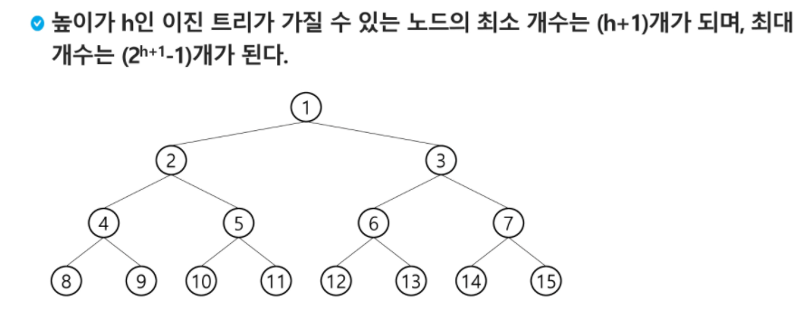


#### 포화 이진 트리

* 모든 레벨에 노드가 포화상태로 차있는 이진 트리
* 높이가 h일 때, 최대 노드 개수인 (2^h+1 - 1)의 노드를 가진 이진 트리
  * 높이가 3일 때 2^3+1 - 1  = 15개의 노드
* 루트를 1번으로 하여 2^h+1 - 1까지 정해진 위치에 대한 노드 번호를 가짐

​	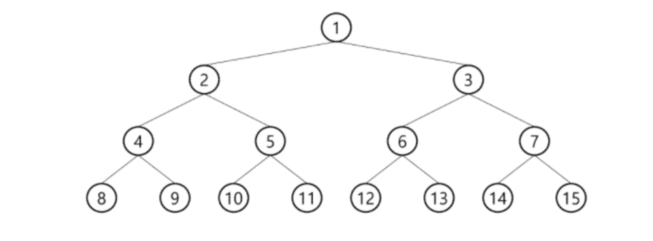


#### 완전 이진 트리

*  높이가 h이고 노드 수가 n개일 때(단 h+1 <= n < 2^h+1 -1), 포화 이진 트리의 노드 번호 1번부터 n번까지 빈 자리가 없는 이진 트리 (중간 번호가 빠지는 게 아니라 큰 번호부터 역순으로 없어야함)

  * 예) 노드가 10개인 완전 이진 트리

  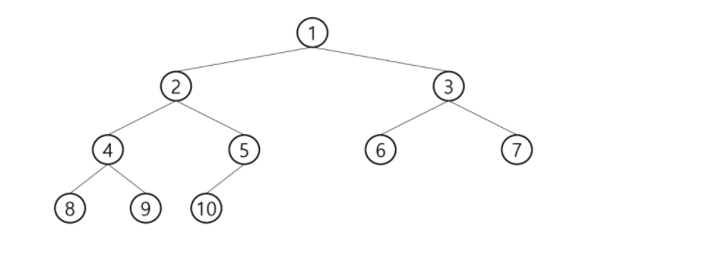


#### 편향 이진 트리

* 높이 h에 대한 최소 개수의 노드를 가지면서 한쪽 방향의 자식 노드만을 가진 이진 트리
  * 왼쪽 편향 이진 트리
  * 오른쪽 편향 이진 트리

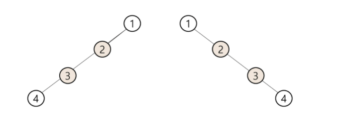


#### 이진트리 - 순회

순회란 트리의 각 노드를 중복되지 않게 전부 방문하는 것을 말하는데, 트리는 비 선형 구조이기 때문에 선형구조에서와 같이 선후 연결 관계를 알 수 없다.

따라서 특별한 방법이 필요하다


##### 순회 

:  트리의 노드들을 체계적으로 방문하는 것

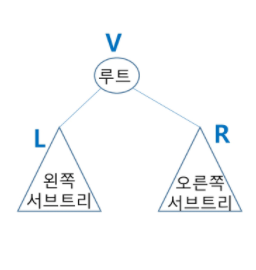

3가지 방법

* 전위 순회(preorder) : VLR
  * 부모 노드 방문 후, 자식노드를 좌,우 순서로 방문한다
* 중위 순회(inorder traversal) : LVR
  * 왼쪽 자식노드, 부모노드, 오른쪽 자식노드 순으로 방문한다
* 후위 순회(postorder traversal) : LRV
  * 자식노드를 좌우 순서로 방문한 후, 부모노드로 방문한다


#### 전위순회

수행방법

* 현재 노드 n을 방문하여 처리한다 -> V
* 현재 노드 n을 왼쪽 서브트리로 이동한다 -> L
* 현재 노드 n을 오른쪽 서브트리로 이동한다 -> R

알고리즘

```
# sudo 코드
def preorder_traverse(T):				# 전위순회
    if T :								# T is not None
        visit(T)						# print(T.item)
        preorder_traverse(T.left)	
        preorder_traverse(T.right)
```

```python

def pre_order(v):
    if v:               # 0번 정점이 없으므로, 0번은 자식이 없는 경우를 표시
        print(v)        #visit(v)
        pre_order(ch1[v])
        pre_order(ch2[v])
```


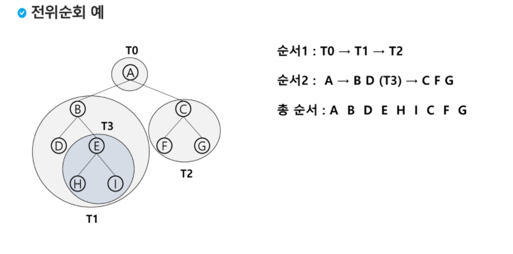


#### 중위 순회

수행방법

* 현재 노드 n의 왼쪽 서브트리로 이동한다 : L
* 현재 노드 n을 방문하여 처리한다 : V
* 현재 노드 n의 오른쪽 서브트리로 이동한다 : R

알고리즘

```
# sudo 코드
def inorder_traverse(T):					# 중위순회
	if T:									# T is not None
        inorder_traverse(T.left)
        visit(T)							# print(T.item)
        inorder_traverse(T.right)
	
```

```python
def in_order(v):
    if v:
        in_order(ch1[v])
        print(v)        #visit(v)
        in_order(ch2[v])
```

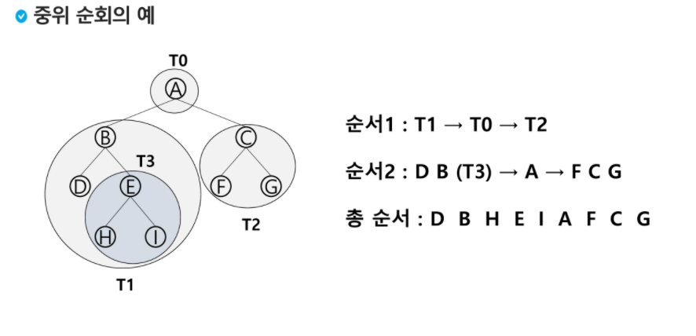


#### 후위 순회

수행방법

* 현재 노드 n의 왼쪽 서브트리로 이동한다 : L
* 현재 노드 n의 오른쪽 서브트리로 이동한다 : R
* 현재 노드 n을 방문하여 처리한다 : V

알고리즘

```
# sudo 코드
def inorder_traverse(T):					# 중위순회
	if T:									# T is not None
        inorder_traverse(T.left)
        inorder_traverse(T.right)
        visit(T)							# print(T.item)
	
```

```python
def post_order(v):
    if v:
        post_order(ch1[v])
        post_order(ch2[v])
        print(v)
```

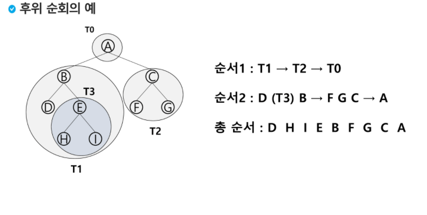


#### 배열을 이용한 이진트리 표현

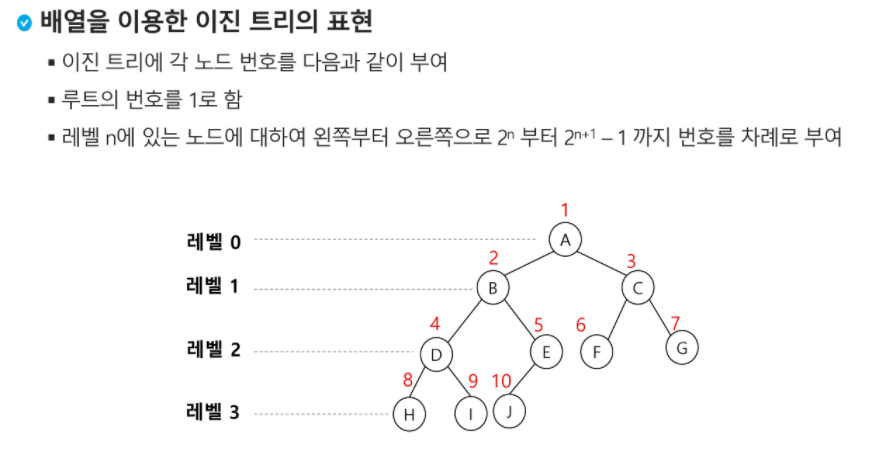

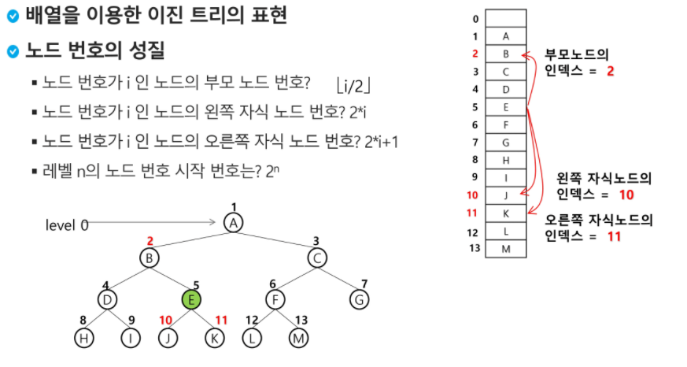

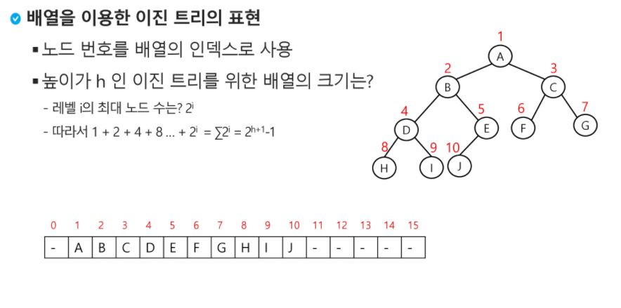

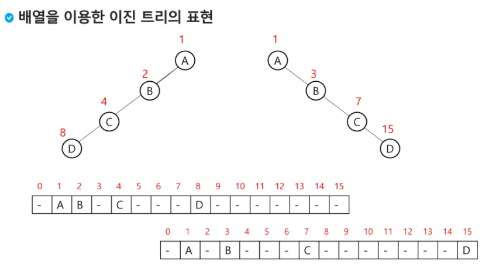


#### 배열을 이용한 이진트리의 저장

간선의 개수 + 1 = 노드 개수

노드 개수 - 1 = 간선의 개수

##### 1. 부모 번호를 인덱스로 자식 번호를 저장

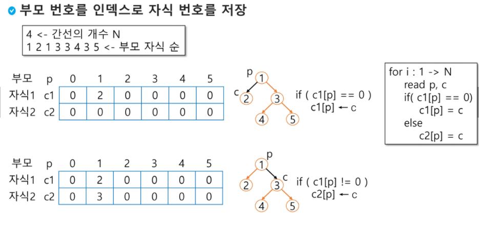

부모 번호를 기준으로 자식 리스트 2개를 만들어 해당 인덱스에 저장하자

```python
# 포화 이진트리
# 4
# 1 2 1 3 3 4 3 5

E = int(input())                   # edge 수
arr = list(map(int, input().split()))
V = E +1                           # 정점 수 == 1번부터 V번까지 정점이 있을 때 마지막 정점

# 부모번호를 인덱스로 자식번호 저장
ch1 = [0]*(V+1)
ch2 = [0]*(V+1)

for i in range(E):
    p, c = arr[i*2], arr[i*2+1]
    if ch1[p] == 0:     # 아직 자식이 없는 경우
        ch1[p] = c
    else:
        ch2[p] = c

print(ch1)
# [0, 2, 0, 4, 0, 0]
print(ch2)
# [0, 3, 0, 5, 0, 0]
```

##### 2. 자식 번호를 기준으로 저장

자식 번호를 기준으로 부모 번호를 저장하자

```python
# 자식 번호를 인덱스로 부모 번호를 저장
# 4
# 2 1 2 4 4 3 4 5
par = [0]*(V+1)
for i in range(E):
    p,c = arr[i*2],arr[i*2+1]
    par[c] = p

print(*par)
# 0 2 0 4 2 4

# root 찾기
root = 0
for i in range(1, V+1):
    if par[i] == 0:
        root = i
        break
print(root)
# 2 

c = 5           # 정점 c의 조상찾기
anc = []
while par[c] != 0:
    anc.append(par[c])
    c = par[c]
print(*anc)
# 4 2

```

##### 3.  배열을 이용한 이진 트리 표현의 단점

편향 이지 ㄴ트리의 경우에 사용하지 않는 배열원소에 대한 메모리 공간 낭비 발생

트리의 중간에 새로운 노드를 삽입하거나 기존 노드를 삭제할 경우 배열의 크기 변경 어려워 비효율적


---

#### 수식 트리

수식을 표현하는 이진 트리

연산자는 루트 노드이거나 가지노드

피연산자는 모두 잎 노드

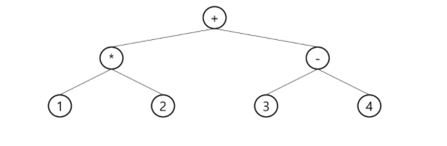


---

#### 이진 탐색 트리

탐색작업을 효율적으로 하기 위한 자료 구조

모든 원소는 서로 다른 유일한 키를 갖는다

key(왼쪽서브트리) < key(루트 노드) < key(오른쪽 서브트리)

왼쪽 서브트리와 오른쪽 서브트리도 이진 탐색 트리이다

중위 순회하면 오름차순으로 정렬된 값을 얻을 수 있다

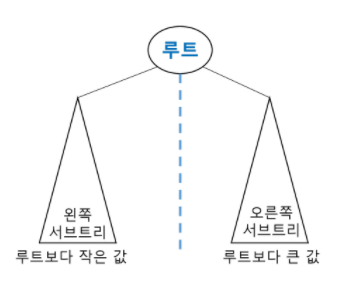

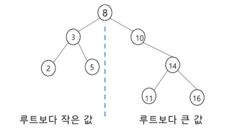

##### 탐색 연산

1. 루트에서 시작
2.  탐색할 키 값 x를 루트 노드의 키 값과 비교
   1. x = 루트노드 키값 : 원하는 원소를 찾았으므로 탐색연산 성공
   2. x < 루트노드 키값 : 루트노드의 왼쪽 서브트리에 대해 탐색연산 수행
   3. x > 루트노드 키값 : 루트노드의 오른쪽 서브트리에 대해 탐색연산 수행
3. 서브트리에 대해 순환적으로 탐색 연산을 반복한다

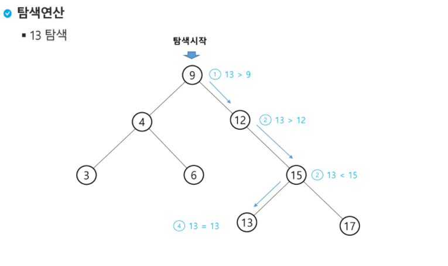


##### 삽입연산

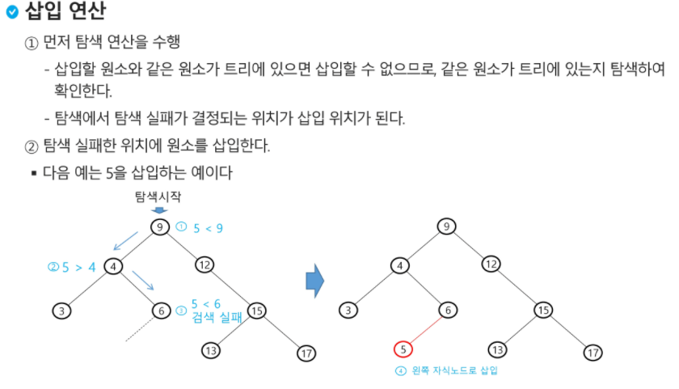


##### 이진 탐색 트리 - 성능

* 탐색, 삽입, 삭제 시간은 트리의 높이만큼 시간이 걸린다.

  * O(h), h : BST의 깊이(height)

* 평균의 경우

  * 이진 트리가 균형적으로 생성되어 있는 경우
  * O(log n)

* 최악의 경우

  * 한쪽으로 치우친 경사 이진트리의 경우
  * O(n)
  * 순차탐색과 시간복잡도가 길다

* 검색 알고리즘의 비교

  


#### 삭제연산

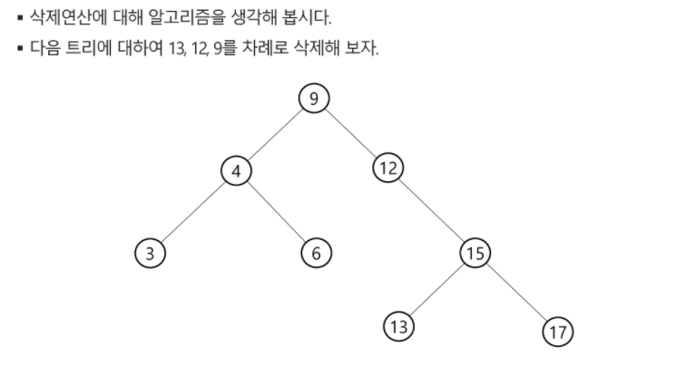


---

### 힙(heap)

\- 완전 이진 트리에 있는 노드 중에서 키 값이 가장 큰 노드나 키 값이 가장 작은 노드를 찾기 위해서 만든 자료구조

\- 최대 힙(max heap) 

* 키값이 가장 큰 노드를 찾기 위한 완전이진트리
* {부모노드의 키값 > 자식노드의 키값}
* 루트노드 : 키값이 가장 큰 노드

\- 최소 힙(min heap)

* 키값이 가장 작은 노드를 찾기 위한 완전 이진 트리
* {부모노드의 키값 < 자식노드의 키값}
* 루트노드 : 키값이 가장 작은 노드


##### 힙 연산 - 삽입

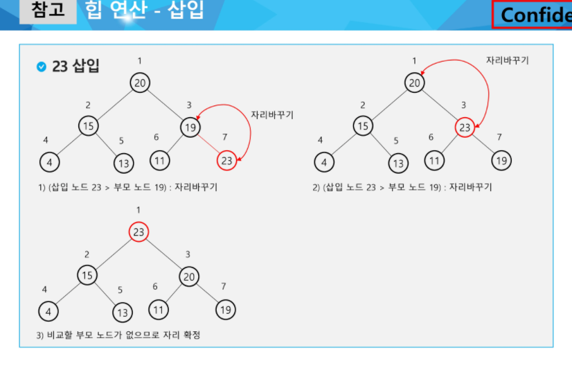

```python
# 최대 100개의 자연수가 키로 입력
# 최대힙

def enq(n):
    global last
    last += 1
    tree[last] = n                      # 완전이진트리 유지
    c = last                            # 새로 추가된 정점을 자식으로
    p = c//2                            # 완전이진트리에서의 부모 정점 번호
    while p>=1 and tree[p] < tree[c]:   # 부모가 있고 자식의 키값이 더 크면 교환
        tree[p], tree[c] = tree[c],tree[p]
        c = p
        p = c //2

# 포화 이진트리의 정점 번호
tree = [0]*(101)
last = 0                                 # 마지막 정점 번호
enq(3)
enq(2)
enq(5)
enq(7)
enq(1)
print(tree[1])
# 7 
```

##### 힙 연산 - 삭제

힙에서는 루트 노드의 원소만을 삭제할 수 있다

루트 노드의 원소를 삭제하여 반환한다

힙의 종류에 따라 최대값 또는 최소값을 구할 수 있다

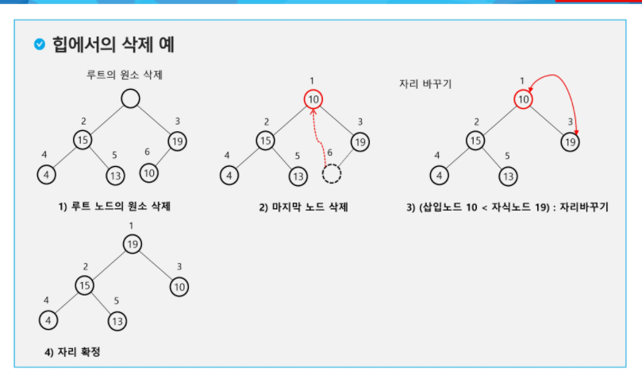

```python
def deq():
    global last
    tmp = tree[1]                       # 루트의 key 값
    tree[1] = tree[last]                # 마지막 정점의 키를 루트에 복사
    last -= 1
    # 부모 > 자식 규칙 유지
    p = 1
    c = p*2                             # 왼쪽 자식 노드 번호
    while c <= last:                    # 왼쪽 자식이 있으면
        if c+1 <= last and tree[c] < tree[c+1]:     # 오른쪽 자식 노드도 있고 더 크면,
            c += 1                          # 오른쪽 자식선택
        if tree[p] < tree[c]:               # 자식 키 값이 더 크면 교환
            tree[p], tree[c] = tree[c],tree[p]
            p = c
            c = p*2
        else:
            break
    return tmp

# 포화 이진트리의 정점 번호
tree = [0]*(101)
last = 0                                 # 마지막 정점 번호
enq(3)
enq(2)
enq(4)
enq(5)
enq(7)
enq(1)
print(tree[1])
enq(9)
print(tree[1])
while last > 0 :
    print(deq(), tree[1])

# 7
# 9
# 9 7
# 7 5
# 5 4
# 4 3
# 3 2
# 2 1
# 1 1
```

