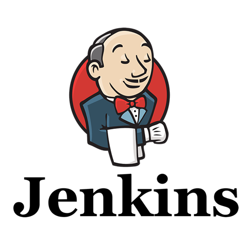
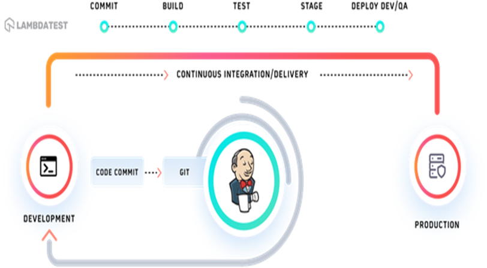
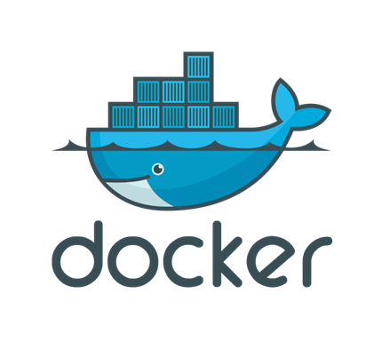
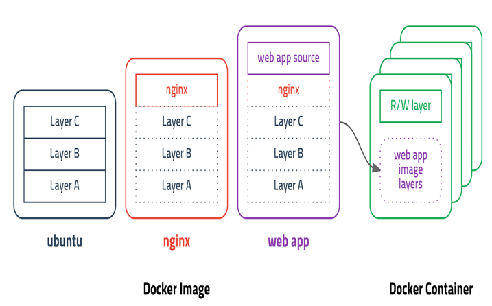
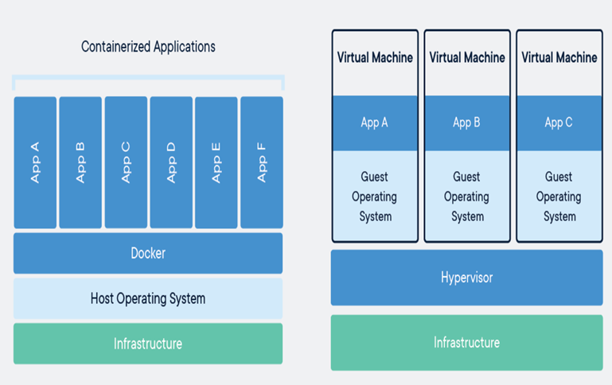
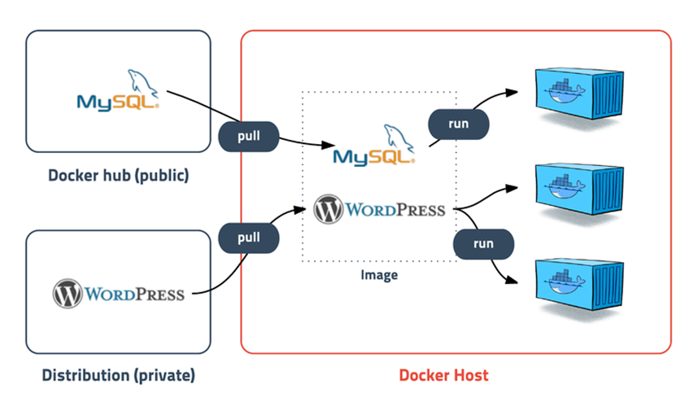

## Jenkins & Docker

### Jenkins



+ 여러 개발자가 작업한 내용을 공유 영역의 저장소(깃헙)에 지속적으로 업로드하여 CI(지속적 통합)이 가능하도록 하는 도구
+ 표준 컴파일 환경에서 컴파일 오류 검출
+ 자동화 테스트 수행 -> 코딩 규약 준수 여부 체크
+ 결함 테스트 환경에 대한 배포 작업을 해줌
+ 애플리케이션 서버로의 배포 간략화 


#### 동작방식



```
1. 로컬에서 개발 후 깃허브로 커밋 후 푸시
2. 젠킨스가 이를 인지하여 빌드 및 테스트 진행
3. 빌드가 성공할 경우 배포 서버로 전송
4. 빌드가 실패할 경우 로그를 남기고 알림
```

---

### Docker



+ 애플리케이션을 신속하게 구축, 테스트 및 배포할 수 있는 소프트웨어 플랫폼
+ 개별 소프트웨어에 독립된 실행환경을 제공함
+ `이미지`를 통해 컨테이너 생성
+ `컨테이너 `단위로 소프트웨어 관리


#### `이미지`



+ 컨테이너 실행에 필요한 파일과 모든 설정값 등을 포함하고 있음

+ 불변하는 값으로, 하나의 이미지로 여러 컨테이너 생성 가능

+ layer 저장방식으로 효율적으로 용량관리가 가능

  ```
  ex) 
  1. ubuntu를 실행하기 위해 layer a,b,c가 필요하여 이미지 다운을 받아놓음
  2. nginx를 실행하기 위해서는 layer a,b,c,nginx가 필요한데, 이전에 ubuntu 실행을 위해 layer a,b,c 를 받아놨기 때문에 nginx만 받으면 nginx에 대한 이미지 다운 완료
  3. 해당 방식으로 이미지를 관리하기 때문에 메모리 관리에서 매우 효율적
  ```

  

#### `컨테이너`



+ 컨테이너는 Docker에서 사용하는 소프트웨어 관리 단위

+ 일종의 소프트웨어 실행에 필요한 모든 것을 포함하는 완전한 파일 시스템 패키징

+ VM에 비해 효율적이고 확장성이 좋다

  ```
  VM의 경우 OS마다 소프트웨어마다 다른 VM을 설정하여 실행시켜주어야하는데,
  Docker의 경우 Docker 위에 개별 소프트웨어 실행을 해주기 때문에, VM을 매번 설정하는 방식보다 효율적이고 확장성이 좋다.
  ```

  

#### 동작방식



+ MySQL과 같은 저장소에서 파일 실행에 필요한 모든 정보를 layer 형태로 구현된 `image` 를 받아옴
+ 받아온 `image`를 통해서 소프트웨어에 맞는 개별환경 `컨테이너`를 만들어 줌
+ 물론 하나의 `image`를 통해 여러개의 컨테이너를 만들 수 있다
