### start

---

#### 1. SW 문제해결

* 프로그래밍하기 위한 제약조건과 요구사항

  * 프로그래밍 언어 특성
  * 동작할 HW와 OS 관련 지식
  * 라이브러리 유의사항들
  * 프로그램 사용가능한 최대 메모리
  * 대응 시간 제한
  * 등등...

* 문제 해결 역량이란?

  * 프로그램을 하기 위한 제약 조건과 요구사항을 이해하고 최선의 방법을 찾아내는 능력
  * 프로그래머가 사용하는 언어나 라이브러리, 자료구조, 알고리즘에 대한 지식을 연결하여 큰 그림을 만드는 능력
  * 문제 해결 역량이란 추상적인 기술로 명확히 정의된 시체가 없다
  * 무작정 알고리즘을 암기하고 문제를 풀어본다고 향상되는 것이 아니다
  * 문제 해결 역량을 향상시키기 위해 훈련이 필요하다

* 문제 해결 능력을 훈련하기 위해서는

  * 새로운 지식만 배우는거로 충분 X
  * 그걸 조합해 나가는 방법을 배워야한다
  * 경험을 통해 나아지리라 막연히 짐작만 하는게 아니라, 상황을 인위적으로 만들어 훈련해야한다

* 문제 해결과정

  1. 문제를 읽고 이해한다
  2. 문제를 익숙한 용어로 재정의
  3. 어떻게 해결할지 계획 세우고
  4. 계획 검증하고
  5. 프로그램으로 구현한다
  6. 어떻게 풀었는지 돌아보고, 개선 방법이 있는지 찾아본다

  

---

#### 2. 복잡도 분석

* 알고리즘 효율
  * 공간적 효율성 : 연산량 대비 얼마나 적은 메모리 공간을 요하는가
  * 시간적 효율성 : 연산량 대비 얼마나 적은 시간을 요하는가
    * 하드웨어 환경에 따라 처리시간이 달라짐
      * 부동 소수 처리 프로세서 존재 유무, 나눗셈, 가속 유무
      * 입출력 장비 성능, 공유 여부
    * 소프트웨어 환경에 따라 처리시간이 달라짐
      * 프로그램 언어 종류
      * 운영체제, 컴파일러 종류
    * 이런 환경적 차이로 분석이 어렵다


* 복잡도의 점근적 표기

  * 다항식으로 이루어져있어, 단순한 함수로 표현하는 것이 점근적 표기법

  * 입력 크기 n이 무한대로 커질 때의 복잡도를 간단히 표기한 것

    * O(Big-Oh) 표기 - 최악의 경우 시간

      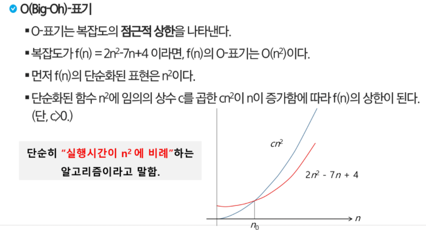

      

    

    * Ω(Big-Omega) 표기 - 최소 시간

      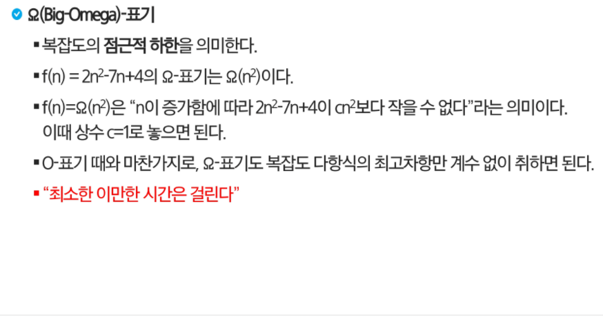

      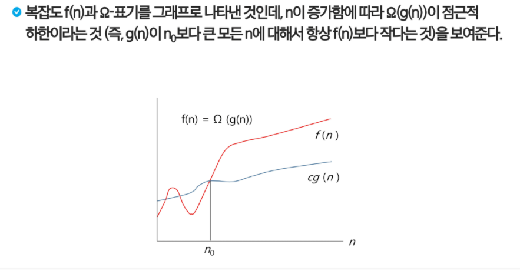

    

    * Θ(Big-Theta) 표기 - 빅오 == 빅 오메가

      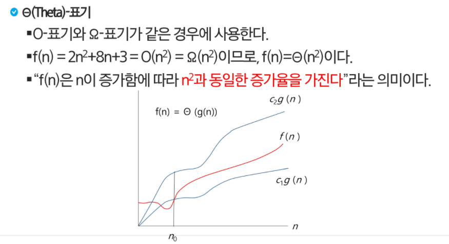


---

#### 3. 표준 입출력 방법

* 입력

  * `input()`: Raw 값 입력 :
  * `eval(input())` : Evaluated된 값 입력

* 출력

  * `print()` : 표준 출력 함수. 출력값의 마지막에 개행 문자 포함
  * `print('text',end='')` : 출력시 마지막에 개행문자 제외할 시
  * `print('%d' % number)` : Formatting된 출력

* 파일 내용을 표준 입력으로 읽어오는 법

  ```python
  import sys
  sys.stdin = open('input.txt','r')
  sys.stdout = open('output.txt','w')
  
  text = input()
  print(text)
  ```


---

#### 4. 비트 연산

| 연산자 |                         연산자 기능                          |
| :----: | :----------------------------------------------------------: |
|   &    |        비트 단위로 AND 연산을 한다<br>ex) num1 & num2        |
|   \|   |        비트 단위로 OR 연산을 한다<br>ex) num1 \| num2        |
|   ^    | 비트단위로 XOR 연산을 한다(같으면 0 다르면 1)<br>ex) num1 ^ num2 |
|   ~    | 단항 연산자로, 피연산자의 모든 비트를 반전시킨다<br>ex) ~num |
|   <<   |   피연산자의 비트 열을 왼쪽으로 이동시킨다<br>ex) num << 2   |
|   >>   |  피연산자의 비트 열을 오른쪽으로 이동시킨다<br>ex) num >> 2  |

* `1 << n`

  * 2**n 의 값을 가지고, 원소가 n개일 경우 모든 부분집합의 수를 의미한다
  * Power set(모든 부분 집합)
    * 공집합과 자기 자신을 포함한 모든 부분집합
    * 각 원소가 포함되거나 포함되지 않는 2가지 경우의 수를 계산하면 모든 부분집합의 수가 된다

* `i&(1<<j)`

  * 계산 결과는 i의 j번째 비트가 1인지 아닌지 의미한다

* ```python
  # 비트 연산 예제
  def Bbit_print(i):
      output = ''
      for j in range(7,-1,-1):
          output += '1' if i & (1 << j) else '0'
          print(output)
          
  for i in range(-5,6):
      print('%3d = ' %i, end='')
      Bbit_print(i)
  ```

  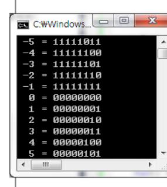

* ```python
  # 비트 연산 예제2
  def Bbit_print(i):
      output = ''
      for j in range(7,-1,-1):
          output += '1' if i & (1 << j) else '0'
          print(output, end='')
  a = 0x10
  x = 0x01020304
  print('%d = ' %a, end='')
  Bbit_print(a)
  print()
  print('0%X = ' %x, end='')
  for i in range(0,4):
      Bbit_print((x >> i*8) & 0xff)
  ```

  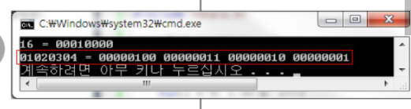

* 엔디안

  * 컴퓨터의 메모리와 같은 1차원의 공간에 여러 개의 연속된 대상을 배열하는 방법을 의미하며, HW  아케텍쳐마다 다르다

  * 주의 : 속도 향상을 위해 바이트 단위와 워드 단위를 변환하여 연산 할 때 올바로 이해하지 않으면 오류를 발생시킬 수 있다.

  * 빅 엔디안(Big-endian) : 보통 큰 단위가 앞에 나옴. 네트워크

  * 리틀 엔디안(little-endian) : 작은 단위가 앞에 나옴. 대다수 데스크탑 컴퓨터

    |    종류     | 0x1234의 표현 | 0x12345678의 표현 |
    | :---------: | :-----------: | :---------------: |
    |  빅 엔디안  |     12 34     |    12 34 56 78    |
    | 리틀 엔디안 |     34 12     |    78 56 34 12    |

* ```python
  # 비트 연산 예제3
  def ce(n) :			#change endian
      p = []
      for i in range(0,4):
          p.append((n>>(24-i*8)) & 0xff)
      return p
  
  x = 0x01020304
  p = []
  for i in range(0,4):
      p.append((x>>(i*8)) & 0xff)
  print('x = %d%d%d%d' % (p[0],p[1],p[2],p[3]))
  p = ce(x)
  print('x = %d%d%d%d' % (p[0],p[1],p[2],p[3]))
  ```

* ```python
  # 비트 연산 예제 4
  def ce1(n):
      return (n << 24 & 0xff000000) | (n << 8 & 0xff0000) | (n >>8 & 0xff00) | (n>>24 & 0xff)
  
  # 아래 결과로 나옴
  n = [[0x01],[0x02],[0x03],[0x04]]
  one = [[0x04],[0000],[0000],[0000]]
  two = [[0000],[0x03],[0000],[0000]]
  tree = [[0000],[0000],[0x02],[0000]]
  four = [[0000],[0000],[0000],[0x01]]
  ```

* ```python
  # 비트 연산 예제5
  # 비트 연산자를 ^ 두 번 연산하면 처음 값을 반환한다.
  def Bbit_print(i):
      output = ''
      for j in range(7,-1,-1):
          output += '1' if i & (1 << j) else '0'
          print(output)
    
  a = 0x86
  key = 0xAA
  
  print('a =>', end='')
  Bbit_print(a)
  # a => 10000110
  print('a^key =>', end='')
  a^=key;
  Bbit_print(a)
  # a^key => 00101100
  print('a^=key =>', end='')
  a^=key;
  Bbit_print(a)
  # a^key => 10000110
  ```


---

#### 5. 진수 

* 진수 변환

  * 원하는 타진법의 수로 나눈 뒤, 나머지를 거꾸로 읽는다

    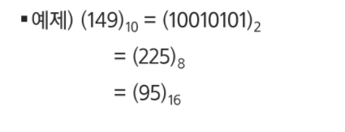

  * 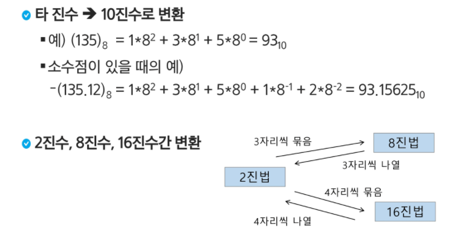

* 컴퓨터에서 음의 정수 표현 방법

  * 1의 보수 : 부호와 절대값으로 표현된 값을 부호 비트를 제외한 나머지 비트들을 0은 1, 1은 0으로 변환
    * ex) -6 : 1 0 0 0 0 0 0 0 0 0 0 0 0 0 1 1 0 : 부호와 절대값 표현
    * ex) -6 : 1 1 1 1 1 1 1 1 1 1 1  1 1 0 0 1 : 1의 보수 표현
  * 2의 보수 : 1의 보수 방법으로 표현된 값의 최하위 비트에 1을 더한다
    * ex) -6 : 1 1 1 1 1 1 1 1 1 1 1  1 1 0 1 0 : 2의 보수 표현
    * 실제로 저장되는 표현

---

#### 6. 실수

*  실수의 표현 : 부동 소수점 표기법을 사용한다.

  * 소수점 위치를 고정시켜 표현하는 방식
  * 소수점 위치를 왼쪽의 가장 유효한 숫자 다음으로 고정시키고 밑수의 지수승으로 표현
  * 

* 실수를 저장하기 위한 형식

  * 단정도 실수(32비트)

  * 배정도 실수(64비트)

    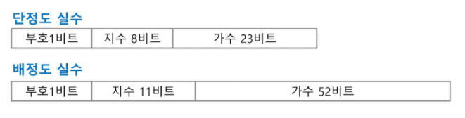

    * 가수부 : 실수의 유효 자릿수들을 부호화된 고정 소수점으로 표현한 것
    * 지수부 : 실제 소수점의 위치를 지수 승으로 표현한 것

  * 단정도 실수의 가수 부분을 만드는 법

    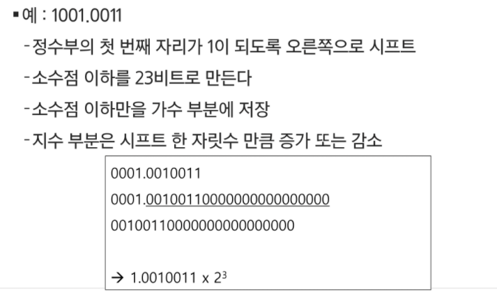

  * 단정도 실수의 지수 부분을 만드는 법

    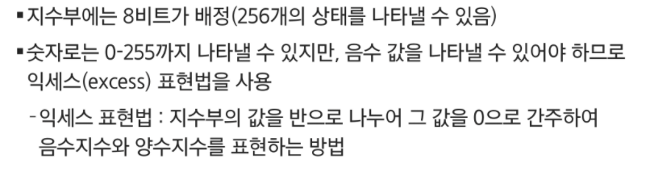

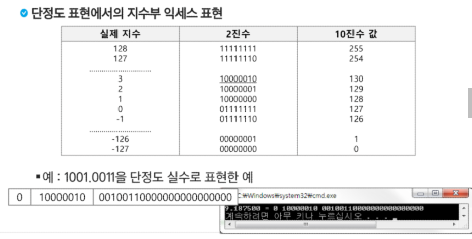