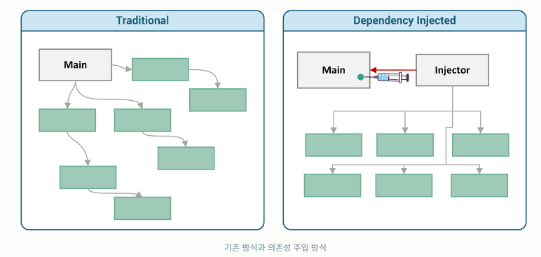
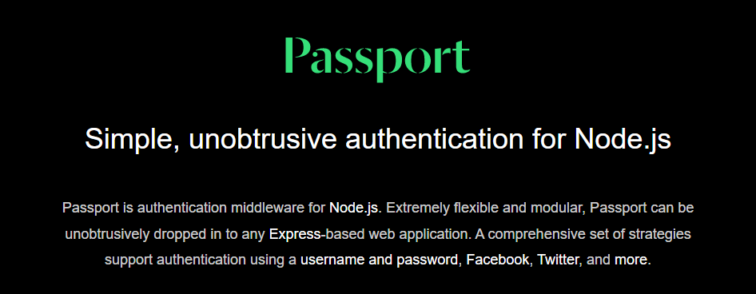
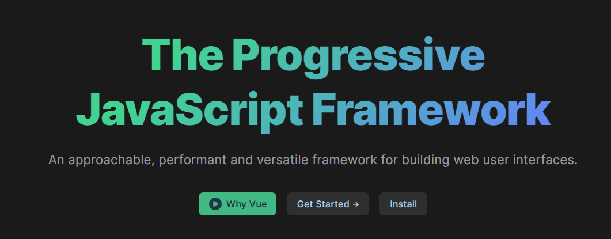

# 디자인 패턴과 프로그래밍 패러다임

## 1.1 디자인 패턴

+ 디자인 패턴이란 프로그램 설계시 발생했던 문제점들을 객체간 상호 관계 등을 이용하여 해결할 수 있도록 하나의 '규약'으로 만들어 놓은 것

### 1.1.1 싱글톤 패턴

+ 하나의 클래스에 오직 하나의 인스턴스만 가지는 패턴(DB 연결 모듈에 많이 사용)

+ 하나의 인스턴스를 만들어 놓고 해당 인스턴스를 다른 모듈이 공유하며 사용

+ 장점 : 인스턴스 생성 비용이 줄어듦

+ 단점 : 의존성이 높아짐

  #### 자바스크립트 싱글톤 패턴

  ```javascript
  // 자바스크립트에서 {} 또는 new Object로 객체를 생성할 경우 다른 어떤 객체와도 같지 않기 때문에 이 자체만으로 싱글톤 패턴 구현이 가능하다
  
  const obj = {
      a : 27
  }
  const obj2 = {
      a : 27
  }
  console.log(obj === obj2)
  // false
  // 이처럼 서로 다른 인스턴스를 가진다
  ```

  ```javascript
  // 실제 예시
  class Singleton {
      constructor(){
          if (!Singleton.instance){
              Singleton.instance = this
          }
          return Singleton.instance
      }
      getInstance(){
          return this.instance
      }
  }
  
  const a = new Singleton()
  const b = new Singleton()
  console.log(a === b) 
  // true
  ```

  #### 데이터베이스 연결 모듈 예시

  ```javascript
  // DB 연결을 하는 것이기 때문에 비용이 더 높은 작업 
  const URL = 'mongodb://localhost:27017/kundolapp' 
  const createConnection = url => ({"url" : url})    
  class DB {
      constructor(url) {
          if (!DB.instance) { 
              DB.instance = createConnection(url)
          }
          return DB.instance
      }
      connect() {
          return this.instance
      }
  }
  const a = new DB(URL)
  const b = new DB(URL) 
  console.log(a === b) // true
  
  // URL 상수에는 연결할 MongoDB 데이터베이스의 URL이 저장되어 있습니다.
  
  // createConnection 함수는 URL을 인자로 받아 해당 URL을 가진 객체를 반환합니다.
  
  // DB 클래스의 생성자는 이전에 클래스의 인스턴스가 있는지 확인하고, 없으면 createConnection 함수를 사용하여 새로운 인스턴스를 만들고 instance라는 정적 변수에 저장합니다. 이미 클래스의 인스턴스가 있는 경우, 해당 인스턴스를 반환합니다.
  
  // DB 클래스의 connect 메소드는 instance 변수를 반환하여 MongoDB 연결 정보를 가져옵니다.
  ```

  #### 싱글톤 패턴의 단점

  + TDD(Test Driven Development) 할 때 걸림돌이 된다.

    + TDD시 단위 테스트를 주로 하는데 단위 테스트는 서로 독립적이어야하며 테스트를 어떤 순서로든 실행할 수 있어야한다. 하지만 싱글톤은 미리 생성된 하나의 인스턴스를 기반으로 구현하기 때문에 '독립적' 인스턴스 만들기가 어렵다

  + 모듈간 결합을 강하게 만든다.

    + **'의존성 주입(DI, Dependency Injection)'**을 통해 해결 가능

    + **'의존성 주입(DI, Dependency Injection) 원칙'**

      + "상위 모듈은 하위 모듈에서 어떠한 것도 가져오지 않아야한다. 또한, 둘 다 추상화에 의존해야하며, 이때 추상화는 세부 사항에 의존하지 말아야 한다"

      

      이처럼 메인 모듈이 '직접' 하위 모듈에 의존성을 주기보다 중간에 의존성 주입자를 넣어 '간접'적으로 의존성을 주입하는 방식. 이를 **'디커플링이 된다'** 라고 표현

      |                       의존성 주입 장점                       |                      의존성 주입 단점                       |
      | :----------------------------------------------------------: | :---------------------------------------------------------: |
      |                     모듈 쉽게 교체 가능                      | 모듈이 더욱더 분리되어 <br />클래스 수가 늘어나 복잡성 증가 |
      |                 테스팅과 마이그레이션 쉬워짐                 |                 약간의 런타임 패널티가 생김                 |
      | 어플리케이션 의존성 방향이 일관되고 <br />모듈간 관계가 조금 더 명확해짐 |                                                             |

      

### 1.1.2 팩토리 패턴

+ 객체 생성 부분을 떼어내 추상화한 패턴, 객체 생성 로직이 분리되어 리팩토링하더라도 한 곳만 고치면 되니 유지 보수성 증가

+ 상속 관계에 있는 두 클래스에서 상위 클래스가 중요 뼈대를 결정하고 하위 클래스에서 객체 생성에 관한 구체적인 내용을 결정하는 패턴

+ 상위 클래스와 하위 클래스로 나뉘어 느슨한 결합을 가지며 상위 클래스는 인스턴스 생성방식에 대해 알 필요가 없어 더욱 유연성을 가짐

  #### 자바스크립트 팩토리 패턴

  ```javascript
  // 간단하게 new Object()로 구현 가능
  const num = new Object(42)
  const str = new Object('abc')
  num.constructor.name; // Number
  str.constructor.name; // String
  
  // 숫자나 문자열을 전달함에 따라 다른 타입의 객체를 생성하는 모습. 즉, 전달받은 값에 따라 다른 객체를 생성하며 인스턴스의 타입을 정한다
  ```

  ```javascript
  // 커피 팩토리가 상위 클래스로 중요 뼈대 결정
  class CoffeeFactory {
      static createCoffee(type) {
          const factory = factoryList[type]
          return factory.createCoffee()
      }
  }   
  class Latte {
      constructor() {
          this.name = "latte"
      }
  }
  class Espresso {
      constructor() {
          this.name = "Espresso"
      }
  } 
  
  // 하위 클래스가 구체적 내용 결정
  class LatteFactory extends CoffeeFactory{
      static createCoffee() {
          return new Latte()
      }
  }
  class EspressoFactory extends CoffeeFactory{
      static createCoffee() {
          return new Espresso()
      }
  }
  const factoryList = { LatteFactory, EspressoFactory } 
   
   
  const main = () => {
      // 라떼 커피를 주문한다.  
      const coffee = CoffeeFactory.createCoffee("LatteFactory")  
      // 커피 이름을 부른다.  
      console.log(coffee.name) // latte
  }
  main()
  
  // CoffeeFactory 클래스는 커피를 생성하는 팩토리를 생성하는 클래스입니다. createCoffee 메소드를 가지고 있으며, 이 메소드는 factoryList 객체에서 주어진 type 인자에 따라 적절한 팩토리를 찾아서 해당 팩토리로부터 커피를 생성하고 반환합니다.
  
  // Latte 클래스와 Espresso 클래스는 각각 라떼와 에스프레소 커피를 나타내는 클래스입니다. 이들 클래스는 CoffeeFactory 클래스를 상속받지 않습니다.
  
  // LatteFactory 클래스와 EspressoFactory 클래스는 각각 라떼와 에스프레소 커피를 생성하는 팩토리 클래스입니다. 이들 클래스는 CoffeeFactory 클래스를 상속받고, createCoffee 메소드를 구현합니다. createCoffee 메소드에서는 각각 Latte 클래스와 Espresso 클래스를 생성하여 반환합니다.
  
  // 마지막으로, factoryList 객체에는 LatteFactory 클래스와 EspressoFactory 클래스가 저장되어 있습니다.
  
  // main 함수에서는 CoffeeFactory.createCoffee 메소드를 사용하여 라떼 커피를 주문하고, 이를 coffee 변수에 저장합니다. console.log 함수를 사용하여 coffee 변수의 name 속성을 출력합니다. 출력 결과는 latte가 됩니다.
  ```

  위 코드는 의존성 주입으로도 볼 수 있다. `CoffeeFactory`에서 `LatteFactory`의 인스턴스를 생성하는게 아니라 `LatteFactory`에서 생성한 인스턴스를 `CoffeeFactory`에 주입하고 있기 때문

  

### 1.1.3 전략 패턴(정책 패턴)

* 객체의 행위를 바꾸고 싶은 경우 '직접' 수정하지 않고 전략이라 부르는 '캡슐화한 알고리즘'을 컨텐스트 안에서 바꿔주면서 상호 교체가 가능하게 만드는 패턴

  #### passport의 전략 패턴[전략 패턴을 활용한 라이브러리]

  

  * passport는 Node.js에서 인증 모듈을 구현할 때 쓰는 미들웨어 라이브러리로, 여러 '전략'을 기반으로 인증할 수 있게 해준다.
  * 서비스 내 회원가입된 아이디와 비밀번호를 기반으로 인증하는 LocalStrategy 전략과 페이스북, 네이버 등 타 서비스 기반으로 인증하는 OAuth 전략 등을 지원한다

  ```javascript
  var passport = require('passport')
      , LocalStrategy = require('passport-local').Strategy;
  
  passport.use(new LocalStrategy(
      function(username, password, done) {
          User.findOne({ username: username }, function (err, user) {
            if (err) { return done(err); }
              if (!user) {
                  return done(null, false, { message: 'Incorrect username.' });
              }
              if (!user.validPassword(password)) {
                  return done(null, false, { message: 'Incorrect password.' });
              }
              return done(null, user);
          });
      }
  ));
  
  // 먼저, passport 모듈과 LocalStrategy를 require 함수를 사용하여 가져옵니다.
  
  // passport.use 함수를 호출하여 LocalStrategy를 등록합니다. 이 함수는 콜백 함수를 인자로 받습니다. 이 콜백 함수는 로컬 인증에 사용되는 로직을 구현합니다.
  
  // 콜백 함수는 username, password, done 매개변수를 받습니다. done 함수는 인증이 성공하거나 실패했을 때 호출되는 함수입니다.
  
  // User.findOne 메소드를 사용하여 username에 해당하는 사용자를 데이터베이스에서 찾습니다. 이 메소드는 콜백 함수를 인자로 받습니다. 콜백 함수는 에러와 사용자 객체를 받습니다.
  
  // findOne 메소드에서 에러가 발생하면 done 함수를 호출하여 해당 에러를 처리합니다.
  
  // 사용자 객체가 존재하지 않는 경우 done 함수를 호출하여 사용자 인증에 실패했음을 알립니다.
  
  // 사용자 객체가 존재하는 경우, user.validPassword(password)를 호출하여 입력된 비밀번호가 맞는지 확인합니다. 만약 비밀번호가 맞지 않는 경우 done 함수를 호출하여 사용자 인증에 실패했음을 알립니다.
  
  // 인증이 성공한 경우 done 함수를 호출하여 null과 사용자 객체를 반환합니다. 이후에 passport.serializeUser 함수를 사용하여 사용자 객체를 세션에 저장합니다.
  ```

  

### 1.1.4 옵저버 패턴

※ [옵저버 패턴 참고 블로그](https://velog.io/@haero_kim/%EC%98%B5%EC%A0%80%EB%B2%84-%ED%8C%A8%ED%84%B4-%EA%B0%9C%EB%85%90-%EB%96%A0%EB%A8%B9%EC%97%AC%EB%93%9C%EB%A6%BD%EB%8B%88%EB%8B%A4)

* 주체가 어떤 객체의 상태가 변하면 메서드 등을 통해 옵저버들에게 변화를 알려주는 디자인 패턴

* 주체 : 객체의 상태 변화를 보고 있는 관찰자 / 옵저버 : 객체의 상태 변화에 따라 전달되는 메서드를 기반으로 '추가 변화 사항'이 생기는 객체

* 옵저버 패턴은 다른 객체의 상태 변화를 감지함에 있어 객체끼리 느슨하게 결합되는 형태이기에 의존성을 제거하고 시스템을 보다 유연하게 해주는 효과가 있다. 

* 또한 상태변화를 감시하는 객체에게 직접 알리는 것이 아니기 때문에 불필요한 코드를 줄이는 효과가 있다

  

  아래 그림처럼 주체와 객체를 합쳐 구축하기도 한다.

  

  ​	

  ※ 트위터는 옵저버 패턴을 활용한 서비스

  

  #### 자바스크립트 옵저버 패턴

  * 자바스크립트에서 옵저버 패턴은 프록시 객체를 통해 구현할 수도 있음

  * **프록시객체란?** [JS 프록시 MDN](https://developer.mozilla.org/ko/docs/Web/JavaScript/Reference/Global_Objects/Proxy)

    * 어떠한 대상의 기본 동작(속성 접근, 할당, 순회, 열거, 함수 호출)을 가로챌 수 있는 객체를 뜻하며, 자바스크립트에서 프록시 객체는 두 개의 매개 변수를 가짐
      * target : 프록시할 대상
      * handler : target 동작을 가로채고 어떠한 동작을 할 것인지 설정되어있는 함수

    ```javascript
    const handler = {
        get : function(target, name) {
            return name === 'name' ? '${target.a} ${target.b}' : target[name]
        }
    }
    const p = new Proxy({a: 'KUNDOL', b:'IS AUMUMU ZANGIN'}, handler)
    console.log(p.name) 
    // KUNDOL IS AUMUMU ZANGIN
    ```

    #### JS의 프록시 객체를 통한 옵저버 패턴 구현
    
    ```javascript
    function createReactiveObject(target, callback) { 
        const proxy = new Proxy(target, {
            set(obj, prop, value){
                if(value !== obj[prop]){
                    const prev = obj[prop]
                    obj[prop] = value 
                    callback(`${prop}가 [${prev}] >> [${value}] 로 변경되었습니다`)
                }
                return true
            }
        })
        return proxy 
    } 
    const a = {
        "형규" : "솔로"
    } 
    const b = createReactiveObject(a, console.log)
    b.형규 = "솔로"
    b.형규 = "커플"
    // 형규가 [솔로] >> [커플] 로 변경되었습니다
    
    // 위 코드는 리액티브한 객체를 생성하는 함수인 createReactiveObject를 정의하고, 이를 이용하여 객체 a에 대한 프록시 객체 b를 생성하는 예시입니다.
    
    // createReactiveObject 함수는 주어진 객체 target에 대한 프록시 객체를 생성합니다. 이 프록시 객체는 set 핸들러를 가지며, 객체의 프로퍼티가 변경될 때마다 콜백 함수 callback이 호출되도록 합니다.
    
    // 예시에서는 객체 a에 대해 createReactiveObject 함수를 호출하여 b를 생성하였습니다. b 객체의 형규 프로퍼티에 값을 할당할 때마다, set 핸들러가 호출되어 값이 변경되었음을 콘솔에 출력합니다.
    ```
  
  #### Vue.js 3.0의 옵저버 패턴
  
  
  
  ```javascript
  function createReactiveObject(
  	target: Target,
      isReadonly: boolean,
      baseHandlers: ProxyHandler<any>,
      collectionHandlers: ProxyHandler<any>,
      proxyMap: WeakMap<Target, any>
  ){
          if (!isObject(target)){
              if (__DEV__){
                  console.warn(`value cannot be made reactive: ${String(target)}`)
              }
              return target
          }
          
          // target is already a Proxy, return it.
          // exception: calling readonly() on a reactive object
          if(
          	target[ReactiveFlags.RAW] &&
              !(isReadonly && target[ReactiveFlags.IS_REACTIVE])
          ){
              return target
          }
          // target already has corresponding Proxy
          const existingProxy = proxyMap.get(target)
          if (existingProxy){
              return existingProxy
          }
          // only a whitelist of value types can be observed.
          const targetType = getTargetType(target)
          if (targetType == TargetType.INVALID){
              return target
          }
          const proxy = new Proxy(
          	target,
          	targetType === TargetType.COLLECTION ? collectionHandelers : baseHandlers
          )
          proxyMap.set(target, proxy)
          return proxy
      }
  
  // 이 함수는 프락시(Proxy)를 사용하여 객체의 상태 변화를 감지합니다. 프락시란 다른 객체에 대한 인터페이스를 제공하면서 그 객체에 대한 접근을 제어하는 객체입니다. 이 함수에서는 타겟 객체(target)와 함께 프락시 객체(proxy)를 생성합니다.
  
  // 함수의 첫 번째 인수는 타겟 객체이고, 두 번째 인수는 읽기 전용 여부(isReadonly)를 나타냅니다. 세 번째와 네 번째 인수는 각각 베이스 핸들러(baseHandlers)와 컬렉션 핸들러(collectionHandlers)입니다. 베이스 핸들러는 객체에 대한 기본적인 프락시 동작을 수행하고, 컬렉션 핸들러는 컬렉션(배열, 맵 등)에 대한 프락시 동작을 수행합니다. 마지막 인수인 프락시 맵(proxyMap)은 타겟 객체와 그에 해당하는 프락시 객체를 저장하는 데 사용됩니다.
  
  // 먼저, 타겟 객체가 객체인지 확인합니다. 그렇지 않으면 함수는 타겟 객체를 그대로 반환합니다. 그리고 타겟 객체가 이미 프락시 객체인 경우에는, 읽기 전용 여부(isReadonly)와 상관없이 프락시 객체를 그대로 반환합니다. 하지만 만약 읽기 전용 여부(isReadonly)가 true인 경우에는, 이미 리액티브인 경우에도 다시 프락시를 만들어 반환합니다.
  
  // 만약 타겟 객체가 리액티브 객체가 아닌 경우, getTargetType 함수를 사용하여 객체의 타입(TargetType)을 확인합니다. 이때 타겟 객체의 타입이 TargetType.INVALID인 경우, 함수는 타겟 객체를 그대로 반환합니다. 하지만 유효한 타겟 객체인 경우, 프락시 객체(proxy)를 생성하여 반환합니다.
  
  // 마지막으로, 생성된 프락시 객체를 프락시 맵(proxyMap)에 저장합니다. 이렇게 하면 같은 타겟 객체에 대해 두 번 이상 리액티브 객체를 만들어도, 항상 같은 프락시 객체를 반환할 수 있습니다.
  ```
  


### 1.1.5 프록시 패턴과 프록시 서버

#### +	프록시 패턴

* 객체에 접근하기 전 그 접근에 대한 흐름을 가로채는 디자인 패턴

* 객체의 속성, 변환 등을 보완하며 보안, 데이터 검증, 캐싱, 로깅에 사용함

  **프록시 서버에서의 개싱**

  + 캐시 안에 정보를 담아두고 같은 정보를 요구하는 요청에 본 서버가 아닌 캐시 안에 있는 데이터를 활용하는 방법
  + 불필요한 외부 연결을 줄여 트래픽을 줄일 수 있음

#### +	프록시 서버

+ 프록시 서버는 서버와 클라이언트 사이에서 클라이언트가 다른 네트워크 서비스에 간접적으로 접속할 수 있게 해주는 시스템

  + ex) **nginx**

    + 비동기 이벤트와 다수 연결을 처리하는 웹 서버로, Node.js 서버 앞단의 프록시 서버로 활용됨

      

  + ex) **CloudFlare**

    + 세계적으로 분산된 서버를 활용하여 콘텐츠 전달을 빠르게 해주는 `CDN 서비스`
    + 웹 서버 앞단에 프록시 서버로 두어 `DDOS 공격 방어` 나 `HTTPS 구축`에 사용
    + 의심스러운 트래픽 판단 후 일정 부분 막아주는 역할도 수행

  + ex) **CORS와 프론트엔드의 프록시 서버**

    + `CORS`란 'Cross-Origin Resource Sharing'으로 서버가 웹 브라우저에서 리소스를 로드할 때 다른 오리진을 통해 로드하지 못하게 하는 HTTP 헤더 기반 메커니즘이다.
    + 프론트엔드에서 127.0.0.1:3000으로 테스팅 할 때 백엔드에서 127.0.0.1:12010이라면 포트 번호가 달라 CORS 에러가 나타난다. 이때 프록시 서버를 둬서 프론트에서 요청되는 오리진을 127.0.0.12010으로 바꿔 줄 수 있다

    

### 1.1.6 이터레이터 패턴

+ 이터레이터(iterator)를 사용하여 컬렉션(collection) 요소들에 접근하는 디자인 패턴

+ 자료형의 구조에 상관없이 이터레이터 하나의 인터페이스로 순환 가능

  ```javascript
  const mp = new Map() 
  mp.set('a', 1)
  mp.set('b', 2)
  mp.set('cccc', 3) 
  const st = new Set() 
  st.add(1)
  st.add(2)
  st.add(3) 
  const a = []
  for(let i = 0; i < 10; i++)a.push(i)
  
  for(let aa of a) console.log(aa)
  for(let a of mp) console.log(a)
  for(let a of st) console.log(a) 
  /* 
  a, b, c 
  [ 'a', 1 ]
  [ 'b', 2 ]
  [ 'c', 3 ]
  1
  2
  3
  */
  
  // 다른 자료 구조인 set과 map임에도 for a of b라는 이터레이터 프로토콜을 통해 순회 가능
  ```


### 1.1.7 노출모듈 패턴

+ 즉시 실행 함수를 통해 `private`, `public` 같은 접근 제어자를 만드는 패턴

+ 자바스크립트는 접근제어자가 존재하지 않아 전역에서 스크립트가 실행됨,, 그렇기에 노출 모듈 패턴으로 구현함

  ```javascript
  const pukuba = (() => {
      const a = 1
      const b = () => 2
      const public = {
          c : 2, 
          d : () => 3
      }
      return public 
  })() 
  console.log(pukuba)
  console.log(pukuba.a)
  // { c: 2, d: [Function: d] }
  // undefined
  
  // a와 b는 다른 모듈에서 사용할 수 없는 private 범위
  // c와 d는 다른 모듈에서 사용할 수 있는 변수나 함수로 public 범위
  ```


### 1.1.8 MVC 패턴


+ Model, View, Controller로 이루어진 디자인 패턴
+ 위와 같은 세가지 역할로 구분하여 개발, 해당 요소에 집중하여 개발 가능
+ 장점 : 재사용성과 확장성이 용이
+ 단점 : 애플리케이션이 복잡해질 수록 모델과 뷰의 관계가 복잡해짐

| 역할     | 구분                                                         |
| -------- | ------------------------------------------------------------ |
| 모델     | 애플리케이션을 구성하는 데이터베이스, 상수, 변수 등 정보     |
| 뷰       | 인터페이스 요소, 사용자가 보는 화면                          |
| 컨트롤러 | 하나 이상의 모델과 뷰를 잇는 다리 역할, 모델이나 뷰의 변경 통지를 받으면 해당 내용을 각 요소에 전달 |


### 1.1.9 MVP 패턴


+ MVC 패턴으로부터 파생됨, Presenter로 교체된 패턴
+ 뷰와 프레젠터는 일대일 관계로 MVC 패턴보다 강한 결합을 지닌다


### 1.1.10 MVVM 패턴


+ MVC 패턴에서 컨트롤러가 View Model로 바뀐 패턴
+ 뷰모델은 뷰를 더욱 추상화한 계층으로 `커맨드`와 `데이터 바인딩`을 가지는 것이 특징
+ 뷰와 뷰모델 사이 양방향 데이터 바인딩을 지원하며 UI를 별도의 코드 수정 없이 재사용하고 단위 테스팅하기 쉽다
  + ex) **Vue.js**


## 1.2 프로그래밍 패러다임

+ 프로그래머에게 프로그래밍의관점을 갖게 해주는 개발 방법론

  

### 1.2.1 선언형과 함수형 프로그래밍

+ **선언형 프로그래밍** : '무엇을' 풀어내는가에 집중, '프로그램은 함수로 이루어진 것이다'

+ **함수형 프로그래밍** : 선언형 패러다임의 일종

  ```javascript
  // ex) 자연수로 이루어진 배열에서 최댓값을 찾는 방식
  const list = [1, 2, 3, 4, 5, 11, 12]
  const ret = list.reduce((max, num) => num > max ? num : max, 0)
  console.log(ret) // 12 
  
  // 위 코드에서 reduce()는 배열만 받아 누적 결괏값을 반환하는 순수 함수
  // 함수형 프로그래밍은 이와 같은 '순수 함수'를 블록처럼 쌓아 로직을 구현하고 '고차 함수'를 통해 재사용성을 높인 프로그래밍 방법이다
  ```

  **순수 함수**

  ```javascript
  // 출력이 입력에만 의존하는 것
  const pure = (a,b) => {
      return a+b
  }
  
  // pure는 매개변수 a와 b에만 영향을 받는다, 만약 a,b가 아닌 다른 전역 변수가 이 출력에 영향을 주면 순수함수가 아니다
  ```

  **고차 함수**

  + 함수가 함수를 매개변수로 받아 로직을 생성할 수 있는 것
  + **일급 객체**
    + 고차 함수를 쓰기 위해선 해당 언어가 일급 객체여야 한다. 다음은 일급 객체의 특징이다
      + 변수나 메서드에 함수를 할당할 수 있다
      + 함수 안에 함수를 매개변수로 담을 수 있다
      + 함수가 함수를 반환할 수 있다


### 1.2.2 객체지향 프로그래밍(OOP, Object-Oriented Programming)

+ 객체들의 집합, 프로그램의 상호 작용을 표현하며 데이터를 객체로 취급하여 객체 내부에 선언된 메서드를 활용하는 방식

+ 설계에 많은 시간이 소요되며 처리 속도가 상대적으로 느림

  ```javascript
  // 최댓값을 찾는 로직
  
  const ret = [1, 2, 3, 4, 5, 11, 12]
  class List {
      constructor(list) {
          this.list = list
          this.mx = list.reduce((max, num) => num > max ? num : max, 0)
      }
      getMax() {
          return this.mx
      }
  }
  const a = new List(ret)
  console.log(a.getMax()) // 12
  ```

**1. 객체지향 프로그래밍의 특징**

+ **추상화 **

  + 핵심 개념 또는 기능을 간추리는 것
    + ex) 인간 이동근 = 백수, 키 180, 남자

+ **캡슐화**

  + 객체의 속성과 메서드를 하나로 묶고 일부를 외부에 감추어 은닉하는 것

+ **상속성**

  + 상위 클래스 특성을 하위 클래스가 이어 받아 재사용하거나 추가, 확장하는 것
  + 코드 재사용성, 관계 생성, 유지 보수성에서 중요

+ **다형성** 

  + 하나의 메서드나 클래스가 다양한 방법으로 동작하는 것

  + **오버로딩**

    + 같은 이름을 가진 메서드를 여러개 두는 것. 메서드의 타입, 매개변수 유형, 개수 등 여러개 가능

    + 컴파일 중 발생하는 '정적 다형성'

      ```java
      class Person {
      
          public void eat(String a) {
              System.out.println("I eat " + a);
          }
      
          public void eat(String a, String b) {
              System.out.println("I eat " + a + " and " + b);
          }
      }
      
      public class CalculateArea {
      
          public static void main(String[] args) {
              Person a = new Person();
              a.eat("apple");
              a.eat("tomato", "phodo");
          }
      }
      /*
      I eat apple
      I eat tomato and phodo
      */
      
      // 매개 변수의 개수에 따라 다른 함수가 호출됨
      ```

  + **오버라이딩**

    + 주로 메서드 오버라이딩, 상위 클래스로부터 상속받은 메서드를 하위 클래스가 재정의하는 것

    + 런타임 중 발생하는 '동적 다형성'

      ```java
      class Animal {
          public void bark() {
              System.out.println("mumu! mumu!");
          }
      }
      
      class Dog extends Animal {
          @Override
          public void bark() {
              System.out.println("wal!!! wal!!!");
          }
      }
      
      public class Main {
          public static void main(String[] args) {
              Dog d = new Dog();
              d.bark();
          }
      }
      /*
      wal!!! wal!!!
      */
      
      // mumu에서 wall로 오버라이딩 되었다
      ```

**2. 객체지향 설계원칙**

+ **단일 책임 원칙(SRP, Single Responsibility Principle)**
  + 모든 클래스는 각각 하나의 책임만 가져야 한다
  + ex) A 로직이 존재한다면 어떤 클래스는 A에 관한 클래스여야하고 수정한다해도 A와 관련된 수정이어야한다
+ **개방-폐쇄 원칙(OCP, Open Closed Principle)**
  + 유지 보수 사항이 생긴다면 코드를 쉽게 확장할 수 있고 수정할 때는 닫혀 있어야하는 원칙
  + 즉, 기존 코드는 잘 변경하지 않으면서 확장은 쉽게 할 수 있어야 함
+ **리스코프 치환 원칙(LSP, Liskov Substitution Principle)**  ※ [참고](https://inpa.tistory.com/entry/OOP-%F0%9F%92%A0-%EC%95%84%EC%A3%BC-%EC%89%BD%EA%B2%8C-%EC%9D%B4%ED%95%B4%ED%95%98%EB%8A%94-LSP-%EB%A6%AC%EC%8A%A4%EC%BD%94%ED%94%84-%EC%B9%98%ED%99%98-%EC%9B%90%EC%B9%99)
  + 다형성을 지원하기 위한 원칙
  + 부모 클래스의 행동 규약을 자식 클래스가 위반한면 안되는 것
  + 행동 규약을 위반한다는 것은 자식 클래스가 오버라이딩을 할 때, 부모 클래스의 메소드를 멋대로 변경하거나 부모 클래스의 의도와 다르게 오버라이딩을 하는 경우를 말한다
+ **인터페이스 분리 원칙(ISP, Interface Segregation Principle)**
  + 하나의 일반적인 인터페이스보다 구체적인 여러 개의 인터페이스를 만들어야 한다
  + 하나로 퉁치려하지 말라
+ **의존 역전 원칙(DIP, Dependency Inversion Principle)**  ※ [참고](https://inpa.tistory.com/entry/OOP-%F0%9F%92%A0-%EC%95%84%EC%A3%BC-%EC%89%BD%EA%B2%8C-%EC%9D%B4%ED%95%B4%ED%95%98%EB%8A%94-DIP-%EC%9D%98%EC%A1%B4-%EC%97%AD%EC%A0%84-%EC%9B%90%EC%B9%99)
  + 객체에서 어떤 클래스를 참조해서 사용해야하는 상황이 생긴다면 해당 class를 직접 참조하는 것이 아니라 대상의 상위요소(추상 클래스 or 인터페이스)로 참조하라는 것


### 1.2.3 절차형 프로그래밍

* 로직이 수행되어야 할 연속적인 계산 과정으로 이루어져 있다

* 일이 진행되는 방식으로 코드를 구현하기만 하면 되기 때문에 코드의 가독성이 좋고 실행속도가 빠르다

* 모듈화가 어렵고 유지 보수성이 떨어진다

  ```javascript
  // 최댓값 찾기
  const ret = [1, 2, 3, 4, 5, 11, 12]
  let a = 0
  for(let i = 0; i < ret.length; i++){
      a = Math.max(ret[i], a)
  } 
  console.log(a) // 12 
  ```

  

## 1.3 Q&A

### Q. 옵저버 패턴을 어떻게 구현하나요?

```
여러가지 방법이 있지만 프록시 객체를 써서 하곤 합니다. 프록시 객체를 통해 객체의 속성이나 메서드 변화 등을 감지하고 이를 미리 설정해놓은 옵저버들에게 전달하는 방법으로 구현합니다.
```

```
나
상태가 변화되는 주제와 변화될 때 마다 값을 갱신하는 옵저버로 나눌 수 있습니다. 인스타그램을 예시로 들었을 때 A를 B가 팔로우한다 했을 때, A는 주제, B는 옵저버의 역할을 합니다. 옵저버 패턴으로 디자인할 경우, 코드는 캡슐화 될 가능성이 높으며 캡슐화를 바탕으로 옵저버나 다른 값의 추가, 삭제가 쉬워진다는 장점이 있습니다.


용우
- 객체의 상태가 변경될 때, 그 객체에 의존하는 다른 객체들이 **알림을 받고 자동으로 업데이트** 되는 디자인 패턴입니다. 옵저버 패턴을 구현할 때는, Subject 객체와 Observer 객체들 사이의 인터페이스를 정의하여 **Subject 객체가 Observer 객체들을 등록, 제거, 알림을 보내는 기능을 제공합니다.**
- 구체적으로, Observer 객체는 Subject 객체를 관찰하기 위해 **등록**하는 registerObserver() 메서드와, **등록을 해제**하기 위한 removeObserver() 메서드를 구현합니다. Subject 객체는 등록된 Observer **객체들을 리스트에 보관**하고, 상태가 변경될 때마다 리스트에 등록된 **Observer 객체들에게 notifyObservers() 메서드를 호출하여 업데이트를 수행**합니다.


송윤
리덕스를 사용하여 옵저버 패턴을 구현하였다.
View에서 이벤트가 발생하면, Action이 dispatch 되고,
Dispatcher는 Reducer함수를 호출하여 현재 state와 action을 전달 합니다.
Reducer는 현재 state와 action을 참조하여 새로운 state를 만들고 반환합니다.
그 후 옵저버들에게 변경사항을 전달하여 상태관리를 구현합니다.
```

[옵저버 패턴 설명 잘해놓은 글](https://velog.io/@hanna2100/%EB%94%94%EC%9E%90%EC%9D%B8%ED%8C%A8%ED%84%B4-2.-%EC%98%B5%EC%A0%80%EB%B2%84-%ED%8C%A8%ED%84%B4-%EA%B0%9C%EB%85%90%EA%B3%BC-%EC%98%88%EC%A0%9C-observer-pattern)

### Q. 프록시 서버를 설명하고 사용 사례에 대해 설명해보세요.

```
프록시 서버란 클라이언트가 자신을 통해 다른 네트워크 서비스에 간접적으로 접속할 수 있게 해주는 서버를 말합니다. 주로 서버 앞단에 둬서 캐싱, 로깅, 데이터 분석을 서버보다 먼저 하는 서버로 쓰입니다. 이를 통해 포트 번호를 바꿔 사용자가 실제 서버의 포트에 접근하지 못하게 할 수 있으며, 공격자의 DDOS 공격을 차단하거나 CDN을 프록시 서버로 캐싱할 수 있으며 nginx를 이용해 Node.js로 이루어진 서버의 앞단에 둬서 버퍼 오버플로우를 해결할 수도 있습니다.
```

```
나
프록시 서버는 클라이언트가 자신을 통해 타 서비스에 간접적으로 접속할 수 있게 해줍니다. 주로 서버 앞단에 둬서 DDOS 공격을 차단하거나 CDN을 캐싱할 수 있으며 대표적인 예시로 nginx가 있습니다. 또한 프론트엔드에서 CORS 에러의 경우 프론트엔드와 백엔드의 포트 번호가 달라 발생하게 되는데 프록시 서버를 두어 이를 해결할 수 있습니다.


용우
- 프록시 서버는 클라이언트와 서버 사이에서 중계기 역할을 하는 서버입니다. 클라이언트가 서버에 직접 접근하는 것이 아니라 프록시 서버를 통해 서버에 접근합니다. 이를 통해 프록시 서버는 다음과 같은 목적으로 사용될 수 있습니다.
프록시 서버를 사용하면 지리적으로 제한된 컨텐츠에 접근할 수 있습니다


송윤
- 프록시 서버는 많은 웹 서버들과 웹 리소스에 대한 단일한 접근 제어 전략을 구현하고 감사 추적을 하기 위해 사용될 수 있다.

이것은 대기업 환경이나 분산된 관료 조직에서 유용하다.

각기 다른 조직에서 관리되는 다양한 종류의 수많은 웹 서버들에 대한 접근 제어를 수시로 갱신할 필요 없이, 중앙 프록시 서버에서 접근 제어를 설정할 수 있다.

이 경우 똑똑한 사용자들은 고의적으로 제어 프록시를 피해갈 수 있기에, 서버가 고정적으로 프록시 서버로부터의 요청만 받아들이도록 설정할 수 있다.
```

### Q. MVC 패턴을 설명하고 MVVM 패턴과의 차이는 무엇인지 설명해보세요.

```
MVC 패턴은 모델, 뷰, 컨트롤러로 이루어진 디자인 패턴입니다. 앱의 구성 요소를 세 가지 역할로 구분하여 개발 프로세스에서 각각의구성 요소에만 집중해서 개발할 수 있다는 점과 재사용성과 확장성이 용이하다는 장점이 있고ㅡ 애플리케이션이 복잡해질수록 모델과 뷰의 관계 또한 복잡해지는 단점이 있습니다.
MVVM 패턴은 컨트롤러가 뷰모델로 바뀐 패턴입니다. 뷰모델은 뷰를 더욱 추상화한 계층이며 커맨드와 데이터 바인딩을 가지는 것이 특징입니다. 뷰와 뷰모델 사이의 양방향 데이터 바인딩을 지원하며 UI를 별도의 코드 수정 없이 재사용할 수 있고 단위 테스팅하기 쉽다는 장점이 있습니다.
```

```
나
MVC는 모델 뷰 컨트롤러로 이루어진 패턴이고 MVVM은 컨트롤러 대신 뷰모델이 적용된 패턴입니다. 각자 역할에 따라 구분하여 개발에 집중할 수 있다는 장점이 있습니다. 이때 뷰 모델의 경우 뷰를 더욱 추상화한 개념으로 양방향 바인딩을 지원한다는 차이가 있습니다. UI를 별도 코드 수정 없이 재사용할 수 있다는 장점이 있습니다.

용우
- MVC 패턴과 MVVM 패턴의 가장 큰 차이는 데이터 바인딩에 있습니다. MVVM 패턴에서는 뷰모델과 뷰 사이에 양방향 데이터 바인딩을 사용하여, 뷰가 뷰모델의 데이터를 자동으로 업데이트하고, 뷰모델도 뷰의 입력을 자동으로 처리할 수 있습니다. 이를 통해 코드의 반복을 줄이고 생산성을 높일 수 있습니다.

송윤
- MVVM은 뷰와 뷰모델 사이의 느슨한 결합과 데이터 바인딩을 통한 자동화된 상태 동기화를 강점으로 가지며, 테스트와 유지보수성이 높아집니다. 반면, MVC는 뷰와 컨트롤러의 강한 결합과 직접적인 상호작용이 특징이며, 단순한 애플리케이션에서 사용될 때 간편하게 구현할 수 있는 장점이 있습니다
```


## 1.4 기타 용어

#### 라이브러리 

+ 공통으로 사용될 수 있는 특정 기능을 모듈화 한 것. 규칙이 없고 프레임워크에 비해 자유로움

#### 프레임워크

+ 공통으로 사용될 수 있는 특정 기능을 모듈화 한 것. 폴더명, 파일명 등에 규칙이 있고 라이브러리에 비해 엄격함

#### Enum

+ 상수 집합을 정의할 때 사용되는 타입, 상수 뿐만 아니라 메서드를 집어넣어 관리할 수도 있다. Enum을 사용할 경우 리팩토링시 상수 집합에 대한 로직 수정시 이 부분만 수정하면 되는 장점이 있고, 본질적으로 시스레드세이프하기 떄문에 싱글톤 패턴을 만들 때 도움이 된다

#### 컨텍스트

* 개발자가 어떠한 작업을 완료하는데 필요한 모든 관련 정보

#### 상속과 구현

+ 상속 :  자식 클래스가 부모 클래스의 메서드를 상속받아 사용하며 추가 및 확장을 할 수 있는 것. 이로 인해 재사용성, 중복성이 최소화됨
+ 구현 : 부모 인터페이스를 자식 클래스에서 재정의하여 구현하는 것. 상속과 달리 반드시 재정의하여 구현해야함
+ 상속은 일반 클래스, abstract 클래스를 기반으로 구현하고, 구현은 인터페이스를 기반으로 구현함

#### DOM(Document Object Model)

+ 문서 객체 모델을 말하며, 웹 브라우저상의 화면을 이루고 있는 요소들을 지칭

#### 버퍼 오버플로우

+ 버퍼는 보통 데이터가 저장되는 메모리 공간으로, 메모리 공간을 벗어나는 경우를 말한다. 이때 사용되지 않아야 할 영역에 데이터가 덮어씌워지는 공격이 발생하기도 한다

#### gzip 압축

+ gzip 압축을 하면 데이터 전송량을 줄일 수 있지만, 해제했을 때 서버의 CPU  오버헤드도 생각하여 압축 사용 유무를 결정해야한다

#### CDN(Content Delivery Network)

+ 사용자가 인터넷에 접속하는 곳과 가까운 곳에서 콘텐츠를 캐싱 또는 배포하는 서버 네트워크를 말한다

#### public

+ 클래스에 정의된 함수에서 접근 가능하며 자식 클래스와 외부 클래스에서 접근 가능한 범위

#### protected

+ 클래스에 정의된 함수에서 접근 가능, 자식 클래스에서 접근 가능하지만 외부에선 불가능

#### private

+ 클래스에 정의된 함수에서 접근 가능, 자식과 외부에서 접근 불가능

#### 즉시 실행 함수

+ 함수를 정의하자마자 바로 호출하는 함수. 초기화 코드, 라이브러리 내 전역 변수의 충돌 방지 등에 사용

#### 커맨드

+ 여러 요소에 대한 처리를 하나의 액션으로 처리할 수 있는 기법

#### 데이터 바인딩

+ 화면에 보이는 데이터와 웹 브라우저 메모리 데이터를 일치시키는 기법으로, 뷰모델을 변경하면 뷰가 변경된다
