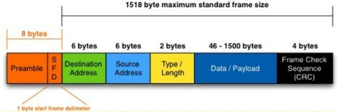

## TCP/IP 4계층 모델

+ 인터넷 프로토콜 스위트 : 인터넷에서 컴퓨터들이 서로 정보를 주고받는 데 쓰이는 프로토콜 집합
+ 이를 TCP/IP 4계층 모델 또는 OSI 7계층 모델로 설명하기도 한다
+ 아래는 TCP/IP 4계층 모델로 설명하겠다

### 2.2.1 계층구조


#### 애플리케이션 계층

+ FTP, HTTP, SSH, SMTP, DNS 등 응용 프로그램이 사용되는 프로토콜 계층

+ 웹 서비스, 이메일 등 실질적으로 사람들에게 서비스를 젝오하는 층

  ```
  FTP : 장치와 장치 간 파일 전송에 사용되는 표준 통신 프로토콜
  
  SSH : 보안되지 않은 네트워크에서 네트워크 서비스를 안전하게 운영하기 위한 암호화 네트워크 프로토콜
  
  HTTP : World Wide Web을 위한 데이터 통신의 기초이자 웹 사이트를 이용하는 데 쓰는 프로토콜
  
  SMTP : 전자 메일 전송을 위한 인터넷 표준 통신 프로토콜
  
  DNS : 도메인 이름과 IP 주소를 매핑해주는 서버
  ```

#### 전송 계층

+ 송신자와 수신자를 연결하는 통신 서비스
+ 애플리케이션 계층과 인터넷 계층 사이 데이터 전달 역할
+ TCP는 패킷 사이 순서 보장, 연결지향 프로토콜을 사용함으로 신뢰성 구축, '가상회선 패킷 교환방식' 사용
+ UDP는 순서 보장 X, 수신 여부 확인 X, 단순히 데이터만 전달하는 '데이터그램 패킷 교환 방식' 사용

`가상회선 패킷 교환 방식` 

: 각 패킷에 가상회선 식별자가 포함되며 모든 패킷 전송 후 가상회선이 해제되고 패킷들은 전송된 '순서대로' 도착하는 방식


`데이터그램 패킷 교환방식`

: 각 패킷이 독립적으로 이동하며 최적의 경로를 선택, 하나의 메세지에서 분할된 여러 패킷은 서로 다른 경로로 전송될 수 있으며 도착한 순서가 다를 수 있는 방식


` TCP 연결 성립과정`

: 신뢰성 확보를 위해 3-웨이 핸드셰이크 작업을 진행함

[3-way handshake](https://popcorntree.tistory.com/111)


`TCP 연결 해제 과정`

: 4-웨이 핸드셰이크 발생

[4-way handshake](https://popcorntree.tistory.com/112)


#### 인터넷 계층

+ 장치로부터 받은 네트워크 패킷을 IP 주소로 지정된 목적지로 전송하기 위해 사용되는 계층
+ IP, ARP, ICMP 
+ 패킷 수신할 상대 주소를 지정하여 데이터 전달
+ 상대방이 제대로 받았는지 보장하지 않는 '비연결형적'


#### 링크 계층

+ 전선, 광섬유, 무선

+ 실질적으로 데이터 전달, 장치간 신호를 주고받는 '규칙'을 정하는 계층

+ 네트워크 접근 계층(`물리계층`과 `데이터 링크 계층`으로 나눔)

+ **물리계층**

  + 무선 LAN과 유선 LAN을 통해 0과 1로 이루어진 데이터를 보내는 계층

  + **유선 LAN(IEEE802.3)**

    + 전이중화 통신 : 양쪽 장치가 동시에 송수신할 수 있는 방식
    + CSMA/CD : 반이중화 통신
      + 데이터를 보낸 이후 충돌이 발생한다면 일정 시간 이후 재전송하는 방식
      + 수신로와 송신로가 한 경로이기 때문에

  + **유선 LAN을 이루는 케이블**

    + 트위스트 페어 케이블 (구리선) 
    + 광섬유 케이블 (광섬유, 구리선과 비교 불가능한 장거리 및 고속 통신 가능)

  + **무선 LAN(IEEE802.11)**

    + **반이중화 통신** : 서로 통신은 가능하지만 동시에 통신은 불가, 한번에 한 방향만 가능
    + **CSMA/CA** : 반이중화 통신 법 중 하나로 데이터를 보내기 전에 캐리어 감지 등으로 사전에 충돌 방지

  + **무선 LAN을 이루는 주파수**

    + **와이파이** : 공유기(AP)를 활용하여 무선 LAN 신호에 연결할 수 있게 하는 기술
    + **BSS(Basic Service Set)** :  
      + 단순 공유기 통한 네트워크 접속 X, 동일 BSS 내에 있는 공유기와 장치들이 서로 통신 가능한 구조
      + 하나의 AP를 기반으로 구축, 근거리 무선 통신 제공
    + **ESS(Extended Serviece Set)** : 
      + 하나 이상 연결된 BSS 그룹, 장거리 무선 통신을 제공하며 BSS보다 더 많은 가용성과 이동성 지원

    

+ **데이터 링크 계층**

  + 이더넷 프레임을 통해 에러 확인, 흐름 제어, 접근 제어를 담당하는 계층

  + **이더넷 프레임** :

    

    + Preamble : 이더넷 프레임이 시작임을 알림
    + SFD(Start Frame Delimiter) : 다음 바이트부터 MAC 주소 필드가 시작됨을 알림
    + DMAC, SMAC : 수신, 송신 MAC 주소
    + EtherType : 데이터 계층 위의 계층인 IP 프로토콜 정의 (IPv4, IPv6)
    + Payload : 전달받은 데이터
    + CRC : 에러 확인 비트

#### 계층간 데이터 송수신 과정


+ 애플리케이션 계층 -> 전송 계층 : 요청(request)이 캡슐화되어 전달됨
+ (요청)링크 계층 -> (서버)링크 계층  : 서버와 통신
+  (서버)링크 계층 -> 애플리케이션 계층 : 비캡슐화 과정


**캡슐화 과정**

: 상위 계층의 헤더와 데이터를 하위 계층의 데이터 부분에 포함시키고 해당 계층의 헤더를 삽입하는 과정


1. 애플리케이션 데이터가 전송 계층으로 가며 TCP(L4) 헤더가 붙음
2. 인터넷 계츠응로 가면서 IP(L3) 헤더가 붙으며 패킷화
3. 링크 계층으로 가며 프레임 헤더와 트레일러가 붙어 프레임화


**비캡슐화 과정**

: 상위 계층으로 가며 각 계층의 헤더 부분을 제거하는 과정


1. 캡슐화된 데이터를 받아 링크 계층부터 프레임화 -> 패킷화 -> 세그먼트, 데이터그램화 -> 메시지화
2. 최종적으로 사용자에게 애플리케이션인 PDU 메세지로 전달


### 2.2.2 PDU

: 네트워크의 계층에서 계층으로 데이터가 전달될 때 한 덩어리의 단위, 제어 관련 정보들이 포함된 '헤더', 데이터를 의미하는 '페이로드'로 구성, 각 계층마다 부르는 명칭이 다름

+ 애플리케이션 계층 : 메세지
+ 전송 계층 : 세그먼트(TCP), 데이터그램(UDP)
+ 인터넷 계층 : 패킷
+ 링크 계층 : 프레임(데이터 링크 계층), 비트(물리 계층)