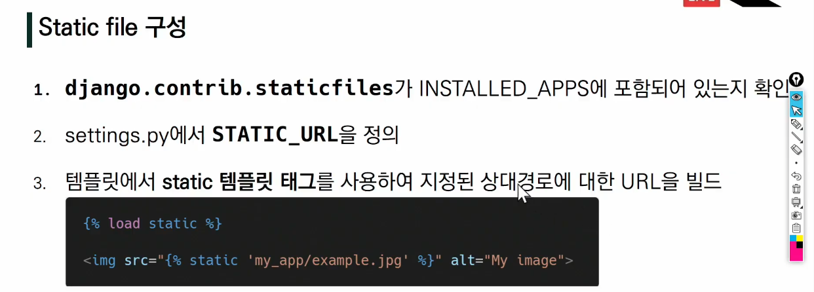
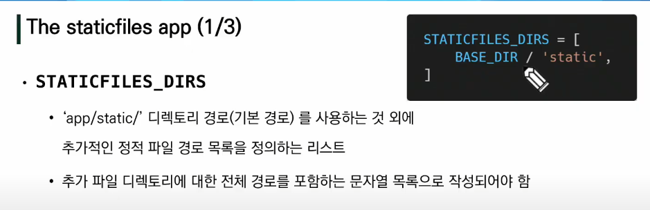
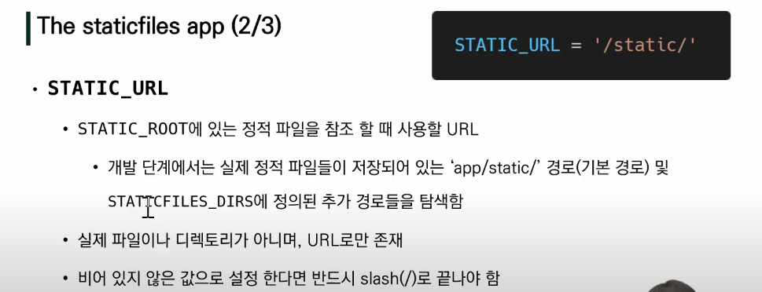
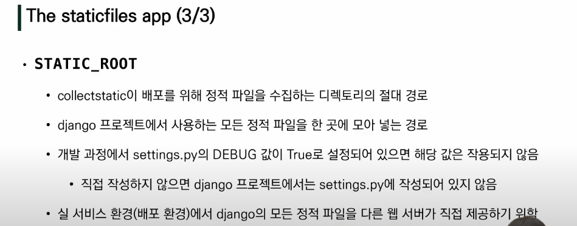

#### Django namespace

#### 이름공간

: 이름공간은 객체를 구분할 수 있는 범위를 나타내느 말로 일반적으로 하나의 이름공간에서는 하나으 ㅣ이름이 단 하나의 객체만을 가리키게 된다.

: 프로그래밍을 하다보면 모든 변수명과 함수명 등 이들 모두를 겹치지 않게 정의하는 것은 매우 어려운 일

: 그래서 장고는

1.  서로 다른 app의 같은 이름을 가진 url name은 이름공간을 설정해서 구분
2.  template, static 등 django는 정해진 경로 하나로 모아서 보기 때문에 중간에 폴더를 임의로 만들어 줌으로써 이름 공간을 설정


#### URL namespace

: 각 앱과 프로젝트 내에서 겹치는 이름의 url이 있을 경우,  django만의 규칙으로 이루어진 특정 페이지만 연결이 된다. 그렇기 떄문에, 물리적으로 폴더를 임의로 넣어 이름공간을 설정하여, 위 상황을 방지하겠다~

```python
#articles > urls.py
app_name = 'articles'
urlpatterns = [
    path('index/', views.index, name='index')
]
```

```django
# articles > templates > articles > index.html 

<a href="{% url 'articles:greeting %'}">greeting</a>
```

: urls.py에 "app_name" attribute 값 작성

: `:` 연산자를 통해 지정


#### Template namespace

: 물리적으로 추가적 경로를 지정해주고 수정해주자

: app_name/templates/app_name


#### Static files

##### 웹 서버와 정적파일

: 웹 서버는 특정위치(URL)에 있는 자원을 요청(HTTP request) 받아서 제공하는 응답(HTTP response)을 처리하는 것을 기본 동작으로 함

: 이는 자원과 접근 가능한 주소가 정적으로 연결된 관계 (ex- 사진 파일은 자원이고 파일 경로는 웹 주소라고 함)

: 즉, 웹 서버는 요청 받은 URL로 서버에 존재하는 정적 자원을 제공

* 정적파일
  * 응답할 때, 별도의 처리 없이 파일 내용을 그대로 보여주면 되는 파일
  * 파일 자체가 고정되어 있고, 서비스 중에도 추가되거나 변경되지 않고 고정되어 있음
  * Django는 이러한 파일을 'Static file'이라고 함
  * staticfiles 앱을 통해 관련 서비스를 제공함




#### About Static files








##### Django template tag

`load`: 사용자 정의 템플릿 태그 세트를 로드, 로드하는 라이브러리,패키지에 등록된 모든 태그와 필터를 불러옴

`static` : STATIC_ROOT에 저장된 정적 파일에 연결

```django
# articles > static > articles > index.html


```