### REST API

---

#### HTTP

웹 상에서 컨텐츠를 전송하기 위한 약속

기본특성

* Stateless
* Connectionless

 쿠키와 세션을 통해 서버 상태를 요청과 연결하도록 함


##### HTTP request methods

* 자원에 대한 행위를 정의하는 방법
* 주어진 자원에 수행하길 원하는 행동을 나타냄
* HTTP Method 예시
  * GET(조회), POST(생성), PUT(업데이트), DELETE(삭제)


##### HTTP response status codes

* 특정  HTTP 요청이 성공적으로 완료되었는지 여부
* 뒤에는 응답 시작번호(ex-404error)

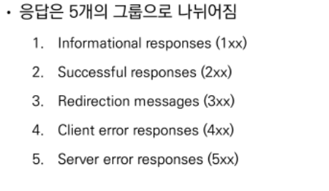

##### 웹에서 리소스 식별

각 리소스는 리소스 식별을 위해 HTTP 전체에서 사용되는 URI로 식별됨

* URL(Uniform Resource Locator)
  * 통합 자원 위치
  * 네트워크 상에 자원이 어디 있는지 알려주기 위한 약속
  * 과거 실제 자원의 위치를 나타냈지만, 현재는 추상화된 의미론적 구성
  * 웹 주소, 링크라고도 불림
* URN(Uniform Resource Name)
  * 통합 자원 이름
  * URL과 달리 자원의 위치에 영향을 받지 않는 유일한 이름 역할
  * ISBN(국제표준도서번호)에 사용됨
* URI(Uniform Resource Identifier)
  * 통합 자원 식별자
  * 인터넷의 자원을 식별하는 유일한 주소(정보의 자원을 표현)
  * 인터넷에서 자원을 식별하거나 이름을 지정하는데 사용되는 간단한 문자열
  * 하위 개념
    * URL, URN
  * URI는 크게 URL과 URN으로 나눌 수 있지만 URN 비중이 매우 적기 떄문에 일반적으로 URL은 URI와 같은 의미처럼 사용하기도 함
  * URI 구조
    * 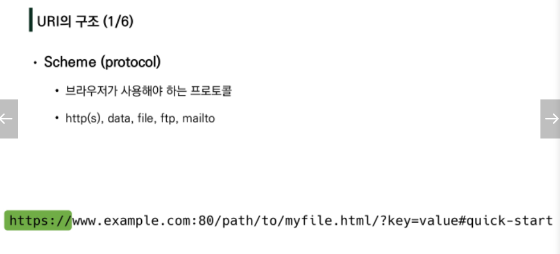
      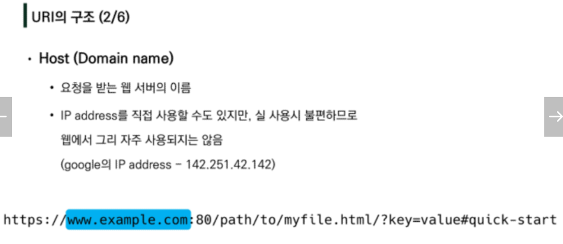
    * 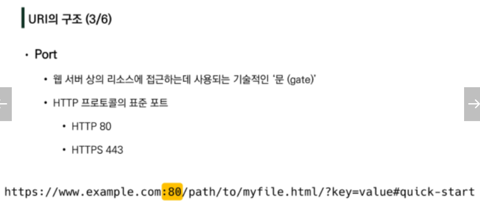
    * 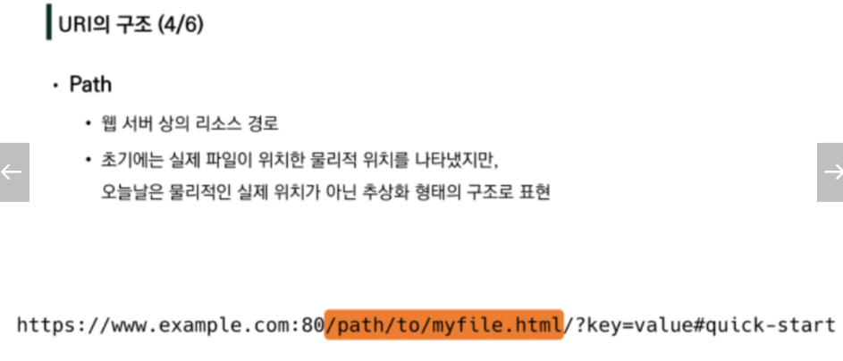
    * 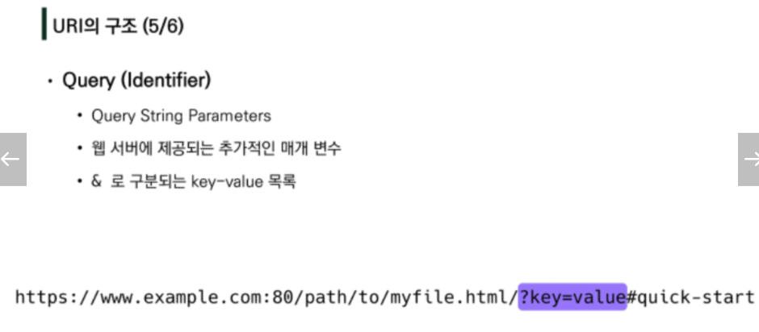
    * 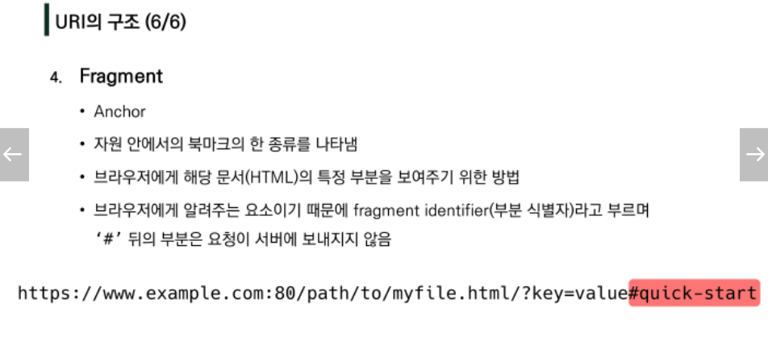

---

### RESTful API

API = 

프로그래밍 언어가 제공하는 기능을 수행할 수 있게 만든 인터페이스

* 애플리케이션과 프로그래밍으로 소통하는 방법
* CLI는 명령줄, GUI는 그래픽, API는 프로그래밍을 통해 특정 기능 수행

Web API = 

웹 어플 개발에서 다른 서비스에 요청을 보내고 응답을 받기 위해 정의된 명세

현재 웹 개발은 모두 직접 개발보다는 여러 Open API를 활용하는 추세

HTML, XML, JSON 파일 등


##### REST

REpresentatioanl State Transfer

API Server를 개발하기 위한 일종의 소프트웨어 설계 방법론

네트워크 구조 원리의 모음

* 자원을 정의하고 자원에 대한 주소를 지정하는 전반적인 방법

REST 원리를 따르는 시스템을 RESTful이란 용어로 지칭함

자원을 정의하는 방법에 대한 고민 = Resetful을 따르는 API를 RESTful API


핵심 규칙

1. 정보는 'URI'로 표현
2. 자원에 대한 행위는 GET, POST, PUT, DELETE
3. 설계방법론을 지키지 않더라도 동작 여부에 큰 영향은 없으나, 지켰을 때 얻는 것이 훨씬 많음


REST의 자원과 주소의 지정방법

1. 자원 = URI
2. 행위 = HTTP Method
3. 표현 = 자원과 행위를 통해 궁극적으로 표현되는 (추상화된) 결과물, JSON으로 표현된 데이터를 제공

​	(그간 우리는 HTML 형태로만 받아왔다)


JSON

* 자바스크립트의 표기법을 따른 단순 문자열

* 사람이 읽거나 쓰기 쉽고 기계가 파싱(해석, 분석)하고 만들어내기 쉬움

* 파이썬의 dictionary, 자바스크립트의 object처럼 C계열의 언어가 갖고 있는 자료구조로 쉽게 변화할 수 있는 key-value 형태의 구조를 갖고 있음

  

---


### Response

```python
# return JsonResponse 사용법

from django.http.response import JsonResponse

def article_json_1(request):
    articles = Article.objects.all()
    articles_json = []

    for article in articles:
        articles_json.append(
            {
                'id': article.pk,
                'title': article.title,
                'content': article.content,
                'created_at': article.created_at,
                'updated_at': article.updated_at,
            }
        )
    # return을 Json 형식으로 해줌
    return JsonResponse(articles_json, safe=False)

```


Serialization = '직렬화'

* 데이터 구조나 객체 상태를 동일하거나 다른 컴퓨터 환경에 저장하고, 나중에 재구성할 수 있는 포맷으로 변환하는 과정
* Queryset 및 Model Instance와 같은 복잡한 데이터를 JSON, XML 등의 유형으로 쉽게 변환할 수 있는 Python 데이터 타입으로 만들어줌

Django Serializer

Django의 내장 HttpResponse를 활용한 JSON응답

* 주어진 모델 정보를 활용하기 때문에, 이전과 달리 필드를 개별적으로 직접 만들어 줄 필요 없음

```python
# import 하기
from django.http.response import JsonResponse, HttpResponse
from django.core import serializers

def article_json_2(request):
    articles = Article.objects.all()
    # data = 파이썬 형식으로 직렬화된 상태
    data = serializers.serialize('json', articles)
    return HttpResponse(data, content_type='application/json')
```


Django REST Framework(DRF) - 가장 많이 사용

* Django REST framewrk(DRF) 라이브러리를 사용한 JSON 응답

* ```shell
  $ pip install djangorestframework
  ```

  ```python
  # settings.py
  INSTALLED_APPS = [
      ...
      'rest_framework',
  ]
  ```

  ```python
  # articles/urls.py
  from django.urls import path
  from . import views
  
  urlpatterns = [
      ...
      path('json-3/', views.article_json_3),
  ]
  ```

  ```python
  # serializers.py
  
  from rest_framework import serializers
  from .models import Article
  
  # 게시글을 Json 형태로 변경해주는 도구
  class ArticleSerializer(serializers.ModelSerializer):
  
      class Meta:
          model = Article
          fields = '__all__'
  
  ```

  ```python
  # articles/serializers.py
  # Article 모델에 맞춰 자동으로 필드를 생성해 serialize 해주는 ModelSerializer 확인
  
  from .serializers import ArticleSerializer
  # @api_view(['GET'])
  @api_view()
  def article_json_3(request):
      articles = Article.objects.all()
      # many=True : 디테일 페이지와 같이 단일 객체가 아닐때 사용해준다
      serializer = ArticleSerializer(articles, many=True)
      return Response(serializer.data)
  
  
  ```

DRF는 Web API 구축을 위한 강력한 Toolkit을 제공하는 라이브러리

DRF의 Serializer는 Django의 Form 및 ModelForm 클래스와 매우 유사하게 구성되고 작동함

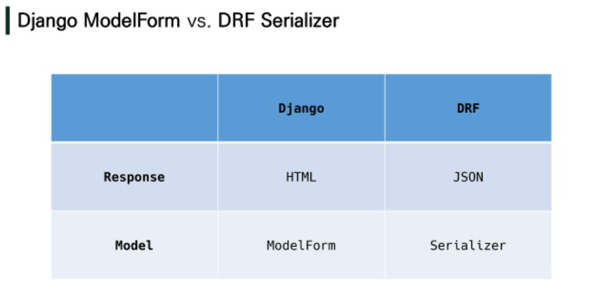


---

### Single Model(단일관계, 1:N 같은거 없을 때)

DRF with Single Model

* 단일 모델의 data를 직렬화(serialization)하여 JSON으로 변환하는 방법에 대한 학습
* 단일 모델을 두고 CRUD 로직을 수행 가능하도록 설계
* API 개발을 위한 핵심 기능을 제공하는 도구 활용
  * DRF built-in form
  * Postman 
    *  API를 구축하고 사용하기 위해 여러 도구를 제공하는 API플랫폼
    * 설계, 테스트, 문서화 등의 도구를 제공함으로써 API를 더 빠르게 개발 및 생성할 수 있도록 도움

ModelSerializer

* 모델 필드에 해당하는 필드가 있는 Serializer 클래스를 자동으로 만들 수 있는 shortcut

* 모델 정보에 맞춰 자동으로 필드 생성

* serializer에 대한 유효성 검사기를 자동으로 생성

* .create() & .update()의 간단한 기본 구현이 포함됨

* Model의 필드를 어떻게 '직렬화' 할지 설정하는 것이 핵심

* 이 과정은 Django에서 Model의 필드를 설정하는 것과 동일함

* ```python
  # articles/serializers.py
  
  from rest_framwork import serializers
  from .models import Article
  
  clss ArticleListSerializer(serializers.ModelSerializer):
      
      class Meta:
          model = Article
          fields = ('id','title',)
  ```

* 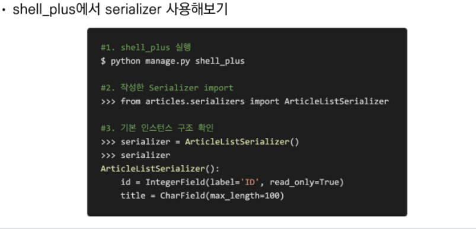

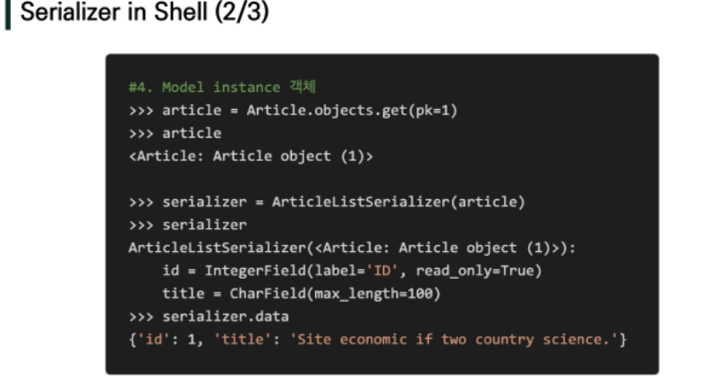

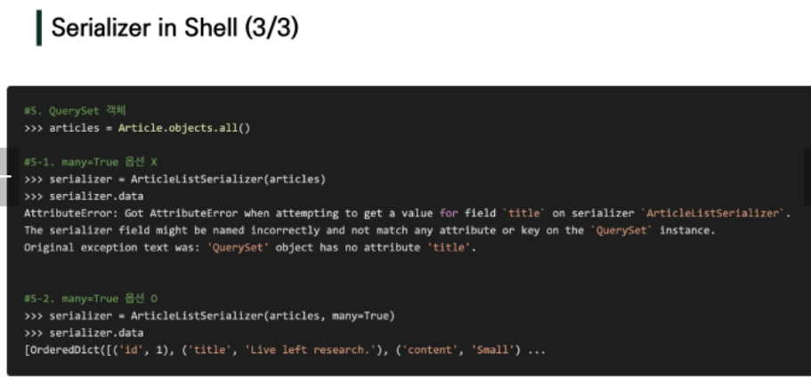

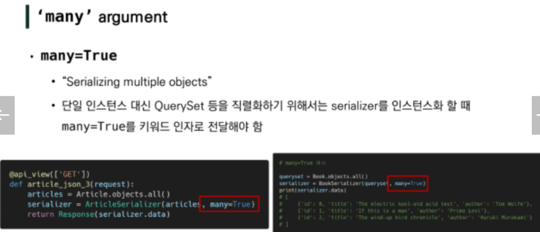


---

### Single Model 구현해보기

Build RESTful API

|             |     GET      |  POST   |     PUT     |   DELETE    |
| :---------: | :----------: | :-----: | :---------: | :---------: |
|  articles/  | 전체 글 조회 | 글 작성 |             |             |
| articles/1/ | 1번 글 조회  |         | 1번 글 수정 | 1번 글 삭제 |


serializers.py를 변경하여 출력폼을 변화시킬 수 있다.

```python
# articles/serializers.py

from rest_framwork import serializers
from .models import Article

class ArticleListSerializer(serializers.ModelSerializer):
    
    class Meta:
        model = Article
        fields = ('id','title',)
```


```python
# articles/urls.py

from django.urls import path
from . import views

# 요청받는 주소만 있으면 되기에 현재는 app_name, url name가 불필요하다
# 필요하면 생성하면 됨
urlpatterns = [
    # 게시글 리스트 조회, 작성
    path('articles/', views.article_list),
    # 단일 게시글 조회, 삭제, 수정
    path('articles/<int:article_pk/', views.article_detail),
]
```


DRF의 views에는 필수적으로 `api_view`decorator를 작성해야한다.

`raise_exception` 사용으로 is_valid() 유효성 검사 이후 에러를 발생시켜 코드를 줄일 수 있다.

ex) form.is_valid(raise_exception=True)로 사용, 에러가 있는 경우 기본적으로 400 에러발생

```python
# articles/views.py

# 더 정확한 http 응답을 위해서 import
from signal import raise_signal
from rest_framework import status
from rest_framework.response import Response
from rest_framework.decorator import api_view
from django.shortcuts import render
from .serializers import ArticleListSerializer, ArticleSerializer
from .models import Article
# get_list_or_404도 사용가능
from django.shortcuts import get_list_or_404, get_object_or_404
# Create your views here.

# 게시글 조회와 작성
#@api_view
@api_view(['GET','POST'])
def article_list(request):
    if request.method=='GET':
        # articles = Article.objects.all()
        articles = get_list_or_404(Article)
        # 단일 객체가 아니기에 many 필요
        serializer = ArticleListSerializer(articles, many=True)
        return Response(serializer.data)

    elif request.method=='POST':
        serializer = ArticleSerializer(data=request.data)
        # is_valid 후에 400 request의 반복이라 raise_exception 추가해서 코드 줄이기 가능
        if serializer.is_valid(raise_exception=True):
            serializer.save()
            # 정확한 페이지 응답을 위해 status 추가
            # 단순히 status=201로 표현 가능하지만 권장하지 않음
            return Response(serializer.data, status=status.HTTP_201_CREATED)
        # is_valid(raise_exception=True) 구문으로 생략 가능
        #return Response(serializer.errors,status=status.HTTP_400_BAD_REQUEST)


# 디테일과 삭제, 수정
@api_view(['GET','POST','PUT'])
def article_detail(request, article_pk):
    article = get_object_or_404(Article, pk=article_pk)
    if request.method=='GET':
        # 단일객체이기 때문에 many 필요 X
        serializer = ArticleSerializer(article)
        return Response(serializer.data)

    # 글 삭제
    elif request.method=='DELETE':
        article.delete()
        data = {
            'delete': f'데이터 {article.pk}번이 삭제되었습니다.',
        }
        return Response(data, status=status.HTTP_204_NO_CONTENT)

    # 글 수정
    elif request.method=='PUT':
        # 수정이니까, data도 받아와야해
        serializer = ArticleSerializer(article, request.data)
        # 조금 더 명확하게 아래와 같이 작성해도 된다
        # serializer = ArticleSerializer(article, data = request.data)
        if serializer.is_valid(raise_exception=True):
            serializer.save()
            return Response(serializer.data)


```


---

### 1:N 관계

1:N 관계에서 모델 data를 직렬화하여 JSON으로 변환해보자


`Read Only Field` (읽기 전용 필드)

: 어떤 게시글에 작성하는 댓글인지 정보를 form-data로 넘겨주지 않았기에, 직렬화 과정에서 is_valid를 통과하지 못하고 400 error를 발생시킴

* CommentSerializer에서 article field에 해당하는 데이터 또한 요청받아서 직렬화하도록 설정되었기 때문

이때 읽기전용필드 설정을 통해 직렬화하지 않고 반환값에만 해당 필드가 포함되도록 설정할 수 있음


```python
# articles/serializers.py

# comment 전용 serializer 만들기
class CommentSerializer(serializers.ModelSerializer):

    class Meta:
        model = Comment
        field = '__all__'
        # 읽기 전용으로 설정해줌으로 article은 직렬화되지 않은 채로
        # 결과값(return)에는 포함되게 된다
        read_only_fields = ('article',)
```


#### 1:N관계 Comment로 실습

```python
# articles/models.py
# comment 모델 추가

from django.db import models

class Article(models.Model):
    title = models.CharField(max_length=100)
    content = models.TextField()
    created_at = models.DateTimeField(auto_now_add=True)
    updated_at = models.DateTimeField(auto_now=True)

# comment 모델 추가
class Comment(models.Model):
    article = models.ForeignKey(Article, on_delete=models.CASCADE)
    content = models.TextField()
    created_at = models.DateTimeField(auto_now_add=True)
    updated_at = models.DateTimeField(auto_now=True)   
```


```python
# articles/urls.py
# comment url 추가

urlpatterns = [
    ...
    path('comments/', views.comment_lsit),
]
```


```python
# articles/views.py

# 댓글 리스트 조회
@api_view(['GET'])
def comment_list(request):
    comments = get_list_or_404(Comment)
    # 멀티플 오브젝트니까 many 넣어주고
    serializer = CommentSerializer(comments, many=True)
    return Response(serializer.data)


# 단일 댓글 객체 조회, 삭제, 수정
@api_view(['GET', 'DELETE', 'PUT'])
def comment_detail(request, comment_pk):
    comment = get_object_or_404(Comment, pk=comment_pk)
    if request.method=='GET':
        # 멀티플 오브젝트니까 many 넣어주고
        serializer = CommentSerializer(comment, many=True)
        return Response(serializer.data)

    # 댓글 삭제
    elif request.method=='DELETE':
        comment.delete()
        data = {
            'delete': f'데이터 {comment.pk}번이 삭제되었습니다.',
        }
        return Response(data, status=status.HTTP_204_NO_CONTENT)

    # 댓글 수정
    elif request.method=='PUT':
        # 수정이니까, data도 받아와야해
        serializer = CommentSerializer(comment, request.data)
        # 조금 더 명확하게 아래와 같이 작성해도 된다
        # serializer = CommentSerializer(article, data=request.data)
        if serializer.is_valid(raise_exception=True):
            serializer.save(article=article)
            return Response(serializer.data)


# 댓글 생성
@api_view(['POST'])
def comment_create(request, article_pk):
    # 게시글에 댓글이 달리니까 article 찾아줌
    article = get_object_or_404(Article, pk=article_pk)
    serializer = CommentSerializer(data=request.data)
    if serializer.is_valid(raise_exception=True):
        # serializer에는 commit=False가 아니라 다음과 같이 직접 넣어준다
        # 어느 게시글인지 알려주는거임
        serializer.save(article=article)
        return Response(serializer.data, status=status.HTTP_201_CREATED)
```


---

### 추가로, 게시글에 댓글정보까지 함께 보이고 싶다(역참조)

1. 특정 게시글에 작성된 댓글 목록 출력하기

   * 기존 필드 override

     * `PrimaryKeyRelatedField`

       * pk를 사용하여 관계대상을 나타내는데 사용
       * 필드가  N을 나타내는 경우 `many=True` 필요
       * comment_set 필드 값을 form-data로 받지 않으므로 `read_only=True`필요

       ```python
       # serializers.py
       
       class ArticleSerializer(serializers.ModelSerializer):
           # 게시글 조회시 댓글정보를 보이기 위해서 오버라이드
           # 기존 필드에 comment가 포함되어 있지 않기 때문에, read_only를 인자로 넣어줌
           comment_set = serializers.PrimaryKeyRelatedField(many=True, read_only=True)
           
           class Meta:
               model = Article
               fields = '__all__'
       ```

       </hr>

       

     * `Nested relationships`

       * 모델 관계상으로 참조된 대상(게시글)은 참조하는 대상(댓글)의 표현에 포함되거나 중첩될 수 있음
       * 이러한 중첩 관계는 serializers를 필드로 사용하여 표현 가능
       * 두 클래스의 상하위치 변경

       ```python
       class ArticleSerializer(serializers.ModelSerializer):
           # `Nested relationships` 방식
           # 이때 CommentSerializer을 사용하기 때문에 CommentSerializer 클래스를 ArticleSerializer 클래스 위로 옮겨주어야한다
           comment_set = CommentSerializer(many=True, read_only=True)
           
           class Meta:
               model = Article
               fields = '__all__'
       ```

       

2. 특정 게시글에 작성된 댓글의 개수 구하기

   * 새로운 필드 추가

   ```python
   class ArticleSerializer(serializers.ModelSerializer):
       # `Nested relationships` 방식
       comment_set = CommentSerializer(many=True, read_only=True)
       # 댓글 갯수 생성하기
       # 없는 필드니까 우리가 만들어준다
       comment_count = serializers.IntegerField(source='comment_set.count', read_only=True)
   
       class Meta:
           model = Article
           fields = '__all__'
   ```

   