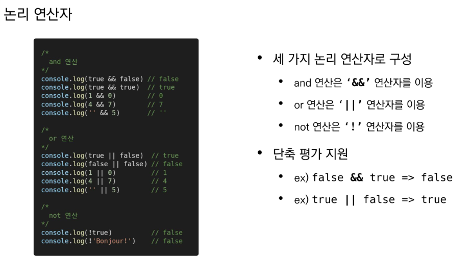

### JS 기초

---

#### JS의 필요성

\* 브라우저 화면을 '동적'으로 만들기 위함

\* 브라우저를 조작할 수 있는 유일한 언어

#### 브라우저에서 할 수 있는 일

##### \* DOM(Document Object Model) 조작

* 문서(HTML)조작
* HTML, XML 같은 문서를 다루기 위한 프로그래밍 인터페이스
* 문서 구조화, 구조화된 구성요소를 하나의 객체로 취급하여 다루는 논리적 트리모델
* 객체로 구조화되어 있으며 key로 접근가능
* 단순 속성 접근, 메서드뿐만 아니라 프로그래밍 언어적 특성을 활용한 조작 가능

##### \* BOM(Browser Object Model)조작

* navigator, screem, location, frames, history, XHR
* 자바스크립트가 브라우저와 소통하기 위한 모델
* 버튼, URL 입력창 등 일부분 제어 가능
* 

##### \* JavaScript Cor(ECMAScript)

* Data Structure(Object, Array), Conditional Expression, Iteration
* 브라우저를 조작하기 위한 명령어(언어)

##### 정리

##### [※] ECMAScript

##### [※] 세미콜론

* 자바스크립트는 세미콜론을 선택적으로 사용 가능
* 세미콜론이 없으면 ASI(자동 세미콜론 삽입규칙)에 의해 자동으로 세미콜론이 삽입됨

##### [※] 코딩스타일 가이드

* 합의된 원칙과 일관성
  * 절대적인 하나의 정답은 없으며, 상황에 맞게 원칙을 정하고 일관성 있게 사용하는 것이 중요
* 코딩 스타일은 코드 품질에 직결되는 중요한 요소
  * 코드 가독성, 유지보수 또는 팀원과의 커뮤니케이션 등 개발 과정 전체에 영향을 끼침

---

#### 변수와 식별자

##### \* 식별자 정의와 특징

* 식별자 = 변수명
* 반드시 문자, $, _로 시작
* 대소문자 구분하며, 클래스명 외에는 모두 소문자 시작
* 예약어 사용불가능(for, if 등등)
* 작성 스타일
  * 카멜 케이스
    * 변수, 객체, 함수에 사용
    * 두번째 단어의 첫글자부터 대문자
    * ex- myFirstJavascript
  * 파스칼 케이스
    * 클래스, 생성자에 사용
    * 모든 단어의 첫번째 글자를 대문자로
    * ex- User
  * 대문자스네이크케이스
    * 상수에 사용
    * 개발자 의도와 상관없이 변경될 가능성이 없는 값을 의미
    * ex-API_KEY

##### \* 변수선언키워드

##### [※] 선언, 할당, 초기화란?

* let

  * 재할당 할 예정인 변수 선언시 사용
  * 변수 재선언 불가능
  * 블록 스코프

* const

  * 재할당 예정이 없는 변수 선언

  * 변수 재선언 불가능

  * 블록 스코프

    

* var
  * 재선언 및 재할당 모두 가능
  * 호이스팅 되는 특성으로 예기치못한 문제 발생 가능
    * 변수를 선언 이전에 참조할 수 있는 현상
    * 변수 선언 이전의 위치에서 접근시 undefined 반환
    * 
  * 잘 안씀
  * 함수 스코프

| 키워드 | 재선언 | 재할당 |   스코프    |  비고  |
| :----: | :----: | :----: | :---------: | :----: |
|  let   |   X    |   O    | 블록 스코프 |  ES6~  |
| const  |   X    |   X    | 블록 스코프 |  ES6~  |
|  var   |   O    |   O    | 함수 스코프 | 사용 X |

---

#### 데이터타입

자바스크립트의 모든 값은 특정 데이터 타입을 가짐

크게 원시타입, 참조타입으로 분류됨

---

#### 원시타입

오류를 내지 않음(NaN으로 표현함)

typeof Nan = 'number'

---

#### 연산자

1. 할당 연산자

   

   

   [예상치 못한 결과]

   

   

   

   

   

---

### 조건문

#### if

#### switch

---

#### 반복문

