### JS Axios를 이용한 비동기 통신개념

---

### AJAX

비동기식 JS와 XML

서버와 통신하기 위해 XMLHttpRequest 객체 활용

JSON, XML, HTML 그리고 일반 텍스트 형식등을 포함한 다양한 형식을 주고 받을 수 있음

[참고] AJAX의 X가 XML을 의미하긴 하지만, 요즘은 더 가벼운 용량과 JS의 일부라는 이유로 JSON을 더 많이 사용함


#### AJAX 특징

페이지 전체를 새로고침 하지 않고서도 수행되는 **비동기성**

- 서버 응답에 따라 전체 페이지가 아닌 일부분만 업데이트할 수 있다.
- 페이지 새로고침 없이 서버에 요청
- 서버로부터 데이터를 받고 작업 수행 가능


#### XMLHttpRequest 객체

서버와 상호작용하기 위해 사용되며, 전체 페이지의 새로고침 없이 데이터를 받아올 수 있음

사용자 작업을 방해하지 않으면서 페이지 일부 업데이트 가능

주로 AJAX 프로그래밍에 사용

이름과 달리 XML뿐 아니라 모든 종류 데이터를 받아온다

생성자 = XMLHttpRequest()


---

#### Asynchronous JavaScript(비동기식)

##### 동기식?

순차적, 직렬적 Task 수행

요청 후 응답을 받아야 다음 동작이 이루어짐

버튼 클릭 후 alert 메세지의 확인 버튼을 눌러야 다음 코드가 실행됨 = Blocking

JavaScript는 single threaded이기 때문

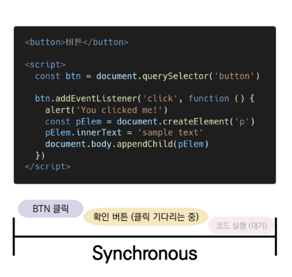


##### 비동기식

병렬적 Task 수행

요청 후 응답을 기다리지 않고 다음 동작이 이루어짐

결과적으로 변수 todo에는 응답 데이터가 할당되지 않고 빈 문자열이 출력 = Non-Blocking

JavaScript는 single threaded이기 때문

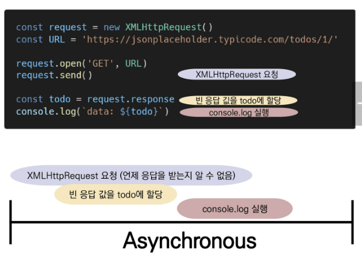


##### 왜 비동기를 사용하는가?

**"for 사용자 경험"**

만약 매우 큰 데이터를 동반한 앱이 있다면, 데이터를 모두 불러오기까지 앱이 멈춘 것처럼 보인다.

비동기식 코드라면 데이터를 요청하고 응답 받는 동안, 앱 실행을 함께 진행함

=> 데이터를 불러오는 동안 지속적으로 응답하는 화면을 보여줌으로써 더욱 쾌적한 사용자 경험 제공

때문에 많은 웹 API기능은 현재 비동기 코드를 사용하여 실행됨


**[참고] Threads**

프로그램이 작업을 완료하기 위해 사용할 수 있는 단일 프로세스

각 쓰레드는 한 번에 하나의 작업만 수행 가능

ex) Task A -> Task B -> Task C

* 다음 작업을 시작하려면 반드시 앞의 작업이 완료되어야함
* 컴퓨터 CPU는 여러 코어를 가지고 있기 떄문에 한 번에 여러 일을 처리할 수 있음


##### JavaScript는 single threaded이다

컴퓨터가 여러 개의 CPU를 가지고 있어도 main thread라 불리는 단일 스레드에서만 작업 수행

즉, 이벤트를 처리하는 Call Stack이 하나인 언어라는 의미

이 문제를 해결하기 위해

1. 즉시 처리하지 못하는 이벤트를 다른곳(Web API)로 보내서 처리
2. 처리된 이벤트들은 처리된 순서대로 대기실(Task queue)에 줄 세워놓고
3. Call Stack이 비면 담당자(Event Loop)가 대기 줄에서 가장 오래된 이벤트를 Call Stack으로 보냄


**Concurrency model(동시성 모델)**

1. Call Stack

   요청이 들어올 떄마다 순차적으로 처리하는 Stack

2. WEb API

   JS엔진이 아닌 브라우저 영역에서 제공하는 API

   `setTimeout()` , DOM events 그리고 AJAX로 데이터를 가져오는 시간이 소요되는 일을 처리

   시간 관련된 일들은 대부분 넘어간다

3. TAsk Queue

   비동기 처리된 callback 함수가 대기하는 Queue형태의 자료

   main thread가 끝난 후 실행되어 후속 JS코드가 차단되는 것을 방지

4. Event Loop

   Call Stack이 비어있는지 확인

   비어 있는 경우 Task Queue에서 실행 대기중인 callback 함수가 있는지 확인

   Task Queue에 대기중인 callback 함수가 있다면 가장 앞에 있는 callback을 push


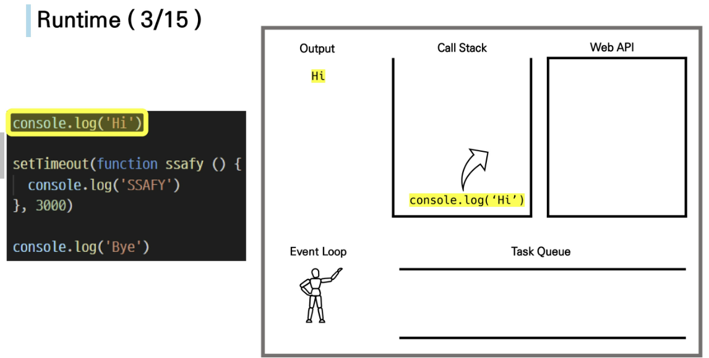

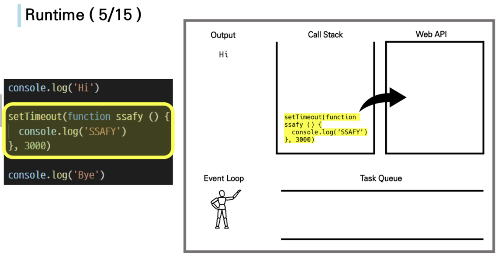

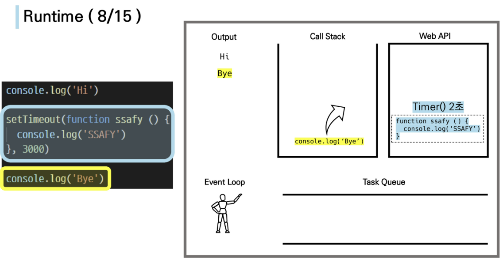

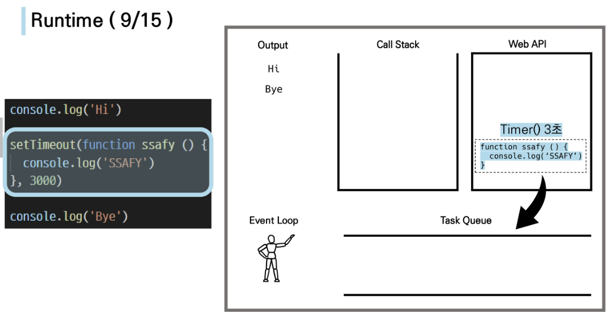

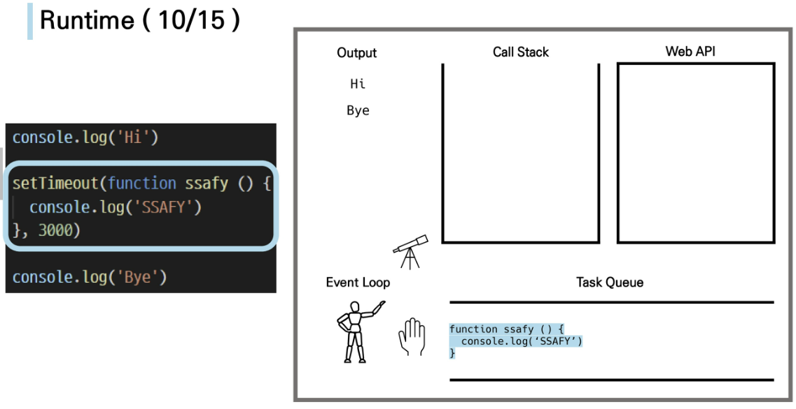

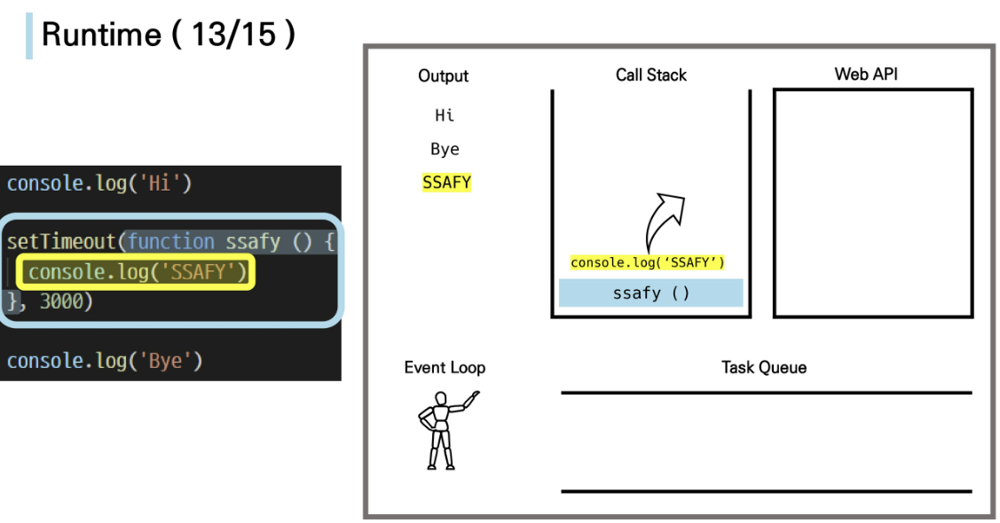


```html
<!DOCTYPE html>
<html lang="en">
<head>
  <meta charset="UTF-8">
  <meta http-equiv="X-UA-Compatible" content="IE=edge">
  <meta name="viewport" content="width=device-width, initial-scale=1.0">
  <title>Document</title>
</head>
<body>
  <script>
    console.log('start')

    function after3Seconds(){
      console.log('3초가 지났어')
    }
    // 3초 후에 ??를 할거야
    setTimeout(after3Seconds, 3000)
  
  console.log('end')
  </script>
</body>
</html>

```

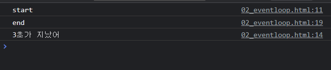


**Zero Delays**

0초짜리여도, 후순위로 넘어간다.

```html
<!DOCTYPE html>
<html lang="en">
<head>
  <meta charset="UTF-8">
  <meta http-equiv="X-UA-Compatible" content="IE=edge">
  <meta name="viewport" content="width=device-width, initial-scale=1.0">
  <title>Document</title>
</head>
<body>
  <script>
    console.log('start')

    function after0Seconds(){
      console.log('바로 끝날걸')
    }

    setTimeout(after0Seconds, 0)
  
  console.log('end')
  </script>
</body>
</html>

```

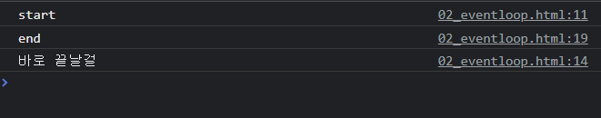

실제로 0ms 후에 callback 함수가 실행되는게 아니다

실행은 Task Queue에 대기중인 작업 수에 따라 다르다. delay는 js가 요청을 처리하는데 필요한 최소시간이기 때문


##### 순차적인 비동기 처리

Web API로 들어오는 순서가 중요한 게 아니라, 어떤 이벤트가 먼저 처리되느냐가 중요(즉, 실행 순서 불명확)

이를 해결하기 위해 순차적인 비동기 처리를 위한 2가지 방법

1. Async callbacks
   * 백그라운데서 실행을 시작할 함수를 호출할 때 인자로 지정된 함수
   * ex) addEventListener()의 두번째 인자
2. promis-style
   * Modern Web APIs에서의 새로운 코드 스타일
   * XMLHttpRequest 객체를 사용하는 구조보다 조금 더 현대적인 버전


---

#### Callback Function

다른 함수에 인자로 전달된 함수

외부 함수 내에서 호출되어 일종의 루틴 또는 작업을 완료함

동기식, 비동기식 모두 사용됨 - 그러나 비동기 작업이 완료된 후 코드 실행을 계쏙하는데 주로 사용됨

비동기 작업이 완료된 후 코드 실행을 하는데 사용되는 경우를 **비동기 콜백**이라 한다

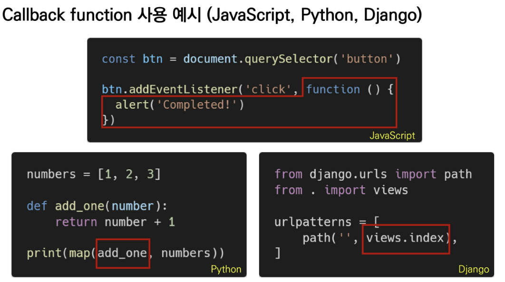


#### Async callbacks

백그라운드에서 코드 실행을 시작할 함수를 호출할 떄 인자로 지정된 함수

백그라운드 코드가 끝나면 콜백 함수를 호출하여, 작업이 완료되었음을 알리거나, 다음 작업을 실행하게 할 수 있음

콜백 함수를 다른 함수의 인수로 전달할 때, 함수의 참조를 인수로 전달할 뿐이지, 즉시 실행되지 않고 함수의 body에서 call back됨


##### why use callback?

+ 콜백 함수는 명시적 호출이 아닌 특정 루틴 혹은 action에 의해 호출되는 함수
+ Django의 경우 '요청이 들어오면', event의 경우 '특정 이벤트가 발생하면'의 조건으로 함수를 호출할 수 있었던 건 'callback function' 개념 덕분
+ 비동기 로직을 수행할 때, callback 함수는 필수


##### callback Hell

순차적 연쇄 비동기 작업을 처리하기 위해 'callback 함수를 지속적으로 호출하는 상황'

즉, 여러개의 연쇄 비동기 작업을 할 때 마주하는 상황

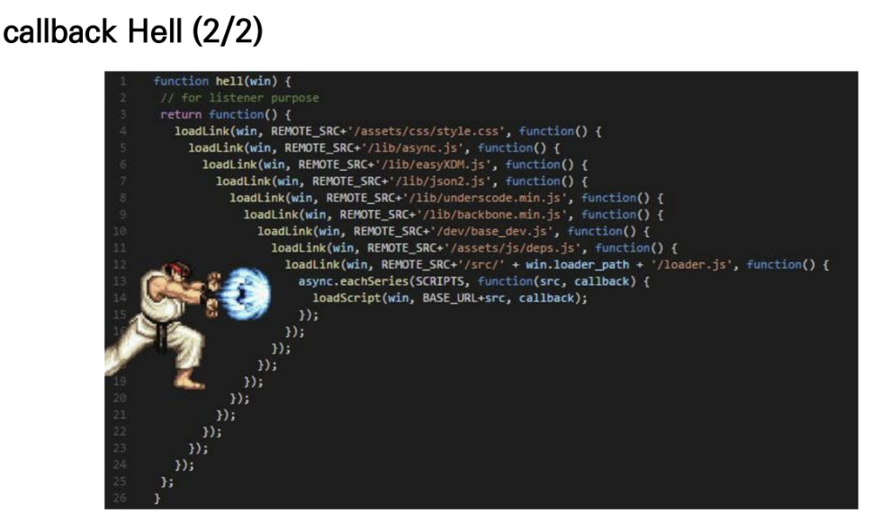

callback Hell 해결하기

+ 코드의 깊이를 얕게 유지
+ 모듈화
+ 모든 단일 오류 처리
+ **Promis callbacks (프로미스 콜백 방식 사용)**


##### Promise callbacks

##### Promise가 보장하는 것

1. callback 함수는 JS의 EventLoop가 현재 실행중인 Call Stack을 완료 전에는 절대 호출되지 않음
2. 비동기 작업이 성공하거나 실패한 뒤에 `.then()` 메서드를 이용하여 추가한 경우에도 1번과 같이 동작
3. `.then()`을 여러번 사용하여 여러개의 callback 함수를 chaning 가능(Promise의 가장 뛰어난 장점)

**Promise object**

비동기 작업의 최종 완료 또는 실패를 나타내는 객체

* 미래의 완료 또는 실패와 그 결과 값을 나타냄
* 미래의 어떤 상황에 대한 약속
* `.then()` = 성공에 대한 약속
  * 이전 작업 성공시 수행할 콜백함수
  * 각 콜백 함수는 이전 작업의 성공 결과를 인자로 전달 받음
  * 각각 `.then()`은 서로 다른 promise를 반환하여, 여러 비동기 작업을 차례로 수행할 수 있게 해준다
* `.catch()` = 실패에 대한 약속
  * `.then`이 하나라도 시리패하면 동작
  * 이전 작업의 실패로 인해 생성된 error 객체는 catch 블록 안에서 사용 가능
* `.then()`과 `.catch()` 모두 반드시 반환값이 있어야 한다.
* `.finally(callback)`
  * Promise 객체를 반환, 결과와 상관없이 무조건 지정된 callback 함수 실행
  * 어떤 인자도 전달받지 않아서, Promise가 성공인지 거절인지 판단 불가능
  * 

```javascript
const myPromis = axios.get(URL)
// console.log(myPromis) // Promis Object

myPromis
	.then(response => {
    return response.data
})

// chaining
axios.get(URL)
	.then(response => {
    return response.data
})
	.then(response => {
    return response.title
})
	.catch(error => {
    consol.log(error)
})
	.finally(function () {
    console.log('나는 마지막에 무조건 시행!')
})
```


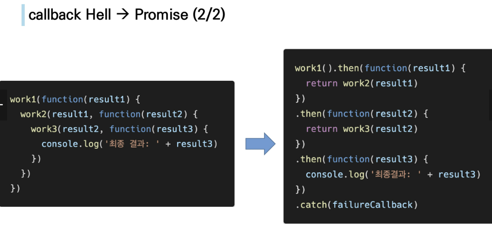

---

#### Axios

**"Promise based HTTP client for the browser"**

**브라우저를 위한 Promise 기반의 클라이언트**

**XHR이라는 브라우저 내장 객체를 활용하여 AJAX 요청을 하였지만, 더 편리한 AJAX 요청이 가능하도록 도와준다**

```javascript
axios.get('https://jsonplaceholder.typicode.com/todos/1') // Promise return
	.then(..)
	.catch(..)
```

```javascript
const URL = 'https://jsonplaceholder.typicode.com/todos/1'

axios.get(URL)
	.then(function (response) {
    	console.log(response)
    	return response.data
	})
	.then(function (data) {
    	return data.title
	})
	.then(function (title) {
    	console.log(title)
	})
	.catch(function (error) {
    	console.log(error)
	})
	.finally(function () {
    	console.log('이건 무조건 실행된다')
	})

```

---

#### [부록] async & await

+ 비동기 코드를 작성하는 새로운 방법

+ 기존 Promise 시스템 위에 구축된 syntactic sugar

  + Promise구조의 then chaining을 제거
  + 비동기 코드를 조금 더 동기 코드처럼 표현

  ```javascript
  // 기존 Promise 코드
  
  <script src="https://unpkg.com/axios/dist/axios.min.js"></script>
  <script>
    const URL = 'https://dog.ceo/api'
  
    function fetchDogImage(){
      axios.get(URL + '/breeds/list/all')
        .then(res => {
          const breedObj = res.data.message
          const breedArray = Object.keys(breedObj)
          const breed = breedArray[0] // 아펜핀셔
  
          return axios.get(URL + `/breed/${breed}/images`)
        })
        .then(res => console.log(res.data))
        .catch(err => console.error(err))
    }
  
    fetchDogImage()
  </script>
  ```

  ```javascript
  <script src="https://unpkg.com/axios/dist/axios.min.js"></script>
  <script>
  /*
  0. async-await를 사용하려면, 함수로 묶어야 한다.
  1. 해당 함수 맨 앞에 async라는 키워드로 표시를 남긴다.
  2. 함수 블록 내부에, 비동기로동작하는 함수들을 찾아서 앞에 await을 남긴다.
  */
  
    // async-await => 함수로 묶는 작업
    async function fetchDogImage(){
      // 아래에서 순서가 보장되지 않은 함수 앞에 await을 적어준다
      const res = await axios.get(URL + '/breeds/list/all')
      const breedObj = res.data.message
      const breedArray = Object.keys(breedObj)
      const breed = breedArray[0] // 아펜핀셔
      const images = await axios.get(URL + `/breed/${breed}/images`).data
      console.log(images)
  
    }
    
    fetchDogImage()
      .catch(err => console.error(err))
  </script>
  ```
