## Vue.js

사용자 인터페이스를 만들기 위한 진보적인  JS 프레임 워크

현대적 tool과 다양한 라이브러리를 통해 SPA(Single Page Application)을 완벽 지원


**SPA**

- 단일 페이지 애플리케이션

- 현재 페이지를 동적으로 렌더링함으로써 사용자와 소통하는 웹 애플리케이션

- 단일페이지로 구성되며 서버로부터 최초에만 페이지를 다운로드하고, 이후 동적으로 DOM을 구성

  - 처음 페이지를 받은 이후부터는 서버로부터 새로운 전체 페이지를 불러오는 것이 아닌, 

    현재 페이지 중 필요한 부분만 동적으로 다시 작성

- 연속되는 페이지 간의 사용자 경험을 향상

  - 모바일 사용량이 증가하고 있는 현재, 트래픽 감소와 속도, 사용성, 반응성 향상은 매우 중요하기 떄문

- 동장 원리 일부가 CSR(Client Side Rendering)의 구조를 따름

- 등장 배경

  - 과거 사이트들은 요청에 따라 매번 새로운 페이지를 응답했다
  - 스마트폰 등장과 함꼐 모바일 최적화의 필요성 대두됨
    - 모바일 네이티브 앱과 같은 형태의 웹 페이지가 필요해짐
  - 이러한 문제 해결을 위해 Vue.js, CSR, SPA 등장
  - 1개의 웹페이지에서 여러 동작이 이루어지며 모바일 앱과 비슷한 형태의 사용자 경험 제공


**CSR**

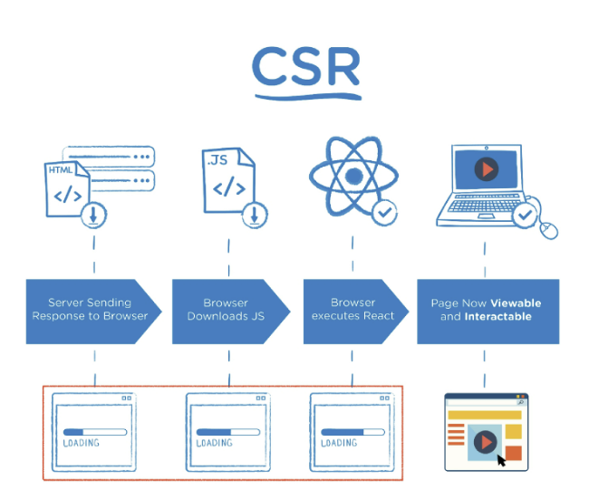

+ Client Side Rendering
+ 서버에서 화면을 구성하는 SSR 방식과 달리 클라이언트에서 화면 구성
+ 최초 요청시 HTML, CSS, JS 등 데이터를 제외한 각종 리소스를 응답받고, 이후 클라이언트에서는 필요한 데이터만 요청해 JS로 DOM을 렌더링 하는 방식
+ 즉, 처음엔 뼈대만 받고 브라우저에서 동적으로 DOM을 그림
+ SPA가 사용하는 렌더링 방식
+ 장점
  + 서버와 클라이언트 간 트래픽 감소
    + 웹 애플리케이션에 필요한 모든 정적 리소스를 최초에 한 번 다운로드 후 필요한 데이터만 갱신
  + 사용자 경험(UX) 향상
    + 전체 페이지를 다시 렌더링하지 않고 변경되는 부분만을 갱신하기 때문
+ 단점
  + SSR에 비해 전체 페이지 최종 렌더링 시점이 느림
  + SEO(검색 엔진 최적화)에 어려움이 있음(최초 문서에 데이터 마크업이 없기 때문)


**SSR**

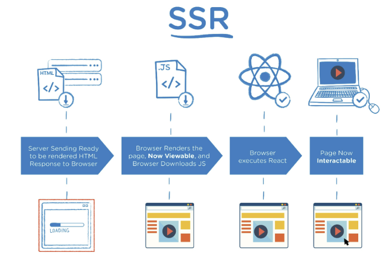

+ Server Side Rendering
+ 서버에서 클라이언트에게 보여줄 페이지를 모두 구성하여 전달하는 방식
+ JS 웹 프레임워크 이전에 사용되던 전통적인 렌더링 방식
+ 장점
  + 초기 구동 속도가 빠름
    + 클라이언트가 빠르게 컨텐츠를 볼 수 있음
  + SEO(검색 엔진 최적화)에 적합
    + DOM에 이미 모든 데이터 작성되어있기 때문
+ 단점
  + 모든 요청마다 새로운 페이지를 구성하여 전달
    + 반복되는 전체 새로고침으로 인해 사용자 경험이 떨어짐
    + 상대적으로 트래픽이 많아 서버의 부담이 클 수 있음


**SSR&CSR**

+ 두 방식의 차이는 최종 HTML 생성 주체가 누구인가에 따라 결정(누가 HTML을 만드나?)
+ 즉, 실제 브라우저에 그려질(렌더링) HTML을 서버가 만든다면 SSR/ 클라이언트가 만든다면 CSR
+ SSR과 CSR을 단순 비교하여 '어떤 것이 더 좋다'가 아니라, 내 서비스에 맞는 방법을 적절히 택하는 것이 중요
+ Django에서 Axios를 활용한 좋아요/팔로우 로직의 경우 대부분은 SSR
+ 특정 요소만 JS(AJAX&DOM조작)를 활용(CSR)
  + AJAX를 활용해 비동기 요청으로 필요한 데이터를 서버로 요챙보내 받아오고 JS로 DOM 조작

---

### Why Vue.js

현대 웹 페이지는 규모가 계속해서 커지고 있으며, 그만큼 사용하는 데이터도 늘어나고 사용자와의 상호작용도 많이 이루어짐

Vanilla JS만으로는 관리하기 어려움

+ Vanilla JS => 100개의 DOM이 있으면 모두 지정하여 수정해주어야한다.

+ Vue.js = DOM과 Data가 연결되어 있고, 데이터를 변경하면 알아서 DOM 변경

  즉, 우리가 신경써야할 것은 오직 Data에 대한 관리(Developer Exp) 향상


---

### Concepts of Vue.js

#### MVVM Pattern

애플리케이션 로직을 UI로부터 분리하기 위해

구성요소

+ Model
  + JS Object
  + Object === {key : value}
+ View
  + HTML
+ View Model
  + View와 Model 사이에 Data와 DOM에 관련된 모든 일을 처리
  + ViewModel을 활용해 Data를 얼만큼 잘 처리할 것인지 DOM을 고민하는 것

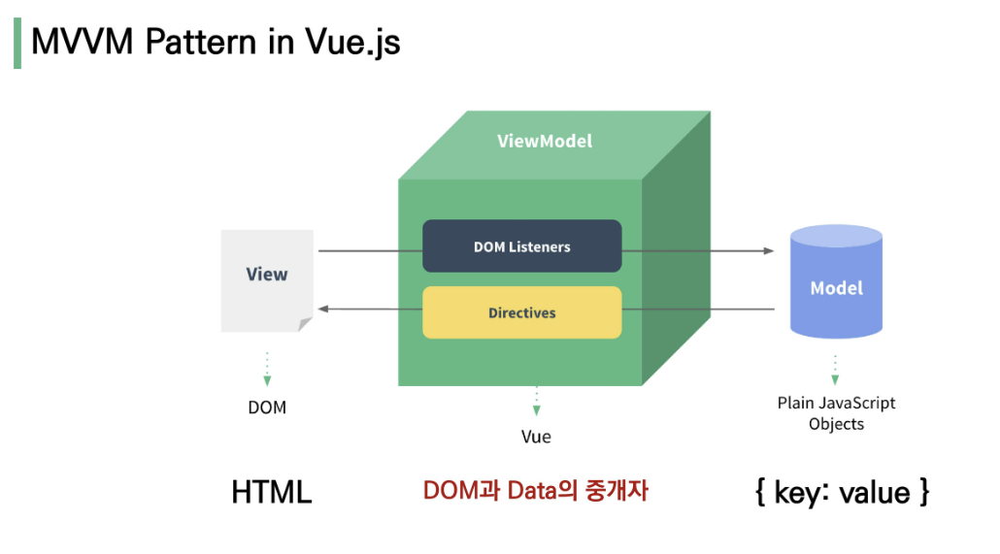


---

### Quick Start of Vue.js

#### Django & Vue.js 코드 작성 순서

**Django**

+ 데이터의 흐름
+ url -> views -> template

**Vue.js**

+ Data가 변화하면 DOM이 변경
+ Data 로직 작성
+ DOM 작성

**따라하기**

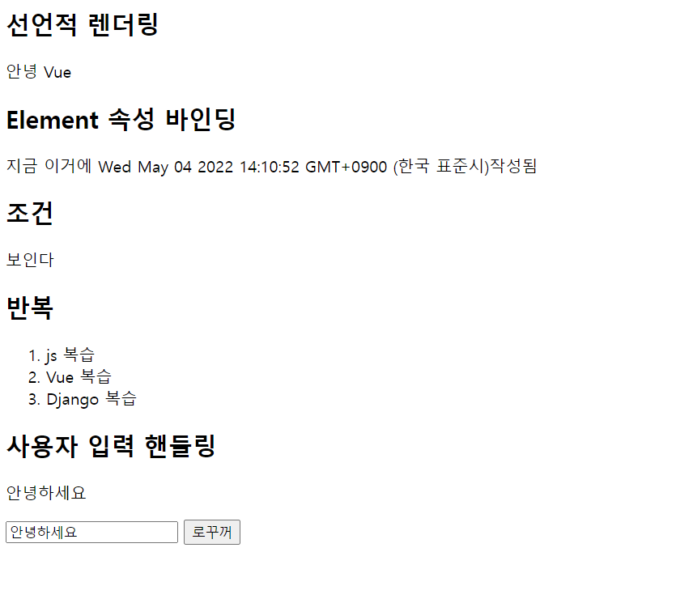

```html
<!DOCTYPE html>
<html lang="ko">
<head>
  <meta charset="UTF-8">
  <meta http-equiv="X-UA-Compatible" content="IE=edge">
  <meta name="viewport" content="width=device-width, initial-scale=1.0">
  <title>Vue Quick Start</title>
</head>
<body>
  <!-- 2. 선언적 렌더링 -->
  <h2>선언적 렌더링</h2>
  <div id="app1">
    {{ message }}
  </div>

  <!-- 3. 엘리멘트 속성 바인딩 -->
  <h2>Element 속성 바인딩</h2>
  <div id="app2">
    {{ message }}
  </div>

  <!-- 4. 조건 -->
  <h2>조건</h2>
  <div id="app3">
    <p v-if="seen">보인다</p>
  </div>

  <!-- 5. 반복 -->
  <h2>반복</h2>
  <div id="app4">
    <ol>
      <li v-for="todo in todos">
        {{ todo.text }}
      </li>
    </ol>
  </div>

  <!-- 6. 사용자 입력 핸들링 -->
  <h2>사용자 입력 핸들링</h2>
  <div id="app5">
    <p>{{ message }}</p>
    <input v-model="message" type="text">
    <button v-on:click="reversedMessage"> 로꾸꺼 </button>
  </div>

  <!-- 1. Vue CDN -->
  <script src="https://cdn.jsdelivr.net/npm/vue/dist/vue.js"></script>

  <script>
    // 2. 선언적 렌더링
    const app1 = new Vue({
      el: '#app1',
      data: {
        message : '안녕 Vue'
      }
    })

    // 3. 엘리먼트 속성 바인딩
    const app2 = new Vue({
      el: '#app2',
      data: {
        message : `지금 이거에 ${new Date()}작성됨`
      }
    })

    // 4. 조건
    const app3 = new Vue({
      el: '#app3',
      data: {
        seen: true
        // seen: false 이러면 안보임
      }
    })

    // 5. 반복
    const app4 = new Vue({
      el: '#app4',
      data : {
        todos: [
          { text : 'js 복습'},
          { text : 'Vue 복습'},
          { text : 'Django 복습'},
        ]
      }
    })

    // 6. 사용자 입력 핸들링
    const app5 = new Vue({
      el: '#app5',
      data : {
        message: '안녕하세요'
      },
      methods : {
        reversedMessage: function () {
          this.message = this.message.split('').reverse().join('')
        }
      }
    })
  </script>
</body>
</html>

```


----

### Basic Syntax of Vue.js


```html
<!DOCTYPE html>
<html lang="ko">
<head>
  <meta charset="UTF-8">
  <meta http-equiv="X-UA-Compatible" content="IE=edge">
  <meta name="viewport" content="width=device-width, initial-scale=1.0">
  <title>Document</title>
</head>
<body>
  <div id="app">
    {{ message }}
    {{ greeting() }}
  </div>

  
  <script src="https://cdn.jsdelivr.net/npm/vue/dist/vue.js"></script>
  <script>
    const app = new Vue({
      el: '#app', // vue 인스턴스에 연결할 기존 DOM요소 가져오기
      data : {		// 데이터 객체, 
        message : '안녕하세요'
      },
      methods : {		// 인스턴스에 추가할 메서드, 화살표 함수 사용하면 안됨
        greeting : function () {
          const newMessage = this.message + `!!!!!!!!!!`
          console.log(newMessage)
          return newMessage
        }
      }
    })
  </script>
</body>
</html>

```


---

### Template Syntax

렌더링 된 DOM을 기본 Vue 인스턴스의 데이터에 선언적으로 바인딩할 수 있는 HTML 기반 템플릿 구문을 사용

1.  **Interpolation(보간법)**

   + Text
     + `<span>메세지 : {{ msg }} </span>`
   + Raw HTML
     + `<span v-html='rawHtml'></span>`
   + Attributes
     + `<div v-bind:id='dynamicId'></div>`
   + JS 표현식
     + {{ number + 1 }}
     + {{ message.split('').reverse().joint('') }}

2. **Directive**

   + `v-`접두사가 있는 특수 속성

   + 속성 값은 단일 JS 표현식이 됨(`v-for`은 예외)

   + **전달인자(Arguments)**

     + `:` 을 통해 전달인자를 받을 수도 있다

     + ```html
       <a v-bind:href='url'> ... </a>
       <a v-on:click='doSomething'>...</a>
       ```

   + **수식어(Modifiers)**

     + `.`으로 표시되는 특수 접미사

     + directive를 특별한 방법으로 바인딩해야함을 나타냄

     + ```html
       <form v-on:submit.prevent='onSubmit'>
           ...
       </form>
       ```

   + `v-text`

     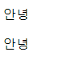

     ```html
     <body>
       <div id="app">
         <!-- 기존 방법 -->
         <p>{{ message }}</p>
         <!-- 이렇게도 불러올 수 있다 -->
         <p v-text="message"></p>
       </div>
       
       <script src="https://cdn.jsdelivr.net/npm/vue/dist/vue.js"></script>
       <script>
         const app = new Vue({
           el: '#app',
           data : {
             message: '안녕'
           }
         })
       </script>
     </body>
     ```

   + `v-html`

   + 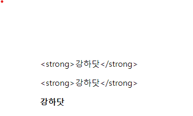

     ```html
     
     <body>
       <div id="app">
         <p>{{ message }}</p>
         <p v-text="message"></p>
         <p v-html="message"></p>
       </div>
       
       <script src="https://cdn.jsdelivr.net/npm/vue/dist/vue.js"></script>
       <script>
         const app = new Vue({
           el:'#app',
           data: {
             message : '<strong>강하닷</strong>'
           }
         })
       </script>
     </body>
     ```

   + `v-show`

     

     ```html
     <body>
       <div id="app">
         <p v-show="isTrue">True</p>
         <!-- isFalse가 False니까 False가 나타나지 않는다 -->
         <p v-show="isFalse">False</p>
       </div>
       
       <script src="https://cdn.jsdelivr.net/npm/vue/dist/vue.js"></script>
       <script>
         const app = new Vue({
           el: '#app',
           data : {
             isTrue : true,
             isFalse : false,
           }
         })
       </script>
     </body>
     ```

   + `v-if, v-else-if, v-else`

     

     ```html
     <body>
       <div id="app">
         <!-- seen === false니까 안 나온다 -->
         <!-- v-show와 다른 점: html 자체에서 사라져있다 -->
         <p v-if="seen">seen is TRUE</p>
     
         <p v-if="myType==='A'">A</p>
         <!-- myType === 'A'니까 안 나온다 -->
         <!-- v-show와 다른 점: html 자체에서 사라져있다 -->
         <p v-else-if="myType==='B'">B</p>
         <p v-else-if="myType==='C'">C</p>
         <p v-else>NOT A/B/C</p>
       </div>
     
       <script src="https://cdn.jsdelivr.net/npm/vue/dist/vue.js"></script>
       <script>
         const app = new Vue({
           el:'#app',
           data: {
             seen: false,
             myType: 'A',
           }
         })
       </script>
     </body>
     ```

   + `v-show`와 `v-if`

     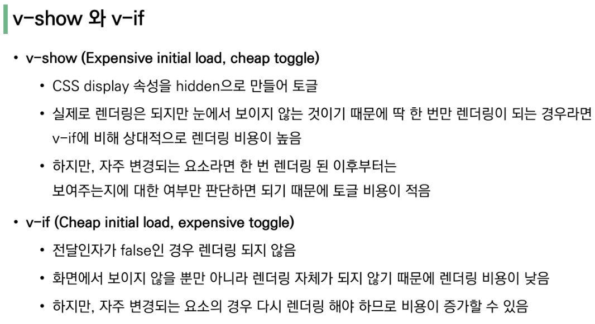

   + `v-for` : 고유한 키값을 전달해주는 것이 필수

   + 가급적 `v-for`와 `v-if`를 동시에 사용하지 말 것

     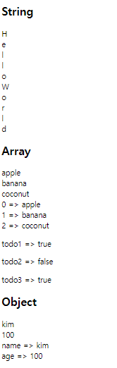

     ```html
     <body>
       <div id="app">
         <h2>String</h2>
         <!--  문자열 하나씩 꺼내기 -->
         <div v-for="char in myStr"> 
           {{ char }}
         </div>
         
         <h2>Array</h2>
         <!-- 배열에서 요소 하나씩 꺼내기 -->
         <div v-for="fruit in fruits">
           {{ fruit }}
         </div>
     
         <!-- 배열에서 요소, 인덱스 꺼내기 -->
         <div v-for="(fruit, idx) in fruits" :key="idx">
           {{ idx }} => {{ fruit }}
         </div>
     
         <!-- 배열에서 요소, 요소 꺼내기 -->
         <div v-for="todo in todos" :key="todo.id">
           <p>{{ todo.title }} => {{ todo.completed }}</p>
         </div>
         
         <h2>Object</h2>
         <!-- 객체에서 값 꺼내기 -->
         <div v-for="value in myObj">
           {{ value }}
         </div>
         <!-- 키와 값 꺼내기 -->
         <div v-for="(value, key) in myObj">
           {{ key }} => {{ value }}
         </div>
       </div>
     
       <script src="https://cdn.jsdelivr.net/npm/vue/dist/vue.js"></script>
       <script>
         const app = new Vue({
           el:'#app',
           data: {
             myStr : 'Hello World',
             fruits : ['apple', 'banana', 'coconut'],
             todos : [
               {id:1, title: 'todo1', completed: true},
               {id:2, title: 'todo2', completed: false},
               {id:3, title: 'todo3', completed: true},
             ],
             myObj: {
               name:'kim',
               age:100,
             }
           }
         })
       </script>
     </body>
     ```

   + `v-bind`

     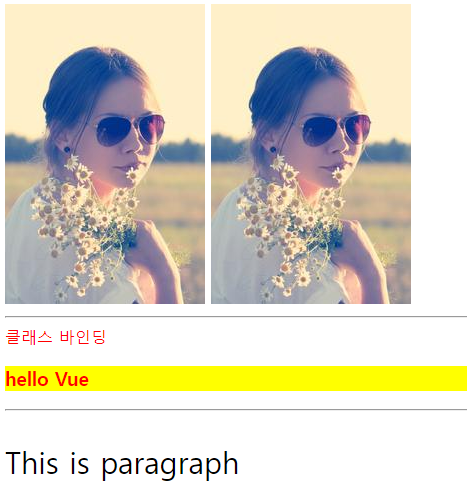

     ```html
     <body>
       <div id="app">
         <!-- 속성 바인딩 -->
         <!-- bind로 연동시킨다 -->
         
         <!-- 축약으로 다음과 같이도 사용 -->
         
     
         <hr>
     
         <!-- 클래스 바인딩 -->
         <!-- active를 활용해서 클래스에 바인드 걸기 -->
         <div :class="{ active : isRed }">
           클래스 바인딩
         </div>
     
         <!-- 이렇게도 클래스 주기 가능 -->
         <h3 :class="[activeRed, myBackground]">
           hello Vue
         </h3>
     
         <hr>
     
         <!-- 스타일 바인딩 -->
         <!-- 자바스크립트는 숫자 더하기 문자가 가능해서 다음과 같이 가능 -->
         <p :style="{ fontSize: fontSize +'px' }">
           This is paragraph
         </p>
       </div>
     
       
       <script src="https://cdn.jsdelivr.net/npm/vue/dist/vue.js"></script>
       <script>
         const app = new Vue({
           el:'#app',
           data: {
             fontSize : 30,
             altMsg : 'This is message',
             imageSrc: 'https://picsum.photos/200/300/',
             isRed: true,
             activeRed : 'active',
             myBackground : 'my-background-color',
           }
         })
       </script>
     </body>
     ```

   + `v-on`: 엘리먼트에 이벤트 리스너를 연결

   + 약어 `@`

   + 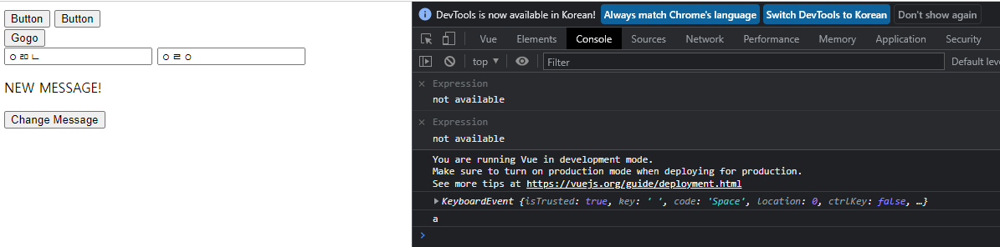

     ```html
     <body>
       <div id="app">
         <!-- 메서드 핸들러 -->
         <button v-on:click="alertHello">Button</button>
         <!-- 약어로 사용 -->
         <button @click="alertHello">Button</button>
     
         <!-- 기본 동작 방지 -->
         <!-- form 제출 후 새로고침 방지 -->
         <form action="" @submit.prevent="alertHello">
           <button>Gogo</button>
         </form>
     
         <!-- 키 별칭을 이용한 키 입력 수식어 -->  
          <!-- 특정키 입력될 경우 이벤트 실행  -->
         <input type="text" @keyup.space="log"> 
         <!--  cb 함수 특별 문법 () -->
         <!-- 원래는 log라는 함수에 'a'를 넣어 실행하겠다인데 -->
         <!-- console.log('a')와 같이 행위가 일어남 -->
         <input type="text" @keyup.enter="log('a')">
     
         <p>{{ message }}</p>
         <button @click="changeMessage">Change Message</button>
     
       </div>
       
       <script src="https://cdn.jsdelivr.net/npm/vue/dist/vue.js"></script>
       <script>
         const app = new Vue({
           el: '#app',
           // 값
           data:{
             message: 'Hello Vue',
           },
           // 행동
           methods : {
             alertHello : function () {
               alert('hello')
             },
             log : function (event) {
               console.log(event)
             },
             changeMessage() {
               this.message = 'NEW MESSAGE!'
             }
             }
           }
         )
       </script>
     </body>
     ```

   + `v-model` : HTML form 요소의 값과 data를 양방향 바인딩

   + 수식어

     + `.lazy` 
       + input 대신 change 이벤트 이후 동기화
     + `.number`
       + 문자열을 숫자로 변경
     + `.trim`
       + 입력에 대한 trim을 진행

     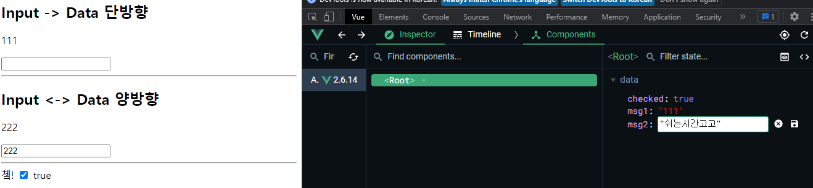

     ```html
     <body>
       <div id="app">
         <h2>Input -> Data 단방향</h2>
         <p>{{ msg1 }}</p>
         <input type="text" @input="onInputChange">
         <hr>
         <!-- v-model을 활용해 양방향 소통 가능 -->
         <!-- 데이터 값을 변경하면 Input에도 영향 -->
         <h2>Input <-> Data 양방향</h2>
         <p>{{ msg2 }}</p>
         <input type="text" v-model="msg2">
         <hr>
         쳌! <input id="box" type="checkbox" v-model="checked">
         <label for="box">{{ checked }}</label>
     
       </div>
     
       <script src="https://cdn.jsdelivr.net/npm/vue/dist/vue.js"></script>
       <script>
         const app = new Vue({
           el:'#app',
           data: {
             msg1:'111',
             msg2:'222',
             checked:true,
           },
           methods : {
             onInputChange (event){
               this.msg1 = event.target.value
             }
           },
         })
       </script>
     </body>
     ```

   + **computed&methods**

     + 함수 형태로 정의하지만 값으로 존재한다.
     + 종속된 데이터에 따라 저장되고, 종속 데이터가 변경될 때만 함수 실행된다.
     + 즉, 어떤 데이터도 의존하지 않는 computed 속성의 경우 절대로 업데이트 되지 않는다. 반드시 반환값이 필요하다.

     

     ```html
     <body>
       <div id="app">
         <div>
           <input type="text" v-model="message">
         </div>
         <p>Original : <strong>{{ message }}</strong></p>
         <!-- 함수니까 ()로 실행시킨다. -->
         <p>Reverse by Method <strong>{{ reverseMsg() }}</strong></p>
         <!-- 값으로 존재하기 때문에 ()으로 실행하지 않는다 -->
         <p>Reverse by Computed <strong>{{ reversedMsg }}</strong></p>
     
       </div>
       
       <script src="https://cdn.jsdelivr.net/npm/vue/dist/vue.js"></script>
       <script>
         const app = new Vue({
           el: '#app',
           data: {
             message: 'Original',
             other: 'asdg'
           },
           methods : {
             // data를 바꾸는 로직(setter 함수들)
             reverseMsg(){
               return this.message.split('').reverse().join('')
             }
           },
           computed : {
             // data를 통한 값을 얻음(getter 함수들)
             // (data에 의존하는) 계산된 값
             // 이름을 명사형으로 짓는다
             // 함수지만 값으로써 존재한다.
             reversedMsg() {
               // 이 예시에서는 message가 변할 때만 computed값이 변경된다.
               // data의 other이 아무리 변경되어도 reversedMsg의 값은 그대로. 계산 X
               return this.message.split('').reverse().join('')
             }
           }
           }
         )
       </script>
     </body>
     ```

   + **computed_watch**

     + 명령형 프로그래밍 방식 (우리는 선언형을 선호하기때문에 남용하지 말것)
     + 잘 쓸 곳이 없다

     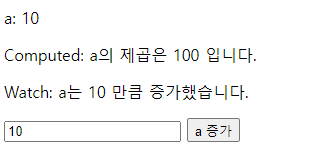

     ```html
     <body>
       <div id="app">
         <p>a: {{ a }}</p>
         <p>Computed: a의 제곱은 {{ square }} 입니다.</p>
         <p>Watch: a는 {{ increase }} 만큼 증가했습니다.</p>
         <input type="number" v-model.number="delta">
         <button @click="a += delta">a 증가</button>
       </div>
     
       <script src="https://cdn.jsdelivr.net/npm/vue/dist/vue.js"></script>
       <script>
         const app = new Vue({
           el: '#app',
           data: {
             a: 0,
             delta: 0,
             increase: 0,
           },
           computed: {
             square: function () {
               console.log('Computed !')
               return this.a**2
             }
           },
           watch: {
             // a가 변경되면 변경된 값을 콜백함수의 첫번째 인자로 전달하고 이전 값을 두번째 인자로 전달
             // computed는 새 프로퍼티를 생성하지만 watch는 아무 프로퍼티도 생성하지 않고 익명함수는 단순히 콜백함수 역할만 함
             // watch에 명시된 프로퍼티는 감시할 대상을 의미할 뿐임
             // 특정 data의 변경에 맞춰서 변경한다.
             a: function (newValue, oldValue) {
               console.log('Watch !')
               this.increase = newValue - oldValue
             }
           }
         })
       </script>
     </body>
     ```

   + **computed&html**

     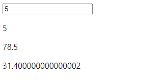

     ```html
     <body>
       <div id="app">
         <input type="text" v-model="r">
         <p>{{ r }}</p>
         <p>{{ area }}</p>
         <p>{{ perim }}</p>
       </div>
       
       <script src="https://cdn.jsdelivr.net/npm/vue/dist/vue.js"></script>
       <script>
         const app = new Vue({
           el:'#app',
           data: {
             r:2,
           },
           computed:{
             area : function () {
               return this.r **2 * 3.14
             },
             perim : function () {
               return this.r *2 * 3.14
             }, 
           }
         })
       </script>
     </body>
     ```

   + **filter**

     + 자바스크립트 표현식 마지막에 `|`와 함께 추가되어야함

     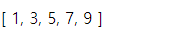

     ```html
     <body>
       <div id="app">
         {{ numbers | getOddNumbers | getUnderTen}}
         <!-- 보통은 computed로 사용한다 -->
         {{ getOddNumbersTen }}
       </div>
     
       <script src="https://cdn.jsdelivr.net/npm/vue/dist/vue.js"></script>
       <script>
         const app = new Vue({
           el: '#app',
           data: {
             numbers: [1, 2, 3, 4, 5, 6, 7, 8, 9, 10, 11, 12, 13, 14, 15],
           },
           filters: {
             getOddNumbers(array) {
               return array.filter(num => num %2)
             },
             getUnderTen(array) {
               return array.filter(num => num < 10)
             },
           },
           // 보통은 computed로 사용한다
           computed: {
             getOddNumbersTen() {
               return this.numbers.filter(num => num %2 && num < 10)
             }
           }
         })
       </script>
     </body>
     ```

     

---

### Lifecycle Hooks

각 인스턴스는 생성될 떄 일련의 초기화 단계를 거침

그 과정에서 사용자 정의 로직을 실행할 수 있는 Lifecycle Hooks도 호출됨

공식 문서를 통해 각 라이프사이클훅스를 참고할 것


```html
<body>
  <div id="app">
    <!-- imgSrc가 비어있다면 html에서도 사라져있따 -->
    <!-- imgSrc가 있다면 src와 연결해주자 -->
    
    <!-- 버튼 클릭시 강아지 받아오자 -->
    <button @click="getImg">GetDog</button>
  </div>
  
  <script src="https://cdn.jsdelivr.net/npm/axios/dist/axios.min.js"></script>
  <script src="https://cdn.jsdelivr.net/npm/vue/dist/vue.js"></script>
  <script>
    const API_URL = 'https://dog.ceo/api/breeds/image/random'
    const app = new Vue({
      el: '#app',
      data: {
        imgSrc: '',
      },
      methods: {
        getImg: function () {
          axios.get(API_URL)
            .then(response => {
              // 멍멍이 사진 응답을 받아온다면, imgSrc에 해당값을 넣어주자.
              this.imgSrc = response.data.message
            })
        }
      },
      // view 인스턴스가 생성될 때 getImg를 실행하라
      // 초기부터 강아지 사진을 받아오자!
      // 대부분 created를 사용하고 외부 API에서 초기 데이터 받아올 때 사용
      created : function () {
        this.getImg()
      }
    })
  </script>
</body>
```


