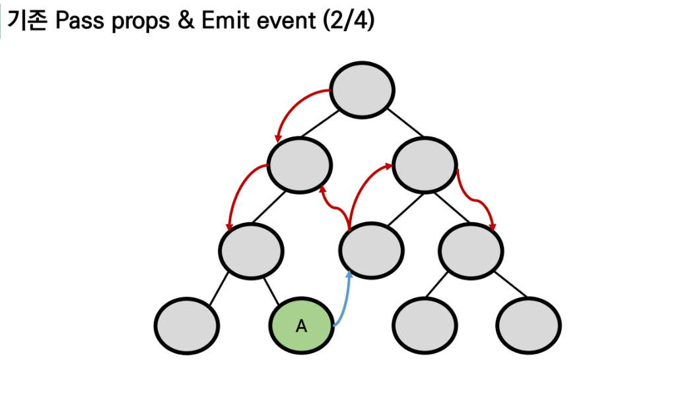
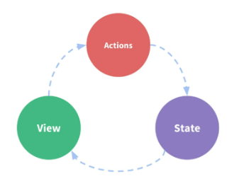
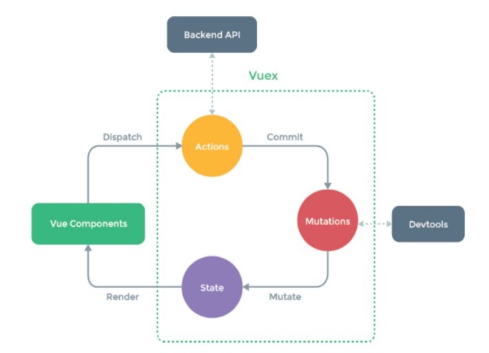
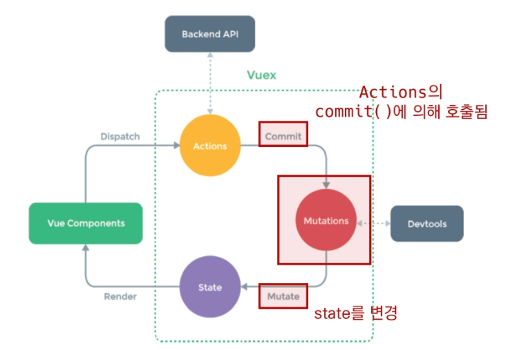
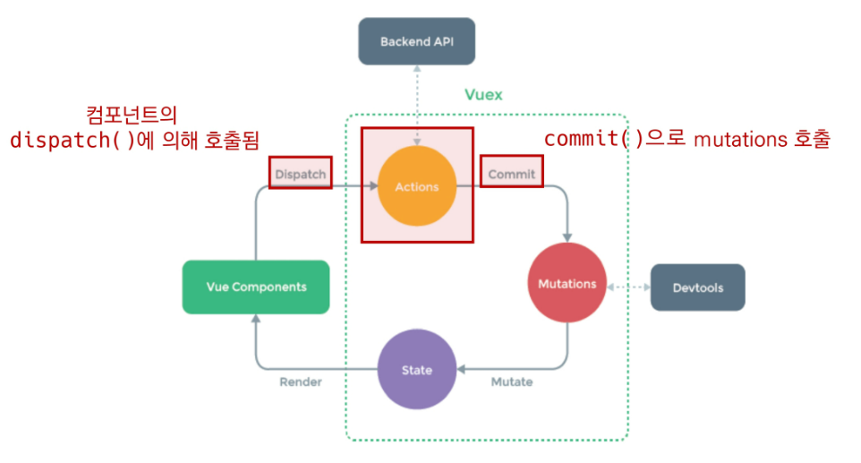
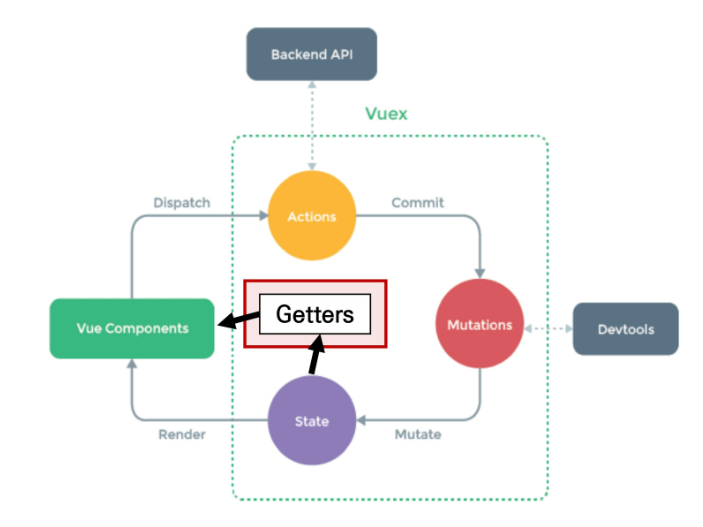
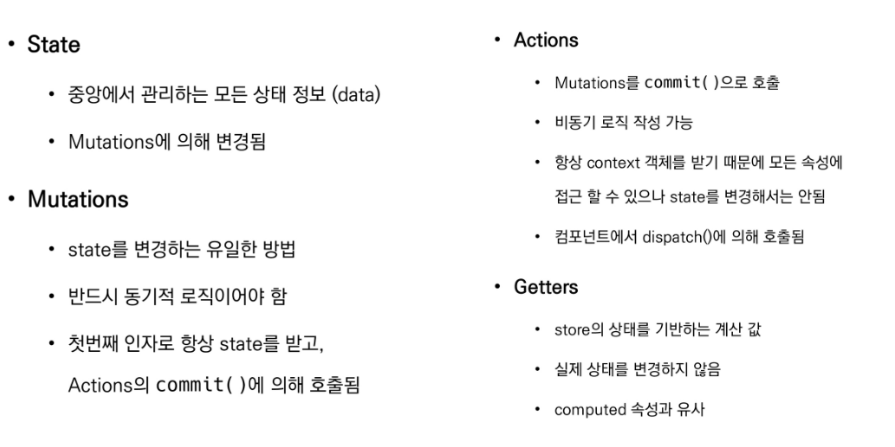
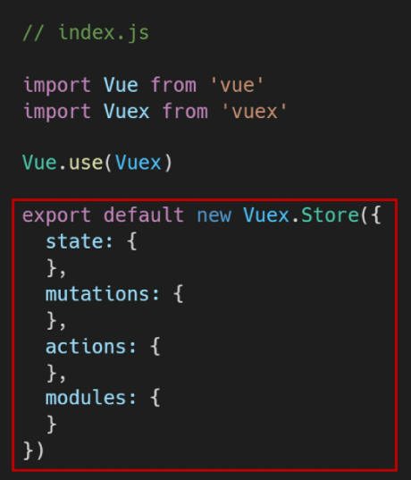
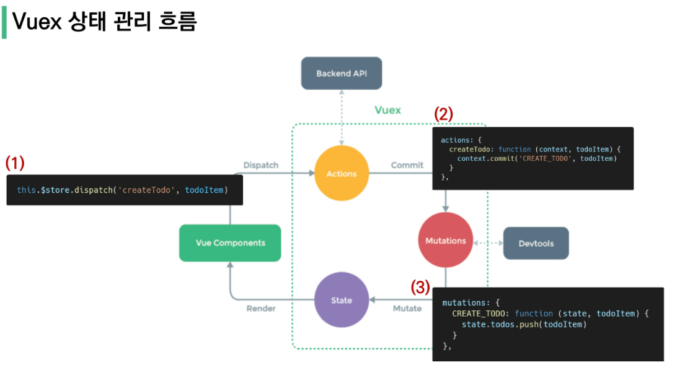
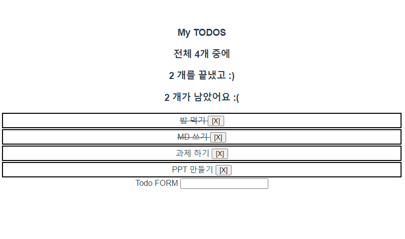

### Vue  컴포넌트간 데이터 통신과 Vuex

---

### Vuex

+ 상태관리 패턴 + 라이브러리
+ 상태를 전역 저장소로 관리할 수 있도록 지원하는 라이브러리
  + 상태가 예측가능한 방식으로만 변경될 수 있도록 보장하는 규칙 설정
  + 애플리케이션의 모든 컴포넌트에 대한 **중앙 집중식 저장소** 역할
+ Vue의 공식 devtools와 통합, 기타 고급 기능을 제공


#### State

+ state는 곧 data며, 해당 애플리케이션의 핵심이 되는 요소
+ 중앙에서 관리하는 모든 상태 정보


#### 상태관리패턴

+ 컴포넌트의 공유된 상태를 추출, 전역에서 관리
+ 컴포넌트는 커다란 veiw가 되며 모든 컴포넌트는 트리에 상관없이 상태에 액세스하거나 동작을 트리거할 수 있음
+ 상태 관리 및 특정 규칙 적용과 관련된 개념을 정의하고 분리함으로, 코드 구조와 유지관리기능 향상


#### 기존 pass props & emit event

+ 각 컴포넌트는 독립적으로 데이터 관리
+ 데이터는 단방향 흐름으로 부모->자식 전달만 가능하며, 반대의 경우 이벤트 트리거
+ 장점 : 데이터 흐름을 직관적으로 파악 가능
+ 단점 : 
  + 컴포넌트 중첩이 깊어지는 경우, 동위 관계의 컴포넌트로 데이터 절달이 불편
  + 공통 상태를 공유하는 여러 컴포넌트가 있는 경우 데이터 전달구조가 매우 복잡해짐
    + ex) 지나치게 중첩된 컴포넌트를 통과하는 prop



+ 단방향 데이터 흐름

  + state는 앱을 작동하는 원본소스(data)

  + view는 state의 선언적 매핑

  + action은 view에서 사용자 입력에 대해 반응적으로 state를 바꾸는 방법

    


#### Vuex management pattern

+ 중앙 저장소에 state를 모아놓고 관리
+ 규모가 큰(중첩이 깊은) 프로젝트에서 매우 효율적
+ 각 컴포넌트에서는 중앙집중저장소의 state만 신경쓰면 됨
  + 동일한 state를 공유하는 다른 컴포넌트들도 동기화 됨


+ #### 단방향 흐름에 의존한 state(상태) 관리

  + 부모 자식 간의 컴포넌트 관계가 단순하거나 depth가 깊지 않은 경우에는 문제가 없다
    + 몇단계만 거치면 데이터를 쉽게 이동시킬 수 있으며, 훨씬 직관적 파악이 가능
  + 하지만 규모가 커질 경우 상태관리가 어려워짐
    + 상태를 공유하는 컴포넌트의 상태 동기화 관리가 어려움
    + 상태를 전달할 떄 상->하 로만 가능
  + A 컴포넌트의 상태를 공유하는 다른 컴포넌트에 pass props&emit event를 통해 동기화해야함

  

* #### Vuex를 활용한 state 관리

  * 상태 변화에 따른 여러 흐름을 모두 관리해야하는 불편함을 해소할 필요가 있다
    * 상태는 데이터를 주고 받는 컴포넌트 사이의 관계도 충분히 고려해야하기 때문에 상태흐름 관리가 매우 중요해짐
  * 결국 이러한 상태를 '올바르게 관리하는 저장소'의 필요성을 느끼게 됨
    * 상태를 한 곳(store)에 모아놓고 관리하자
    * 상태의 변화는 모든 컴포넌트에서 공유
    * 상태의 변화는 오로지 Vuex가 관리하여 해당 상태를 공유하고 있는 모든 컴포넌트는 변화에 반응
  * A 컴포넌트와 같은 상태를 공유하는 다른 컴포넌트는 신경쓰지 않고, 오로지 상태 변화를 Vuex에 알림


---

### Vuex Core Concepts

#### Vuex 핵심컨셉




##### State

+ 중앙에서 관리하는 모든 상태 정보(data)

  + vuex는 single state tree 사용
  + 단일 객체는 모든 애플리케이션 상태를 포함하는 '원본소스' 역할을 함
  + 이는 각 애플리케이션마다 하나의 저장소만 갖게 된다는 것을 의미

+ 여러 컴포넌트 내부의 state를 중앙에서 관리

  + 이전에는 state를 찾기 위해 각 컴포넌트를 직접 확인해야했지만, vuex store에서 각 컴포넌트에 사용하는 state를 한 눈에 파악 가능하게 되었다

+  state가 변화하면 해당 state를 공유하는 여러 컴포넌트의 DOM은 알아서 렌더링

  

##### Mutations

+ 실제로 state를 변경하는 유일한 방법
+ mutation의 핸들러함수는 반드시 동기적이어야함
  + 비동기적 로직(콜백함수)는 state가 변화하는 시점이 의도한 것과 달라질 수 있으며, 콜백이 실제로 호출 될 시기를 알 수 있는 방법이 없음(추적 불가)
+ 첫번째 인자로 항상 state를 받음
+ Actions에서 `commit()` 메서드에 의해 호출됨
  


##### Actions

+ mutation과 유사하지만 차이점이 있다

  + state를 변경하는 대신 mutations를 `commit()` 메서드로 호출해서 실행
  + mutations와 달리 비동기 작업이 포함될 수 있음
    + Backend API와 통신하여 Data Fetching 등의 작업 수행

+ `context` 객체 인자를 받음

  + context 객체를 통해 store/index.js 파일 내의 모든 요소 속성 접근&메서드 호출 가능
  + 단 State 를 직접 변경하지 않는다

+ 컴포넌트에서 `dispatch()` 메서드에 의해 호출됨

+ Actions를 통해 state를 조작할 수 있지만 **state는 오로지 mutations를 통해서만 조작해야함**

  + 명확할 역할 분담을 통해 서비스 규모가 커져도 state를 올바르게 관리하기 위함

  


##### Getters

+ state를 변경하지 않고 활용하여 계싼을 수행
  + compute를 사용하는 것처럼 getters는 저장소의 상태를 기준으로 계산
  + 예를 들어, state에 todoList라는 해야할 일의 목록의 경우 완료된 todo 목록만을 필터링해서 출력해야하는 경우가 있음
+ computed 속성과 마찬가지로 getters의 결과는 state 종속성에 따라 캐시되고, 종속성이 변경된 경우에만 다시 재계산됨
+ getters 자체가 state를 변경하지 않음
  + state를 특정 조건에 따라 구분(계산)만 함
  + 즉, 계산된 값을 가져옴




##### 정리




---


#### [실습] Vuex Todo App

```shell
$ vue create vue-todoapp-vuex
$ cd todoapp
$ vue add vuex
```

*  vuex로 인한 변화

  * store 디렉토리 생성

  * index.js 생성

    * vuex core concepts가 작성되는 곳

      





#### [state, getters, mutations, actions 실습]



##### components

TodoForm.vue

```vue
<template>
  <div>
    Todo FORM
    <!-- 입력 input 공백 없애기 위해 trim -->
    <input 
      type="text"
      @keyup.enter="createTodo"
      v-model.trim="todoTitle">
  </div>
</template>

<script>


export default {
  name: 'TodoForm',
  data(){
    return {
      todoTitle:''
    }
  },
  methods: {
    createTodo(){
      const newTodo = {
        title: this.todoTitle,
        isCompleted: false,
        date: new Date().getTime()
      }
      this.$store.dispatch('createTodo', newTodo)
      // 입력 후에 form 빈칸으로 reset하기
      this.todoTitle = ''
    }
  }

}
</script>

<style>

</style>
```

TodoList.vue

``` vue
<template>
  <div>
    <!-- 중앙 state에 바로 접근, key 필요 -->
    <todo-list-item 
      v-for="todo in todos"
      :key="todo.date"
      :todo="todo">
      
      </todo-list-item>
  </div>
</template>

<script>
// import TodoListItem from './TodoListItem.vue'
import TodoListItem from '@/components/TodoListItem.vue'

import { mapState } from 'vuex'
// import { mapState, mapMutations } from 'vuex'

export default {
  name:'TodoList',
  components: {
    TodoListItem,
  },
  // <todo-list-item v-for="todo in $store.state.todos":key="todo.date">
  // 로 쓰지만 우리는 todo in todos가 더 쓰기 편하다
  // computed로 todos를 정의해서 사용하게 된다
  computed: {
    ...mapState(['todos'])

    // todos(){
    //   return this.$store.state.todos
    // }
  },
  // methods: {
  //   ...mapMutations(['LOAD_TODOS'])
  // },
  // created(){
  //   this.LOAD_TODOS()
  // }
}
</script>

<style>

</style>
```

TodoListItem.vue

```vue
<template>
  <div>
    <span 
      @click="updateTodoStatus(todo)"
      :class="{ 'is-completed' : todo.isCompleted}">
    {{ todo.title }}
    </span>
    <!-- 특수 문법 -->
    <!-- click할 때, deleteTodo 걸어두고 인자로 todo 같이 넘겨주세요 -->
    <!-- method에서 ...mapActions을 사용하니까 인자를 이 방법으로 넘겨주어야한다. -->
    <button @click="deleteTodo(todo)">[X]</button>
  </div>
</template>

<script>
import { mapActions } from 'vuex'

// mapActions(['deleteTodo', 'createTodo']) == 
// {deleteTodo: function () {}, createTodo: function(){} }


export default {
  name:'TodoListItem',
  props: {
    todo: Object,
  },
  methods: {
    // deleteTodo(){
      //   // store에 삭제 요청하기
    //   this.$store.dispatch('deleteTodo', this.todo)
    // }

    // 이렇게 말고 actions의 'deleteTodo' 함수를 바로 쓰고 싶다.
   ...mapActions(['deleteTodo', 'updateTodoStatus']),
  //  { deleteTodo: function () {}, 
  //    updateTodoStatus: function(){} } 와 같은 형태이다.
  
  //  myMethod는 index에 정의한 함수 말고 내가 추가해서 쓰고 싶은거 저렇게 씀
   myMethod(){}
  }
}
</script>

<style scoped>
.is-completed {
  text-decoration: line-through;
}

span{
  cursor: pointer;
}

div {
  border: 2px solid black;
  margin: 2px;
  padding: 2px;
}
</style>
```

##### store/index.js

```javascript

import Vue from 'vue'
import Vuex from 'vuex'
import createPersistedState from 'vuex-persistedstate'

Vue.use(Vuex)

export default new Vuex.Store({
  plugins: [
    createPersistedState()
  ],

  state: {  // data
    todos: [],
  },
  getters: {  //computed
    // 전체 일 개수
    allTodoCount(state){
      return state.todos.length
    },
    // 현재 끝난 일의 개수
    completedTodosCount(state){
      return state.todos.filter(todo => {
        return todo.isCompleted === true
      }).length
    },
    // 안 끝난 일의 개수
    uncompletedTodosCount(state){
      return state.todos.filter(todo => {
        return !todo.isCompleted
      }).length
    },
  },
  mutations: {  // methods => change
    // mutations name은 상수로 작성하는 것을 권장
    // state를 기본 첫 인자로 받으며, 필요한 데이터는 두 번째 인자로 받는다
    // LOAD_TODOS(state){
    //   const todosString = localStorage.getItem('todos')
    //   state.todos = JSON.parse(todosString)
    // },
    
    CREATE_TODO(state, newTodo){
      state.todos.push(newTodo)
    },
    DELETE_TODO(state, todoItem){
      const index = state.todos.indexOf(todoItem)
      state.todos.splice(index, 1)
    },
    UPDATE_TODO_STATUS(state, todoItem){
      state.todos = state.todos.map(todo => {
        if (todo == todoItem) {
        todo.isCompleted = !todo.isCompleted
        }
        return todo
      })
    },
  },
  actions: {  // methods => !change
    
    // console에서 localStorage에 데이터 저장하는 방법
    saveTodos({ state }){
      const jsondata = JSON.stringify(state.todos)
      localStorage.setItem('todos', jsondata)
    },

    // mutations을 한번 더 포장
    // context => 맥가이버 칼
    // 기존 createTodo를 아래와 같이 재구조화 가능
    // createTodo(context, newTodo){
    //   context.commit('CREATE_TODO', newTodo)
    // }
    createTodo(context, newTodo){
      context.commit('CREATE_TODO', newTodo)
      // context.dispatch('saveTodos')

    },
    deleteTodo({ commit }, todoItem){
      if (confirm('진짜 삭제하실?')){
      commit('DELETE_TODO', todoItem)
      // dispatch('saveTodos')

    }
    },
    updateTodoStatus({ commit }, todoItem){
      commit('UPDATE_TODO_STATUS', todoItem)
      // updateTodoStatus({ commit,dispatch }, todoItem){
        // commit('UPDATE_TODO_STATUS', todoItem)
        // dispatch('saveTodos')
    },
  },
  modules: {
  }
})

```

##### App.vue

```vue
<template>
  <div id="app">
    <h3>My TODOS</h3>
    <h3>전체 {{ allTodoCount }}개 중에</h3>
    <h3>{{ completedTodosCount }} 개를 끝냈고 :) </h3>
    <h3>{{ uncompletedTodosCount }} 개가 남았어요 :(</h3>
    
    <todo-list></todo-list>
    <todo-form></todo-form>
  </div>
</template>


<script>
import TodoForm from './components/TodoForm.vue'
import TodoList from './components/TodoList.vue'

import { mapGetters } from 'vuex'

export default {
  name: 'App',
  components: {
    TodoList,
    TodoForm
  },
  // data로 받아오면 안된다. computed로 받아와야함
  // data가 변하면 state가 바뀌게 되면서 vue가 힘들어한다
  // 오직 state는 mutations로만 바꾼다
  // 값을 가져올 때 computed로 받아오자
  computed: {
    ...mapGetters([
      'allTodoCount',
      'completedTodosCount',
      'uncompletedTodosCount',
    ])
  }
}
</script>

<style>
#app {
  font-family: Avenir, Helvetica, Arial, sans-serif;
  -webkit-font-smoothing: antialiased;
  -moz-osx-font-smoothing: grayscale;
  text-align: center;
  color: #2c3e50;
  margin-top: 60px;
}
</style>

```


---

#### Local Storage

위 실습간에 문제점 = 서버가 없어서 새로고침하면 목록이 모두 사라진다.

**Vuex-persistedstate**

+ Vuex state를 자동으로 브라우저의 LocalStorage에 저장해주는 라이브러리
+ 페이지가 새로고침 되어도 Vuex state를 유지시킴

```shell
$ npm i vuex-persistedstate
```

```javascript
// 라이브러리 사용
// index.js
import createPersistedState from 'vuex-persistedstate'

Vue.use(Vuex)

export default new Vuex.Store({
  plugins: [
    createPersistedState()
  ],
```


---

### 마무리

#### 그냥 mutations로만 state 변경하면 안될까?

+ 가능하다
  + 단 저장소의 각 컨셉(state, getter, mutations, actions)은 각자 역할이 존재하도록 설계되어 있음
+ 물론 우리가 작성한 todoapp처럼 actions 로직이 특별 작업 없이 단순 mutations만을 호출하는 경우도 있으나, 이 경우는 Vuex 도입의 적절성을 판단할 필요가 있다

#### 언제 사용해야할까?

+ 앱이 단순하다면 Vuex가 없는것이 적절할 수 있다.
+ 중대형 규모의 SPA 구축하는 경우 Vuex는 자연스럽게 선택하게 된다
+ 결과적으로 역할에 적절한 상황에서 활용할 때, 효용 극대화