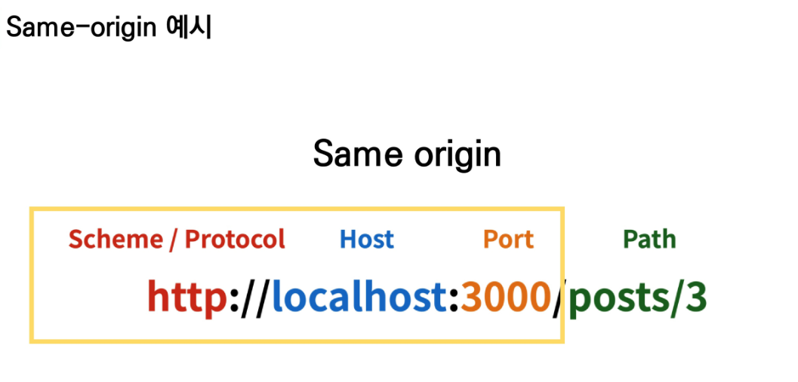
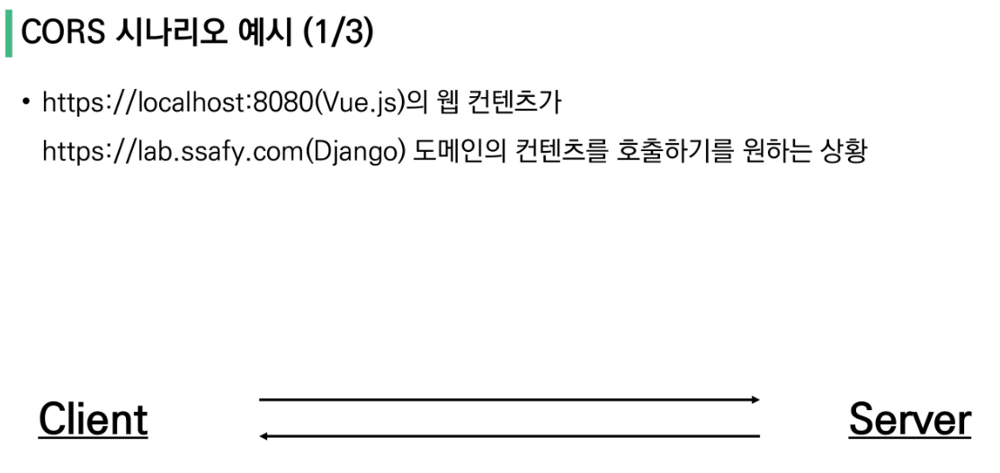
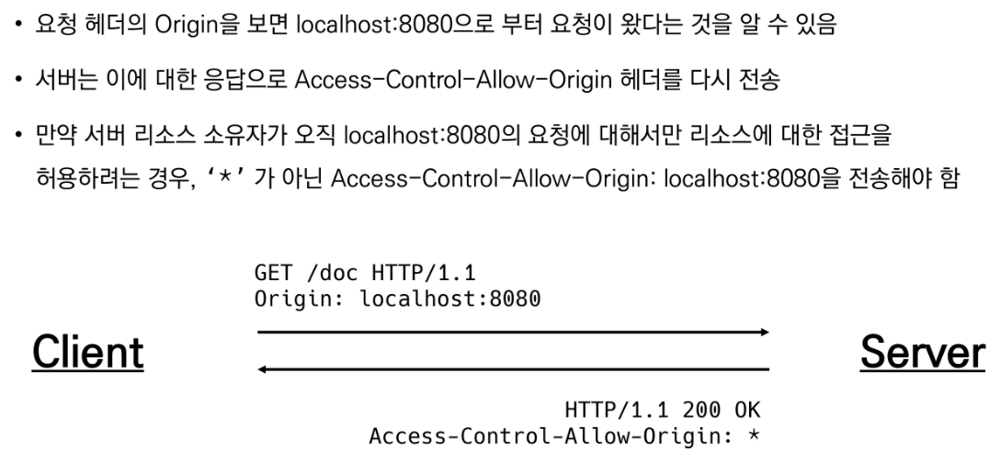
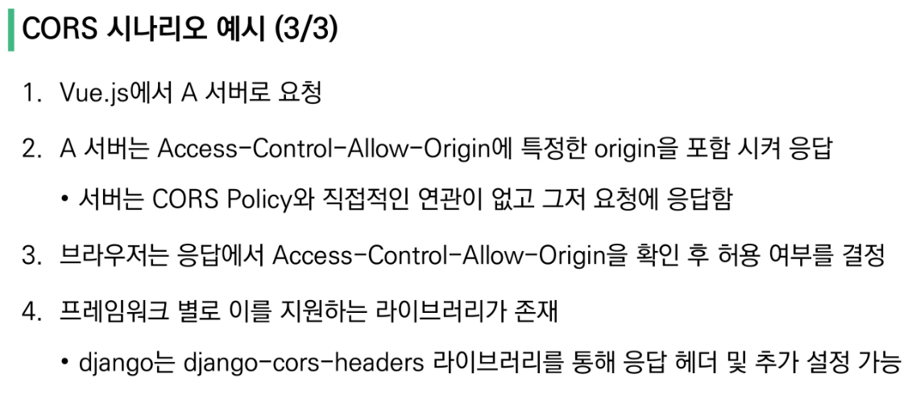
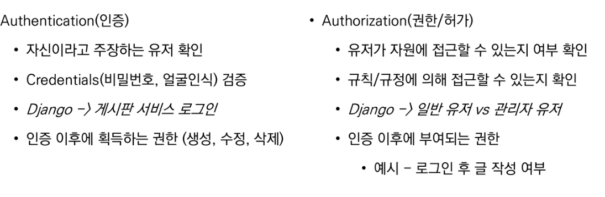
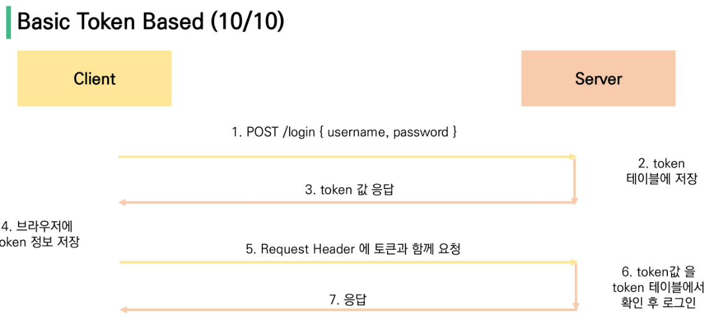
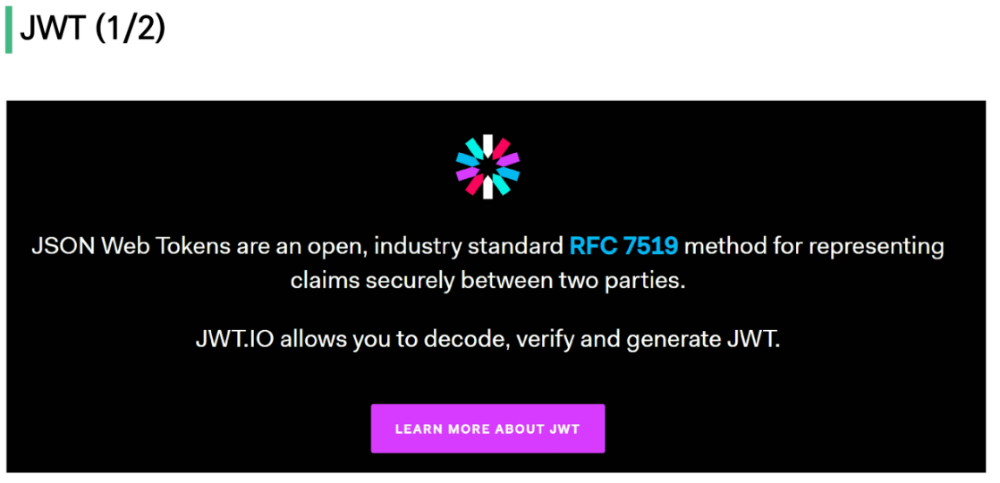
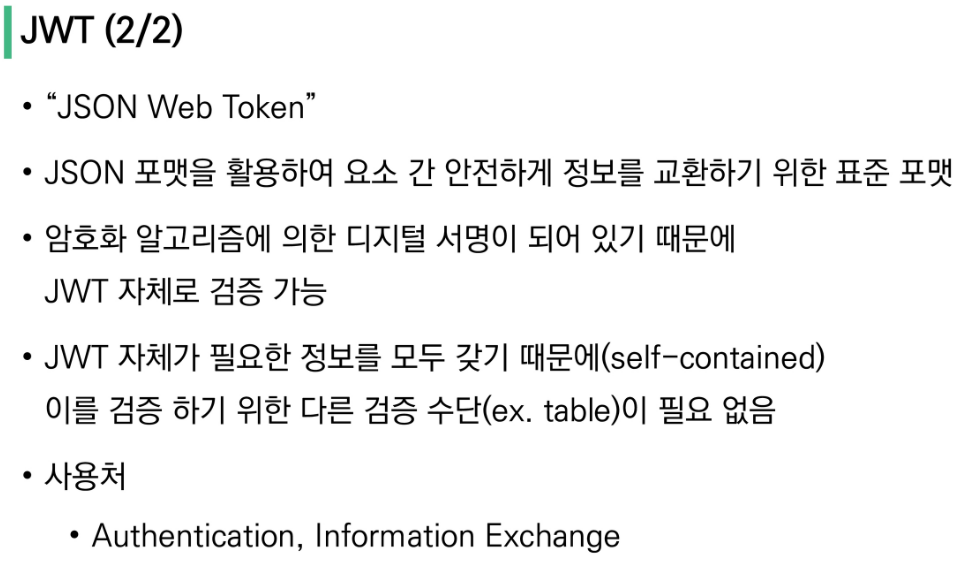
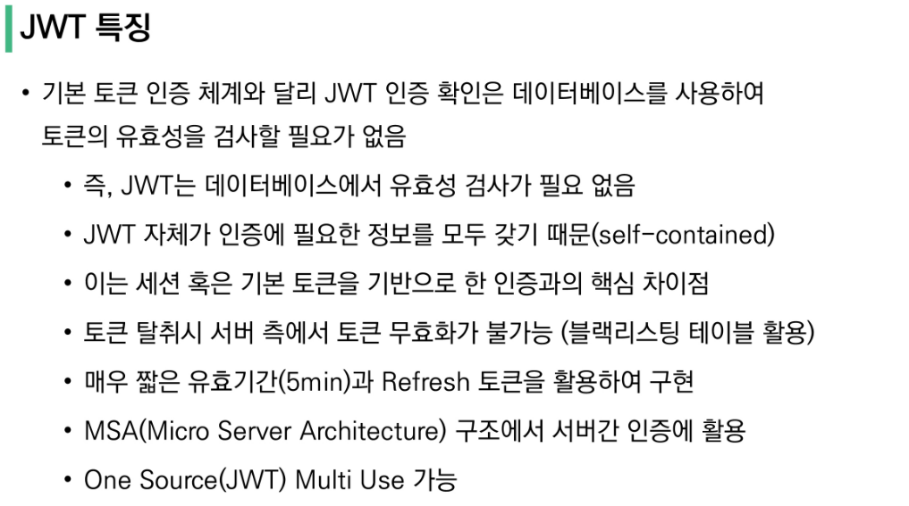

### Vue_API 활용

---

#### Server & Client

**Server** : "정보 제공"

- 클라이언트에게 '정보', '서비스'를 제공하는 컴퓨터 시스템

- 정보&서비스 - Django를 통해 응답한 template, DRF를 통해 응답한 JSON

**Client** : "정보 요청&표현"

+ 서버에게 **리소스를 요청**하고, 
+ 요청을 위해 필요한 인자를 **서버가 요구하는 방식에 맞게 제공**하며, 
+ 서버로부터 반환되는 응답을 **사용자에게 적절한 방식으로 표현**하는 기능을 가진 시스템

---

#### CORS(SOP를 극복하는 방법)

**"동일 출처 정책"(SOP(Same-origin policy))**

특정 출처에서 불러온 문서나 스크립트가 다른 출처에서 가져온 리소스와 상호작용하는 것을 제한하는 보안 방식

잠재적으로 해로울 수 있는 문서를 분리함으로써 공격받을 수 있는 경로를 줄임



**CORS(Cross-Origin Resource Sharing)**

- 교차 출처 리소스 공유
- **추가 HTTP header를 사용**하여, 특정 출처에서 실행중인 웹 애플리케이션이 **다른 출처의 자원에 접근할 수 있는 권한을 부여하도록 브라우저에 알려주는 체제**
- 리소스가 자신의 출처(Domain, Protocol, Por)와 다를 때 교차 출처 HTTP 요청을 실행
- 다른 출처의 리소스를 불러오려면 그 출처에서 **올바른 CORS header를 포함한 응답**을 반환해야함
- CORS는 HTTP의 일부로, 어떤 호스트에서 자신의 컨텐츠를 불러갈 수 있는지 **서버에 지정할 수 있는 방법** 
- CORS HTTP 응답 헤더 예시
  - `Access-Control-Allow-Origin`
  - `Access-Control-Allow-Credentials`
  - `Access-Control-Allow-Headers`
  - `Access-Control-Allow-Methods`

**`Access-Control-Allow-Origin: *`**

+ 브라우저 리소스에 접근하는 임의의 origin으로부터 요청을 허용한다고 알리는 응답에 포함
+ `*` 은 모든 도메인에서 접근할 수 있음을 의미
+ `*` 외의 특정 origin 하나를 명시할 수 있음
  + 
  + 
  + 

#### `django-cors-headers` 라이브러리 등록 **

+ 응답에 CORS header를 추가해주는 라이브러리
+ 다른 출처에 보내는 Django 애플리케이션에 대한 브라우저 내 요청을 허용함
+ Django App이 header 정보에 CORS를 설정한 상태로 응답을 줄 수 있게 도와주며, 이 설정을 통해 브라우저는 다른 origin에서 요청을 보내는 것이 가능해짐

```shell
$ pip install django-cors-headers
```

```python
# settings.py
...
INSTALLED_APPS = [
    ...
    'corsheaders',
    ...
]

# middleware 설정
MIDDLEWARE = [
    'corsheaders.middleware.CorsMiddleware',
    ...
]

# 특정 origin에게만 교차 출처 허용
# CORS_ALLOWED_ORIGINS = [
#     # Vue LocalHost
#     'http://localhost:8080',
# ]

# 모두에게 교차출처 허용
CORS_ALLOW_ALL_ORIGINS = True
```

---

#### Authentication & Authorization

**Authentication**

* 인증, 입증, 내가 누구인지
* 사원증 그 자체(건물 입장시 필요한 것)

**Authorization**

* 권한 부여, 허가
* 부장급만 접근 가능, 과장급만 접근 가능 등의 권한
* 인증이 되었어도 모든 권한을 부여 받는 것은 아니다
* 

---

#### DRF Authentication

##### 다양한 인증 방식

1. Session Based
2. Token Based
   + **Basic Token**
   + **JWT**
3. Oauth
   + google
   + facebook
   + github




#### JWT







---


#### Django account 관련 CRUD 쉽게 생성하기

```shell
$ pip install django-allauth
$ pip install dj-rest-auth
```


settings.py

```python
INSTALLED_APPS = [

    ...
    'rest_framework',
    'rest_framework.authtoken',  # token 기반 auth
    # DRF auth
    'dj_rest_auth',  # signup 제외 auth 관련 담당
    'dj_rest_auth.registration',  # signup 담당

    # signup 담당을 위해 필요 
    'allauth', 
    'allauth.account',

	...
    'django.contrib.sites',  # dj-rest-auth signup 필요
	...
]

SITE_ID = 1

# DRF 인증 관련 설정
REST_FRAMEWORK = {
    # 기본 인증방식 설정
    'DEFAULT_AUTHENTICATION_CLASSES': [
        'rest_framework.authentication.TokenAuthentication',
    ],
    # 기본 권한 설정
    'DEFAULT_PERMISSION_CLASSES': [
        # 모두에게 허용
        # 'rest_framework.permissions.AllowAny', 

        # 인증된 사용자만 모든일이 가능 / 비인증 사용자는 모두 401 Unauthorized
        'rest_framework.permissions.IsAuthenticated'
    ]
}


```


urls.py

```python
urlpatterns = [
    path('admin/', admin.site.urls),
    path('api/v1/articles/', include('articles.urls')),
    path('api/v1/accounts/', include('accounts.urls')),
    # 주소 패턴은 자유롭게 설정 가능. 포워딩만 dj_rest_auth로 하면 된다.
    path('api/v1/accounts/', include('dj_rest_auth.urls')),
    path('api/v1/accounts/signup/', include('dj_rest_auth.registration.urls')),
]

```

