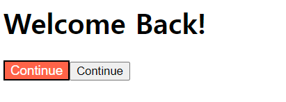
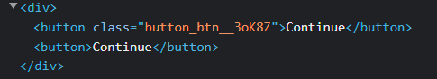
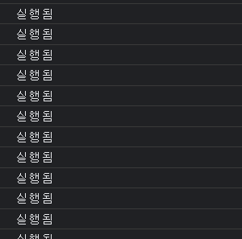
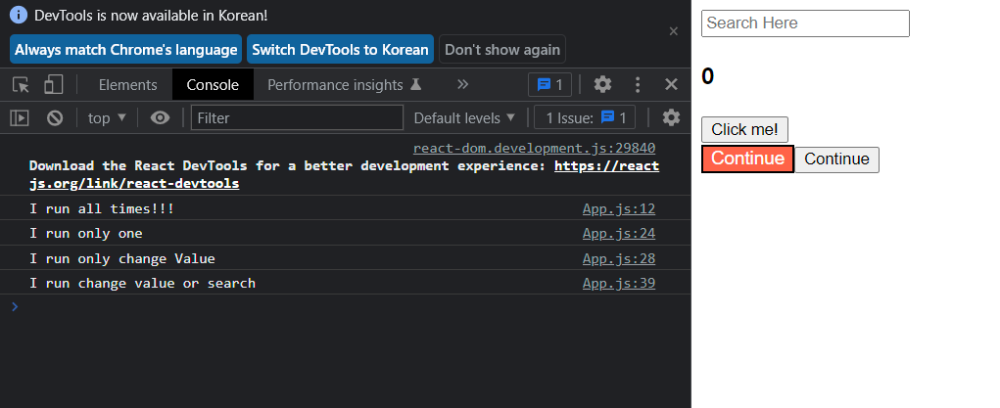
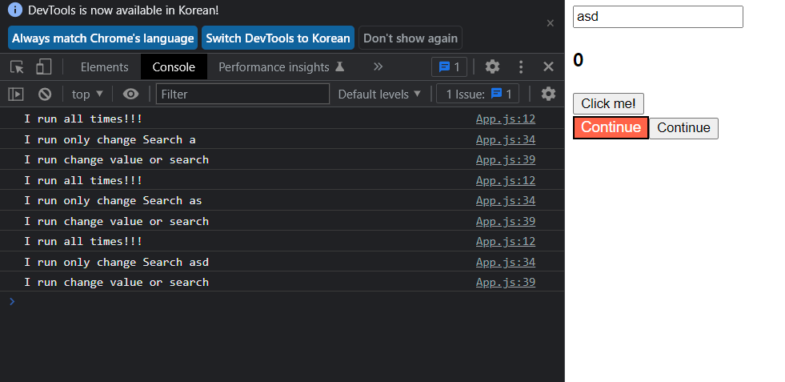
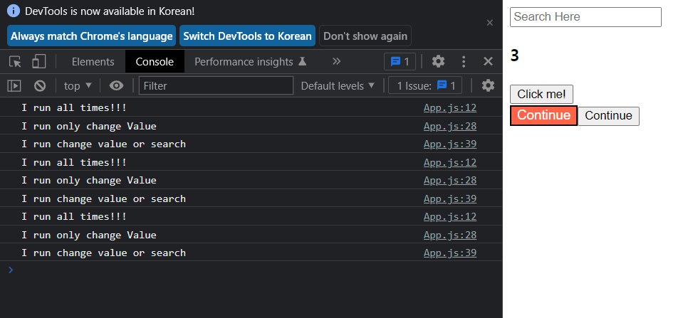

## React-app


#### Create React App

```shell
$npx create-react-app '폴더명'
$cd '폴더명/'
$npm run start
```

과정으로 react 앱 생성 및 실행

---

#### CSS

react 앱의 핵심은 `분할&정복`

각 컴포넌트에 props 형태로 style을 전달해주는 것은 가능은 하나 추천하지 않는다.

각 `이름.module.css` 파일을 생성 후 적용시킨다.



```css
// button.module.css;

.btn {
  background-color: tomato;
  color: white;
  font-size: 15px;
}

```

```javascript
// button.js

// react 강점 중 하나, className을 다 기억해서 따로 적용하지 않고 styles를 import 시켜서 자동으로 각기 다른 className을 랜덤으로 생성해준다 ==> 즉, 각기 다른 className을 기억하고 사용할 필요가 없다는 뜻. 또한 index.js에 css를 import 시키는 것이 아니기 때문에, 현재 파일 button.js 내에서 styles.btn이 적용된 컴포넌트에만 css가 적용된다!
import styles from "./button.module.css";


function Button({ text }) {
    // 두개의 버튼 중 하나에만 sytles.bt, 즉 css를 적용시킨다.
  return (
    <div>
      <button className={styles.btn}>{text}</button>
      <button>{text}</button>
    </div>
  );
}

// 내가 만든 컴포넌트를 import해서 쓰고 싶을 때 항상
// export default를 통해 내보낸다고 정의해주자
export default Button;


```

```javascript
// index.js

import React from "react";
import ReactDOM from "react-dom/client";
import App from "./App";
import Button from "./button";

const root = ReactDOM.createRoot(document.getElementById("root"));
root.render(
  <React.StrictMode>
    <App />
    <Button text="Continue" />
  </React.StrictMode>
);

```



`className={sytles.btn}`이 적용된 button에만 random으로 생성된 class 이름이 붙어져있다.


---

#### `useEffect()`

: 특정함수의 실행주기를 제어해준다.

```javascript
import { useState } from "react";

function App() {
  const [value, setValue] = useState(0);
  function onClick() {
    setValue((prev) => prev + 1);
  }
  console.log("실행됨");
  return (
    <div>
      {value}
      <button onClick={onClick}>Click me!</button>
    </div>
  );
}

export default App;


```



기존에 state를 다루던 방법 => state가 변경(click마다) 될 때마다 App 내의 `console.log`코드가 계속해서 실행된다.

==> 첫 번째 render에만 코드가 실행되고 다른 state변화에는 실행되지 않도록 만들자

```
예) API를 통해 데이터를 가져올 때 컴포넌트 렌더에서 API를 부르고
이후 상태가 변화할 때 그 API에서 데이터를 다시 가져오지 않게 만들 수 있다.
==> useEffect를 사용하자
```

```
useEffect('실행이 제한될 함수', 'Deps')로 구성되어 있다
여기서 Deps는 react.js가 바라보는 값이 변경되는 state를 뜻한다.
다음 예시를 통해 알아보자~~!!
```

```javascript
// app.js

// useState import 하기
import { useEffect, useState } from "react";

function App() {
  const [value, setValue] = useState(0);
  const [search, setSearch] = useState("");
  function onClick() {
    setValue((prev) => prev + 1);
  }
  function onChange(event) {
    setSearch(event.target.value);
  }
  console.log("I run all times!!!");

  // function과 useEffect 분리해서 만들기
  // function onlyOne() {
  //   console.log("I run only Onetime!");
  // }
  // useEffect(onlyOne, []);

  //------------------------------
  // fuction과 useEffect 한번에 만들기
  // 1. 첫 렌더시 한번만 실행되기
  useEffect(() => {
    console.log("I run only one");
  }, []);
  // value state 값이 변경될 때만 해당 함수 실행하기
  useEffect(() => {
    console.log("I run only change Value");
  }, [value]);
  // search state 값이 변경될 때만 해당 함수 실행하기
  // search state 값이 빈값일 경우에는 검색하지 않기 => if로 조건문 걸어준 것
  useEffect(() => {
    if (search !== "") {
      console.log("I run only change Search", search);
    }
  }, [search]);
  // value와 search state 변경될 때만 해당 함수 실행하기
  useEffect(() => {
    console.log("I run change value or search");
  }, [value, search]);
  return (
    <div>
      <div>
        <input
          value={search}
          onChange={onChange}
          type="text"
          placeholder="Search Here"
        />
      </div>
      <h3>{value}</h3>
      <button onClick={onClick}>Click me!</button>
    </div>
  );
}

export default App;

```

##### 첫 렌더시



`search` 값이 빈값이기에 search 함수 빼고 모두 실행되었다.


##### search 변경시



`alltimes`와 `search` & `search&value` 함수가 실행되었다.

`only one `& `only value`는 실행되지 않는다.


##### value 변경시



`alltimes` & `value` & `search&value` 함수가 실행되었다

`only one` & `only search`는 실행되지 않는다.


#### CleanUpFn

컴포넌트가 사라질 때, 특정 함수 실행이나 정보를 전달할 수 있게 도와주는 함수

useEffect의 마지막에 필요한 함수나 정보를 return 함으로써 컴포넌트 삭제시 원하는 함수나 정보를 실행시킬 수 있다

```javascript
import { useEffect, useState } from "react";

// cleanUpFn : 컴포넌트가 사라질 때, 특정 함수 실행이나 정보를 전달할 수 있게 도와주는 함수
// useEffect의 마지막에 필요한 함수나 정보를 return 함으로써 컴포넌트 삭제시 원하는 함수나 정보를 실행시킬 수 있다
function Hello() {
  // 원래 작동 원리
  //   function byFn() {
  //     console.log("bye :(");
  //   }
  //   function HiFn() {
  //     console.log("create :)");
  //     return byFn;
  //   }
  //   useEffect(HiFn, []);

  // 통상적인 방법
  useEffect(() => {
    console.log("create:)");
    return () => {
      console.log("bye :(");
    };
  }, []);

  // 같은 작성법
  // useEffect(function HiFn() {
  //   console.log("create :)");
  //   return function byFn() {
  //     console.log("bye :(");
  //   };
  // }, []);
  return <h1>Showing!</h1>;
}
function App() {
  const [showing, setShowing] = useState(false);

  function onClick() {
    setShowing(!showing);
  }
  return (
    <div>
      {showing ? <Hello /> : null}
      <button onClick={onClick}>{!showing ? "Show" : "Hide"}</button>
    </div>
  );
}

export default App;

```

