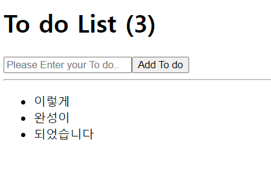
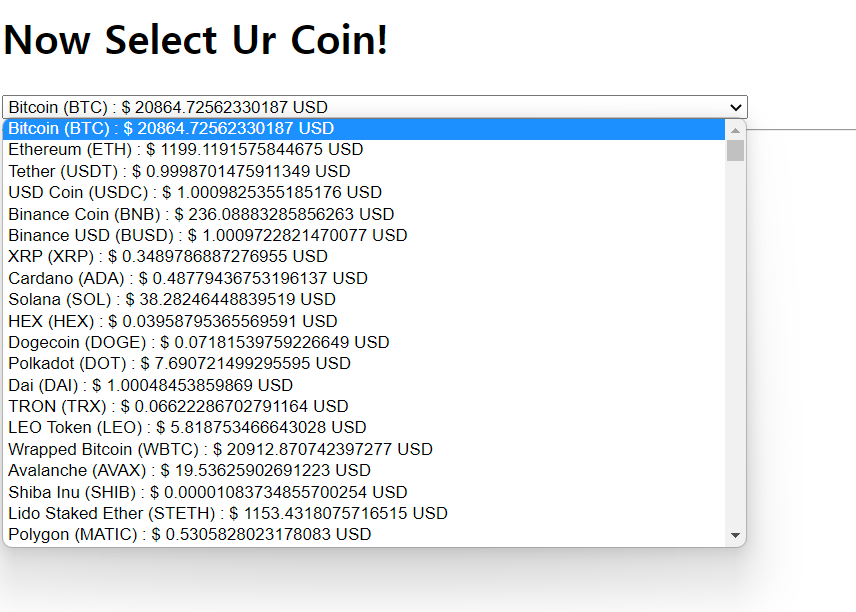
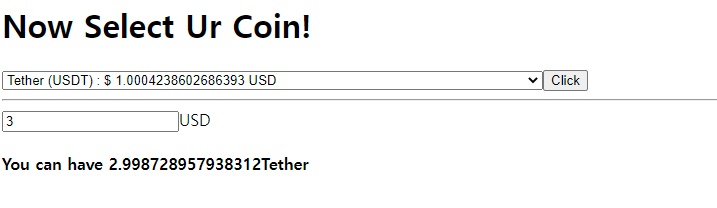

## React practice


### 1.  Todo List



```javascript
// app.js

import { useState } from "react";

function App() {
  // todo 입력값 관리할 state
  const [todo, setTodo] = useState("");
  // todo list 관리할 state
  const [todos, setTodos] = useState([]);
  // input에 값 입력시 받아올 function
  function onChange(event) {
    setTodo(event.target.value);
  }
  // form 제출시 작동할 function
  function onClick(event) {
    // 기본 submit event 제어
    event.preventDefault();
    // 빈값일 경우 todo에 추가되지 않도록 제어
    if (todo === "") {
      return;
    }
    // 최근 array를 받아오고, 입력된 todo를 추가해주는 코드
    // array의 경우 ...을 통해 unpack 가능하다.
    setTodos((currentArray) => [todo, ...currentArray]);
    // 입력이 끝나면 input 값을 빈값으로 초기화 해주자
    setTodo("");
  }
  // map 함수 => array에 포함된 각 요소에 적용시킬 함수를 넣어줄 수 있다
  // 첫째 인자로 각 개별요소를 받아오며, map을 사용할 때 key 값이 필요하기에 index값으로 key를 설정해줌
  return (
    <div>
      <h1>To do List ({todos.length})</h1>
      <form onClick={onClick}>
        <input
          value={todo}
          onChange={onChange}
          type="text"
          placeholder="Please Enter your To do.."
        ></input>
        <button>Add To do</button>
        <hr />
        <ul>
          {todos.map((todo, index) => (
            <li key={index}>{todo}</li>
          ))}
        </ul>
      </form>
    </div>
  );
}

export default App;

```


---


### 2. Coin Tracker



```javascript
import { useEffect, useState } from "react";

function App() {
  const [loading, setLoading] = useState(true);
  const [coins, setCoins] = useState([]);

  useEffect(() => {
    // fetch로 api 받아오고
    fetch("https://api.coinpaprika.com/v1/tickers")
      // api 받아와지면 그 응답을 json 형태로 바꿔줌
      .then((response) => response.json())
      // json으로 바뀌면 coins array에 넣어주고 loading은 false로 바꿔줌
      .then((json) => {
        setCoins(json);
        setLoading(false);
      });
  }, []);
  return (
    <div>
      <h1>{loading ? "Loading..." : "Now Select Ur Coin!"}</h1>
      {loading ? null : (
        <select>
          {coins.map((coin) => (
            <option key={coin.id}>
              {coin.name} ({coin.symbol}) : $ {coin.quotes.USD.price} USD
            </option>
          ))}
        </select>
      )}
      <hr />
      {/* {coin.quotes.USD.price} */}
    </div>
  );
}

export default App;

```




++ 기능추가 (내가 얼마 가진지 입력하면 몇 코인을 살 수 있는지 )

```javascript
import { useEffect, useState } from "react";

function App() {
  const [loading, setLoading] = useState(true);
  const [coins, setCoins] = useState([]);
  const [selects, setSelects] = useState(0);
  const [money, setMoney] = useState("");
  function onChange(event) {
    setSelects(event.target.value - 1);
  }
  function moneyChange(event) {
    setMoney(event.target.value);
  }
  function onClick() {
    console.log(selects);
  }
  useEffect(() => {
    // fetch로 api 받아오고
    fetch("https://api.coinpaprika.com/v1/tickers")
      // api 받아와지면 그 응답을 json 형태로 바꿔줌
      .then((response) => response.json())
      // json으로 바뀌면 coins array에 넣어주고 loading은 false로 바꿔줌
      .then((json) => {
        setCoins(json);
        setLoading(false);
      });
  }, []);
  return (
    <div>
      <h1>{loading ? "Loading..." : "Now Select Ur Coin!"}</h1>
      {loading ? null : (
        <select onChange={onChange}>
          {coins.map((coin) => (
            <option key={coin.id} value={coin.rank}>
              {coin.name} ({coin.symbol}) : $ {coin.quotes.USD.price} USD
            </option>
          ))}
        </select>
      )}
      <button onClick={onClick}>Click</button>
      <hr />
      <div>
        {loading ? null : (
          <div>
            <div>
              <input
                onChange={moneyChange}
                type="number"
                placeholder="Ur money"
              ></input>
              USD
            </div>
            <h4>
              You can have {money / coins[selects].quotes.USD.price}
              {coins[selects].name}
            </h4>
          </div>
        )}
      </div>
    </div>
  );
}

export default App;

```

